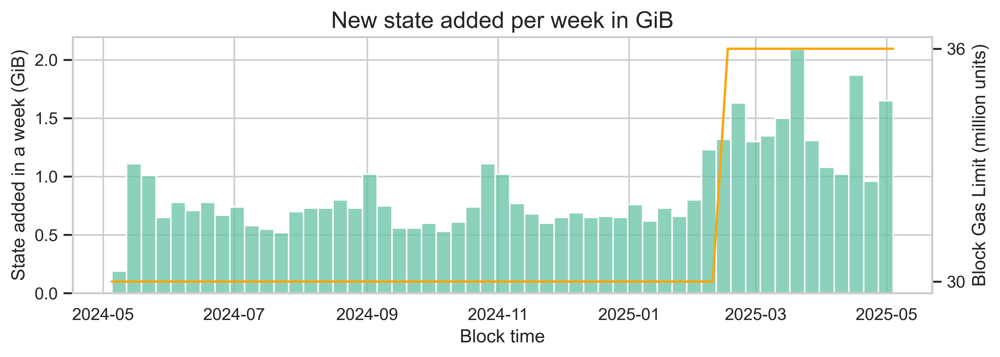

## Abstract

This proposal increases the cost of state creation operations, thus avoiding excessive state growth under increased block gas limits. It sets a unit cost per new state byte that targets an average state growth of 60 GiB per year at a block gas limit of 300M gas units and an average gas utilization for state growth of 30%. Contract deployments get a 10x cost increase while new accounts get a 8.5x increase.

## Motivation

State creation does not have a harmonized cost, with different methods incurring varied costs for creating the same size of new state. For instance, while contract deployment only costs 202 gas units per new byte created, new storage slots cost 625 gas units per new byte created. This proposal establishes a standard to harmonize all state creation operations.

Additionally, state growth will become a bottleneck for scaling under higher block limits. As of May 2025, the current database size in a Geth node dedicated to state is ~340 GiB. After the increase in gas limit from 30M to 36M gas units, the median size of new state created each day doubled, from ~102 MiB to ~205 MiB.

The relationship we are seeing in this example is not linear as expected. This is likely due to other factors impacting user behavior. However, all else being equal, we expect a proportional increase in the number of new states created as gas limits increase. At a 60M gas limit (and a proportional increase in new state per day of 1.7x), we would see a daily state growth of ~349 MiB and a yearly state growth of ~124 GiB. Similarly, at a 100M gas limit, the state would grow at a rate of ~553 MiB per day and 197 GiB per year. This level of state growth would give us less than 2.5 years until the size of the state database exceeds the threshold of 650 GiB, at which point nodes will begin experiencing a degradation in performance.

## Specification

Upon activation of this EIP, the following parameters of the gas model are updated:

| **Parameter** | **Current value** | **New value** | **Increase** | **Operations affected** |
|:---:|:---:|:---:|:---:|:---:|
| `GAS_CREATE` | 32,000 | 5,000,000 | 78x | `CREATE`, `CREATE2`, contract creation txs |
| `GAS_CODE_DEPOSIT` | 200 | 1,900 | 9.5x | `CREATE`, `CREATE2`, contract creation txs |
| `GAS_NEW_ACCOUNT` | 25,000 | 212,800 | 8.5x | New EOA funding |
| `GAS_SELF_DESTRUCT_NEW_ACCOUNT` | 25,000 | 212,800 | 8.5x | `SELF_DESTRUCT` |
| `GAS_STORAGE_SET` | 20,000 | 60,800 | 3x | `SSTORE` |
| `PER_EMPTY_ACCOUNT_COST` | 25,000 | 212,800 | 8.5x | EOA delegation |
| `PER_AUTH_BASE_COST` | 12,500 | 43,700 | 3.5x | EOA delegation |

## Rationale

### Harmonization across state creation

With the current pricing, the gas cost of creating 1 byte of state varies depending on the method used. The following table shows the various methods and their gas cost per byte. The calculation ignores the transaction intrinsic cost (21k gas units) and the costs of additional opcodes and scaffolding needed to execute such a transaction.

| Method | What is written | Intrinsic gas | Bytes → state | Gas / byte |
|---|---|---|---|---|
| Deploy 24kB contract ([EIP-170](./eip-170.md) limit) | Runtime code + account trie node | 32,000 CREATE + 25,000 new account + 200 × 24,576 code deposit = 4,972,200 gas | 24,576 B | ~202 gas |
| Fund fresh EOA with 1 wei | Updated account leaf | 25,000 new account | ~112 B | ~223 gas |
| Add delegate flag to funded EOA ([EIP-7702](./eip-7702.md)) | 23 B (0xef0100‖address) + updated account leaf | 25,000 PER_EMPTY_ACCOUNT + 12,500 PER_AUTH_BASE + 1,616 calldata - 7,823 refund = ~31,300 gas | ~135 B | ~232 gas |
| [EIP-7702](./eip-7702.md) authorization to empty address | 23 B (0xef0100‖address) + updated account leaf | 25,000 PER_EMPTY_ACCOUNT + 12,500 PER_AUTH_BASE + 1,616 calldata = 39,116 gas | ~135 B | ~289 gas |
| Fill new storage slots (SSTORE 0→x) | Slot in storage trie | 20,000 gas/slot | 32 B | 625 gas |

To harmonize costs, we first set the gas cost of a single state byte, `cost_per_state_byte`. **This cost targets an average growth of 60 GiB per year at a block gas limit of 300M gas units and an average gas utilization for state growth of 30%**. A [recent empirical analysis](../assets/eip-0000/multidim_empirical_analysis.md) has shown that, at current gas prices, state creation accounts for approximately 30% of all gas consumed. ** Additionally, on average, blocks use half of the entire available gas in the block. Thus, we are setting the unit gas cost of state creation based on the average case. Finally, we are targeting a 300M block limit to account for scaling optimizations expected in the short to medium term.

This capacity corresponds to an average of $\frac{60 \times 1024^3}{365} = 176,505,505$ bytes per day. With a 300M gas limit, Ethereum will process $150M \times 7,200 = 1,080,000M$ gas units per day, at block target. With a 30% consumption dedicated to state creation, the total gas units per day for state creation are $1,080,000M \times 0.3 = 324,000M$. Thus, the cost per byte is $\frac{324,000M}{176,505,505}=~1,835$. To provide a further buffer and simplify calculations, we round this number and set `cost_per_state_byte` to 1900.

Now that we have a standardized cost per byte, we can derive the various costs parameters by multiplying the unit cost by the increase in bytes any given operation creates in the database (i.e., 32 bytes per slot, 112 bytes per account and 23 bytes per authorization):

- `GAS_CODE_DEPOSIT` = `cost_per_state_byte` = 1,900
- `GAS_STORAGE_SET` = 32 x `cost_per_state_byte` = 60,800
- `GAS_NEW_ACCOUNT` = 112 x `cost_per_state_byte`= 212,800
- `GAS_SELF_DESTRUCT_NEW_ACCOUNT` = 112 x `cost_per_state_byte` = 212,800
- `PER_EMPTY_ACCOUNT_COST` = 112 x `cost_per_state_byte` = 212,800
- `PER_AUTH_BASE_COST` = 23 x `cost_per_state_byte` = 43,700

### Contract creation premium

The `GAS_CREATE` parameter is set differently from the remaining parameters. This parameter aims to encode a premium paid for deploying contracts.

Between genesis and the pre-Pectra block 22,431,083, 55% of all deployed contracts were never accessed after being deployed. This includes MEV or utility contracts that are created for a single transaction, mass-mint factories that never see adoption or even testing contracts.

In addition, contract deployment is done by very few accounts, with only 5.6 million accounts (around 2.3%) having deployed at least one contract since genesis.

Finally, compared with the overall costs of developing DApps, the contract deployment cost is fairly low.

Thus, **we define the `GAS_CREATE` parameter as a fixed cost representing a 10% premium over the code deposit cost of a 24 kB contract**. With the new pricing, a 24 kB contract pays $1,900 \times 24,576 = 46,694,400$ gas units of code deposit. Ten percent of that is roughly 5,000,000 gas units.

## Backwards Compatibility

This is a backwards-incompatible gas repricing that requires a scheduled network upgrade.

Wallet developers and node operators MUST update gas estimation handling to accommodate the new calldata cost rules. Specifically:

- Wallets: Wallets using `eth_estimateGas` MUST be updated to ensure that they correctly account for the updated gas parameters. Failure to do so could result in underestimating gas, leading to failed transactions.
- Node Software: RPC methods such as `eth_estimateGas` MUST incorporate the updated formula for gas calculation with the new floor cost values.

Users can maintain their usual workflows without modification, as wallet and RPC updates will handle these changes.

### Estimated price impacts

Users and dApp developers will experience an increase in transaction costs associated with creating a new state. Assuming an ETH price of 4000 USD, here is a comparison for some operations:

New account:

- OLD: 0.5 Gwei x 25,000 x 4,000 USD = 0.05 USD
- NEW: 0.5 Gwei x 212,800 x 4,000 USD = 0.425 USD

New slot:

- OLD: 0.5 Gwei x 20,000 x 4,000 USD = 0.04 USD
- NEW: 0.5 Gwei x 60,800 x 4,000 USD = 0.122 USD

24kB contract deployment:

- OLD: 0.5 Gwei x (32,000 + 25,000 + 200 × 24,576) x 4,000 USD = 9.9444 USD
- NEW: 0.5 Gwei x (5,000,000 + 212,800 + 1,900 × 24,576) x 4,000 USD = 103.814 USD

## Security Considerations

Increasing the cost of state creation operations could impact the usability of certain applications. More analysis is needed to understand the potential effects on various dApps and user behaviors.

### Mispricing with respect to ETH transfers

One potential concern is the cost of creating a new account (212,800 gas units), compared to transferring ETH to a fresh account (21,000 gas units). With this mismatch, users wishing to create new account are incentivized to first send a normal transaction (costing 21k) to this account to create it, thus avoiding the `PER_EMPTY_ACCOUNT_COST` of 212,800 gas units.

[EIP-2780](./eip-2780.md) solves this mispricing by adding a new component to the intrinsic gas cost of transactions. For transactions the sending ETH that send ETH to a fresh account. If a non-create transaction has value > 0 and targets a non-existent account, the `GAS_NEW_ACCOUNT` is added to intrinsic cost.

## Copyright

Copyright and related rights waived via [CC0](../LICENSE.md).
