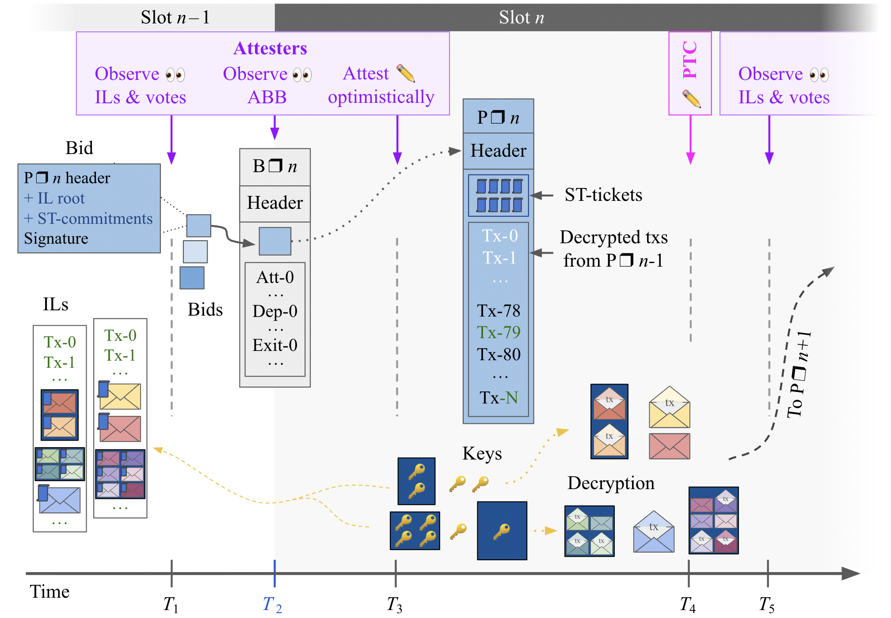

## Abstract

This EIP specifies LUCID, a mechanism for carrying encrypted transactions through Ethereum's public inclusion pipeline while keeping their contents hidden until after the scheduling decision has been fixed. By requiring commitment before reveal and delaying decryption until that point, LUCID protects MEV-sensitive order flow, limits probabilistic front-running by minimizing pre-execution information leakage, and broadens the practical censorship resistance of inclusion lists. The design remains open to different off-protocol decryption schemes, including trustless self-decryption, rather than coupling Ethereum to a single enshrined cryptographic construction.

## Motivation

Transaction ordering power has, in practice, made the public mempool unusable for a large share of economically meaningful transactions on Ethereum. When pending transactions can be inspected before inclusion, sophisticated actors can front-run, sandwich, or simply copy profitable strategies, turning transparent block production into an industrialized market for toxic MEV. 

The natural response has been a migration toward private order flow. Users, wallets, searchers, and applications increasingly route transactions through private relays, builder-run mempools, order flow auctions, and other trusted intermediaries that can shield transaction contents until inclusion. These arrangements replace a public and permissionless inclusion path with opaque bilateral relationships. They reward trust, access, and private dealmaking over open competition, starving the public mempool, entrenching incumbent builders, and leaving access to blockspace vulnerable to outages, policy changes, and discretionary blacklisting.

This is especially concerning because it pushes some of Ethereum’s most important activity away from the public, composable domain. Offchain market structures may provide reasonable local fixes under today’s conditions, but they are not a compelling long-run equilibrium for Ethereum. The promise of DeFi is not merely that transactions settle onchain; it is that trading, competition, and execution themselves can occur permissionlessly onchain. Another core property is censorship resistance (CR), but because [EIP-7805](./eip-7805.md) (FOCIL) relies on open propagation, it cannot provide CR for transactions subject to MEV extraction.

A public encrypted mempool addresses this gap. If transactions can be propagated publicly in encrypted form, committed to before their contents are revealed, and then included once the relevant protocol conditions are met, users no longer need to choose between MEV protection and trustless access to blockspace. It therefore becomes possible for inclusion lists to protect transactions that today must be routed through trusted private channels, while also reducing the importance of privileged private order flow in builder competition.

At the same time, Ethereum cannot presently enshrine a single encryption scheme for this purpose. A viable in-protocol scheme requires a silent setup with small public keys, non-interactive decryption, no trusted setup, practical ciphertext sizes, CCA2 security, and a credible path to quantum safety. No known construction fully satisfies these requirements at Ethereum’s scale, and waiting for cryptographic breakthroughs would impose an unacceptable delay.

LUCID extends the inclusion pipeline to sealed transactions (STs) that can be propagated in public without revealing their contents. Builders commit to them before decryption, and decryptors release keys only after the scheduling decision has been fixed. In doing so, it preserves a public, permissionless path to inclusion for MEV-sensitive transactions without coupling Ethereum to a specific encryption scheme. Transactions may be self-decrypted in a trustless manner or encrypted in an open design according to a decryptor’s instructions. This broadens the practical CR afforded by FOCIL while reducing Ethereum’s dependence on brittle, centralized order-flow relationships. In the longer term, it helps preserve an Ethereum in which trading and transaction competition can take place onchain, in public, and under permissionless market structure.

## Specification

### Constants and Parameters

```python
TOB_GAS_FRACTION_DENOMINATOR = 8
TOB_FEE_FRACTION = 64
MAX_ST_COMMITS_PER_IL = 2
MAX_STS_PER_BUNDLE = 16
MAX_BYTES_PER_ST = 2**24 // 64 # Byte bound implied by EIP-7976 and EIP-7825
MAX_ST_COMMITS = MAX_ST_COMMITS_PER_IL * IL_COMMITTEE_SIZE # IL_COMMITTEE_SIZE defined in EIP-7805
MAX_ST_TICKETS = MAX_ST_COMMITS * MAX_STS_PER_BUNDLE
tob_gas_limit = block.gas_limit // TOB_GAS_FRACTION_DENOMINATOR
tob_gas_limit_per_il = tob_gas_limit // IL_COMMITTEE_SIZE
```

### Overview: from submission to execution

This subsection provides an overview of the LUCID mechanism. LUCID relies on sealed transactions (STs), consisting of a signed ST ticket used for charging the sender and binding to a decryptor and `ciphertext_envelope`.  The `ciphertext_envelope` decrypts to a signed plaintext transaction (PT) that can have a different `from` field than the ST. Senders encrypt transactions to a decryptor in an open design following the decryptor's off‑protocol instructions (and if applicable, using its public key), or can otherwise self‑decrypt trustlessly. The ST can be propagated in the public mempool without revealing the PT until after commitment. Figure 1 provides a timeline for the design.



**Figure 1.** LUCID timeline. Bids are included in the beacon block to allow decryptors to release keys in a timely manner before the next slot starts. Decrypted transactions are executed in the next block.

* **Before $T_1$** – Includers propagate ILs that, besides PTs, can incorporate STs. The STs are either included individually or in a bundle (dark blue background).
* **$T_1$** – Attesters (purple) of slot $n$ freeze their view of propagated ILs as well as votes on the timeliness of decryption keys released during the previous slot.
* **After $T_1$** – Once builders know which ILs and keys they must adhere to, they cast an expanded `ExecutionPayloadBid` for the right to build the block. The bid contains "ST-commitments" to the hash of STs and ST bundles.
* **$T_2$** – At the start of slot $n$, the proposer selects a winning bid, which is at least as encompassing as its own view of required ILs for block $n$ and keys from slot $n-1$. It includes that bid in the beacon block.
* **After $T_2$** – Upon observing the beacon block, nodes begin requesting any missing ILs as well as ST bytes that are referenced by the ST‑commitments. Senders and decryptors can also independently propagate those bytes now.
* **$T_3$** – Attesters of slot $n$ cast a vote on the current head of the chain. If the beacon block is missing or if the bid fails their audit due to omitted ST-commitments in ILs from their frozen view, they indicate the preceding block that is the head of the chain in their view. If the bid passes their audit, they optimistically attest to the block.
* **After $T_3$ (Payload)** – The builder releases the payload which also carries ST tickets that are charged. The first transactions (white rectangle) are decrypted STs, previously committed to in block $n-1$. Regular PTs from the current slot follow (black rectangle).
* **After $T_3$ (Keys)** – Each decryptor observes the ST-commitments in the beacon block. It confirms correct data for its own ST-commitment (pertaining, e.g., to its `gas_obligation` specifying how much gas it consumes), that the aggregate of all `gas_obligation` entries is within the allotted share of the next payload (`tob_gas_limit`), and that the beacon block is attested to. It propagates the key(s) that reveal the STs. The key(s) are flooded P2P and observed by attesters of the next block before their deadline at $T_4$.
* **$T_4$** – The payload timeliness committee (PTC) votes for the timeliness of the payload, including timely receipt of ST/ST-bundle bytes and adherence to the keys released in the previous slot. It further casts a separate bitfield vote confirming the ST-commitments that can now be decrypted, i.e., those with valid ST/ST-bundle bytes (again) and keys released during the current slot.
* **$T_5$** – Attesters of slot $n+1$ freeze their view of propagated ILs as well as the decryption key timeliness votes for the previous block. The process then follows the same trajectory as after $T_1$ (for the previous slot).

### Sealed transactions

A sealed transaction (ST) is a transaction envelope which contains:

1. a signed ST ticket transaction (to later be included on-chain), and
2. a ciphertext envelope (not included on-chain).

It is encoded in SSZ when being included in FOCIL style inclusion lists.

```python
class SealedTransaction(Container):
    ticket: Transaction
    ciphertext_envelope: ByteList[MAX_BYTES_PER_ST]
```

It is encoded in RLP when propagating across the mempool, as a new [EIP-2718](./eip-2718.md) transaction.

```
ST_TX_TYPE || rlp([
  st_ticket,
  ciphertext_envelope
])
```

#### ST ticket

An ST ticket is a new [EIP-2718](./eip-2718.md) typed transaction. It is charged and consumes the sender's execution nonce, but is not executed as a normal EVM message call.

```
ST_TICKET_TX_TYPE || rlp([
    chain_id,
    nonce,
    max_priority_fee_per_gas,
    max_fee_per_gas,
    gas_limit,
    max_tob_fee,
    max_preceding_commitments,
    decryptor_address,
    decryptor_fee,
    key_commitment,
    reveal_commitment,
    ciphertext_hash,
    signature_id,
    signature
])
```

Besides regular transaction fields, the ST ticket also has a:

* `max_tob_fee` that the sender is willing to pay.
* `max_preceding_commitments` executed before the ST, acting as an upper bound.
* `decryptor_address` that receives the fee and signs bundles.
* `decryptor_fee` paid for timely decryption of the plaintext transaction.
* `key_commitment` that binds to the revealed key.
* `reveal_commitment` that binds to the revealed transaction.
* `ciphertext_hash`, where `ciphertext_hash = keccak256(ciphertext_envelope)` binds the ciphertext bytes.

The `signature_id` is one byte and the `signature` is arbitrary bytes interpreted according to `signature_id`. The only currently valid value for `signature_id` is `EC_DSA_TYPE == 0x01`.
In this case, the `signature` is to be interpreted as a (`signature_y_parity`, `signature_r`, `signature_s`)-triple. This design ensures that we do not enshrine non-PQ safe ECDSA signatures.

#### Ciphertext envelope

The `ciphertext_envelope` of the ST is defined as:

```python
class CiphertextEnvelope(Container):
  header: ByteList[2**16 - 1]
  dem_ciphertext: ByteList[MAX_BYTES_PER_ST]
```

On the EL, `ciphertext_envelope` is:

```
rlp([header_len:u16 || header || dem_ciphertext])
```

The `header_len` is big-endian. The `header` is `header_len` bytes and is opaque to the protocol. This field is reserved for decryption scheme metadata. 

The `dem_ciphertext` is the output of a DEM `ChaCha20-Poly1305` AEAD encryption with:

* DEM key – `k_dem` (32 bytes).
* Nonce – `keccak256(chain_id || ticket_from || ticket_nonce)[:12]` for STs.
* Empty `aad` (`b""`).
* `dem_ciphertext` is `ciphertext || tag` (`tag` is 16 bytes).

The `ciphertext_envelope` decrypts to `plaintext_tx`, an [EIP-1559](./eip-1559.md) transaction to be executed onchain. 

```
rlp([plaintext_tx: Transaction])
```

The `plaintext_tx` must have:

* `max_priority_fee_per_gas = 0`
* `max_fee_per_gas = 0`
* `gas_limit = ticket.gas_limit`

The `gas_limit` must be sufficient to cover the calldata cost of the byte size of the `SealedTransaction`. [EIP-7825](./eip-7825.md) thus bounds the byte size of an ST.

To bind the key, the sender includes `key_commitment = keccak256(k_dem)` in the ST ticket.

The `reveal_commitment` binds the revealed plaintext payload to a specific ticket. `ticket_from` is the recovered sender address from the ticket signature.

```python
class RevealCommitmentPreimage(Container):
    chain_id: uint256
    ticket_from: ExecutionAddress
    ticket_nonce: uint64
    plaintext_tx: Transaction

reveal_commitment = hash_tree_root(RevealCommitmentPreimage(...))
```

### Bundles

Sealed transactions with the same `decryptor_address` can be bundled together. The bundle is then signed by the `decryptor_address` to authenticate that the decryptor formed it.

```python
class SealedBundle(Container):
    sealed_transactions: List[SealedTransaction, MAX_STS_PER_BUNDLE]
    decryptor_signature: ByteList[65]
```

The `ticket_hash` of an ST is `keccak256(ticket_bytes)`. The `bundle_root` is the hash of the list of ticket hashes: `bundle_root = keccak256(keccak256(ticket_bytes[0]) || ... || keccak256(ticket_bytes[n]))` The decryptor signs `(chain_id, bundle_root)` with an ECDSA signature that recovers `decryptor_address`.

All STs that can pay the `ticket_fee` as specified in "Block processing" below and pass the `ticket.nonce` check have their `executable` bit set to `1`. Bundles have a collective `max_preceding_commitments` which is set as the minimum `max_preceding_commitments` among STs with `executable = 1`.

Each ST has a `tob_fee` computed as described below under the "Block processing" subsection. The `bundle_tob_fee` is the aggregate of the `tob_fee` of all STs in the bundle with `executable = 1`.

### Extended payload bid with ST-commitments

The `ExecutionPayloadBid` is extended with ST commitments and canonical IL roots.

```python
class STCommitment(Container):
    commitment_root: Bytes32
    commitment_key: Bytes32
    gas_obligation: uint64
    executable: Bitlist[MAX_STS_PER_BUNDLE]

class ExecutionPayloadBid(Container):
    ...
    st_commitments: List[STCommitment, MAX_ST_COMMITS]
    IL_roots: List[Bytes32, IL_COMMITTEE_SIZE]
```

The `commitment_root` is `ticket_hash` for non-bundles and `bundle_root` for bundles. For a non-bundle commitment, `executable` is empty and `gas_obligation = ticket.gas_limit`. For a bundle commitment, `executable` has length equal to the number of tickets in the committed bundle (in `ticket_hashes` order). The `executable` bit is set to `1` if the ST-ticket is funded and passes nonce checks. The `commitment_tob_fee` is defined as the `tob_fee` of an ST and the `bundle_tob_fee` of a bundle. It is not included in the commitment since it can be computed deterministically and is not required at commitment time.

For STs, the `commitment_key` is the ticket's `key_commitment`. For bundles, the builder first generates the list `key_commitments` of all `key_commitment` entries in the bundle with `executable[i] == 1`. It then sets `commitment_key = keccak256(key_commitments)`.

The `gas_obligation` is the aggregate `ticket.gas_limit` for bundle members with `executable[i] == 1`. 

### Execution payload expansion

```python
class DecryptedTransaction(Container):
    plaintext_tx: Transaction
```

The execution payload is prepended with `st_tickets` and `decrypted_transactions`:

```python
class ExecutionPayload(Container):
    st_tickets: List[Transaction, MAX_ST_TICKETS]
    decrypted_transactions: List[DecryptedTransaction, 2 * MAX_ST_TICKETS]
    ...
```

### Key message

Decryptors publish DEM key material in an unsigned message.

```python
class LucidKeyMessage(Container):
    chain_id: uint256
    scheduling_beacon_block_root: Bytes32
    scheduling_slot: uint64
    commit_index: uint8
    k_dems: List[Bytes32, MAX_STS_PER_BUNDLE]
```

#### Key message validity and decryption

A `LucidKeyMessage` is valid if it:

1. resolves, for a non-bundle ST, `keccak256(k_dems[0]) == commitment_key`; resolves, for a multi-key bundle, `keccak256(keccak256(k_dems[0]) || ... || keccak256(k_dems[n])) == commitment_key`;
2. has a `chain_id` that matches the chain;
3. references a commitment present in the scheduling block;
4. has the length:
  * `len(k_dems) == 1` for STs,
  * `len(k_dems) == sum(executable)` for multi-key bundles, because keys skip indices where `executable[i] = 0`;
5. successfully decrypts the transaction(s).

Decryption of a scheduled ST is defined as successful only if decrypting `ciphertext_envelope` yields a `plaintext_tx` whose:

* `hash_tree_root(RevealCommitmentPreimage(...)) == ticket.reveal_commitment`, and
* `plaintext_tx` decodes to a type-2 transaction with:
  * `max_fee_per_gas = 0`,
  * `max_priority_fee_per_gas = 0`,
  * `gas_limit = ticket.gas_limit`.

### Key release

The decryptor observes ST-commitments from the `ExecutionPayloadBid` included in the beacon block. It verifies that the `executable` bitfield indeed produces the specified `gas_obligation` for its own ST-commitment and that the aggregate of all `gas_obligation` entries is within the `tob_gas_limit`. Given that these requirements are fulfilled, if the payload turns out to be invalid or untimely, the decryptor's ST-commitment will always fit within the `tob_gas_limit`. This means that the ST(s) can still be included ToB in the next valid payload, as further discussed in the section entitled "Recovery under rejected payload".

The decryptor further verifies that the order of the ST-commitment is consistent with its underlying `max_preceding_commitments`. When the decryptor is confident that the beacon block will become canonical (for example after observing attestations for it), it releases its `LucidKeyMessage`. In the case of a single ST, the sender may itself also release the `LucidKeyMessage`, even if it specified a decryptor other than itself.

### Key timeliness

Each PTC member publishes a signed vote message indicating which valid keys, scheduled for the current slot, that they have observed:

```python
DOMAIN_LUCID_KEY_TIMELINESS = DomainType('TBD')

class LucidKeyTimelinessVote(Container):
    chain_id: uint256
    voting_slot: uint64
    validator_index: ValidatorIndex
    scheduling_beacon_block_root: Bytes32
    scheduling_slot: uint64
    keys_observed: Bitlist[MAX_ST_COMMITS]

class SignedLucidKeyTimelinessVote(Container):
    message: LucidKeyTimelinessVote
    signature: BLSSignature
```

A bit `keys_observed[j]` is set to 1 iff the voter observed, by the key observation deadline of the PTC, a valid `LucidKeyMessage` for `(scheduling_beacon_block_root, scheduling_slot, commit_index=j)`. Nodes propagate equivocated `LucidKeyTimelinessVote` messages the same way they do for equivocated ILs and keys. The PTC members of the *next slot* store received votes at the `lucid_key_vote_deadline`, but keep listening for new messages and equivocation until they vote.

Let `timely_key_votes` be a bitfield of observed votes on a key at `lucid_key_vote_deadline` and `total_key_votes` be a bitfield of observed votes on a key at the attestation time. The number of committee members who equivocated is tallied in `equivocated_votes`. These votes are not included in the key votes bitfields. Further define:

* `timely_1 = sum(timely_key_votes)`,
* `timely_0 = len(timely_key_votes) - timely_1`,
* `late_1 = sum(total_key_votes) - timely_1`,
* `late_0 = len(total_key_votes) - sum(total_key_votes) - timely_0`

The PTC of the *next slot* considers:

* All non-equivocated votes it observed at `lucid_key_vote_deadline` to have been seen by the builder.
* All non-equivocated votes it observed after `lucid_key_vote_deadline` to have potentially been seen by the builder.
* All equivocated votes to potentially have been seen voting either `0` or `1`.

The builder can thus treat a key as missing under condition:

* `2 * timely_1 <= (timely_1 + timely_0 + late_0 + equivocated_votes)`;

and treat a key as observed under condition:

* `2 * (timely_1 + late_1 + equivocated_votes) > (timely_1 + timely_0 + late_1 + equivocated_votes)`.

If this test fails for any key, the PTC of the next slot votes against the payload timeliness.

### Inclusion lists with STs and bundles

The `InclusionList` container of [EIP-7805](./eip-7805.md) is extended with STs and ST bundles:

```python
class InclusionList(Container):
    ...
    sealed_transactions: List[SealedTransaction, MAX_ST_COMMITS_PER_IL]
    sealed_bundles: List[SealedBundle, MAX_ST_COMMITS_PER_IL]
```

The IL must satisfy `len(sealed_transactions) + len(sealed_bundles) <= MAX_ST_COMMITS_PER_IL`.

An entry of a timely IL must still be excluded from the block if:

* it is an ST that already appears in the block via a bundle,
* it is a bundle with STs that already appear in another bundle with a higher aggregate `gas_limit`.

An entry of a timely IL may still be excluded from the block if:

* The aggregate `gas_limit` of all STs (including bundled STs) of the IL exceeds `tob_gas_limit_per_il`.
* It cannot be inserted in `st_commitments` at the position determined by the ST-commitment ordering rule (see Block processing)—without breaking its `max_preceding_commitments` stipulation.

Attesters check the second condition similar to the post-execution check of FOCIL for each entry in `sealed_transactions` or `sealed_bundles` in a timely observed IL that was excluded from the block. The attester iterates through the `st_commitments` starting ToB, for bundles updating `executable` of the to-be-inserted commitment and aggregating the `tob_fee` over eligible STs to compute the `bundle_tob_fee`. If in any instance the ST-commitment could be placed in `st_commitments` at the position determined by the ST-commitment ordering rule without violating its `max_preceding_commitments`, but is not included, attesters vote against the block.

### Block processing

Nodes match the STs/ST bundles with their ST-commitments in the beacon block and verify that the commitments are ordered by descending `commitment_tob_fee`, tie-breaking by descending `gas_obligation` and ascending `commitment_root` respectively; referred to as the "ST-commitment ordering rule". They further verify that ST tickets adhere to the order of the ST-commitments. The ST tickets of bundles must further be in the same order as in the bundle, which the `decryptor` is free to decide.

Each ST ticket is charged after first establishing a `priority_fee` and `tob_fee` based on the `base_fee_per_gas`:

```python
# Initialize
max_priority_fee = ticket.max_priority_fee_per_gas * ticket.gas_limit
max_fee = ticket.max_fee_per_gas * ticket.gas_limit
base_fee = block.base_fee_per_gas * ticket.gas_limit

# Compute capped fees
assert max_fee >= base_fee + ticket.decryptor_fee
priority_fee = min(max_priority_fee, max_fee - (base_fee + ticket.decryptor_fee))
tob_fee = min(ticket.max_tob_fee, max_fee - (base_fee + ticket.decryptor_fee + priority_fee))

# Charge the ticket sender
ticket_fee =  base_fee + ticket.decryptor_fee + priority_fee + tob_fee
assert ticket.signer.balance >= ticket_fee
assert ticket.signer.nonce == ticket.nonce
ticket.signer.balance -= ticket_fee
ticket.signer.nonce += 1
```

All nodes validate key message validity as previously described for the PTC. They verify that `decrypted_transactions` contains the byte-identical transactions they derived via decryption, positioned in the same order as the corresponding charged ST tickets, with STs not decrypted left out from the `decrypted_transactions` list. 

Upon successful decryption, the calldata cost of the decrypted transaction is computed using `max(len(ciphertext_envelope), len(plaintext_tx.data))` bytes. The PT is then executed as a regular transaction with the exception that the fee is not paid, since it was already prepaid by the ST ticket. The `gas_used` is referred to as `dual_gas_used` to capture that it encompasses a broader interpretation of calldata. The unused gas, previously charged to the `parent_ticket` according to the base fee of the previous block, is then returned to the sender, together with the `parent_tob_fee` reserved for the penalty:

```python
parent_ticket.signer.balance += parent.base_fee_per_gas * (parent_ticket.gas_limit - dual_gas_used) + parent_tob_fee * (TOB_FEE_FRACTION - 1) // TOB_FEE_FRACTION
```

The `priority_fee` is not reconciled with `gas_used` since the ST still took up bounded space upon commitment. The specified decryptor is further credited the decryptor fee:

```python
parent_ticket.decryptor_address.balance += parent_ticket.decryptor_fee
```

The `decrypted_transactions` are executed against the header of the block in which their ST ticket was committed to, in order to prevent builders from being able to inject information into the block after having witnessed decrypted transactions. During processing, the `SLOTNUM` opcode introduced in [EIP-7843](./eip-7843.md) must always return the slot number which included the corresponding ST ticket. The addition of the parent block hash to the historical block registry defined in [EIP-2935](./eip-2935.md) is no longer done at the top of the block; it is deferred till after the last ST has been executed. Likewise, the addition of the parent blocks beacon root to the historical root registry defined in [EIP-4788](./eip-4788.md) is no longer done at the top of the block; it is also deferred till after the last ST has been executed.

### Recovery under rejected payload

Decrypted transactions shall be included if:

* The ST bytes (and, if bundled, the ST bundle bytes) and keys were and are validly available, as confirmed by the PTC vote.
* The ST-commitments were correctly formatted and the aggregate of all `gas_obligation` entries was within the `tob_gas_limit` (as also confirmed by the attestations).
* The beacon block specified a correct `gas_obligation` and `max_preceding_commitments` entry for their ST-commitment, given the `executable` bitfield provided for bundles.

If payload $n$ is rejected, two sets of STs are affected:

* The STs with `decrypted_transactions` scheduled for payload $n$, with ST-commitments in beacon block $n-1$ and ST tickets in payload $n-1$.
* The STs with ST-commitments in beacon block $n$, scheduled for payload $n+1$.

Both sets of STs that shall be included must then be included in the next payload. That payload includes the ST tickets of the associated commitments from beacon block $n$, and `decrypted_transactions` for commitments from both beacon block $n-1$ and $n$. The `decrypted_transactions` must be ordered according to the ST-commitments: those derived from commitments in beacon block $n-1$ go before those from commitments in beacon block $n$.

The `executable` bitfield and `gas_obligation` for an ST-commitment are fixed by its associated scheduling beacon block, and the key-timeliness outcome for the ST-commitment and `LucidKeyMessage` is fixed by the corresponding `LucidKeyTimelinessVote`. If an ST-commitment was mis-specified with respect to the original scheduling state, its transactions MUST NOT be included under recovery. When a recovery payload includes commitments from multiple scheduling beacon blocks, they are processed in scheduling-block order, and `max_preceding_commitments` is enforced only with respect to commitments from the same scheduling beacon block.

The recovery payload must not commit to new STs, in order for the protocol to catch up. In the baseline specification, decrypted STs are allotted at most `1 / TOB_GAS_FRACTION_DENOMINATOR` of the gas limit. The next one can then include two sets of decrypted STs, which at most consume `2 /  TOB_GAS_FRACTION_DENOMINATOR` of the block's gas limit.

### Engine API Changes

* Add `engine_getInclusionListV2` endpoint to retrieve an IL which may contain STs and bundles from the ExecutionEngine.
* Add `engine_updatePayloadWithInclusionListV2` endpoint to update a payload with the IL that may contain STs and bundles that should be used to build the block.
* Add `engine_updateInclusionListV2` endpoint which consumes an updated `InclusionList` containing STs, and the 8 byte payload id being built.

### Beacon Chain RPC API Changes

* Update `/eth/v2/events` endpoint to notify wallets that their ST has been included, and it is safe to publish the key.
* Update `/eth/v2/events` endpoint to notify clients and committees that a key has been released.
* Add `/eth/v1/beacon/key` endpoint to relay the key to the libp2p topic.

## Rationale

### Probabilistic front-running

Attackers may attempt to probabilistically front-run transactions by preparing various options, that are only executed if they turn out to be profitable upon observing revealed keys of other transactions. LUCID tackles non-reveal of ST-commitments and probabilistic front-running from five different angles:

1. The public mempool need not reveal the plaintext transaction, its calldata, or its signer. While the signed ST ticket is visible, the revealed `plaintext_tx` may be signed by a different account than the ticket signer, which is not revealed until the ST is committed onchain.
2. After commitment, an attacker cannot replace ciphertexts, change ordering, or inject new STs. It can only control the binary decision whether to release valid keys for STs/ST bundles it already committed to. A multi-key bundle either fails, or all `executable` STs are revealed.
3. The `decrypted_transactions` are executed against the header of the block in which their ST ticket was committed to. This prevents builders from being able to inject information into the block after having witnessed decrypted transactions.
4. ST-commitments are ordered by ToB fee, a fraction which is returned upon reveal. Selective reveal is therefore priced both in expectation and ex post. Concretely:
    a. In the case that the front-runner consistently posts ST-commitments which it intends to use for front-running under advantageous circumstances, it must also consistently pay the part of the ToB fee that is not returned upon reveal – `tob_fee / TOB_FEE_FRACTION`.
    b. In the case that the front-runner happens upon an advantageous circumstance, it must pay the higher penalty for every bit of information it communicates upon non-reveal  – `tob_fee`.
5. Each ST specifies the `max_preceding_commitments` that may execute before it. This allows users to balance their need for protection from probabilistic front-running with their willingness to pay a high ToB fee. If a sender allows at most $m$ preceding commitments, then an adversarial party can choose between at most $2^{m-1}$ distinct patterns to be executed before the sender—if it purchases all $m$ commitments by paying a higher `tob_fee` than the sender for each one. Deliberations concerning `max_preceding_commitments` are more important for senders that self-decrypt, whereas bundled STs can leverage the joint ToB fee of all STs of the bundle to reduce the viability of probabilistic front-running (see "Alternative specifications" for further improvements).

The builder also has one bit of reveal optionality. It can elect to either release or not release its payload, upon observing some of the keys. This alters the pre-state which the decrypted transaction are executed against, just like how a non-reveal of an earlier ST-commitment also changes the prestate. Since the builder is staked, it can also trivially be penalized for a non-reveal at an appropriate level.

### MEV and welfare

The objective of LUCID is to restore a public, permissionless inclusion path for MEV-inducing transactions. Some users may prefer this inclusion path, whereas others continue using trusted private inclusion paths. The welfare claim of LUCID is therefore comparative and optional: it gives users an additional path that trades some private-intermediary conveniences for trustlessness and censorship resistance. To discuss the MEV landscape, it seems useful to distinguish between:

* Exogenous MEV – induced by information external to the protocol, such as changes in CEX prices, prices on other chains, or other offchain information not yet reflected in the protocol state.
* Autogenous MEV (i.e., transaction-induced MEV) – induced when a transaction's own execution creates or reveals a new public signal, such as a large repricing trade or other state transition.
* Endogenous MEV – induced by the protocol state itself, such as imbalances between pools, available liquidations, or other imbalances internal to the protocol.

LUCID allows for infusing new information onchain trustlessly, which is useful for all three types of MEV, since it prevents front-running. However, differences regarding when the MEV opportunities become public and when they can be acted on affects their relationship to the encrypted mempool. A review of exogenous/autogenous/endogenous MEV can guide the discussion of user and protocol welfare.

#### Exogenous MEV

MEV emerges exogenously when conditions outside of the protocol change such that its state becomes imbalanced relative to the rest of the world. Traders then rush to include transactions onchain in order to restore balance between the protocol state and the outside world. By restoring balance they extract value, as they execute against the imbalanced onchain state. On an L1 like Ethereum, exogenous MEV is captured at the "information infusion boundary" (IIB)—the point at which new information enters onchain as the builder commits to a new block.

Given multiple pools or liquidity sources inside the protocol, the sender or its agent must determine where to trade. In trusted offchain flow, builders or upstream intermediaries can privately simulate and filter candidate transactions, rely on order matching, private inventory, and other offchain liquidity arrangements. An idealized arrangement is therefore that the builder takes in bids on suggested trades for restoring balance relative to the outside world, and executes only the most profitable ones—those that pay the most for the opportunity to execute in the block. In other words, transactions that cannot profitably execute are filtered out or revert offchain.

It can be useful to compare with MEV on L2s, given experience with higher onchain searching there. When an L2 sequencer that receives private orderflow follows a deterministic scheduling rule, for example ordering by priority fee or on a first-come first-served (FCFS) basis, searchers attempting to extract exogenous MEV without guarantees about the exact state they execute against may instead probe the state during execution. Filtering, fallback logic, and/or reverts then move onchain. Many L2s do not have one discrete IIB per block. The detached relationship between trader and sequencer means that each new transaction acts on exogenous MEV as visible to the sender at submission time. Furthermore, an L2 may utilize sub-blocks, each allowing new information to enter the state, or FCFS ordering such that, from a transaction-ordering perspective, new information may continuously enter and trade against the state.

For the decrypted segment of LUCID, the relevant point at which new information still can affect internal ordering (the IIB) is the scheduling decision in slot $n$ rather than the moment of execution in slot $n+1$; the relative ordering of decrypted transactions is fixed one slot before they execute (see also the one-slot design, where the decrypted transactions indeed execute toward the end of the block). Once the STs are committed, no late entrant can insert a new transaction into their decrypted segment. This reduces the scope for extracting exogenous MEV inside LUCID ToB. Onchain probing for exogenous MEV is therefore expected to be more limited among decrypted transactions. Instead, most exogenous MEV is expected to be extracted among the first transactions executing post-ToB, just as today with builder filtering applied. It should also be noted that if an ST is revealed and then reverts onchain, its intent becomes public; LUCID therefore does not reproduce the offchain failure privacy available through private orderflow.

There is one exception worth pointing out: the key release offers transactors the ability to infuse limited new information onchain, by releasing or withholding keys. Since keys are released later than the block commitment time, new exogenous MEV may have emerged in the meantime. Decryptors can therefore selectively withhold or release keys so that only the most profitable (as of the key PTC deadline) pre-committed trades execute. We can expect such trades to be concentrated among the latest decrypted transactions, where the penalty for non-reveal is limited by lower ToB fees. This type of non-reveal does not consume additional blockspace in the way blind searching does, since withheld transactions can be replaced by regular transactions in block $n+1$. In essence, it is a form of probabilistic MEV burn.

#### Autogenous MEV

An important boundary case is transactions that neither act on exogenous nor endogenous MEV. The transaction may atomically settle a series of coincidences-of-wants, or reveal a new public signal or opportunity via a large repricing trade or other state transitions whose informational content may not have been observable beforehand. We refer to this transaction-induced MEV as "Autogenous MEV".

Naturally, the transaction's own informational or state-changing content can make it vulnerable to being traded around. Since the transaction's value derives from the information or matching it carries rather than from capturing an existing onchain imbalance, it is less sensitive to the exact pre-state than exogenous MEV extraction, though execution quality still depends on the state of any liquidity venues it touches. LUCID can therefore be particularly suitable for allowing these transactions to enter the public inclusion pipeline without first disclosing its informational content to a privileged intermediary.

The content of the transaction becomes public at key release, but the transaction that generates it was already committed to one slot earlier. Later decrypted transactions can react to it only through pre-committed contingent logic, whereas unrestricted competition over the revealed signal can begin among transactions executing after the decrypted transactions.

#### Endogenous MEV

Endogenous MEV is MEV internal to the protocol state itself, such as DEX pool imbalances that can be rebalanced by arbitrage. On the L1, since the state is readily available to the builder as it builds the block, endogenous MEV can be arbitraged out without querying state onchain. Under a simplified idealized model, much endogenous MEV is competed away during block construction, leaving little remaining after the regular transactions have been executed.

The decrypted transactions may produce new endogenous MEV, as, e.g., DEX pools are unbalanced by decrypted transactions. While the sender, with the assistance of searchers or other intermediaries, can still prepare routing and backrunning options offchain, the builder is not able to simulate and filter these after commitment. The exact settlement or backrunning operation can therefore instead be determined onchain after querying the state, whereas candidate routing and backrunning options still can be precomputed offchain at commitment time. This does not reproduce a trusted intermediary's ability to simulate many candidate backruns against the exact evolving pre-state, but it does preserve a path for pre-committed, targeted backrunning.

The sender can place backrunning transactions directly after its trade within a bundle if it is expected to leave residual MEV on the table. The decryptor may also place backrunning transactions there, or at the end of a bundle. Since the backrunning transaction knows the precise operations performed by the MEV-inducing transaction, any required onchain queries can be highly targeted, querying only the most relevant trading pairs or venues before executing the backrunning leg.

Just as for exogenous MEV, if an L2 sequencer does not offer revert protection or filter bundles to select the most profitable option, each MEV transaction may need to make queries onchain. Given residual opportunities that may emerge also in between exogenous-MEV-extraction transactions executed across the block (due to limited builder oversight), it can be expected that L2s experience more blind searching also for endogenous MEV. Another difference relative to LUCID is that blind searching is particularly appealing under the low fees associated with L2s. In this discussion, it should finally be noted that the blockspace available to decrypted transactions is limited, setting an upper bound on how much settlement can move fully onchain. This does not preclude optimistic search, but it does bound the portion of blockspace in which such search can compete for opportunities arising from decrypted transactions.

#### User welfare

MEV captured via both offchain and onchain paths for both regular and encrypted transactions may be shared with the sender according to the arrangements they make with the relevant service provider (e.g., searchers, MEV-Share nodes, decryptors, applications, or any software developed for facilitating routing and backrunning). The sender accounts for many factors when deciding whether it wishes to use the encrypted mempool or not. These include the expected difference in execution quality—including route quality, liquidity access, and residual MEV capture—between offchain and onchain paths; potential costs (searcher fees, gas fees, decryptor fees, etc.); its requirement for CR; the risks associated with having plaintext visible to various trusted parties; its requirements for revert protection; and its fear of probabilistic front-running, etc. Under equilibrium, usage will depend on the importance of these various factors. Even if there is less demand than the allotted maximum `1 / TOB_GAS_FRACTION_DENOMINATOR`, the full blockspace can still be utilized, because the gas allocation for the encrypted mempool does not encroach on the block gas limit if it is not used.

#### Protocol welfare

Besides the immediate resilience associated with a trustless inclusion path, the encrypted mempool will redirect more trading and transaction competition onchain, which also may be considered a long-term strategic advantage. Specifically, during ToB execution (limited by the `tob_gas_limit`), some of the computation that previously took place offchain now moves onchain, since no single builder or intermediary has monopoly control over settlement in that segment of the block. Thus, some additional gas may be spent on targeted state queries during this bounded portion of the block, but this is a natural and perhaps even desirable consequence of pushing some of Ethereum's most important activity into the public composable domain. The welfare claim is not that onchain search is intrinsically superior, but that this can be an acceptable trade-off for restoring a public, composable, and censorship-resistant path to inclusion.

In essence, users that need to land MEV-inducing transactions permissionlessly onchain without being front-run or sandwiched are the clearest candidates to use the encrypted mempool. As outlined in previous subsections, the encrypted mempool can protect autogenous MEV among transactions on their path to inclusion. For many users, the encrypted mempool inclusion path comes with both benefits and drawbacks relative to private inclusion. In either case, it seems beneficial to allow both inclusion paths and let users determine which path is most suitable for them.

### Decryptor liability for non-reveal

To keep the first version of the design simple, there is no protocol-level mechanism for having decryptors of multi-key bundles assume liability (and thus incur the penalty) in place of the sender for failing to decrypt. Such a mechanism can be added in a subsequent upgrade. However, decryptor-sponsored liability can be approximated out-of-protocol by including a decryptor-funded sponsor ST in the bundle with the user STs.

Each sender provides some agreed-upon `decryptor_fee = d`, and a minimal or 0 `max_tob_fee`. The decryptor includes in the bundle its own minimum-gas transaction with a `max_tob_fee` at a level of `n * d * TOB_FEE_FRACTION`, where `n` is the number of STs in the bundle, each paying `d`. Because bundle ordering uses the aggregate `tob_fee` of executable STs, the bundle now ranks as if the decryptor had posted that ToB fee on behalf of the users.

If the bundle is revealed successfully, the sponsor ST receives back `(TOB_FEE_FRACTION - 1) / TOB_FEE_FRACTION` of its `tob_fee`, so its net ToB-fee burn is `n * d`. That exactly matches the aggregate decryptor fees paid by the users. If the bundle is not revealed, the sponsor ST forfeits the full `n * d * TOB_FEE_FRACTION`, so the decryptor economically absorbs the non-reveal penalty.

Since the sender still sets the `max_preceding_commitments`, it does not assume additional risks if the decryptor reneges on its pledge to sponsor the ToB fee of the bundle as agreed upon. The mempool must naturally protect against spam and reject STs that have no chance of getting included. However, any ST can be validly included even with `max_tob_fee = 0`, and decryptors that encourage senders to produce STs relying on ToB fee sponsorship for inclusion—without performing such sponsorship—can also easily be filtered out.

### Alternative specifications

#### Same-slot decryption

A same-slot variant of LUCID is possible if the block is split into two independently propagated chunks. The first chunk contains the ST tickets and all ordinary transactions, and is delivered by the primary payload deadline. The second chunk contains decrypted transactions corresponding to ST-commitments already fixed in the bid and potentially additional regular transactions, and is delivered by the secondary payload deadline. The builder still publishes its bid with ST-commitments in the beacon block, but would only construct the second chunk after decryptors have released keys. 

The design is inspired by semantic block chunking and the flow is as follows: The builder constructs the bid and the first chunk with ST tickets and regular transactions—including the BAL for executing them—without knowing the ST plaintexts. Once the scheduling beacon block becomes available, the first chunk is released and decryptors publish keys as in the baseline design. The builder decrypts the committed STs, constructs the second chunk including its own BAL, and propagates it while attesters are already validating or executing the first chunk. Decrypted transactions are ordered according to the same pattern as in the baseline design, matching the ST-commitments. The builder may be given the opportunity to include additional regular transactions in the second chunk, ensuring full block utilization under withheld keys. This would turn the design into a mix of block-auction and slot-auction ePBS.

Once attesters have finished executing the first chunk, they switch over to executing the second chunk. The block is valid only if both chunks are timely, which is determined by a singular PTC vote at the deadline of the second chunk. Since the first chunk is committed to in the bid, the builder cannot change the regular transactions upon observing released keys. A benefit of the design is that the builder has responsibility for its included STs, from commitment to execution. A drawback is increased design complexity, requiring semantic block chunking.

#### Censorship resistance without FOCIL

The design does not strictly require coupling with FOCIL for achieving a reasonable level of censorship resistance for MEV-inducing transactions. Such an integration can therefore be left out from the first implementation. Since the sender is hidden until commitment, a builder cannot know and censor based on contents or identities of senders. Builders may still rely on a whitelist for permitted senders, but such a builder would be unprofitable under competition. It should however be noted that the decryptor is visible in the ST ticket, and some builder may decide to censor based on decryptor identities. 

#### Trust graph

One way to reduce the fee pressure created by `max_preceding_commitments` is to distinguish between trusted and untrusted decryptors, inspired by the design proposed in [EIP-8105](./eip-8105.md). The main residual front-running risk comes from earlier commitments whose decryptors the sender does not trust to avoid strategic withholding. Earlier commitments from trusted decryptors need not consume the same safety budget. 

A future version can therefore replace or complement `max_preceding_commitments` with `max_preceding_untrusted_commitments`. Decryptors would be nodes in a directed trust graph maintained in a canonical registry of decryptor addresses and trust edges. A decryptor `A` trusts decryptor `B` if there is a path from `A` to `B` in that graph. For an ST or bundle using decryptor `A`, an earlier commitment from decryptor `B` counts toward the limit only if `A` does not trust `B`. Trust is directional: commitments from `B` may precede `A` without consuming `A`’s bound when `A` trusts `B`, but not vice versa unless `B` also trusts `A`.

This allows users to delegate trust selection to their chosen decryptor instead of listing trusted third parties in every ST. It also reduces pressure toward a single dominant decryptor. For example, a small decryptor can trust a larger, widely used decryptor, allowing its users to be placed after that decryptor’s commitments without requiring those commitments to count against their safety bound. The difference to [EIP-8105](./eip-8105.md) is that there is no hard requirement that only trusted decryptors may execute before the transaction, unless `max_preceding_untrusted_commitments = 0`. This expansion is viable because of the additional steps that the design takes against probabilistic front-running, including the offchain decryption process. A few untrusted decryptors are therefore unlikely to be a concern for most users.

## Backwards Compatibility

This EIP introduces backward-incompatible changes to both the consensus and execution layers and therefore requires a hard fork. It extends block validity rules, `ExecutionPayloadBid`, `ExecutionPayload`, `InclusionList`, the Engine API, beacon-chain RPC interfaces, and the P2P handling of inclusion lists, sealed transactions, bundles, keys, and key-timeliness votes. Clients that are not upgraded will not be able to validate or construct post-fork blocks correctly.

This EIP does not remove or alter the semantics of existing plaintext transaction types. Legacy transactions and other non-LUCID transactions remain valid and retain their ordinary execution semantics. Users that do not opt into sealed transactions may continue to use the public mempool as before. Wallets, builders, relays, indexers, tracers, and RPC implementations that wish to support LUCID must add support for the new transaction types, commitment rules, and key-propagation flows, etc.

## Security Considerations

Denial-of-service vectors for STs are instances with a low ToB fee and low `max_preceding_commitments`, particularly STs with these characteristics that are not intended to be bundled. Given that the utilization of the encrypted mempool is unknown—and may vary going forward—there are no fixed settings that can be established at this point for STs that should or should not be propagated. Furthermore, decryptors that establish a pattern of sponsorship as outlined in the Rationale may garner more permissive bounds during filtering.

Users and wallets must treat the choice of `decryptor_address` as a security decision. They should prefer decryptors and encryption instructions that are publicly documented and audited. 

The DEM uses `ChaCha20-Poly1305`, which must not reuse the same `(k_dem, nonce)` pair across different ciphertexts. In this EIP, the DEM nonce is protocol-defined rather than chosen by the encryptor: for STs it is derived from `(chain_id, ticket_from, ticket_nonce)`. Decryptors and self-decrypting senders should therefore ensure that the released `k_dem` is bound to the intended ticket or bundle context, and that any reusable secret recovered from the opaque `header` is not itself revealed. Since the protocol fixes `aad = b""`, this binding must come from key derivation rather than AEAD associated data. Reuse of a `(k_dem, nonce)` pair can break confidentiality and integrity.

## Copyright

Copyright and related rights waived via [CC0](../LICENSE.md).
