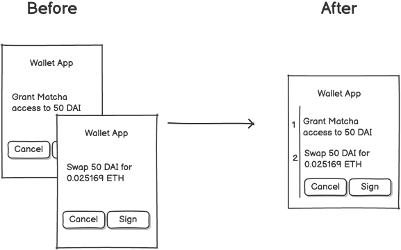

## Abstract

This EIP provides a standard for signing multiple typed-data messages with a single signature by encoding them into a Merkle tree. This allows components to independently verify messages, without requiring full knowledge of the others. It provides a significant UX improvement by reducing the number of signature prompts to one, while preserving the security and flexibility of the [EIP-712 standard](./eip-712.md).

This EIP also gives applications the flexibility to verify messages in isolation, or in aggregate. This opens up new verification modalities; for e.g, an applications can require that message (`x`) is only valid when signed in combination message (`y`).

[EIP-712]: ./eip-712.md

## Motivation

As the ecosystem moves towards ETH-less transactions, users are often required to sign multiple off-chain messages in quick succession. Typically, a first signature is needed for a precise EIP-20 allowance (via [Permit2](https://blog.uniswap.org/permit2-and-universal-router), [EIP-2612](./eip-2612.md), etc.), followed by subsequent messages to direct the use of funds. This creates a frictional user experience as each signature requires a separate wallet interaction and creates confusion about what, in aggregate, is being approved.



Current solutions have significant drawbacks:

- **Pre-approving EIP-20 allowance:** spend creates security vulnerabilities
- **Merging multiple messages into a single message:** prevents independent verifiability. Each message cannot be verified without knowledge of the entire batch
- **Separate signature requests:** creates friction in the user experience

## Specification

### Overview

The composite signature scheme uses a Merkle tree to hash multiple typed-data data messages together under a single root. The user signs only an EIP-712 message containing the Merkle root. The process is described below.

### Composite Message Type

This EIP defines a standard struct for a composite message:

```solidity
struct CompositeMessage {
    bytes32 merkleRoot;
}
```

### Generating a Composite Signature

1. For a set of messages `[m₁, m₂, ..., mₙ]`, compute each message hash EIP-712's `hashStruct`:

   ```
   hashₙ = hashStruct(mₙ)
   ```

2. Use these message hashes as leaf nodes in a Merkle tree.

3. Compute the Merkle root and create a `CompositeMessage` containing this root:

   ```
   compositeMessage = { merkleRoot: merkleRoot }
   ```

4. Sign the `CompositeMessage` according to EIP-712 encoding rules.

   ```
   signature = sign(keccak256("\x19\x01" ‖ domainSeparator ‖ hashStruct(compositeMessage)))
   ```

   With `domainSeparator` defined as:

   ```solidity
   keccak256(
    abi.encode(
        keccak256("EIP712Domain(string name,string version,uint256 chainId)"),
        keccak256("EIP-XXXX"),
        keccak256("1.0.0"),
        block.chainid
    )
   );
   ```

### Verification Process

To verify that an individual message `mₓ` was included in a composite signature:

1. Verify the signature on the `CompositeMessage` using standard EIP-712 verification:

   ```
   recoveredSigner = ecrecover(encode(domainSeparator, compositeMessage), signature)
   isValidSignature = (recoveredSigner == expectedSigner)
   ```

2. Hash message `mₓ` using EIP-712's `hashStruct` to get the leaf node and verify the Merkle proof against
   the Merkle root from the `CompositeMessage`:
   ```
   leafNode = hashStruct(mₓ)
   isValid = verifyMerkleProof(leafNode, merkleProof, merkleRoot)
   ```

The message is verified if and only if (1) and (2) succeed.

### Specification of `eth_signCompositeTypedData` JSON RPC method.

This EIP adds a new method `eth_signCompositeTypedData` to the Ethereum JSON-RPC. This method allows signing multiple typed data messages with a single signature using the specification described above. The signing account must be prior unlocked.

This method returns: the signature, merkle root, and an array of proofs (each corresponding to an input message).

##### Parameters

1. `Address` - Signing account
2. `TypedDataArray` - Array of `TypedData` objects from EIP-712.

##### Returns

```JavaScript
{
  signature: 'DATA',     // Hex encoded 65 byte signature (same format as eth_sign)
  merkleRoot: 'DATA',    // 32 byte Merkle root as hex string
  proofs: [              // Array of Merkle proofs (one for each input message)
    ['DATA', 'DATA'], // First message proof (array of 32 byte hex strings)
    ['DATA', 'DATA'], // Second message proof
    ...
  ]
}
```

##### Example

Request:

```shell
curl -X POST --data '{"jsonrpc":"2.0","method":"eth_signCompositeTypedData","params":["0xCD2a3d9F938E13CD947Ec05AbC7FE734Df8DD826", [{"types":{"EIP712Domain":[{"name":"name","type":"string"},{"name":"version","type":"string"},{"name":"chainId","type":"uint256"},{"name":"verifyingContract","type":"address"}],"Person":[{"name":"name","type":"string"},{"name":"wallet","type":"address"}],"Mail":[{"name":"from","type":"Person"},{"name":"to","type":"Person"},{"name":"contents","type":"string"}]},"primaryType":"Mail","domain":{"name":"Ether Mail","version":"1","chainId":1,"verifyingContract":"0xCcCCccccCCCCcCCCCCCcCcCccCcCCCcCcccccccC"},"message":{"from":{"name":"Cow","wallet":"0xCD2a3d9F938E13CD947Ec05AbC7FE734Df8DD826"},"to":{"name":"Bob","wallet":"0xbBbBBBBbbBBBbbbBbbBbbbbBBbBbbbbBbBbbBBbB"},"contents":"Hello, Bob!"}}, {"types":{"EIP712Domain":[{"name":"name","type":"string"},{"name":"version","type":"string"},{"name":"chainId","type":"uint256"},{"name":"verifyingContract","type":"address"}],"Transfer":[{"name":"amount","type":"uint256"},{"name":"recipient","type":"address"}]},"primaryType":"Transfer","domain":{"name":"Ether Mail","version":"1","chainId":1,"verifyingContract":"0xCcCCccccCCCCcCCCCCCcCcCccCcCCCcCcccccccC"},"message":{"amount":"1000000000000000000","recipient":"0xbBbBBBBbbBBBbbbBbbBbbbbBBbBbbbbBbBbbBBbB"}}]],"id":1}'
```

Result:

```JavaScript
{
  "id": 1,
  "jsonrpc": "2.0",
  "result": {
    "signature": "0x4355c47d63924e8a72e509b65029052eb6c299d53a04e167c5775fd466751c9d07299936d304c153f6443dfa05f40ff007d72911b6f72307f996231605b915621c",
    "merkleRoot": "0x7de103665e21d6c9d9f82ae59675443bd895ed42b571c7f952c2fdc1a5b6e8d2",
    "proofs": [
      ["0x4bdbac3830d492ac3f4b0ef674786940fb33481b32392e88edafd45d507429f2"],
      ["0x95be87f8abefcddc8116061a06b18906f32298a4644882d06baff852164858c6"]
    ]
  }
}
```

## Rationale

#### UX Improvement

A single signature that covers multiple messages

#### Isolated Verification

Independent verification of messages without knowledge of others

#### Human-readable

This EIP preserves the readability benefits of EIP-712. Giving wallets and users insight into what is being signed.

#### Improved Wallet Security

Certain messages signed in isolation may appear harmless but combined with may be harmful. Giving the full list of messages to users could help them better navigate their experience.

#### Flexible Verification Modes

Applications can require combination of messages be signed together to enhance security.

## Backwards Compatibility

A standalone EIP-712 signature cannot be assumed to be a composite of one. This is because composite messages are ways of type `CompositeMessage`. Verifiers will need to be aware of if they are verifying a composite message.

## Security Considerations

### Replay Protection

This EIP focuses on generating composite messages and verifying their signatures. It does not contain mechanisms to prevent replays. Developers **must** ensure their applications can handle receiving the same message twice.

### Partial Message Verification

During verification, care **must** be taken to ensure that **both** of these checks pass:

1. EIP-712 signature on the Merkle root is valid
2. Merkle proof is valid against the root

### User Understanding

Wallets **must** communicate to users that they are signing multiple messages at once. They should provide a way for users to review all messages included in the composite signature.

### Merkle Tree Construction

Merkle tree should be constructed in a consistent manner.

1. The hashing function **must** be `keccak256`
2. Hash pairs **must** be sorted lexicographically to simplify verification

## Reference Implementation

https://github.com/sola92/composite-712

## Copyright

Copyright and related rights waived via [CC0](https://creativecommons.org/publicdomain/zero/1.0/).
