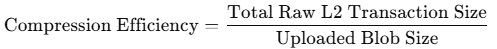

## Abstract

This proposal introduces a way to reward L2 Rollup operators for uploading block data to L1
(the Ethereum mainnet). It reduces the gas cost burden for operators. It strengthens the
sustainability of rollup operations. It promotes network decentralization.

## Motivation

1. **There is a cost burden for L2 operators.**
    - An operator uploads L2 block data to L1. It pays gas fees but has no direct way to recoup them.
    - The higher the cost, the more likely a few large operators dominate, causing censorship risk and centralization.

2. **There is data availability and blob usage.**
    - An operator must regularly upload block data to ensure that L2 data remains available.
    - A reward mechanism incentivizes the operator to use blob space effectively. It increases overall scalability.

3. **There is potential for greater network scalability and decentralization.**
    - A reward scheme encourages more rollup operators to enter, which fosters competition and reduces rollup fees.
    - Multiple operators submitting blocks in parallel can reduce L1 transaction load and maximize overall network capacity.

## Specification

### 1) Block Submission and Reward Flow

#### L2 Block Creation and Data Aggregation

- The operator aggregates L2 transactions and creates a block. It converts the block into blob data (blobTx).
- It may include a compressed state root, a ZK proof, or a fraud-proof payload.
- It uses high compression to get higher rewards.

#### Submission to L1

- The block submitter sends the blobTx to a specialized Rollup contract on L1 (for example, RollupBlockSubmitter).
- The data is committed on L1 through a transaction.
- The `msg.sender` of that L1 transaction identifies the submitter.

#### Challenge Period and Verification

- An Optimistic Rollup finalizes the block after its fraud-proof challenge period ends.
- A ZK Rollup finalizes the block immediately when the ZK proof is verified.
- A detected fraud triggers penalties against the submitter.

#### Reward Distribution

- The rollup contract pays ETH to the block submitter if the block is verified without issues.
- It considers metrics such as data size, network congestion, and compression efficiency.
- It can grant extra incentives if data remains available on-chain for a required duration (e.g. with EIP-4844 blobs).

### 2) How L1 Identifies the L2 Block Submitter

- L1 does not store the operator's identity explicitly, but it checks the transaction's `msg.sender`.
- A rollup contract logs events so that off-chain analyzers can track who submitted each block.
- A mapping can store the block hash and operator address, like this:
  
  ```solidity
  mapping(bytes32 => address) public rollupProposers;

  function submitRollup(bytes32 _blobHash) external {
      rollupProposers[_blobHash] = msg.sender;
      emit RollupSubmitted(msg.sender, _blobHash, block.timestamp);
  }
  ```

- The operator can later call a `claimReward()` function to withdraw the reward.

### 3) Ways to Use L2 Block Submitter Information

1. **Reward Distribution**
    - It grants rewards to the valid block submitter after the block passes all checks.
2. **Verification and Fraud Proofs**
    - A malicious operator faces blacklisting or slashing if fraud is proven.
3. **Extra Incentives for Honest Submitters**
    - It tracks submission history. It provides higher rewards to trustworthy operators who consistently submit correct blocks.

### **4) Reward Calculation Criteria**

1. **Blob Size**
    - Submitting more data (thus more L2 transactions) increases potential reward.
    - The system imposes a minimum of valid transactions to block trivial spam.
2. **Network Congestion**
    - Higher L1 congestion raises gas costs, so the reward can scale up to offset the operator's expenses.
3. **Compression Efficiency**
    - Fewer bytes for the same number of transactions leads to bonus payments.
    - For instance:
      

4. **Data Availability Period**
    - [EIP-4844](./eip-4844.md) blobs stay on-chain for around 2--3 weeks. The operator can earn extra rewards if no challenge arises during that period.

### 5) Reward Delivery Methods

1. **Smart Contract--Based Reward**
    - The rollup contract on L1 tracks submitters. It can directly send ETH to them once a block is finalized, or allow them to call **claimReward()**.
    - The funds can come from a dedicated pool, funded by rollup fees or other means.

2. **EVM Opcode--Based Reward**
    - A new opcode (e.g. **OP_ROLLUP_REWARD**) can trigger automatic ETH transfers when a blobTx is accepted.
    - It requires a protocol-level change (a hard fork), so it is more difficult to implement and less flexible than the contract-based model.

## Rationale

1. **Ensures Operator Sustainability**
    - An operator covers gas fees on L1. A reward allows the operator to recoup part of that cost and remain profitable, sustaining rollup operations.

2. **Boosts Data Availability and Efficiency**
    - Operators aim for better compression and effective blob usage to earn higher rewards. This approach improves the entire network's data efficiency.

3. **Lowers L2 Transaction Costs**
    - A reimbursed operator can reduce L2 fees for users. It makes L2 adoption more attractive.

## Security Considerations

1. **Reward Only after Proper Verification**
    - The system waits for fraud-proof or ZK-proof validation before issuing rewards.
    - Wrongful submissions get no rewards and can be penalized (e.g. slashing or blacklisting).

2. **Spam Mitigation**
    - The system sets a minimum transaction threshold or a minimum state update to disincentivize empty blob submissions.
    - It keeps rewards below the raw cost for non-useful data, deterring spam attempts.

3. **Operator Trust**
    - The system can require stake deposits from operators or vary rewards by past performance.
    - It can track multiple addresses tied to the same entity to prevent Sybil attacks.

## Backwards Compatibility

- This proposal targets EIP-4844 (Proto-Danksharding) for blob transactions.
- It can also work with pre-EIP-4844 calldata, though data storage costs are higher there.
- A smart contract--based reward system does not conflict with existing Ethereum protocol rules.
- [EIP-1559](./eip-1559.md), or other improvements do not interfere with this scheme.

## Security Considerations

The reward mechanism must be based on accurate verification, with clear rules to prevent fraudulent activity. Rollup operators submitting incorrect data should not receive rewards, and the reliability and accuracy of the data must be ensured.

<!-- TODO: Needs discussion. -->

## Copyright

Copyright and related rights waived via [CC0](../LICENSE.md).
