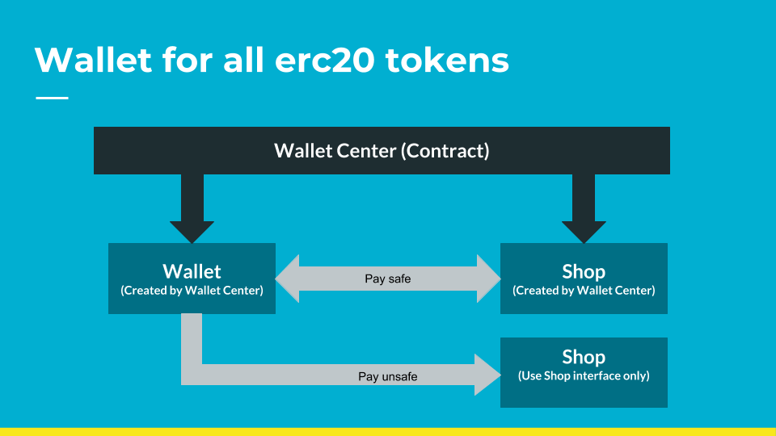
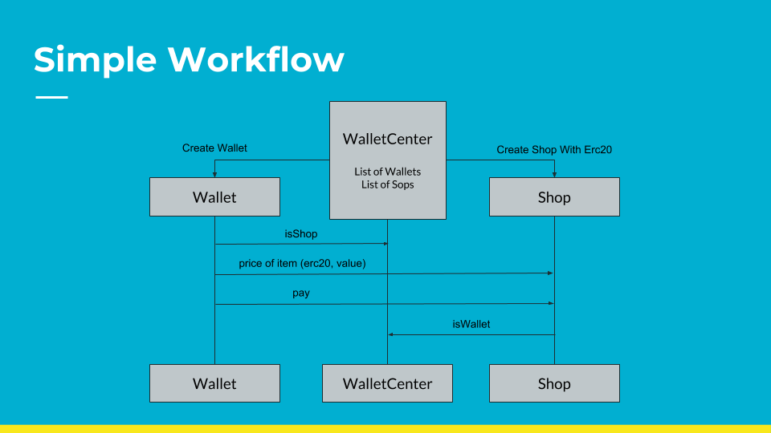

# All tokens go to heaven
## Simple Summary
Make wallets and shops created from certified contracts make erc20 tokens easy to use for commerce.



## Abstract
The mutual trust between the wallet and the shop created by the authenticated contract allows you to pay for and purchase items at a simple process.

## Motivation
New standards with improvements have been released, but the majority of tokens currently being developed are erc20 tokens. So I felt I needed a proposal to use old tokens in commerce.
 To use various erc20 tokens for trading, you need a custom contract. However, a single wallet with a variety of tokens, and a mutually trusted store, can make transactions that are simple and efficient. The erc20 token is traded through two calls, `approve (address _spender, uint256 _value)` and `transferFrom (address _from, address _to, uint256 _value)`, but when using the wallet contract, `paySafe (address _shop, uint256 _item)`will be traded only in one call.
And if you only reuse the store interface, you can also trade using `payUnsafe (address _shop, uint256 _item)`.

## Specification

## WalletCenter
### Methods
#### createWallet
Create wallet contract and add to list. Returns the address of new wallet.

``` js
function createWallet() public returns (address _wallet)
```

#### isWallet
Returns true or false value for test this address is a created by createWallet.

``` js
function isWallet(address _wallet) public constant returns (bool)
```

#### createShop
Create Shop contract and add to list. Returns the address of new Shop with erc20 token address.

``` js
function createShop(address _erc20) public returns (address _shop)
```

#### isShop
Returns true or false value for test this address is a created by createWallet.

``` js
function isShop(address _shop) public constant returns (bool)
```

### Events
#### Wallet
Search for my wallet.
``` js
event Wallet(address indexed _owner, address indexed _wallet)
```

#### Shop
Search for my shop.
``` js
event Shop(address indexed _owner, address indexed _shop, address indexed _erc20)
```

## Wallet
Wallet must be created by wallet center.
### Methods
#### balanceOf
Returns the account balance of Wallet.
``` js
function balanceOf(address _erc20) public constant returns (uint256 balance)
```

#### withdrawal
withdrawal `_value` amount of `_erc20` token to `_owner`.
``` js
function withdrawal(address _erc20, uint256 _value) onlyOwner public returns (bool success)
```

#### paySafe
Pay for safe shop (created by contract) item with item index `_item`.
``` js
function paySafe(address _shop, uint256 _item) onlyOwner onlyShop(_shop) public payable returns (bool success)
```

#### payUnsafe
Pay for unsafe shop (did not created by contract) item with item index `_item`.
``` js
function payUnsafe(address _shop, uint256 _item) onlyOwner public payable returns (bool success)
```

#### payCancel
Cancel pay and refund. (only weekly model)
``` js
function payCancel(address _shop, uint256 _item) onlyOwner public returns (bool success)
```

#### refund
Refund from shop with item index `_item`.
``` js
function refund(uint256 _item, uint256 _value) public payable returns (bool success)
```

### Events
#### Pay
``` js
event Pay(address indexed _shop, uint256 indexed _item, uint256 indexed _value)
```

#### Refund
``` js
event Refund(address indexed _shop, uint256 indexed _item, uint256 indexed _value)
```

## Shop
Shop is created by wallet center or not. but Shop that created by wallet center is called safe shop.
### Methods
#### balanceOf
Returns the account balance of Shop.
``` js
function balanceOf(address _erc20) public constant returns (uint256 balance)
```

#### withdrawal
withdrawal `_value` amount of `_erc20` token to `_owner`.
``` js
function withdrawal(address _erc20, uint256 _value) onlyOwner public returns (bool success)
```

#### pay
Pay from buyer with item index `_item`.
``` js
function pay(uint256 _item) onlyWallet(msg.sender) public payable returns (bool success)
```

#### refund
refund token to `_to`.
``` js
function refund(address _buyer, uint256 _item, uint256 _value) onlyWallet(_buyer) onlyOwner public payable returns (bool success)
```

#### resister
Listing item for sell.
``` js
function resister(uint8 _category, uint256 _price, uint256 _stock) onlyOwner public returns (uint256 _itemId)
```

#### update
Update item state for sell. (change item `_price` or add item `_stock`)
``` js
function update(uint256 _item, uint256 _price, uint256 _stock) onlyOwner public
```

#### price
Get token address and price from buyer with item index `_item`.
``` js
function price(uint256 _item) public constant returns (address _erc20, uint256 _value)
```

#### canBuy
`_who` can Buy `_item`.
``` js
function canBuy(address _who, uint256 _item) public constant returns (bool _canBuy)
```

#### isBuyer
`_who` is buyer of `_item`.
``` js
function isBuyer(address _who, uint256 _item) public constant returns (bool _buyer)
```

#### info
Set shop information bytes.
``` js
function info(bytes _msgPack)
```

#### upVote
Up vote for this shop.
``` js
function upVote()
```

#### dnVote
Down vote for this shop.
``` js
function dnVote()
```

#### about
Get shop token, up vote and down vote.
``` js
function about() view returns (address _erc20, uint256 _up, uint256 _down)
```

#### infoItem
Set item information bytes.
``` js
function infoItem(uint256 _item, bytes _msgPack)
```

#### upVoteItem
Up vote for this item.
``` js
function upVoteItem(uint256 _item)
```

#### dnVoteItem
Down vote for this item.
``` js
function dnVoteItem(uint256 _item)
```

#### aboutItem
Get Item price, up vote and down vote.
``` js
function aboutItem(uint256 _item) view returns (uint256 _price, uint256 _up, uint256 _down)
```

### Events
#### Pay
``` js
event Pay(address indexed _buyer, uint256 indexed _item, uint256 indexed _value)
```

#### Refund
``` js
event Refund(address indexed _to, uint256 indexed _item, uint256 indexed _value)
```

#### Item
``` js
event Item(uint256 indexed _item, uint256 _price)
```

#### Info
``` js
event Info(bytes _msgPack)
```

#### InfoItem
``` js
event InfoItem(uint256 indexed _item, bytes _msgPack)
```

## Implementation
Sample token contract address is [0x393dd70ce2ae7b30501aec94727968c517f90d52](https://ropsten.etherscan.io/address/0x393dd70ce2ae7b30501aec94727968c517f90d52)

WalletCenter contract address is [0x1fe0862a4a8287d6c23904d61f02507b5044ea31](https://ropsten.etherscan.io/address/0x1fe0862a4a8287d6c23904d61f02507b5044ea31)

WalletCenter create shop contract address is [0x59117730D02Ca3796121b7975796d479A5Fe54B0](https://ropsten.etherscan.io/address/0x59117730D02Ca3796121b7975796d479A5Fe54B0)

WalletCenter create wallet contract address is [0x39da7111844df424e1d0a0226183533dd07bc5c6](https://ropsten.etherscan.io/address/0x39da7111844df424e1d0a0226183533dd07bc5c6)


## Appendix
``` js
pragma solidity ^0.4.24;

contract ERC20Interface {
    function totalSupply() public constant returns (uint);
    function balanceOf(address tokenOwner) public constant returns (uint balance);
    function allowance(address tokenOwner, address spender) public constant returns (uint remaining);
    function transfer(address to, uint tokens) public returns (bool success);
    function approve(address spender, uint tokens) public returns (bool success);
    function transferFrom(address from, address to, uint tokens) public returns (bool success);

    event Transfer(address indexed from, address indexed to, uint tokens);
    event Approval(address indexed tokenOwner, address indexed spender, uint tokens);
}

contract SafeMath {
    function safeAdd(uint a, uint b) public pure returns (uint c) {
        c = a + b;
        require(c >= a);
    }
    function safeSub(uint a, uint b) public pure returns (uint c) {
        require(b <= a);
        c = a - b;
    }
    function safeMul(uint a, uint b) public pure returns (uint c) {
        c = a * b;
        require(a == 0 || c / a == b);
    }
    function safeDiv(uint a, uint b) public pure returns (uint c) {
        require(b > 0);
        c = a / b;
    }
}

contract _Base {
    address internal owner;
    address internal walletCenter;
    
    modifier onlyOwner {
        require(owner == msg.sender);
        _;
    }
    modifier onlyWallet(address _addr) {
        require(WalletCenter(walletCenter).isWallet(_addr));
        _;
    }
    modifier onlyShop(address _addr) {
        require(WalletCenter(walletCenter).isShop(_addr));
        _;
    }

    function balanceOf(address _erc20) public constant returns (uint256 balance) {
        if(_erc20==address(0))
            return address(this).balance;
        return ERC20Interface(_erc20).balanceOf(this);
    }

    function transfer(address _to, address _erc20, uint256 _value) internal returns (bool success) {
        require((_erc20==address(0)?address(this).balance:ERC20Interface(_erc20).balanceOf(this))>=_value);
        if(_erc20==address(0))
            _to.transfer(_value);
        else
            ERC20Interface(_erc20).approve(_to,_value);
        return true;
    }
    
    function withdrawal(address _erc20, uint256 _value) public returns (bool success);
    
    event Pay(address indexed _who, uint256 indexed _item, uint256 indexed _value);
    event Refund(address indexed _who, uint256 indexed _item, uint256 indexed _value);
    event Prize(address indexed _who, uint256 indexed _item, uint256 indexed _value);
}

contract _Wallet is _Base {
    constructor(address _who) public {
        owner           = _who;
        walletCenter    = msg.sender;
    }
    
    function pay(address _shop, uint256 _item) private {
        require(_Shop(_shop).canBuy(this,_item));

        address _erc20;
        uint256 _value;
        (_erc20,_value) = _Shop(_shop).price(_item);
        
        transfer(_shop,_erc20,_value);
        _Shop(_shop).pay(_item);
        emit Pay(_shop,_item,_value);
    }
    
    function paySafe(address _shop, uint256 _item) onlyOwner onlyShop(_shop) public payable returns (bool success) {
        pay(_shop,_item);
        return true;
    }
    function payUnsafe(address _shop, uint256 _item) onlyOwner public payable returns (bool success) {
        pay(_shop,_item);
        return true;
    }
    function payCancel(address _shop, uint256 _item) onlyOwner public returns (bool success) {
        _Shop(_shop).payCancel(_item);
        return true;
    }

    function refund(address _erc20, uint256 _item, uint256 _value) public payable returns (bool success) {
        require((_erc20==address(0)?msg.value:ERC20Interface(_erc20).allowance(msg.sender,this))==_value);
        if(_erc20!=address(0))
            ERC20Interface(_erc20).transferFrom(msg.sender,this,_value);
        emit Refund(msg.sender,_item,_value);
        return true;
    }
    function prize(address _erc20, uint256 _item, uint256 _value) public payable returns (bool success) {
        require((_erc20==address(0)?msg.value:ERC20Interface(_erc20).allowance(msg.sender,this))==_value);
        if(_erc20!=address(0))
            ERC20Interface(_erc20).transferFrom(msg.sender,this,_value);
        emit Prize(msg.sender,_item,_value);
        return true;
    }
    
    function withdrawal(address _erc20, uint256 _value) onlyOwner public returns (bool success) {
        require((_erc20==address(0)?address(this).balance:ERC20Interface(_erc20).balanceOf(this))>=_value);
        if(_erc20==address(0))
            owner.transfer(_value);
        else
            ERC20Interface(_erc20).transfer(owner,_value);
        return true;
    }
}

contract _Shop is _Base, SafeMath{
    address erc20;
    constructor(address _who, address _erc20) public {
        owner           = _who;
        walletCenter    = msg.sender;
        erc20           = _erc20;
    }
    
    struct item {
        uint8                       category;   // 0 = disable, 1 = non Stock, non Expire, 2 = can Expire (after 1 week), 3 = stackable
        uint256                     price;
        uint256                     stockCount;

        mapping(address=>uint256)   customer;
    }

    uint                    index;
    mapping(uint256=>item)  items;
    
    function pay(uint256 _item) onlyWallet(msg.sender) public payable returns (bool success) {
        require(canBuy(msg.sender, _item));
        require((erc20==address(0)?msg.value:ERC20Interface(erc20).allowance(msg.sender,this))==items[_item].price);
        
        if(erc20!=address(0))
            ERC20Interface(erc20).transferFrom(msg.sender,this,items[_item].price);
        
        if(items[_item].category==1 || items[_item].category==2 && now > safeAdd(items[_item].customer[msg.sender], 1 weeks))
            items[_item].customer[msg.sender]   = now;
        else if(items[_item].category==2 && now < safeAdd(items[_item].customer[msg.sender], 1 weeks) )
            items[_item].customer[msg.sender]   = safeAdd(items[_item].customer[msg.sender], 1 weeks);
        else if(items[_item].category==3) {
            items[_item].customer[msg.sender]   = safeAdd(items[_item].customer[msg.sender],1);
            items[_item].stockCount             = safeSub(items[_item].stockCount,1);
        }

        emit Pay(msg.sender,_item,items[_item].customer[msg.sender]);
        return true;
    }
    
    function payCancel(uint256 _item) onlyWallet(msg.sender) public returns (bool success) {
        require (items[_item].category==2&&safeAdd(items[_item].customer[msg.sender],2 weeks)>now&&balanceOf(erc20)>=items[_item].price);

        items[_item].customer[msg.sender]  = safeSub(items[_item].customer[msg.sender],1 weeks);
        transfer(msg.sender, erc20, items[_item].price);
        _Wallet(msg.sender).refund(erc20,_item,items[_item].price);
        emit Refund(msg.sender,_item,items[_item].price);

        return true;
    }
    function refund(address _to, uint256 _item) onlyWallet(_to) onlyOwner public payable returns (bool success) {
        require(isBuyer(_to,_item)&&items[_item].category>0&&(items[_item].customer[_to]>0||(items[_item].category==2&&safeAdd(items[_item].customer[_to],2 weeks)>now)));
        require((erc20==address(0)?address(this).balance:ERC20Interface(erc20).balanceOf(this))>=items[_item].price);

        if(items[_item].category==1)
            items[_item].customer[_to]  = 0;
        else if(items[_item].category==2)
            items[_item].customer[_to]  = safeSub(items[_item].customer[_to],1 weeks);
        else
            items[_item].customer[_to]  = safeSub(items[_item].customer[_to],1);
            
        transfer(_to, erc20, items[_item].price);
        _Wallet(_to).refund(erc20,_item,items[_item].price);
        emit Refund(_to,_item,items[_item].price);

        return true;
    }
    
    event Item(uint256 indexed _item, uint256 _price);
    function resister(uint8 _category, uint256 _price, uint256 _stock) onlyOwner public returns (uint256 _itemId) {
        require(_category>0&&_category<4);
        require(_price>0);
        items[index]    = item(_category,_price,_stock);
        index = safeAdd(index,1);
        emit Item(index,_price);
        return safeSub(index,1);
    }
    function update(uint256 _item, uint256 _price, uint256 _stock) onlyOwner public {
        require(items[_item].category>0);
        require(_price>0);
        uint256 temp = items[_item].price;
        items[_item].price      = _price;
        items[_item].stockCount = safeAdd(items[_item].stockCount,_stock);
        
        if(temp!=items[_item].price)
            emit Item(index,items[_item].price);
    }
    
    function price(uint256 _item) public constant returns (address _erc20, uint256 _value) {
        return (erc20,items[_item].price);
    }
    
    function canBuy(address _who, uint256 _item) public constant returns (bool _canBuy) {
        return  (items[_item].category>0) &&
                !(items[_item].category==1&&items[_item].customer[_who]>0) &&
                (items[_item].stockCount>0);
    }
    
    function isBuyer(address _who, uint256 _item) public constant returns (bool _buyer) {
        return (items[_item].category==1&&items[_item].customer[_who]>0)||(items[_item].category==2&&safeAdd(items[_item].customer[_who],1 weeks)>now)||(items[_item].category==3&&items[_item].customer[_who]>0);
    }
    
    uint lastWithdrawal;
    function withdrawal(address _erc20, uint256 _value) onlyOwner public returns (bool success) {
        require(safeAdd(lastWithdrawal,1 weeks)<=now);
        require((_erc20==address(0)?address(this).balance:ERC20Interface(_erc20).balanceOf(this))>=_value);
        if(_erc20==address(0))
            owner.transfer(_value);
        else
            ERC20Interface(_erc20).transfer(owner,_value);
        lastWithdrawal = now;
        return true;
    }
}

contract WalletCenter {
    mapping(address=>bool) public     wallet;
    event Wallet(address indexed _owner, address indexed _wallet);
    function createWallet() public returns (address _wallet) {
        _wallet = new _Wallet(msg.sender);
        wallet[_wallet] = true;
        emit Wallet(msg.sender,_wallet);
        return _wallet;
    }
    function isWallet(address _wallet) public constant returns (bool) {
        return wallet[_wallet];
    }
    mapping(address=>bool) public     shop;
    event Shop(address indexed _owner, address indexed _shop, address indexed _erc20);
    function createShop(address _erc20) public returns (address _shop) {
        _shop   = new _Shop(msg.sender,_erc20);
        shop[_shop] = true;
        emit Shop(msg.sender,_shop,_erc20);
        return _shop;
    }
    function isShop(address _shop) public constant returns (bool) {
        return shop[_shop];
    }
}
```
## Copyright
Copyright and related rights waived via [CC0](../LICENSE.md).
