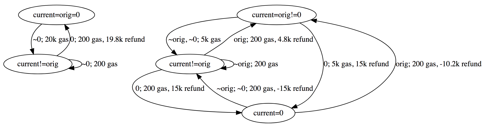

## Abstract

This EIP proposes net gas metering changes for SSTORE opcode, enabling
new usages for contract storage, and reducing excessive gas costs
where it doesn't match how most implementation works.

This acts as an alternative for EIP-1087, where it tries to be
friendlier to implementations that use different optimization
strategies for storage change caches.

## Motivation

This EIP proposes a way for gas metering on SSTORE (as an alternative
for EIP-1087 and EIP-1153), using information that is more universally
available to most implementations, and require as little change in
implementation structures as possible.

* *Storage slot's original value*.
* *Storage slot's current value*. 
* Refund counter.

Usages that benefits from this EIP's gas reduction scheme includes:

* Subsequent storage write operations within the same call frame. This
  includes reentry locks, same-contract multi-send, etc.
* Exchange storage information between sub call frame and parent call
  frame, where this information does not need to be persistent outside
  of a transaction. This includes sub-frame error codes and message
  passing, etc.

## Specification

Definitions of terms are as below:

* *Storage slot's original value*: This is the value of the storage if
  a reversion happens on the *current transaction*.
* *Storage slot's current value*: This is the value of the storage
  before SSTORE operation happens.
* *Storage slot's new value*: This is the value of the storage after
  SSTORE operation happens.

Replace SSTORE opcode gas cost calculation (including refunds) with
the following logic:

* If *current value* equals *new value* (this is a no-op), 200 gas is
  deducted.
* If *current value* does not equal *new value*
  * If *original value* equals *current value* (this storage slot has
    not been changed by the current execution context)
    * If *original value* is 0, 20000 gas is deducted.
    * Otherwise, 5000 gas is deducted. If *new value* is 0, add 15000
      gas to refund counter.
  * If *original value* does not equal *current value* (this storage
    slot is dirty), 200 gas is deducted. Apply both of the following
    clauses.
    * If *original value* is not 0
      * If *current value* is 0 (also means that *new value* is not
        0), remove 15000 gas from refund counter. We can prove that
        refund counter will never go below 0.
      * If *new value* is 0 (also means that *current value* is not
        0), add 15000 gas to refund counter.
    * If *original value* equals *new value* (this storage slot is
      reset)
      * If *original value* is 0, add 19800 gas to refund counter.
      * Otherwise, add 4800 gas to refund counter.

Refund counter works as before -- it is limited to half of the gas
consumed. On a transaction level, refund counter will never go below
zero. However, there are some important notes depending on the
implementation details:

* If an implementation uses "transaction level" refund counter (refund
  is checkpointed at each call frame), then the refund counter
  continues to be unsigned.
* If an implementation uses "execution-frame level" refund counter
  (a new refund counter is created at each call frame, and then merged
  back to parent when the call frame finishes), then the refund
  counter needs to be changed to signed -- at internal calls, a child
  refund can go below zero.

## Explanation

The new gas cost scheme for SSTORE is divided into three different
types:

* **No-op**: the virtual machine does not need to do anything. This is
  the case if *current value* equals *new value*.
* **Fresh**: this storage slot has not been changed, or has been reset
  to its original value. This is the case if *current value* does not
  equal *new value*, and *original value* equals *current value*.
* **Dirty**: this storage slot has already been changed. This is the
  case if *current value* does not equal *new value*, and *original
  value* does not equal *current value*.

We can see that the above three types cover all possible variations of
*original value*, *current value*, and *new value*.

**No-op** is a trivial operation. Below we only consider cases for
**Fresh** and **Dirty**.

All initial (not-**No-op**) SSTORE on a particular storage slot starts
with **Fresh**. After that, it will become **Dirty** if the value has
been changed. When going from **Fresh** to **Dirty**, we charge the
gas cost the same as current scheme. A **Dirty** storage slot can be
reset back to **Fresh** via a SSTORE opcode. This will trigger a
refund.

When a storage slot remains at **Dirty**, we charge 200 gas. In this
case, we would also need to keep track of `R_SCLEAR` refunds -- if we
already issued the refund but it no longer applies (*current value* is
0), then removes this refund from the refund counter. If we didn't
issue the refund but it applies now (*new value* is 0), then adds this
refund to the refund counter. It is not possible where a refund is not
issued but we remove the refund in the above case, because all storage
slot starts with **Fresh** state.

### State Transition

Below is a graph ([by
@Arachnid](https://github.com/ethereum/EIPs/pull/1283#issuecomment-410229053))
showing possible state transition of gas costs. We ignore **No-op**
state because that is trivial:

Below is table version of the above diagram. Vertical shows the *new
value* being set, and horizontal shows the state of *original value*
and *current value*.

When *original value* is 0:

|    | A (`current=orig=0`) | B (`current!=orig`)      |
|----|----------------------|--------------------------|
| ~0 | B; 20k gas           | B; 200 gas               |
| 0  | A; 200 gas           | A; 200 gas, 19.8k refund |

When *original value* is not 0:

|             | X (`current=orig!=0`) | Y (`current!=orig`)     | Z (`current=0`)           |
|-------------|-----------------------|-------------------------|---------------------------|
| `orig`      | X; 200 gas            | X; 200 gas, 4.8k refund | X; 200 gas, -10.2k refund |
| `~orig, ~0` | Y; 5k gas             | Y; 200 gas              | Y; 200 gas, -15k refund   |
| 0           | Z; 5k gas, 15k refund | Z; 200 gas, 15k refund  | Z; 200 gas                |

## Rationale

This EIP mostly archives what a transient storage tries to do
(EIP-1087 and EIP-1153), but without the complexity of introducing the
concept of "dirty maps", or an extra storage struct.

* We don't suffer from the optimization limitation of
  EIP-1087. EIP-1087 requires keeping a dirty map for storage changes,
  and implicitly makes the assumption that a transaction's storage
  changes are committed to the storage trie at the end of a
  transaction. This works well for some implementations, but not for
  others. After EIP-658, an efficient storage cache implementation
  would probably use an in-memory trie (without RLP encoding/decoding)
  or other immutable data structures to keep track of storage changes,
  and only commit changes at the end of a block. For them, it is
  possible to know a storage's original value and current value, but
  it is not possible to iterate over all storage changes without
  incurring additional memory or processing costs.
* It never costs more gas compared with the current scheme.
* It covers all usages for a transient storage. Clients that are easy
  to implement EIP-1087 will also be easy to implement this
  specification. Some other clients might require a little bit extra
  refactoring on this. Nonetheless, no extra memory or processing cost
  is needed on runtime.

Regarding SSTORE gas cost and refunds, see Appendix for proofs of
properties that this EIP satisfies.

* For *absolute gas used* (that is, actual *gas used* minus *refund*),
  this EIP is equivalent to EIP-1087 for all cases.
* For one particular case, where a storage slot is changed, reset to
  its original value, and then changed again, EIP-1283 would move more
  gases to refund counter compared with EIP-1087.

Examine examples provided in EIP-1087's Motivation:

* If a contract with empty storage sets slot 0 to 1, then back to 0,
  it will be charged `20000 + 200 - 19800 = 400` gas.
* A contract with empty storage that increments slot 0 5 times will be
  charged `20000 + 5 * 200 = 21000` gas.
* A balance transfer from account A to account B followed by a
  transfer from B to C, with all accounts having nonzero starting and
  ending balances, it will cost `5000 * 3 + 200 - 4800 = 10400` gas.

## Backwards Compatibility

This EIP requires a hard fork to implement. No gas cost increase is
anticipated, and many contracts will see gas reduction.

## Test Cases

Below we provide 17 test cases. 15 of them covering consecutive two
`SSTORE` operations are based on work [by
@chfast](https://github.com/ethereum/tests/issues/483). Two additional
case with three `SSTORE` operations is used to test the case when a
slot is reset and then set again.

| Code                               | Used Gas | Refund | Original | 1st | 2nd | 3rd |
|------------------------------------|----------|--------|----------|-----|-----|-----|
| `0x60006000556000600055`           | 412      | 0      | 0        | 0   | 0   |     |
| `0x60006000556001600055`           | 20212    | 0      | 0        | 0   | 1   |     |
| `0x60016000556000600055`           | 20212    | 19800  | 0        | 1   | 0   |     |
| `0x60016000556002600055`           | 20212    | 0      | 0        | 1   | 2   |     |
| `0x60016000556001600055`           | 20212    | 0      | 0        | 1   | 1   |     |
| `0x60006000556000600055`           | 5212     | 15000  | 1        | 0   | 0   |     |
| `0x60006000556001600055`           | 5212     | 4800   | 1        | 0   | 1   |     |
| `0x60006000556002600055`           | 5212     | 0      | 1        | 0   | 2   |     |
| `0x60026000556000600055`           | 5212     | 15000  | 1        | 2   | 0   |     |
| `0x60026000556003600055`           | 5212     | 0      | 1        | 2   | 3   |     |
| `0x60026000556001600055`           | 5212     | 4800   | 1        | 2   | 1   |     |
| `0x60026000556002600055`           | 5212     | 0      | 1        | 2   | 2   |     |
| `0x60016000556000600055`           | 5212     | 15000  | 1        | 1   | 0   |     |
| `0x60016000556002600055`           | 5212     | 0      | 1        | 1   | 2   |     |
| `0x60016000556001600055`           | 412      | 0      | 1        | 1   | 1   |     |
| `0x600160005560006000556001600055` | 40218    | 19800  | 0        | 1   | 0   | 1   |
| `0x600060005560016000556000600055` | 10218    | 19800  | 1        | 0   | 1   | 0   |

## Appendix: Proof

Because the *storage slot's original value* is defined as the value
when a reversion happens on the *current transaction*, it's easy to
see that call frames won't interfere SSTORE gas calculation. So
although the below proof is discussed without call frames, it applies
to all situations with call frames. Below we will discuss the case
separately for *original value* being zero and not zero, and use
*induction* to prove some properties of SSTORE gas cost.

*Final value* is the value of a particular storage slot at the end of
a transaction. *Absolute gas used* is the absolute value of *gas used*
minus *refund*. We use `N` to represent the total number of SSTORE
operations on a storage slot. For states discussed below, refer to
*State Transition* in *Explanation* section.

### Original Value Being Zero

When *original value* is 0, we want to prove that:

* **Case I**: If the *final value* ends up still being 0, we want to charge `200 *
  N` gases, because no disk write is needed.
* **Case II**: If the *final value* ends up being a non-zero value, we want to
  charge `20000 + 200 * (N-1)` gas, because it requires writing this
  slot to disk.
  
#### Base Case

We always start at state A. The first SSTORE can:

* Go to state A: 200 gas is deducted. We satisfy *Case I* because
  `200 * N == 200 * 1`.
* Go to state B: 20000 gas is deducted. We satisfy *Case II* because
  `20000 + 200 * (N-1) == 20000 + 200 * 0`.
  
#### Inductive Step

* From A to A. The previous gas cost is `200 * (N-1)`. The current
  gas cost is `200 + 200 * (N-1)`. It satisfy *Case I*.
* From A to B. The previous gas cost is `200 * (N-1)`. The current
  gas cost is `20000 + 200 * (N-1)`. It satisfy *Case II*.
* From B to B. The previous gas cost is `20000 + 200 * (N-2)`. The
  current gas cost is `200 + 20000 + 200 * (N-2)`. It satisfy
  *Case II*.
* From B to A. The previous gas cost is `20000 + 200 * (N-2)`. The
  current gas cost is `200 - 19800 + 20000 + 200 * (N-2)`. It satisfy
  *Case I*.
  
### Original Value Not Being Zero

When *original value* is not 0, we want to prove that:

* **Case I**: If the *final value* ends up unchanged, we want to
  charge `200 * N` gases, because no disk write is needed.
* **Case II**: If the *final value* ends up being zero, we want to
  charge `5000 - 15000 + 200 * (N-1)` gas. Note that `15000` is the
  refund in actual defintion.
* **Case III**: If the *final value* ends up being a changed non-zero
  value, we want to charge `5000 + 200 * (N-1)` gas.
  
#### Base Case

We always start at state X. The first SSTORE can:

* Go to state X: 200 gas is deducted. We satisfy *Case I* because
  `200 * N == 200 * 1`.
* Go to state Y: 5000 gas is deducted. We satisfy *Case III* because
  `5000 + 200 * (N-1) == 5000 + 200 * 0`.
* Go to state Z: The absolute gas used is `5000 - 15000` where 15000
  is the refund. We satisfy *Case II* because `5000 - 15000 + 200 *
  (N-1) == 5000 - 15000 + 200 * 0`.
  
#### Inductive Step

* From X to X. The previous gas cost is `200 * (N-1)`. The current gas
  cost is `200 + 200 * (N-1)`. It satisfy *Case I*.
* From X to Y. The previous gas cost is `200 * (N-1)`. The current gas
  cost is `5000 + 200 * (N-1)`. It satisfy *Case III*.
* From X to Z. The previous gas cost is `200 * (N-1)`. The current
  absolute gas cost is `5000 - 15000 + 200 * (N-1)`. It satisfy *Case
  II*.
* From Y to X. The previous gas cost is `5000 + 200 * (N-2)`. The
  absolute current gas cost is `200 - 4800 + 5000 + 200 * (N-2)`. It
  satisfy *Case I*.
* From Y to Y. The previous gas cost is `5000 + 200 * (N-2)`. The
  current gas cost is `200 + 5000 + 200 * (N-2)`. It satisfy *Case
  III*.
* From Y to Z. The previous gas cost is `5000 + 200 * (N-2)`. The
  current absolute gas cost is `200 - 15000 + 5000 + 200 * (N-2)`. It
  satisfy *Case II*.
* From Z to X. The previous gas cost is `5000 - 15000 + 200 *
  (N-2)`. The current absolute gas cost is `200 + 10200 + 5000 -
  15000 + 200 * (N-2)`. It satisfy *Case I*.
* From Z to Y. The previous gas cost is `5000 - 15000 + 200 *
  (N-2)`. The current absolute gas cost is `200 + 15000 + 5000 -
  15000 + 200 * (N-2)`. It satisfy *Case III*.
* From Z to Z. The previous gas cost is `5000 - 15000 + 200 *
  (N-2)`. The current absolute gas cost is `200 + 5000 - 15000 + 200 *
  (N-2)`. It satisfy *Case II*.

## Copyright

Copyright and related rights waived via [CC0](https://creativecommons.org/publicdomain/zero/1.0/).
