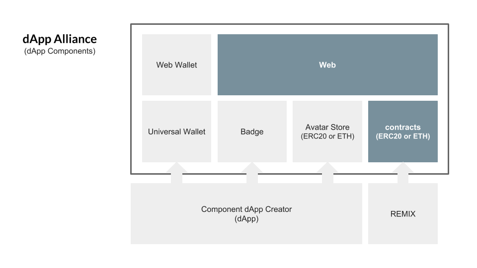
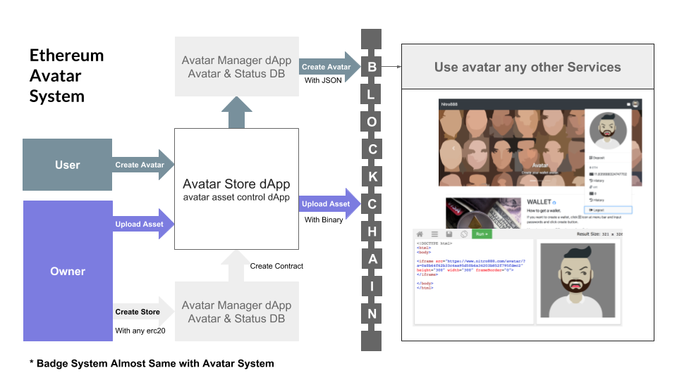
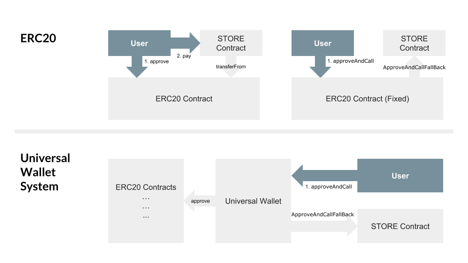

## Simple Summary
Contracts are open source based. And most developers use the public contracts at the start of the project to modify or simply include them. This is project-oriented centralized development and I think it is a waste of resources. Therefore, we propose to make dApp or contracts component-ready for use in other services.

## Abstract
There have been suggestions for modified tokens based on erc20, but since many tokens have already been built on erc20, it is necessary to increase the utilization of already developed erc20 tokens. Therefore, we propose a universal wallet that can use erc20 tokens universally. We also propose a component dApp that allows you to create and save your avatar (& social badge system), and use it immediately in other services. All of the dApps suggested in this document are based on decentralized development and use that anyone can create and participate in.

## Motivation
While many projects are under development in an open source way, they are simply adding and deploy with open sources to their projects. This means that you are developing a centralized service that uses your own dApp-generated information on your own. In order to improve the block chain ecosystem, all resources created by dApp and placed in the public block chain must be reusable in another dApp. This means that you can enhance your service by exchanging the generated information with other dApp. Likewise, ERC20 Tokens require Universal Wallet standards to be easy to use for direct transactions.

### Seeds for improvement of the blockchain ecosystem.
- Synergy - With other dApps and resources.
- Enhanced interface - For ERC20 tokens.
- Easy & Decentralized - Everyone should be able to add to their services easily, without censorship.


#### The following avatar store, badge system, and universal wallet are kind of examples about component dApp.


## Specification
### 1. Avatar
#### 1.1. Avatar Shop
- The avatar store is created after ERC20 currency is set.
- You can customize asset category & viewer script.

#### 1.2. Upload asset & user data
The avatar's information & assets are stored in the event log part of the block chain.
- Assets are SVG format. (compressed with gzip)
- avatar information data is json (compressed with msgpack)


** The avatar assets from [Avataaars](https://github.com/fangpenlin/avataaars) developed by [Fang-Pen Lin](https://twitter.com/fangpenlin), the original avatar is designed by [Pablo Stanley](https://twitter.com/pablostanley).

### 2. Universal Wallet

#### 2.1. ERC20 interface
``` js
contract ERC20Interface {
    function totalSupply() public constant returns (uint);
    function balanceOf(address tokenOwner) public constant returns (uint balance);
    function allowance(address tokenOwner, address spender) public constant returns (uint remaining);
    function transfer(address to, uint tokens) public returns (bool success);
    function approve(address spender, uint tokens) public returns (bool success);
    function transferFrom(address from, address to, uint tokens) public returns (bool success);

    event Transfer(address indexed from, address indexed to, uint tokens);
    event Approval(address indexed tokenOwner, address indexed spender, uint tokens);
}
```

#### 2.2. Fixed ERC20 contract for receive approval and execute function in one call
``` js
function approveAndCall(address spender, uint tokens, bytes data) public returns (bool success) {
    allowed[msg.sender][spender] = tokens;
    emit Approval(msg.sender, spender, tokens);
    ApproveAndCallFallBack(spender).receiveApproval(msg.sender, tokens, this, data);
    return true;
}
```

#### 2.3. And ApproveAndCallFallBack contract for Fixed ERC20.
However, many ERC20 tokens are not prepared.
``` js
contract ApproveAndCallFallBack {
    function receiveApproval(address from, uint256 tokens, address token, bytes data) public;
}
```
#### 2.4. Universal Wallet
We propose a Universal Wallet to solve this problem.

``` js
contract UniversalWallet is _Base {

    constructor(bytes _msgPack) _Base(_msgPack) public {}
    function () public payable {}

    //-------------------------------------------------------
    // erc20 interface
    //-------------------------------------------------------
    function balanceOf(address _erc20) public constant returns (uint balance) {
        if(_erc20==address(0))
            return address(this).balance;
        return _ERC20Interface(_erc20).balanceOf(this);
    }
    function transfer(address _erc20, address _to, uint _tokens) onlyOwner public returns (bool success) {
        require(balanceOf(_erc20)>=_tokens);
        if(_erc20==address(0))
            _to.transfer(_tokens);
        else
            return _ERC20Interface(_erc20).transfer(_to,_tokens);
        return true;
    }
    function approve(address _erc20, address _spender, uint _tokens) onlyOwner public returns (bool success) {
        require(_erc20 != address(0));
        return _ERC20Interface(_erc20).approve(_spender,_tokens);
    }

    //-------------------------------------------------------
    // pay interface
    //-------------------------------------------------------
    function pay(address _store, uint _tokens, uint256[] _options) onlyOwner public {
        address erc20   = _ApproveAndCallFallBack(_store).erc20();
        address spender = _ApproveAndCallFallBack(_store).spender();
        if(erc20 == address(0)) {
            transfer(erc20,spender,_tokens);
            _ApproveAndCallFallBack(_store).receiveApproval(_options);
        } else {
            _ERC20Interface(erc20).approve(spender,_tokens);
            _ApproveAndCallFallBack(_store).receiveApproval(_options);
        }
    }
    function pay(address _store, uint _tokens, bytes _msgPack) onlyOwner public {
        address erc20   = _ApproveAndCallFallBack(_store).erc20();
        address spender = _ApproveAndCallFallBack(_store).spender();
        if(erc20 == address(0)) {
            transfer(erc20,spender,_tokens);
            _ApproveAndCallFallBack(_store).receiveApproval(_msgPack);
        } else {
            _ERC20Interface(erc20).approve(spender,_tokens);
            _ApproveAndCallFallBack(_store).receiveApproval(_msgPack);
        }
    }
}
```

## Test Cases
- https://www.nitro888.com
- https://github.com/Nitro888/nitro888.github.io
- https://github.com/Nitro888/dApp-Alliance

## Copyright
Copyright and related rights waived via [CC0](../LICENSE.md).
