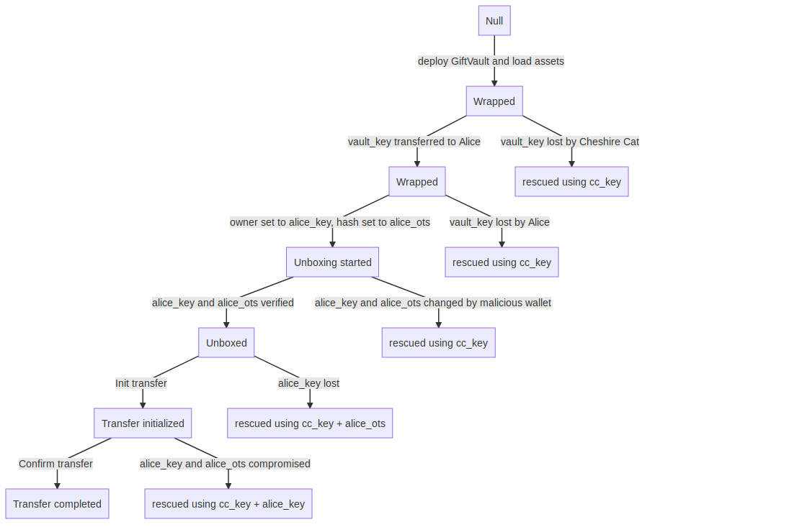

# ERC1638: Ethereum GiftVault -- a safe unboxing ceremony for time-locked multisig smart contracts holding gifts

eip: ERC1638
title: Ethereum GiftVault Standard
author: @ontofractal <ontofractal@protonmail.com>
discussions-to: https://ethereum-magicians.org/t/erc-1638-giftvault-a-ceremony-for-safe-unboxing-of-a-time-locked-multisig-smart-contract-holding-gifts
status: Draft
type: ERC
created: 2018-12-04

# Simple Summary

GiftVault smart contract standard is designed to provide superior gifting/unboxing experience that doesn't impose undue operation security burdens and assures peace of mind for participants.

# GiftVault Abstract: an opening ceremony for a time-locked multisig smart contract holding gifts

This standard provides basic functionality to create, transfer, and recover assets packaged as gifts on the Ethereum blockchain. GiftVault is designed to be compatible with multiple third-party wallets.

**Gifter and gift recepient perform a guided ceremony** to protect the gift both from malicious actors and inadvertent loss.

User experience of any gift-related product is paramount. As as result GiftVault specs include both smart contract interface specification and UX/UI specs for wallets and apps.

GiftVault design embraces redundancy to minimize loss of assets which leads to increased complexity. UX/UI trials are required before finalization of standard.

Gifts are a powerful viral user acquisition channel and as a result wallets are incentivized to implement the GiftVault standard and maintain the notification infrastructure.

# Motivation (optional)

This ERC is a result of my personal unsatisfactory experience of gifting Ethereum assets to people who subsequently lost their assets through fishing or misplaced keys.

#### Goals

* Move the needle on the amount of gifts exchanged in the Ethereum ecosystem
* Provide understandable, easy and secure gift asset management UX/UI specs
* Enable development of exciting unboxing experience using wallet apps
* Provide a peace of mind for all participants

#### Non-goals

* Create a secure permanent wallet

## Context

### Example usage scenario

Cheshire Cat is presenting a gift of assorted gaming NFTs to Alice. Alice doesn't understand the complexity of asset management on the blockchain and her naive approach to handling of private keys would most probably lead to loss of assets. Both Alice and Cheshire Cat are concerned that Alice is not yet sufficiently proficient in operation security to prevent being hacked.

### GiftVault smart contract states

1. wrapped
* unboxing initialized
* unboxed
* transfer initialized
* transfer completed

* override activated / rescued

### Participants

* Cheshire Cat, the gifter
* Alice, the giftee
* Bandersnatch, a malicious actor

### Keys

* cc_key: Cheshire Cat key that controls a gifter address used for initial smart contract deployment and possible override and rescue in the future
* vault_key: GiftVault temporary key (brain wallet) that controls the GiftVault
* alice_key: Alice's key
* alice_ots: Alice's One Time Secret

# UX/UI specification

## Constraints

* **A recovery must be possible in the majority of cases where Alice used a compromised wallet**
* A recovery must be possible if Alice lost her gift key
* A recovery must be possible if Alice lost her primary key
* Cheshire Cat must have only temporary and short-term control over the GiftVault
* Cheshire Cat must be able to present a gift in a physical form and without any preliminary coordination with Alice
* If keys are not compromised/lost, Alice must be able to manage the assets without Cheshire Cat involvement

## Stages

#### Stage 0: None -> Wrapped state

At this stage Cheshire Cat deploys a GiftVault smart contract that holds assets and obtains a new brain wallet to present to Alice.

Action flow for Cheshire Cat

* Install/launch a wallet app
* Obtain assets
* Open "create Ethereum GiftVault" screen
* Deploy GiftVault smart contract using the cc_key
* Set up a notification channel for Alice and itself
* Write down generated vault_key (GiftVault Temporary Key)  
* Transfer ethers, tokens, NFTs or other asset to GiftVault
* Present GTK brain wallet to Alice

#### Stage 1: Wrapped -> Unboxing -> Unboxed

Unboxing is a process of transfer of control of GiftVault smart contract from Cheshire Cat to Alice. The unboxing process requires a wallet app.

Action flow for Alice

* Install/launch a wallet app
* Open "claim Ethereum GiftVault" screen
* Create and/or select address to deploy and manage the GiftVault
* Enter vault_key brain wallet received from Cheshire Cat
* Start unboxing by setting owner to address controlled by alice_key (Alice Key) and commit hash of (Alice One Time Password), an easy-to-remember word or password (chosen by Alice)
* Install/launch an independent validation app and set up a notification channel
* Verify that alice_key address and hash committed to the smart contract are matching using an independent validation app
* Wait for 1-7 days and confirm final smart contract ownership hand-off
* Alice confirms unboxing hand-off, GiftVault state is set to Unboxed
* At this moment Cheshire Cat won't be able to activate GiftVault override without alice_key or alice_ots

#### Stage 2: Unboxed -> Transfer Initialized -> Empty

In a unboxed state GiftVault enables withdrawal of tokens to any Ethereum address after completion of an enforced time-lock period.

Action flow for Alice

* Open GiftVault screen
* Wait for a general time-lock to expire
* Set an address for withdrawal
* Wait for withdrawal time-lock to expire
* Confirm the withdrawal

#### Stage OVERRIDE: Any -> Override activated

#### Action flow for Cheshire Cat

* Open Rescue GiftVault screen
* Check smart contract information and override status
* Contact Alice to activate override if disabled
* Select override transfer address
* Activate override and transfer assets

# Interface specification

The key words “MUST”, “MUST NOT”, “REQUIRED”, “SHALL”, “SHALL NOT”, “SHOULD”, “SHOULD NOT”, “RECOMMENDED”, “MAY”, and “OPTIONAL” in this document are to be interpreted as described in RFC 2119.

#### Constructor

`constructor(address _brainWalletAddress) public`

Deploys a smart contract, must set `owner` address to vault_key address, must set `gifter` address to `msg.sender`.

#### initUnboxing

`function initUnboxing(address _newOwner, string _secretHash) public onlyBy(owner)`

Must set `unboxingInitialized` to true,  must set `unboxingStartedTimestamp` to `msg.timestamp`, must set `owner` to `newOwner` (address controlled by alice_key) and must commit `secretHash`, a sha256 hash of Alice's secret.

#### confirmUnboxing

`function confirmUnboxing() public onlyBy(owner)`

Successful function call must set `unboxingCompleted` to true.

#### initTransfer

`function initTransfer(address _externalAddress) public onlyBy(owner)`

Must initialize transfer of assets to the external address and start the withdrawal delay timer.

#### completeTransfer

`function completeTransfer() onlyBy(owner)`

Must transfer assets to the external address after the withdrawal delay has ended.

#### activateOverride

`function activateOverride() onlyBy(owner)`

Must set `overrideEnabled` variable to true using alice_key.

#### activateOverrideBySecret

`function activateOverrideBySecret(string _secretClearText)`

Must set `overrideEnabled` variable to true for any `msg.sender` if sha256 hash of the clear text is the same as the precommitted hash (alice_ots).

#### overrideAndRescue

`function overrideAndRescue() onlyBy(gifter)`

Must perform an immediate transfer of assets to any address if `unboxingCompleted == false` or `overrideEnabled == true`.

A gifter must NOT be able to override and transfer assets using their gifter key if `unboxingCompleted` is true.

# Threat vectors and mitigation

| Threat vector  | Mitigation |
| ------------- | ------------- |
| cc_key is lost or compromised by Bandersnatch | Out of scope  |
| The vault_key is lost before the gift transfer by Cheshire Cat | Override and rescue activated with a cc_key  |
| The vault_key is lost after the gift transfer by Alice | Override and rescue activated with a cc_key after request by Alice  |
| vault_key is stolen, GiftVault activated by Bandersnatch, Alice is unaware | Cheshire Cat wallet is monitoring the smart contract and sends a notification to Alice and Cheshire Cat. Alice must react within 7 days and request override by Cheshire Cat. Override activated with a cc_key |
| vault_key is entered by Alice into a malicious wallet. Wallet ALTERS the secret password and linked address. | Cheshire Cat wallet is monitoring the smart contract and sends a notification to Alice. Alice is required to verify the alice_ots hash and owner address on an independent resource. When the verification fails, she requests override from Cheshire Cat.  Override activated with a cc_key |
| vault_key is entered by Alice into a malicious wallet. Wallet does NOT ALTER the secret password and linked key. | See next stage |
| alice_key and alice_ots are compromised, malicious withdrawal initiated | Cheshire Cat wallet is monitoring the smart contract and sends a notification of withdrawal to Alice. Alice contacts Cheshire Cat. Override activated with cc_key and alice_key |
| alice_key is lost | Alice contacts Cheshire Cat. Override activated with cc_key and one time secret|

# Implementations

TODO

# Copyright Waiver

Copyright and related rights waived via CC0.
