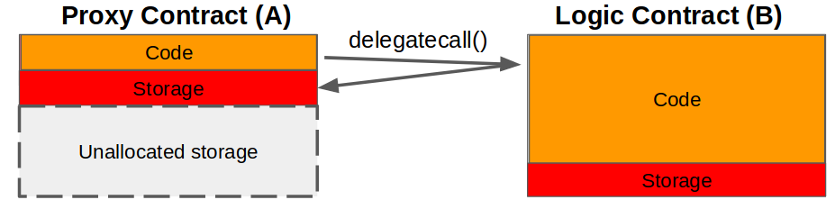

## Simple Summary

Standard upgradeable proxy contract.

## Abstract

The following describes a standard for proxy contracts which is universally compatible with all contracts, and does not create incompatibility between the proxy and business-logic contracts. This is achieved by utilizing a unique storage position in the proxy contract to store the Logic Contract's address. A compatibility check ensures successful upgrades. Upgrading can be performed unlimited times, or as determined by custom logic. In addition, a method for selecting from multiple constructors is provided, which does not inhibit the ability to verify bytecode.

## Motivation

- Improve upon existing proxy implementations to improve developer experience for deploying and maintaining Proxy and Logic Contracts.

- Standardize and improve the methods for verifying the bytecode used by the Proxy Contract.

## Terminology

- `delegatecall()` - Function in contract **A** which allows an external contract **B** (delegating) to modify **A**'s storage (see diagram below, [Solidity docs](https://solidity.readthedocs.io/en/v0.5.3/introduction-to-smart-contracts.html#delegatecall-callcode-and-libraries))
- **Proxy Contract** - The contract **A** which stores data, but uses the logic of external contract **B** by way of `delegatecall()`.
- **Logic Contract** - The contract **B** which contains the logic used by Proxy Contract **A**
- **Proxiable Contract** - Inherited in Logic Contract **B** to provide the upgrade functionality



## Specification

The Proxy Contract proposed here should be deployed _as is_, and used as a drop-in replacement for any existing methods of lifecycle management of contracts. In addition to the Proxy Contract, we propose the Proxiable Contract interface/base which establishes a pattern for the upgrade which does not interfere with existing business rules. The logic for allowing upgrades can be implemented as needed.

### Proxy Contract

#### Functions

##### `fallback`

The proposed fallback function follows the common pattern seen in other Proxy Contract implementations such as [Zeppelin][1] or [Gnosis][2].

However, rather than forcing use of a variable, the address of the Logic Contract is stored at the defined storage position `keccak256("PROXIABLE")`. This eliminates the possibility of collision between variables in the Proxy and Logic Contracts, thus providing "universal" compatibility with any Logic Contract.

```javascript
function() external payable {
    assembly { // solium-disable-line
        let contractLogic := sload(0xc5f16f0fcc639fa48a6947836d9850f504798523bf8c9a3a87d5876cf622bcf7)
        calldatacopy(0x0, 0x0, calldatasize)
        let success := delegatecall(sub(gas, 10000), contractLogic, 0x0, calldatasize, 0, 0)
        let retSz := returndatasize
        returndatacopy(0, 0, retSz)
        switch success
        case 0 {
            revert(0, retSz)
        }
        default {
            return(0, retSz)
        }
    }
}
```

#### `constructor`

The proposed constructor accepts any number of arguments of any type, and thus is compatible with any Logic Contract constructor function.

In addition, the arbitrary nature of the Proxy Contract's constructor provides the ability to select from one or more constructor functions available in the Logic Contract source code (e.g., `constructor1`, `constructor2`, ... etc. ). Note that if multiple constructors are included in the Logic Contract, a check should be included to prohibit calling a constructor again post-initialization.

It's worth noting that the added functionality of supporting multiple constructors does not inhibit verification of the Proxy Contract's bytecode, since the initialization tx call data (input) can be decoded by first using the Proxy Contract ABI, and then using the Logic Contract ABI.

The contract below shows the proposed implementation of the Proxy Contract.

```javascript
contract Proxy {
    // Code position in storage is keccak256("PROXIABLE") = "0xc5f16f0fcc639fa48a6947836d9850f504798523bf8c9a3a87d5876cf622bcf7"
    constructor(bytes memory constructData, address contractLogic) public {
        // save the code address
        assembly { // solium-disable-line
            sstore(0xc5f16f0fcc639fa48a6947836d9850f504798523bf8c9a3a87d5876cf622bcf7, contractLogic)
        }
        (bool success, bytes memory _ ) = contractLogic.delegatecall(constructData); // solium-disable-line
        require(success, "Construction failed");
    }

    function() external payable {
        assembly { // solium-disable-line
            let contractLogic := sload(0xc5f16f0fcc639fa48a6947836d9850f504798523bf8c9a3a87d5876cf622bcf7)
            calldatacopy(0x0, 0x0, calldatasize)
            let success := delegatecall(sub(gas, 10000), contractLogic, 0x0, calldatasize, 0, 0)
            let retSz := returndatasize
            returndatacopy(0, 0, retSz)
            switch success
            case 0 {
                revert(0, retSz)
            }
            default {
                return(0, retSz)
            }
        }
    }
}
```

### Proxiable Contract

The Proxiable Contract is included in the Logic Contract, and provides the functions needed to perform an upgrade. The compatibility check `proxiable` prevents irreparable updates during an upgrade.

> :warning: Warning: `updateCodeAddress` and `proxiable` must be present in the Logic Contract. Failure to include these may prevent upgrades, and could allow the Proxy Contract to become entirely unusable. See below [Restricting dangerous functions](#restricting-dangerous-functions)

#### Functions

##### `proxiable`

Compatibility check to ensure the new Logic Contract implements the Universal Upgradeable Proxy Standard. Note that in order to support future implementations, the `bytes32` comparison could be changed e.g., `keccak256("PROXIABLE-ERC1822-v1")`.

##### `updateCodeAddress`

Stores the Logic Contract's address at storage `keccak256("PROXIABLE")` in the Proxy Contract.

The contract below shows the proposed implementation of the Proxiable Contract.

```javascript
contract Proxiable {
    // Code position in storage is keccak256("PROXIABLE") = "0xc5f16f0fcc639fa48a6947836d9850f504798523bf8c9a3a87d5876cf622bcf7"

    function updateCodeAddress(address newAddress) internal {
        require(
            bytes32(0xc5f16f0fcc639fa48a6947836d9850f504798523bf8c9a3a87d5876cf622bcf7) == Proxiable(newAddress).proxiableUUID(),
            "Not compatible"
        );
        assembly { // solium-disable-line
            sstore(0xc5f16f0fcc639fa48a6947836d9850f504798523bf8c9a3a87d5876cf622bcf7, newAddress)
        }
    }
    function proxiableUUID() public pure returns (bytes32) {
        return 0xc5f16f0fcc639fa48a6947836d9850f504798523bf8c9a3a87d5876cf622bcf7;
    }
}
```

## Pitfalls when using a proxy

The following common best practices should be employed for all Logic Contracts when using a proxy contract.

### Separating Variables from Logic

Careful consideration should be made when designing a new Logic Contract to prevent incompatibility with the existing storage of the Proxy Contract after an upgrade. Specifically, the order in which variables are instantiated in the new contract should not be modified, and any new variables should be added after all existing variables from the previous Logic Contract

To facilitate this practice, we recommend utilizing a single "base" contract which holds all variables, and which is inherited in subsequent logic contract(s). This practice greatly reduces the chances of accidentally reordering variables or overwriting them in storage.

### Restricting dangerous functions

The compatibility check in the Proxiable Contract is a safety mechanism to prevent upgrading to a Logic Contract which does not implement the Universal Upgradeable Proxy Standard. However, as occurred in the parity wallet hack, it is still possible to perform irreparable damage to the Logic Contract itself.

In order to prevent damage to the Logic Contract, we recommend restricting permissions for any potentially damaging functions to `onlyOwner`, and giving away ownership of the Logic Contract immediately upon deployment to a null address (e.g., address(1)). Potentially damaging functions include native functions such as `SELFDESTRUCT`, as well functions whose code may originate externally such as `CALLCODE`, and `delegatecall()`. In the [ERC-20 Token](#erc-20-token) example below, a `LibraryLock` contract is used to prevent destruction of the logic contract.

## Examples

### Owned

In this example, we show the standard ownership example, and restrict the `updateCodeAddress` to only the owner.

```javascript
contract Owned is Proxiable {
    // ensures no one can manipulate this contract once it is deployed
    address public owner = address(1);

    function constructor1() public{
        // ensures this can be called only once per *proxy* contract deployed
        require(owner == address(0));
        owner = msg.sender;
    }

    function updateCode(address newCode) onlyOwner public {
        updateCodeAddress(newCode);
    }

    modifier onlyOwner() {
        require(msg.sender == owner, "Only owner is allowed to perform this action");
        _;
    }
}
```

### ERC-20 Token

#### Proxy Contract

```javascript
pragma solidity ^0.5.1;

contract Proxy {
    // Code position in storage is keccak256("PROXIABLE") = "0xc5f16f0fcc639fa48a6947836d9850f504798523bf8c9a3a87d5876cf622bcf7"
    constructor(bytes memory constructData, address contractLogic) public {
        // save the code address
        assembly { // solium-disable-line
            sstore(0xc5f16f0fcc639fa48a6947836d9850f504798523bf8c9a3a87d5876cf622bcf7, contractLogic)
        }
        (bool success, bytes memory _ ) = contractLogic.delegatecall(constructData); // solium-disable-line
        require(success, "Construction failed");
    }

    function() external payable {
        assembly { // solium-disable-line
            let contractLogic := sload(0xc5f16f0fcc639fa48a6947836d9850f504798523bf8c9a3a87d5876cf622bcf7)
            calldatacopy(0x0, 0x0, calldatasize)
            let success := delegatecall(sub(gas, 10000), contractLogic, 0x0, calldatasize, 0, 0)
            let retSz := returndatasize
            returndatacopy(0, 0, retSz)
            switch success
            case 0 {
                revert(0, retSz)
            }
            default {
                return(0, retSz)
            }
        }
    }
}
```

#### Token Logic Contract

``` javascript

contract Proxiable {
    // Code position in storage is keccak256("PROXIABLE") = "0xc5f16f0fcc639fa48a6947836d9850f504798523bf8c9a3a87d5876cf622bcf7"

    function updateCodeAddress(address newAddress) internal {
        require(
            bytes32(0xc5f16f0fcc639fa48a6947836d9850f504798523bf8c9a3a87d5876cf622bcf7) == Proxiable(newAddress).proxiableUUID(),
            "Not compatible"
        );
        assembly { // solium-disable-line
            sstore(0xc5f16f0fcc639fa48a6947836d9850f504798523bf8c9a3a87d5876cf622bcf7, newAddress)
        }
    }
    function proxiableUUID() public pure returns (bytes32) {
        return 0xc5f16f0fcc639fa48a6947836d9850f504798523bf8c9a3a87d5876cf622bcf7;
    }
}


contract Owned {

    address owner;

    function setOwner(address _owner) internal {
        owner = _owner;
    }
    modifier onlyOwner() {
        require(msg.sender == owner, "Only owner is allowed to perform this action");
        _;
    }
}

contract LibraryLockDataLayout {
  bool public initialized = false;
}

contract LibraryLock is LibraryLockDataLayout {
    // Ensures no one can manipulate the Logic Contract once it is deployed.
    // PARITY WALLET HACK PREVENTION

    modifier delegatedOnly() {
        require(initialized == true, "The library is locked. No direct 'call' is allowed");
        _;
    }
    function initialize() internal {
        initialized = true;
    }
}

contract ERC20DataLayout is LibraryLockDataLayout {
  uint256 public totalSupply;
  mapping(address=>uint256) public tokens;
}

contract ERC20 {
    //  ...
    function transfer(address to, uint256 amount) public {
        require(tokens[msg.sender] >= amount, "Not enough funds for transfer");
        tokens[to] += amount;
        tokens[msg.sender] -= amount;
    }
}

contract MyToken is ERC20DataLayout, ERC20, Owned, Proxiable, LibraryLock {

    function constructor1(uint256 _initialSupply) public {
        totalSupply = _initialSupply;
        tokens[msg.sender] = _initialSupply;
        initialize();
        setOwner(msg.sender);
    }
    function updateCode(address newCode) public onlyOwner delegatedOnly  {
        updateCodeAddress(newCode);
    }
    function transfer(address to, uint256 amount) public delegatedOnly {
        ERC20.transfer(to, amount);
    }
}
```

## References

- ["Escape-hatch" proxy Medium Post](https://medium.com/terminaldotco/escape-hatch-proxy-efb681de108d)

## Copyright

Copyright and related rights waived via [CC0](../LICENSE.md).

[1]: https://github.com/maraoz/solidity-proxy/blob/master/contracts/Dispatcher.sol
[2]: https://blog.gnosis.pm/solidity-delegateproxy-contracts-e09957d0f201
