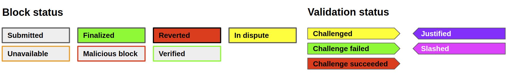
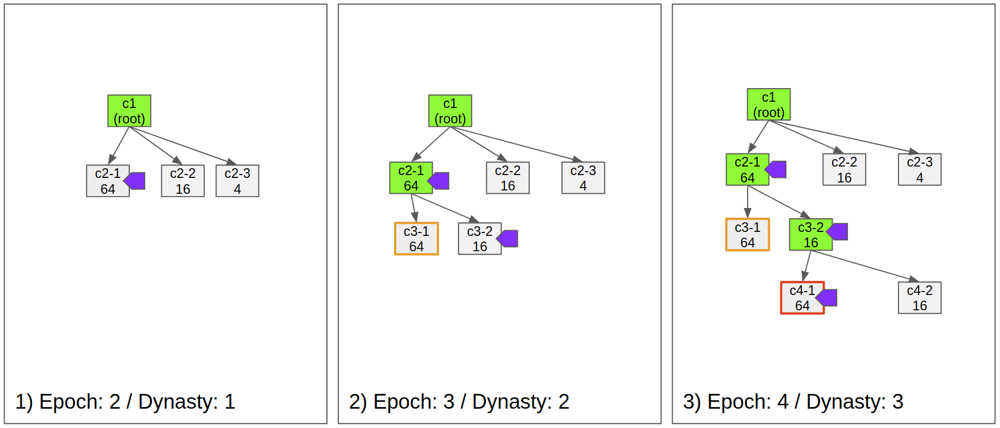
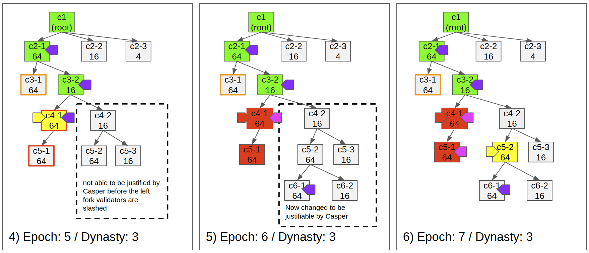
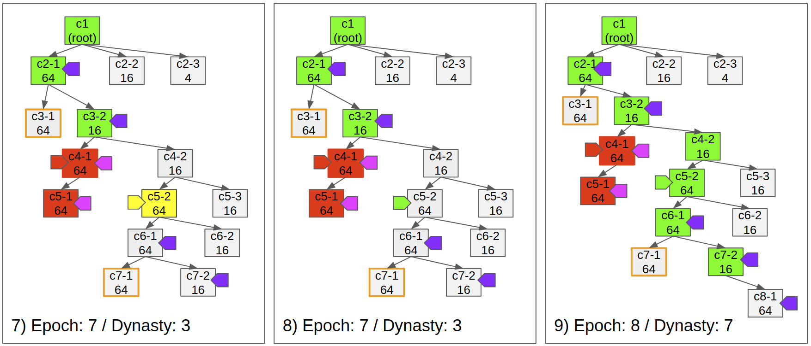

<!--You can leave these HTML comments in your merged EIP and delete the visible duplicate text guides, they will not appear and may be helpful to refer to if you edit it again. This is the suggested template for new EIPs. Note that an EIP number will be assigned by an editor. When opening a pull request to submit your EIP, please use an abbreviated title in the filename, `eip-draft_title_abbrev.md`. The title should be 44 characters or less.-->

## Simple Summary
<!--"If you can't explain it simply, you don't understand it well enough." Provide a simplified and layman-accessible explanation of the EIP.-->

A standard interface of tokens for layer 2 solutions which are minted by Casper PEPoW algorithm.

## Abstract
<!--A short (~200 word) description of the technical issue being addressed.-->

The following standard is an extended version of ERC20 token for layer-2 solutions using Casper PEPoW. This token is minted by checkpoint proposing and validation to mitigate the data availability problem and provide economic incentives for the operators.

Casper PEPoW uses priority exponential proof of work for its checkpoint proposing rule and Casper FFG for its fork choice rule. In Casper PEPoW, checkpoint proposers are ordered dynamically and have their own difficulties in proposing a new checkpoint. Also, the difficulty of Proof of Work to propose a new checkpoint is exponential to the order of priority. Lastly, the Casper validation reward for a checkpoint is also exponential to its priority.

Moreover, to provide the main-net level security to the 2nd layer, unlike the vanilla Casper FFG, justified checkpoints can be reverted by the challenge system. Any checkpoint, which is justified, but not finalized yet, can get a challenge. If the challenge reverts the justified checkpoint, validators who voted to the checkpoint are all slashed. It makes the conflicting fork being able to be justified. Lastly, to finalize a checkpoint, all of its ancestor checkpoints should not be in dispute.

## Motivation
<!--The motivation is critical for EIPs that want to change the Ethereum protocol. It should clearly explain why the existing protocol specification is inadequate to address the problem that the EIP solves. EIP submissions without sufficient motivation may be rejected outright.-->

When we run a layer 2 solution, the data availability problem is always a hot potato. Furthermore, the operators spend Ether for the gas costs to update the data from the 2nd layer to the 1st layer. To solve these problems, we need to make the operator set more decentralized to mitigate the data availability issue and also need to mint tokens to reward the decentralized operators.

## Specification
<!--The technical specification should describe the syntax and semantics of any new feature. The specification should be detailed enough to allow competing, interoperable implementations for any of the current Ethereum platforms (go-ethereum, parity, cpp-ethereum, ethereumj, ethereumjs, and [others](https://github.com/ethereum/wiki/wiki/Clients)).-->

```solidity
pragma solidity >=0.4.21 < 0.6.0;

interface IERC1913 /* is IERC20 */{

    /**
     * @dev Push the message sender into the waiting list for the *d+2* dynasty
     *      if the sender sends more than the designated minimum amount of ETH.
     *      Later, it should allow ERC20 tokens instead of ETH.
     */
    function deposit() external payable;

    /**
     * @dev Register the message sender to the exit queue for the *d+2* dynasty
     *      if the validator set includes the message sender.
     */
    function requestWithdraw() external;

    /**
     * @dev If there was no slash during its withdrawal delay period,
     *      the message sender can withdraw the staked ETH.
     */
    function withdraw() external;

    /**
     * @dev An operator can submit a checkpoint with proof of work. The difficulty of the
     *      proof of work is exponential to the message sender's priority
     *      which is decided by the parent checkpoint.
     */
    function propose(
        bytes32 _parent,
        bytes32 _state,
        uint256 _epochNum,
        uint256 _nonce
    ) external ;

    /**
     * @dev Anyone can apply published vote messages by the validators.
     *      The message is a byte array which length is 193 and it contains source hash,
     *      target hash, source epoch number, target epoch number, and the signature.
     *      kIt mints token as many as the checkpoint's priority and transfer them to the
     *      voter.
     */
    function vote(bytes calldata _msg) external;

    /**
     * @dev Several vote messages can be applied at once.
     */
    function batchVote(bytes calldata _msgArr) external;

    /**
     * @dev Anyone can raise a challenge process staking a designated amount of bond.
     */
    function challenge(bytes32 _checkpointHash) external payable;

    /**
     * @dev Anyone can change the state of a checkpoint from submitted to justified
     *      if it secures more than two third of the total stake.
     *      The message sender gets rewarded with newly minted token.
     */
    function justify(bytes32 _checkpointHash) external;

    /**
     * @dev If a validator published double votes or surrond votes,
     *      anyone can punish the validator and get rewards
     */
    function slash(bytes calldata _vote1, bytes calldata _vote2) external;

    /**
     * @dev Returns whether the `validatorAddress` is validator or not
     */
    function isValidator(address _validatorAddress) external view returns (bool);

    /**
     * @dev Returns whether the validator with the address can withdraw its stake or not.
     *      It returns true if the validator is never slashed and out of withdrawal delay
     *      period.
     */
    function isWithdrawable(address _validatorAddress) external view returns (bool);

    /**
     * @dev Returns the difficulty of proposing a new child checkpoint for the `_parent`
     *      value.
     *      It differs by the proposer and the parent hash.
     */
    function difficultyOf(
        bytes32 _parent,
        address _proposer
    ) external view returns (uint256);

    /**
     * @dev Returns the amount of reward for validation. It is exponentially proportional
     *      to the priority of the checkpoint proposer.
     */
    function rewardFor(
        bytes32 _parent,
        address _proposer
    ) external view returns (uint256);

    /**
     * @dev Returns the priority to propose a new checkpoint agaisnt the parent
     *      checkpoint.
     */
    function priorityOf(bytes32 _parent, address _proposer) external view returns (uint8);

    /**
     * @dev Returns whether the nonce value for the priority exponential proof of work is
     *      correct or not.
     */
    function proofOfWork(
        address _proposer,
        bytes32 _parent,
        bytes32 _state,
        uint256 _epochNum,
        uint256 _nonce
    ) external view returns (bool);
    
    event Deposit(
        address indexed _from,
        uint256 _startDynasty,
        uint256 _amount
    ); // amount: wei

    event Vote(
        address indexed _from,
        bytes32 indexed _targetHash,
        uint256 _targetEpoch,
        uint256 _sourceEpoch
    );

    event Logout(
        address indexed _from,
        uint256 _endDynasty
    );

    event Withdraw(
        address indexed _to,
        uint256 _amount
    ); // amount: wei

    event Slash(
        address indexed _from,
        address indexed _offender,
        uint256 indexed _offenderIndex,
        uint256 _bounty
    ); // bounty: wei 

    event Epoch(
        uint256 indexed _number,
        bytes32 indexed _checkpointHash,
        bool _isJustified,
        bool _isChallenged,
        bool _isFinalized
    );

    event Dynasty(
        uint256 indexed _number,
        bytes32 indexed _checkpointHash
    );

}
```

The technical specification should describe the syntax and semantics of any new feature. The specification should be detailed enough to allow competing, interoperable implementations for any of the current Ethereum platforms (go-ethereum, parity, cpp-ethereum, ethereumj, ethereumjs, and [others](https://github.com/ethereum/wiki/wiki/Clients)).

## Rationale
<!--The rationale fleshes out the specification by describing what motivated the design and why particular design decisions were made. It should describe alternate designs that were considered and related work, e.g. how the feature is supported in other languages. The rationale may also provide evidence of consensus within the community, and should discuss important objections or concerns raised during discussion.-->

First, applying a mechanism like Casper FFG to the layer 2 solutions is a good way to offer operators an economic incentive to participate in. And it makes the network more decentralized and resistant to the data unavailability. If we apply Casper FFG to the layer 2 solutions, anyone participates in the operator set without permission and gets rewarded for checkpoint proposing or validation. And if someone submits a checkpoint that does not provide enough data to others, the validators may choose another checkpoint.

Secondly, it is important to use the PEPoW algorithm to make the network more decentralized. PEPoW lets PoW still be useful to mitigate forking and back up the out of network problem with the only small amount of hash power. For example, even if a checkpoint proposer cut in the line by using an extra hash power, the checkpoint may not be chosen by the validators since it does not offer the best reward. As a result, it makes having an obsessive hash power pointless for users to operate a node. Therefore, many users can easily participate as an operator and naturally run their nodes with the standard amount of hash power.


### Mechanism





- Fig 1) 
  - The first checkpoint is justified and finalized
  - *c2-1* is the first submitted checkpoint, because of its low difficulty.
  - *c2-1* is justified by the validators because it offers the highest reward, for isntance 64 tokens, while *c2-2* offers only 16 tokens.
- Fig 2)
  - The checkpoint *3-1* is not available. Soon after another proposer submitted the checkpoint *c3-2* due to the unavailability.
  - Validators vote to *c3-2* even it is the second priority.
  - As *c3-2* is justified, Casper finalizes *c2-1* and the dynasty becomes 2.
- Fig 3)
  - *c4-1* is submitted and justified, but its state transition is invalid.



- Fig 4)
  - One of the operators challenges *c4-1* due to the invalid state transition
  - Because *c4-1* is justified, *c4-2* is not able to be justified due to it is on the conflicting fork.
- Fig 5)
  - The challenge succeeds and the justification for *c4-1* is reverted.
  - As Casper reverts the justification, proposer and validators who voted to *c4-1* gets slashed.
  - As the malicious operators are slashed, *c4-2* becomes able to be justified.
- Fig 6)
  - Any checkpoint can get challenged if it is not finalized.



- Fig 7) 
  - Even validators justify the direct child of a justified checkpoint, if there's an ancestor checkpoint in dispute, it does not finalize the parent checkpoint.
  - If *c5-2* was not in dispute, *c6-1* should be finalized.

- Fig 8)
  - Defending a challenge does not affect the finalization of already submitted checkpoints.

- Fig 9)
  - The checkpoint *c7-2* is finalized by the justification of *c8-1*.
  - Postponed finalizations occur at once, so the dynasty becomes 7.


## Backwards Compatibility
<!--All EIPs that introduce backwards incompatibilities must include a section describing these incompatibilities and their severity. The EIP must explain how the author proposes to deal with these incompatibilities. EIP submissions without a sufficient backwards compatibility treatise may be rejected outright.-->

This standard does not include backward incompatibility. This is compatible with ERC20.

## Test Cases
<!--Test cases for an implementation are mandatory for EIPs that are affecting consensus changes. Other EIPs can choose to include links to test cases if applicable.-->

[[WIP]https://github.com/wanseob/casper-pepow-token/blob/master/test/CasperToken.test.js](https://github.com/wanseob/casper-pepow-token/blob/master/test/CasperToken.test.js)

## Implementation
<!--The implementations must be completed before any EIP is given status "Final", but it need not be completed before the EIP is accepted. While there is merit to the approach of reaching consensus on the specification and rationale before writing code, the principle of "rough consensus and running code" is still useful when it comes to resolving many discussions of API details.-->
[[WIP]https://github.com/wanseob/casper-pepow-token](https://github.com/wanseob/casper-pepow-token)

## Copyright
Copyright and related rights waived via [CC0](https://creativecommons.org/publicdomain/zero/1.0/).

## References

- [Vitalik Buterin](https://arxiv.org/search/cs?searchtype=author&amp;query=Buterin%2C+V), [Virgil Griffith](https://arxiv.org/search/cs?searchtype=author&amp;query=Griffith%2C+V) ["Casper the Friendly Finality Gadget"](https://arxiv.org/abs/1710.09437)
- [Joseph Poon](mailto:joseph@lightning.network) and [Vitalik Buterin](mailto:vitalik@ethereum.org) ["Plasma: Scalable Autonomous Smart Contracts"](http://plasma.io/)

## Related works
- [https://github.com/wanseob/merklux](https://github.com/wanseob/merklux)
- [https://ethresear.ch/t/merklux-plasma-plant/4050](https://github.com/wanseob/merklux)
