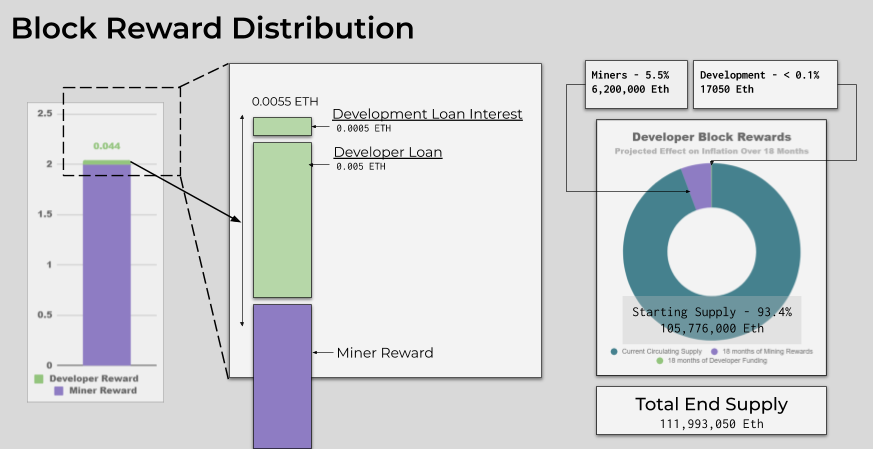
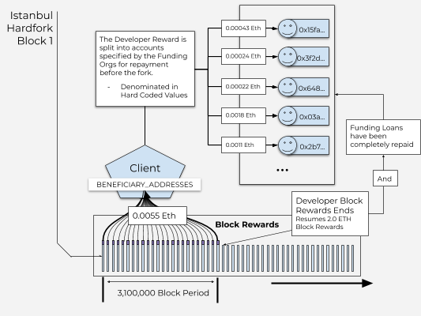

## Simple Summary

Add `0.0055 ETH` per block for 18 months (A total of 17050 ETH) as a developer block reward reserved for funding specific Ethereum1.X working groups. The working groups are State rent (750k), Better sync (360k), Finality gadget (360k), Fee market (360k), Testing infrastructure (360k). Governance of the funds will be through a multisig of trusted individuals from the ecosystem including client teams, the foundation, and the community.

[EIP-1890](./eip-1890.md) proposes a mechanism to capture a portion of block rewards for sustainably funding ongoing network development. That EIP sets values and addresses to zero and so does not actually collect any rewards. This proposal is to explicitly set those values and begin collecting a portion of block rewards for 18 months in order to fund Ethereum 1.X working groups and organization efforts. This funding will be used to repay an initial loan provided by investors in the community funding this work with a small amount of interest. After 18 months the block reward would again reduce to zero.

## Abstract

This EIP extends the mechanism established in EIP-1890 to add `0.0055 ETH` to the block reward for a specific distribution period of `3,100,000 BLOCKS`(≈ 18 months). The `RECIPIENT_ADDRESS` is set to a smart contract with hardcoded denominations that distributes incoming ETH to a set of addresses for the purpose of Eth1.X development. The emission schedule would start at the hard fork block number and continue for `3,100,000 BLOCKS` (≈ 18 months) at which point the address and amount would again return to 0. Any further distribution would require a future hard fork.

## Motivation

The context for this proposal came from attending the [Core Dev Eth1.X Meeting](https://www.youtube.com/watch?v=Au1Qll-86v0) in Berlin. Development is needed to move Eth1.X forward, and I observed that a lack of funding is the primary barrier to this work. This work can only be effectively conducted by working groups forming around these issues, and these working groups need funding in order to pay dedicated contractors and project managers. This proposal is a plan for funding these groups and supporting their operation.

## Specification

Two constants will be introduced:

- `REWARD_DURATION_IN_BLOCKS`, which specifies the number of blocks after `ISTANBUL_BLOCK_HEIGHT` when the reward collection will terminate (i.e., at block `ISTANBUL_BLOCK_HEIGHT + REWARD_DURATION_IN_BLOCKS`)
- `BENEFICIARY_ADDRESSES`, a list of tuples containing the address and the amount to be transferred to this address per block. These amounts will be determined as the loan is collected from participating organizations and the addresses for repayment will be specified by them. The total of the amounts will sum to 0.0055. At the end of `REWARD_DURATION_IN_BLOCKS` the loan will be completely repaid.

```

REWARD_DURATION_IN_BLOCKS = 3100000
DEVFUND_BLOCK_REWARD = 0.0055


BENEFICIARY_ADDRESSES = [
 (<address>, <amount_in_eth>),
 (<address>, <amount_in_eth>)
]
```

Beginning with block `ISTANBUL_BLOCK_HEIGHT`, the reward is added to the participating addresses within `BENEFICIARY_ADDRESSES` at each block until the end of the `REWARD_DURATION_IN_BLOCKS`.

```
IF (CURRENT_BLOCK - ISTANBUL_BLOCK_HEIGHT <= REWARD_DURATION_IN_BLOCKS)

FOR BENEFICIARY in BENEFICIARY_ADDRESSES:
  BENEFICIARY[0].balance += BENEFICIARY[1]

```

## Rewards Distribution Rationale
```
 Development loan repayment: 0.005 ETH per block: 15500 ETH total
 Development loan interest (10% total over the period, simple interest): 0.0005 ETH per block: 1550 ETH total

 Total Block Reward Increase = `0.0055` ETH per block: 17050 ETH Total
```

*With a price of Etheruem at $150.00 this will raise approx USD $2,325,000.00 for developing Eth1.X over the next 18 months.*


 *Specific Addresses to be determined

* [FAQ - Why hardcoded values?]( #why-hardcoded-values )


## Rationale

There has been great public debate concerning EIP-1890, and one of the primary concerns is that it is difficult to evaluate the proposal without more complete information on how funds would be raised, how they would be administered, and how they would be used. There is a need for funding Eth1.x development and it is currently unclear where those funds will come from. This proposal is intended to give a more comprehensive proposal for its funding. In the case that ETH1.x is fully funded before the Istanbul upgrade I will withdraw this EIP. Until that point I intend to continue championing this proposal as a valid funding mechanism for this work.

### Why a loan?

The Eth1x initiative needs funding now, not in 18 months. A loan is necessary to complete certain stages of work before the funding mechanism begins to provide funds. A loan would provide this necessary funding today, and the investors willing to front this cost can recoup their contribution + a reward of *a fixed interest rate* for the risk on their loan. This arrangement will make it easier to find investors willing to participate who have sufficient funds.

### Loan Repayment



There is a risk that the investors lose part of their contribution in the case that this EIP is rejected by the community between the time the funds have been collected and the beginning of the payout schedule. In this case all remaining funds will be returned to the contributors. The interest on the loan is an incentive for investors to participate in spite of this risk. Their downside is limited to the amount of funds spent before this EIP is accepted or rejected, which should be no more than about 5%, while their upside consists of the 10% simple interest paid over the period.

### Development Loan


`Development Loan: 0.005` over 3.1 Million blocks = 15500 ETH 
 
**Funding Working Groups on 1.X**
* Funding Contractors, Coordinators, and project managers
* Working Groups defined with clear mandates

Budget

Working groups
 - State rent (750k)
 - Better sync (360k)
 - finality gadget (360k)
 - Fee market (360k)
 - testing infrastructure (360k) 


**ETH1.X Core Dev Gatherings**

Funding hosting, traveling, and accommodations for necessary in-person gatherings of ETH1.X core developers similar to the Stanford and Berlin ETH1.X Core Dev Meeting held earlier this year.

At the end of the 18 Months, the whole process would be torn down to prevent any internal tyranny of structurelessness forming within.


* [FAQ - How will the funding of the devs be organized?]( #how-will-funding-the-devs-be-organized)

## Accountability

The funds will be transferred into DAI and secured in a multi-sig comprised of members of the community. Representatives from the following groups will receive a key.


 - EIP Editors
 - Geth
 - Parity
 - ConsenSys/PegaSys (PegaSys)
 - The Ethereum Foundation (Hudson Jameson)
 - Community

## Personal Notes and Disclosure 
I want to address any concerns about conflicts of interests directly. My participation with Eth1.X currently has been as a volunteer. I am in talks about a possible funded role helping with testing and coordination. If my work for with Eth1.x is funded, I will accept no additional funding collected by the mechanism proposed in this EIP.

Eth1.X is the now of Ethereum and I would like to see it succeed. This is the intent of my proposal.

### COI

Previously I was PM for Tennagraph, a signalling solution for Ethereum. An Aragon grant funded this project and was distributed through Giveth and an AragonDAO. I have not received any funding from the project beyond this grant. All of this is verifiable on-chain. I am stepping down from any paid role on the project to continue as an advisor. I am also stepping down as a moderator for stances as there is a COI moderating stances for EIPs I am working with directly.

### Disclaimer

I do not claim to represent the community with my views; any members who wish to join supporting me with this proposal are free to do so. This is as fair of a proposal as I can personally conceive.

## Backwards Compatibility

This EIP has no impact on backwards compatibility.

## Test Cases

Not Implemented

## Implementation

Not Implemented

## FAQ

### Why Hardcoded Values?

Why not us a smart contract with some governance mechanism to allow changing the distribution of funds? Wouldn’t that be more flexible and effective?

*TLDR: This EIP is not about governance reform*

First, the payment of the loan will be hardcoded. Once agreed, the terms must be kept to give the lenders confidence in the repayment of the loan. As long as blocks are created the debt will be paid back. This is the essence of a trustless smart contract.

After the loan, there is the option to allow the amounts (limited to less than .05ETH), and the locations (orgs that receive ecosystem funding) to be changed throughout the emission schedule. It is pretty easy to imagine a smart contract or DAO fulfilling this role. However, there are three classes of options available today we can consider when governing changes.

* **Give the Keys to the Hands of the Few (Oligarchy)**

Create a multisig that allows a group of individuals to update the smart contract. The most likely candidates for this are the Core Devs themselves, but it could also be a trusted few from the community/stakeholders. No matter how you slice it, there is a fundamental issue in deciding who gets to decide. There currently is not a trusted/adopted governance mechanism to make these decisions within the Ethereum ecosytem. Also, preventing changing the contract in self interest is difficult without a well-engineered governance system of checks and balances. This EIP does not claim nor aim to solve these issues.

* **Give the Keys to the Hands of the Many (Plutarchy)**

Allow ethereum holders with coin votes to update the smart contract. Using holographic consensus could overcome the issue of voter turnout as it scales as participation scales, even to the size of the whole network. This has some benefits as the entire network can participate. However, the problem is that some individuals in the network are over represented -- the wealthy. Without a solution to identity that has been agreed to and implemented by the entire Ethereum Network, there is no way around giving more power in votes to the rich. This EIP does not claim, nor aim to solve these issues.

* **Use Ethereum Governance as it is Today**

Criticisms or support aside, there is a system that governs Ethereum today. It is a mix of rough consensus among core devs, miners running nodes, clients implementing changes, and stakeholders adopting those changes. It includes yelling or not yelling on twitter and reddit. It is complicated and I don’t claim to understand it. Even without a clear view of how it works, there is evidence of its existence. This evidence is there are changes that have allowed to be implemented, and changes that have not allowed to be implemented in Ethereum.

I do not aim to change Ethereum governance. Because this EIP has hardcoded values, it must go through the existing governance process, whatever that is, before it is implemented. It will then continue to operate until the end of the emission schedule. This is intentional. This makes it uncapturable. No party other then the ecosystem itself can modify the contract once it has been deployed.

This EIP is not about governance reform.

### Why not allow current client implementors fund this work? (EF, Consensys, Parity, etc...) 

Historically there has been a precedent that the Ethereum Foundation is solely responsible for funding the development of Ethereum. This process has evolved as the development has become more distributed. Aya Miyaguchi observed in a recent [Coindesk article](https://www.coindesk.com/ethereum-foundation-director-sets-new-vision-for-blockchain-non-profit), “it really is not only Ethereum Foundation people who are building [Ethereum]”. Yes, we could rely on the Ethereum Foundation to fund Eth1.X. But, why should we? This is a call for the network to come together and fund its own development. Ethereum _the network_ is not owned by any one organization or group of people. We are lucky to have the EF and I consider this EIP in support of their coordination efforts.

### How Will Funding the Devs be Organized

I do not profess to know the best way to organize these funds. There is work already in progress to organize these efforts championed by Alexey Akhunov. The following is a quote from a [recent medium article](https://medium.com/@akhounov/ethereum-1x-as-an-attempt-to-change-the-process-783efa23cf60):

> “Going from funding a few implementation teams continuously and letting them do 'their stuff' to funding more specific and temporary initiatives requires looking at funding through different lenses. How much 'due diligence' and oversight is too much (in terms of overhead), who can decide whether working groups actually deliver, etc. This is also solvable, and also more on this will come later (not in this post)."

My suggestion would be to create an Eth1.X core developer DAO using [DaoStack](https://daostack.io/) to coordinate membership and payment of the Core Devs, but ultimately they are capable of determining the system that works best for them. As long as the system is transparent and mature enough to distribute funds when the time comes, this is sufficient for now.

### Isn't a loan considered a security, or is it?

I am not a lawyer and will seek further guidance from lawyers in the field on this point in particular. From the research I have done and conversations I have had there is a very good argument that a loan of this nature will not be considered a security by the US Supreme Court.
As the result of [REVES ET AL. v . ERNST YOUNG 1990](https://casetext.com/case/reves-v-ernst-young), the court stated that a home loan, consumer financing, a loan secured by a lien on a small business or some assets of a small business, short term notes, or notes that formalize a debt incurred in the ordinary course of business are not securities. If the note resembles the items listed above (home loans, etc.) then the note will not be deemed a security. The Supreme Court provided four factors to determine if a note sufficiently resembles the types of notes that are not classified as securities. ([source](https://www.invigorlaw.com/loan-subject-securities-regulations/))

**Family Resemblance Test**
 1) The intentions of the company and the individual—if the company raised money for general use in a business enterprise, then the note is more likely to be a security; if the individual agreed to the loan primarily for the profit the note was expected to generate, the note is more likely to be a security.
 2) The plan of distribution—the more widely the note is offered, the more likely it is to be found a security.
 3) The expectations of the investing public—if the investors thought they were investing in a business to make a profit on their investment, the note is more likely to be found a security.
 4) Other risk-reducing factor—if the note is collateralized or otherwise less risky than common notes, the note is less likely to be found to be a security.

The loan is for the specific use of supporting Eth1.X research and development. The distribution will not be widely offered and the note will be collateralized by the network itself, provided in ETH and repaid in ETH. In coordinating the collection of these funds recognise I may be legally liable for some of this work and I will do all of the due dilegence I can, seek legal counsel, and accept any legal repercussions resulting from this work.

#### 

## Copyright
Copyright and related rights waived via [CC0](../LICENSE.md).
