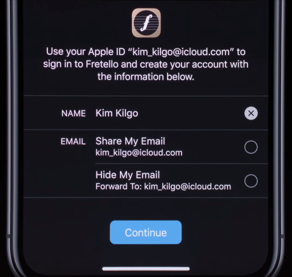
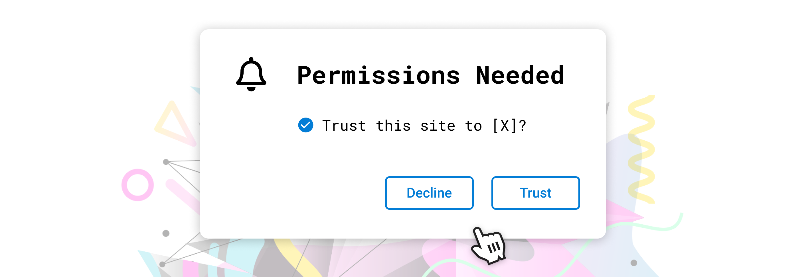

## Abstract

This EIP adds two new wallet-namespaced RPC endpoints, `wallet_getPermissions` and `wallet_requestPermissions`, providing a standard interface for requesting and checking permissions.

## Motivation

Wallets are responsible for mediating interactions between untrusted applications and users' keys through appropriate user consent. Today, wallets always prompt the user for every action. This provides security at the cost of substantial user friction. We believe that a single permissions request can achieve the same level of security with vastly improved UX.

The pattern of permissions requests (typically using Oauth2) is common around the web, making it a very familiar pattern:




Many web3 applications today begin their sessions with a series of repetitive requests:

- Reveal your wallet address to this site.
- Switch to a preferred network.
- Sign a cryptographic challenge.
- Grant a token allowance to our contract.
- Send a transaction to our contract.

Many of these (and possibly all), and many more (like decryption), could be generalized into a set of human-readable permissions prompts on the original sign-in screen, and additional permissions could be requested only as needed:



Each of these permissions could be individually rejected, or even _attenuated_--adjusted to meet the user's terms (for example, a sign-in request could have a user-added expiration date, and a token allowance could be adjusted by the user when it is requested).

## Specification

The key words "MUST", "MUST NOT", "REQUIRED", "SHALL", "SHALL NOT", "SHOULD", "SHOULD NOT", "RECOMMENDED", "MAY", and "OPTIONAL" in this document are to be interpreted as described in RFC 2119.

This proposal adds two new methods to a wallet's web3 provider API: `wallet_getPermissions` and `wallet_requestPermissions`.

### `wallet_getPermissions`

The `wallet_getPermissions` method is used for getting an array of current permissions (empty by default). It takes no parameters and returns an array of `Permission` objects.

#### `wallet_getPermissions` Returns

The format of the returned permissions MUST be an array of `Permission` objects, which are defined as follows:

```typescript
interface Caveat {
  type: string;
  value: any;
}

interface Permission {
  invoker: string;
  parentCapability: string;
  caveats: Caveat[];
}
```

The `invoker` is a URI used to identify the source of the current dapp (e.g. `https://your-site.com/`). The term `parentCapability` refers to the method that is being permitted (e.g. `eth_accounts`). The `caveats` array represents the specific restrictions applied to the permitted method. The `type` of a `Caveat` is a string, and the `value` is an arbitrary JSON value. The `value` of a `Caveat` is only meaningful in the context of the `type` of the `Caveat`.

### `wallet_requestPermissions`

The `wallet_requestPermissions` method is used for an application to request additional permissions. It MUST take a single parameter, a `PermissionRequest` object, and MUST return an array of `RequestedPermission` objects.

#### `wallet_requestPermissions` Parameters

The `wallet_requestPermissions` method takes a single parameter, a `PermissionRequest` object, which is defined as follows:

```typescript
interface PermissionRequest {
  [methodName: string]: {
    [caveatName: string]: any;
  };
}
```

The `methodName` is the name of the method for which the permission is being requested (e.g. `eth_accounts`). The `caveatName` is the name of the caveat being applied to the permission (e.g. `requiredMethods`). The caveat value is the value of the caveat (e.g. `["signTypedData_v3"]`).

Attempted requests to a restricted method must fail with an error, until a `wallet_requestPermissions` request is made and accepted by the user.

If a `wallet_requestPermissions` request is rejected, it should throw an error with a `code` value equal to `4001` as per [EIP-1193](./eip-1193.md).

#### `wallet_requestPermissions` Returns

The `wallet_requestPermissions` method returns an array of `RequestedPermission` objects, which are defined as follows:

```typescript
interface RequestedPermission {
  parentCapability: string;
  date?: number;
}
```

The `parentCapability` is the name of the method for which the permission is being requested (e.g. `eth_accounts`). The `date` is the timestamp of the request, in Unix time, and is optional.

## Rationale

While the current model of getting user consent on a per-action basis has high security, there are huge usability gains to be had bo getting more general user consent which can cover broad categories of usage, which can be expressed in a more human-readable way. This pattern has a variety of benefits to offer different functions within a web3 wallet.

The `requestPermissions` method can be expanded to include other options related to the requested permissions, for example, sites could request accounts with specific abilities. For example, a website like an exchange that requires `signTypedData_v3` (which is not supported by some hardware wallets), might want to specify that requirement. This would allow wallets to display only compatible accounts, while preserving the user's privacy and choice regarding how they are storing their keys.

## Test Cases

### Requesting permissions

The following example should prompt the user to approve the `eth_accounts` permission, and return the permission object if approved.

```javascript
provider.request({
  method: 'requestPermissions',
  params: [
    {
      'eth_accounts': {
        requiredMethods: ['signTypedData_v3']
      }
    }
  ]
});
```

### Getting permissions

The following example should return the current permissions object.

```javascript
provider.request({
  method: 'getPermissions'
});
```

## Security Considerations

### Server-Side Request Forgery (SSRF)

This consideration is applicable if the favicon of a website is to be displayed.

Wallets should be careful about making arbitrary requests to URLs. As such, it is recommended for wallets to sanitize the URI by whitelisting specific schemes and ports. A vulnerable wallet could be tricked into, for example, modifying data on a locally-hosted redis database.

## Copyright

Copyright and related rights waived via [CC0](../LICENSE.md).
