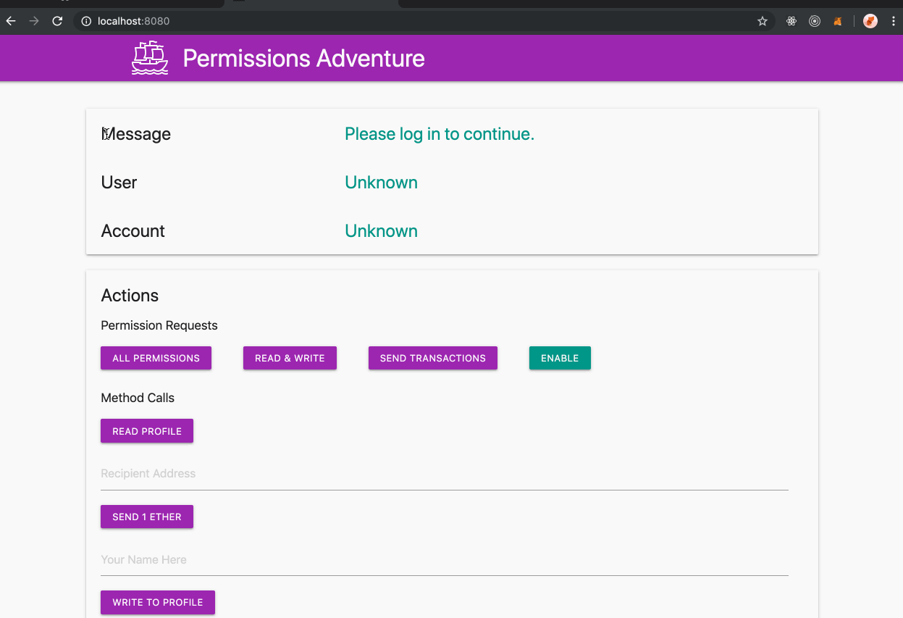

## Simple Summary

A proposed standard interface for restricting and permitting access to security-sensitive methods within a restricted web3 context like a website or "dapp".

## Abstract

Web3 JavaScript wallet browsers may implement `wallet_getPermissions` and `wallet_requestPermissions`. This provides a standard interface for requesting permissions and checking a domain's current permissions status.

## Motivation

Web3 Wallets are built around the responsibility of mediating the interactions between untrusted applications and a user's keys on their computer, getting appropriate consent from the user.

Today web3 browsers like MetaMask always prompt on a per-action basis. This provides security at the cost of substantial user friction. We believe that a single permissions request can achieve the same level of security with vastly improved UX.

The pattern of permissions requests is common around the web, from login with Facebook, Twitter, GitHub, and even Apple, making it a very familiar pattern.

<details>
  <summary>Facebook Permissions</summary>
  
</details>

<details>
  <summary>Log in With Apple</summary>
  
</details>

Many web3 applications today begin their sessions with a series of repetitive requests:

- Reveal your wallet address to this site.
- Switch to a preferred network.
- Sign a cryptographic challenge.
- Grant a token allowance to our contract.
- Send a transaction to our contract.

Many of these (and possibly all), and many more (like decryption), could be generalized into a set of human-readable permissions prompts on the original sign-in screen, and additional permissions could be requested only as needed.

On the user's end, each of these permissions could be individually rejected (unchecked), or even _attenuated_, or adjusted to meet the user's terms (for example, a sign-in request could have a user-added expiration date, and a token allowance could be adjusted by the user when it is requested), making the web3 login a sort of user-revisable terms of use.

## Specification

This proposal adds two new methods to a wallet's web3 provider API:

- `wallet_getPermissions`
- `wallet_requestPermissions`

The `wallet_getPermissions` method is used for getting an array of current permissions (empty by default), while the `wallet_requestPermissions` method is used for an application to request additional permissions.

These two methods are used to restrict a few hypothetical "restricted methods". The first such method we would suggest should be included as part of the standard is `eth_accounts`.

In this framework, the permission for a user to reveal their accounts would look like this:

```javascript
const response = await provider.send({
  method: 'wallet_requestPermissions',
  params: [{
    'eth_accounts': {},
  }]
})
```

If this request was rejected, it would throw an error with a `code` value equal to `4001`, per [EIP 1193 errors](https://eips.ethereum.org/EIPS/eip-1193), which the MetaMask team has canonized in a module [eth-json-rpc-errors](https://github.com/metamask/eth-json-rpc-errors).

If the request is accepted by the user, then subsequent requests to `eth_accounts` will succeed, and return an accounts array as usual.

A call to `wallet_getPermissions` will then return a permissions schema object that describes the current permission.

```javascript
const response = await provider.send({
  method: 'wallet_getPermissions'
})
```

Would return a value something like this:

```json
[
  {
    invoker: 'ens://your-site.eth',
    parentCapability: 'eth_accounts',
    caveats: [
      {
        type: 'filterResponse',
        value: ["0x0c54fccd2e384b4bb6f2e405bf5cbc15a017aafb"]
      }
    ]
  }
]
```

Where `invoker` is a unique domain string used to identify the source of the current dapp. To start, this may include only `https` prefixes, but `ens`, `swarm`, `ipfs`, and others may all be valid sources in the future.

The term `parentCapability` comes from the [zcap-ld spec](https://w3c-ccg.github.io/zcap-ld/), which these permissions objects are based on, and refers to the method that is being permitted.

The `caveats` array represents the specific restrictions applied to the permitted method.

You can see above how internally the user-selected account is transformed into a [`caveat`](https://github.com/MetaMask/json-rpc-capabilities-middleware/blob/master/src/%40types/ocap-ld.d.ts#L28-L33), which is a restriction on the response values, in this case ensuring the page can only be notified of approved accounts. This also means this permissions system is forward-extensible to support logging into a page with multiple accounts.

## Rationale

While the current model of getting user consent on a per-action basis has high security, there are huge usability gains to be had bo getting more general user consent which can cover broad categories of usage, which can be expressed in a more human-readable way. This pattern has a variety of benefits to offer different functions within a web3 wallet.

The `eth_sendTransaction` method itself could be a restricted method (requested by default with the `provider.enable()` method), and the user could at sign-in time decide whether they wanted to require confirmations, approve all transactions, or only approve transactions to a certain contract, or up to a certain token limit, for example. By restricting this method by default, wallets could prevent sites from spamming the user with popups.

If `eth_call` were a restricted method, then random websites would not be able to drain a user's subscription to a hosted provider, making it easier to protect services like Infura against DDoS attacks.

On-chain actions could be represented as a permission under this model, for example, the permission to send an allowance-setting transaction to a specific token address is virtually equivalent to the approval of that transaction, except the site could choose to only invoke the transaction when it was needed. This could allow a standard interface for applications to request permissions which may require different actions depending on different types of accounts (hot wallets, hardware wallets, cold wallets, contract accounts).

The `requestPermissions` method could be expanded to include other options related to the requested permissions, for example, sites could request accounts with specific abilities. For example, a website like an exchange that requires `signTypedData_v3` (which is not supported by some hardware wallets), might want to specify that requirement, maybe like this:

```javascript
provider.send({
  method: 'requestPermissions',
  params: [
    {
      'eth_accounts': {
        requiredMethods: ['signTypedData_v3']
      }
    }
  ]
})
```

That type of API will also be up for discussion on [The MetaMask repository](https://github.com/MetaMask/metamask-extension/issues/6994).

This would allow the wallet to limit the user's options to valid ones, and allows dapps to ensure selected accounts are compatible with their service, while preserving the user's privacy regarding how they are storing their keys.

## Implementation

We have [a branch of MetaMask available now](https://github.com/MetaMask/metamask-extension/tree/LoginPerSite) which adds these methods via an [rpc-engine](https://github.com/MetaMask/json-rpc-engine) middleware called [json-rpc-capabilities-middleware](https://github.com/MetaMask/json-rpc-capabilities-middleware) (or often `RpcCap` internally, for short).

The latest build of this branch of MetaMask can be downloaded from [the draft pull request](https://github.com/MetaMask/metamask-extension/pull/7004) (look for the latest post by `@MetaMaskBot`). A guide to adding a custom build of MetaMask to Chrome can be found [here](https://github.com/MetaMask/metamask-extension/blob/develop/docs/add-to-chrome.md).

This branch of MetaMask can be used with [this sample site](https://metamask.github.io/permissions-adventure/) ([source](https://github.com/metamask/permissions-adventure)), which uses a couple sample permissions for demonstration purposes:

- `readYourProfile`: We have bundled this build with an imaginary concept of a local "profile", a simple [POJO](https://en.wikipedia.org/wiki/Plain_old_Java_object). Eventually this could be extended to instead expose the user's [3box profile](https://3box.io/).
- `writeToYourProfile`: This permission allows the requesting app to freely update/edit the user's profile.
- `sendEther`: A permission allowing the sending of transactions.



It is notable that this branch is the first version of MetaMask that allows you to be connected to each site with a different account, which persists on that site, along with any other permissions granted to the site.

You can get more detailed API and type information [on the RpcCap repository's readme](https://github.com/MetaMask/json-rpc-capabilities-middleware#rpc-methods).

New hypothetical and proposed permissions can be easily added to [the `restrictedMethods` hash in the MetaMask permissions controller](https://github.com/MetaMask/metamask-extension/blob/774d931cb9f16a8f2df8c6deee1dd553b40d5ad5/app/scripts/controllers/permissions.js#L187) or proposed for discussion on the [MetaMask/wallet-permissions-spec](https://github.com/MetaMask/wallet-permissions-spec) repository.

## Copyright

Copyright and related rights waived via [CC0](https://creativecommons.org/publicdomain/zero/1.0/).
