## Simple Summary

Allows user to select a private list of ethereum addresses which can authorize a call protected by a secret only user knows. 
Allows account contracts to set a private list of ethereum addresses that can authorize a call protected by a secret.

## Abstract

A bad experience of crypto-currencies in general is the lost or exposure of a private key, which can lead to irreversible situations.
Social Recovery is being seen as an option for decentralized recovery of account contracts, however the use of social brings the human factor which usually is the main point of vulnerability on safe systems. 

The main risks in Social Recovery are:
- Collusions: If some users know they are part of a certain recovery, they might perceive interest in executing an attack recovery. 
- Targeted attack: An external agent might learn about the owners of recovery and target the weakest points up to the threshold needed to execute attack recovery. 
- General exposure: An attacker which manage to infect a large user-base env dependency and get access to several identities could also side effect on unaffected users through recovery. 
- Impersonation attack: An targeted attack could learn about a user and impersonate the user to their social peers to execute an attack recovery. This becomes more concerning as AI research was capable of "deep fakes" of other persons voice and facial movements.

Although, there is no perfect solution to solve all these problems, the goal is "trust minimizing" the contract for it's controller, and enabling interoperability for different wallets users might be using.  

This standard proposes a way of defining a list of addresses stored in a merkle tree, but also removing any possibility of front running of those actors by mixing the reveal with signed messages tied to secret reveal and a partial reveal of user secret. 

This addresses, along with a their weights and user personal secret would compose a secret-set, which could be exposed without directly putting user at risk, as it would still require for human verification of total threshold amount from address list. 
The secret set could be saved, for example, in web2 cloud-storage without highly compromising security, this is useful for some users that don't trust themselves, but also don't want to trust something in particular. 

The user data secret is optionally saved with the data, this greatly reduces security in case of exposure of the secret-set, but also reduces possible difficulties in recovery, as when not present, the user must remember how the secret was defined.

The user secret is never revealed in chain, instead it's hashed with a nonce, which increments at every recovery. The recovery setup takes a `hash of a hash` of this hashed secret nonce, the double hashing is used for mathematically proof that who is requesting a recovery knows the secret, but without revealing the secret.

## Motivation

Legacy Web UX, Security and Interoperability 

## Specifications

### Recovery Setup 

A user can configure a recovery by providing a secret (`user_secret_data`), and a list of weighted addresses (`address_list`). 

The `user_secret_data` could be semi-private information that can be guessed by user. This standard defines a few initial methods of generating a predictable in the section [User secret type](#user-secret-type). 

However, `user_secret_type` is optional, a random big integer could be used and exported as `private_hash` alongsize with the `address_list`.

The address list must have a total weight greater then the threshold. The threshold is a constant `THRESHOLD = 100 * 10^18`.

This information is processed to create the `secret_set` for recovery, which is shared from wallet to user, usually via QRCode, in a subset of [EIP-831] called [Recovery Secret Set URL](#recovery-secret-set-url)

#### User secret type

This standard defines a few ways of generating a predictable user secret. 

| Version | EIP      | Description      |
| ------- | -------- | :-------------------------------------- |
| 0       | EIP-2429 | [Password Derived](#password-derived)    |
| 1       | EIP-2429 | [Detailed Form](#detailed-form-derived) |
| 2       | EIP-2429 | [Biometric](#biometrics-derived)        |

When biometrics are available, they should be used.

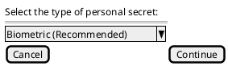

##### Biometrics derived

Most of sensors should be able to give more then one result for the same repeatable reading for the same finger, all those can be tested at every scan until the path to `public_hash` is found.
Wallets must require that user have a repeatable readings on the scanner, otherwise fail to select a secret. The secret select must be the reading most repeated. T
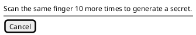

After selected the reading, the UI must verify that user can find the secret back.

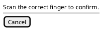

As optional parameters in `secret_set` URL:
- key = `bio_type`: allow biometric sensor type selection
    - default value: `fingerprint`
    - alternative values: `face, eye`
- key = `i`: allow custom iterations
    - default value: `2`

##### Detailed form derived

When no biometrics, a set of standard form with lots questions that usually only the user knows can be given and used to generate the `user_secret_data`.
Defaults fields that are all optional:
`Full Name`, `Birth Date`, `Mother Name`, `Mother Birthdate`, `Nationality`, `First Love's Name`, `First Pet's Name`, `Childhood Nickname`. 

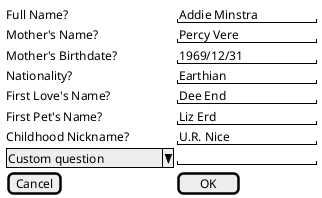

A minimum amount of fields would be necessary, if more are filled, the fields user would have to select what fields they want to use.
In the recovery time, user will have to fill correctly again the same fields with same data. If user don't knows what fields they selected, they simply need to enter the more fields they can, and the algorithm will try permutations until it discovers the path to `public_hash`.

As required parameter in `secret_set` URL:
- key = `fields`
    - value type: String, fields user selected separated by `;`
    - example value: `"Name;Surname;Birth_Date;Mother_Name;Mother_Birthdate;Nationality;First_Love_Name;First_Pet_Name;Childhood_Nickname"`

As optional parameters in `secret_set` URL:
- key = `i`: allow custom iterations
    - default value: `65536`


The `user_secret_data` is obtained by iterating `keccak256(user_answer)` the amount of configured times, which is default a medium value to slow down brute-forcing.

##### Password derived

_Inspired by https://lesspass.com/ and https://keybase.io/warp/_

Similar to Detailed Form, but user is asked for only a few inputs: `Full Name` and `Password`, and a heavier iteration is used by default.

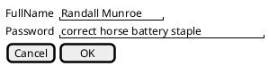

As optional parameters in `secret_set` URL:
- key = `i`: allow custom iterations
    - default value: `1048576`

The `user_secret_data` is obtained by iterating `keccak256(full_name, password)` the amount of configured times, which is default a high value to slow down brute-forcing.

#### Address List

The user would define a list of guardian accounts. The list would be populated with their contact list. An import option and entering one address are handy.

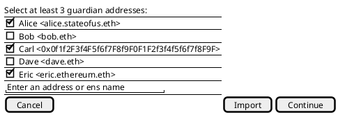

After selecting the guardiants, the user would be prompted to define the weight for each:

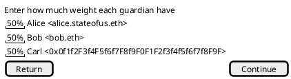

The addresses are stored in a standard merkle tree, but each leaf must be hashed against the `hash_to_peer`. 

`merkle_root` is a hashed as a standard merkle tree composed of leafs of `address_list` on this format `keccak256(bytes32(hash_to_peer), uint256(weight), boolean(is_ens), bytes32(ethereum_address))`.

ENS names is supported, when a guardian have an ENS name, the ENS should be used. If a ENS name is used, `is_ens` must be true (`1`) and the value the namehash of ENS name (`ens_node`), according to [EIP-137]. It is important that recovery contract is configured with the ENS node, not with the resolved address, and the lookup must be performed by the recovery contact by using a dedicated field in the approve function, which when present, the owner of that node or the resolved address must match the signer address. 

Addresses in the list can be account contracts, and if they are account contracts, they can call directly the approve function, or provide an [EIP-1271] signature. 
In case are externally owned accounts, the ecrecover logic applies, but they could also directly call the approve function.

The `weight` sets how much an approval from this address values against `THRESHOLD` constant.

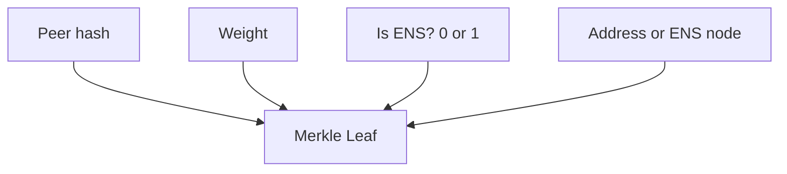

#### User secret data hashing

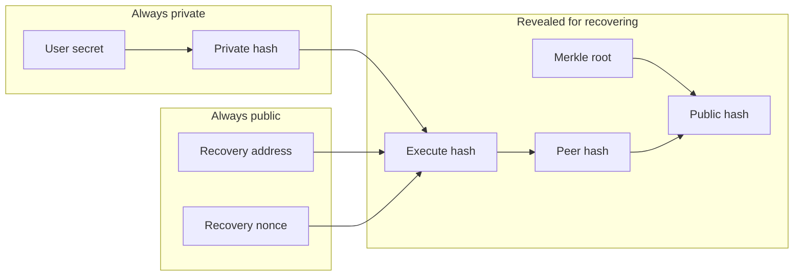
`user_secret_data` is bytes data of user data in plain format. Is never exposed, its never saved. Should be requested to user when `private_hash` is unknown.

`private_hash` is `keccak256(user_secret_data)`.  Is never exposed, could be exported with secret-set.  This can be reused in all recoveries.

`merkle_root` is obtained by hashing a regular merkle tree. Is revealed at execution.

`hash_to_execute` is `keccak256(private_hash, address(recovery_contract), recovery_contract.nonce())`. Is exposed only at execution. Is unique per recovery, and is also known as the "reveal hash". Nonce and recovery contract address is used to allow the reuse of `private_hash`.

`hash_to_peer` is `keccak256(hash_to_execute)`. Is exposed at recovery authorization request, is used to proof user knows `hash_to_execute` and `merkle_root` by revealing the seed of `public_hash`. This is also known as a "partial reveal hash". 

`public_hash` is `keccak256(hash_to_peer, merkle_root)`. Is public since configuration. Can only be used once, and this is also used to prevent replay of execution. After execution successful, must be reconfigured with `setup(bytes32,uint256)`.

#### Recovery Secret Set URL

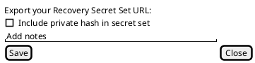

All needed information for a recovery will be stored in a url-type standard, 

    recovery          = erc831_part account_contract [ "@" chain_id ] "/" recovery_contract  "/" private_hash | secret_type "/" address_list [ "?" parameters ] [ "#" notes ]
    erc831_part       = "ethereum:recovery-" 
    account_contract  = ADDRESS
    chain_id          = 1*DIGIT
    recovery_contract = ADDRESS
    private_hash      = "0x" 64*HEXDIG
    secret_type       = UINT
    address_list      = ethereum_address *( ";" ethereum_address )
    ethereum_address  = ADDRESS / ENS_NAME "*" weight
    weight            = UINT
    ADDRESS           = "0x" 40*HEXDIG
    parameters        = parameter *( "&" parameter )
    parameter         = key "=" value
    key               = STRING
    value             = STRING
    notes             = STRING

`account_contract` required the account contract being recovered. Any account contract can be used, as the recovery contract can execute to any interface or address (like a regular multisig). 

`chain_id` defines the ethereum chain for all addresses, if not present pre-defaults to 1 (Mainnet).  

`recovery_contract` the contract which executes the recovery logic. Must support the ABI specified in this document. 

`secret_type` selects the standard used in the generation of `user_secret_data`, required when `private_hash` is not given.

`private_hash` the hash of a `user_secret_data`, in case not present, recovery will ask for `user_secret_data` using the selected standard in `secret_type`. 

`address_list` should preferably be another account contracts that signaled they are available for recovery requests, but any address could assist in recovery. ENS names can be used, and would be resolved during the recovery process. Total weight can be higher than THRESHOLD constant.

`weight` defaults to `Math.ceil(THRESHOLD / address_list.length)`, is custom by user setting. 

`parameters` may be required by specific `secret_type`

`notes` can be used for password tips, if apply.

#### Reconfiguration

A reconfiguration should be possible, however there is a delay period used to prevent a takeover from recovery.
The setup takes 3 parameters: `public_hash`, `address_list_merkle_root`, and the `setup_delay`.
After a successful recovery, a reconfiguration is needed. Some account contracts could accept a call such as `function recoverAndSetup(address _newOwner, bytes32 _newPublicHash, bytes32 _newMerkleRoot, uint256 _setupDelay)` which after recovery automatically calls back `recovery_contract.setup` encoded in the `approve_hash`.

### Recovery Execution

When a recovery becomes needed, the subject need their `Recovery Secret Set URL` to be loaded in to the wallet supporting this standard. Depending on the configuration, while, When the `private_hash` is not available, it must be generated from `user_secret_data` that is a challenge to the user, which are defined on the section [User secret type](#user-secret-type).

When a valid secret set is loaded, it would prompt for which users to request from help. Some wallets might be able to automatically send the requests, while others would give option to user to share the `Help Recover Request URL`, which could be sent using other application.

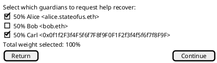

This EIP encourages the use of pre-signed messages [EIP-191] whenever possible, this is important because the gas costs are a common barrier. Is the interest of the Recovery Subject to execute actions in chain, therefore we shouldn't force Guardians to sign transactions envolving costs. If the Guardian selected an address which is an account contract, it must be EIP-1271 to use pre-signed messages.

The normal sequence proposed is the following: 
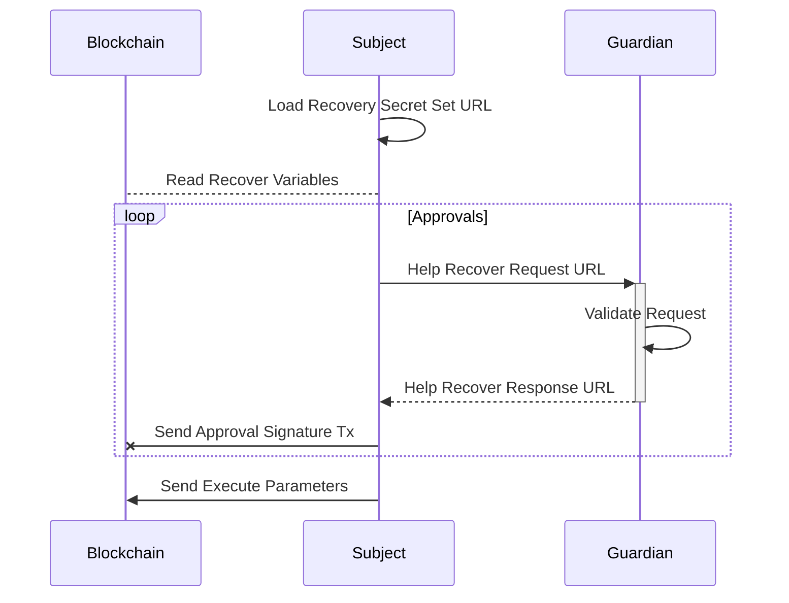

For special cases, where the account contract cannot sign messages, or user have a wallet unable to sign messages in the format specified on this EIP, the conventional execution is also possible through a method which uses msg.sender. 
In this cases, the Guardian would have to pay a small portion of ether gas. 

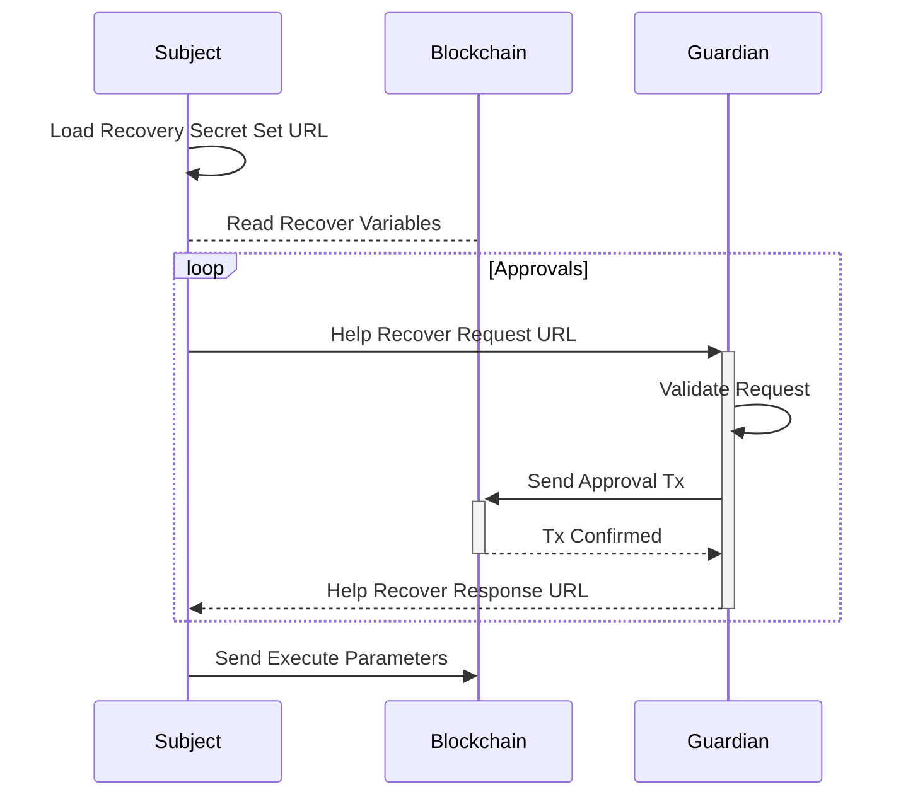

#### Help Recover Request URL

Wallets supporting this standard must generate and recognize recovery requests. These requests are encoded as another [EIP-831], the Recovery Request URL. 
The default ethereum wallet of the OS should recognize these URLs to aid users to help someone with the recovery.

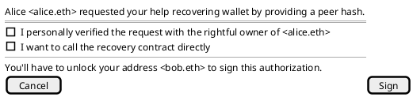

This URL is constructed according to the following:

    helprecover       = erc831_part recovery_contract [ "@" chain_id ] "/" hash_to_peer ":" peer_address "*" weight "/" call_dest "/" function_name  [ "?" function_params ]
    erc831_part       = "ethereum:helprecover-" 
    recovery_contract = ADDRESS
    chain_id          = 1*DIGIT
    hash_to_peer      = "0x" 64*HEXDIG
    peer_address      = ethereum_address
    weight            = UINT
    call_dest         = ethereum_address
    function_name     = STRING 
    function_params   = parameter *( "&" parameter )
    parameter         = key "=" value
    key               = TYPE
    value             = ethereum_address / STRING
    ethereum_address  = ( "0x" 40*40HEXDIG ) / ENS_NAME
    
Where `TYPE` is a standard ABI type name, as defined in [Ethereum Contract ABI specification](https://solidity.readthedocs.io/en/develop/abi-spec.html). `STRING` is a URL-encoded unicode string of arbitrary length, where delimiters and the
percentage symbol (`%`) are mandatorily hex-encoded with a `%` prefix.

`recovery_contract` the contract which executes the recovery logic. Must support the ABI specified in this document. 

`chain_id` defines the ethereum chain for all addresses, if not present pre-defaults to 1 (Mainnet).  

`hash_to_peer` is a required parameter for approving. Used for calculating `leaf_hash`.

`peer_address` defines where the approval must came from. If ENS_NAME, then is whatever resolves to that name. Used for calculating `leaf_hash`.

`weight` is a required parameter for approving. Used for calculating `leaf_hash`.

`call_dest` is a required parameter for approving. Any account contract can be used, as the recovery contract can execute to any interface or address (like a regular multisig).  Used to calculate `approve_hash`.

`function_name` is a required parameter for approving.  Used to calculate `approve_hash`.

`function_params` defines the params of `function_name`. Used to calculate `approve_hash`.

#### Approve Hash

There is no enforced ABI for the recovered contract, the `call_destination` and `call_data` are pre-approved by the `address_list`, however this parameters are secret and tied to `hash_to_peer`, with values revealed at execution. The peers should know what they are signing. All peers approve the same hash.

`approve_hash` is `keccak256(hash_to_peer, call_destination, call_data)`;


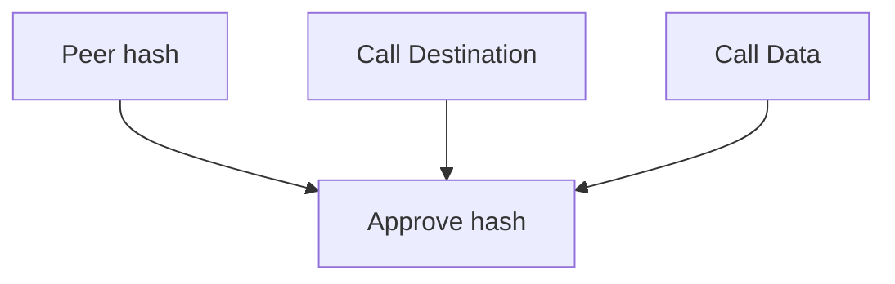

#### Pre-Signed Messages

The `approvePreSigned` function, part of this specification, should construct the messages according to [EIP-191], for validator address should be the `recovery_contract` itself, and` uint256(chain_id), bytes32(public_hash), bytes32(approve_hash)` for the application data, resulting in the following format:

`signing_hash = keccak256(byte(0x19), byte(0x0), address(recovery_contract), uint256(chain_id), bytes32(approve_hash), bytes32(peer_hash), bytes32(weight), bytes32(ens_node) ))`

The initial `0x19` byte is intended to ensure that the `signingHash` is not valid RLP.
The second `0x00` byte is the version 0 of [EIP-191]
`recovery_contract` is the identifier (validator) of the [EIP-191] version 0.
The remaining parameters are part of application specific data.
The `chain_id` must match [EIP-1344] returned data by EVM. 
The `approve_hash` is tied to `public_hash` and is what being approved. 
The `peer_hash` is tied to `public_hash` and is the salt of the merkle leafs.
The `weight` is related to threshold..
The `ens_node` is optional, when present is used in leaf instead of address..

In solidity:
```solidity
    bytes32 signingHash = ECDSA.toERC191SignedMessage(
        address(this),
        abi.encodePacked(
            chainID,
            _approveHash, 
            _peerHash, 
            _weight, 
            _ensNode
        )
    );
```

Account contracts can approve through pre-signed messages supported as long as they support [EIP-1271] for validating signatures on smart contracts.


#### Help Recover Response URL

Transaction receipt URLs contain "ethereum" in their schema (protocol) part and are constructed as follows:

    receipt                 = erc831_part ( signed_message / transaction_hash ) 
    erc831_part             = "ethereum:helpapprove-" 
    transaction_hash        = "0x" 64*HEXDIG 
    signed_message          = "0x" 144*HEXDIG

`signed_message` Is the [Pre-Signed Message](#pre-signed-messages) that appoves the request, will be the case guardian used the pre-signed path.
`transaction_hash` Is the transaction hash that approved the request, will be the case guardian used the direct call path. 

### Solidity Interface

```solidity
pragma solidity >=0.5.0 <0.7.0;

interface ERC2429 {
    event SetupRequested(address indexed who, uint256 activation);
    event Activated(address indexed who);
    event Approved(bytes32 indexed approveHash, address approver, uint256 weight);
    event Execution(address indexed who, bool success);

    struct RecoverySet {
        bytes32 publicHash;
        uint256 setupDelay;
        uint256 timestamp;
    }

    struct Approval {
        bytes32 approveHash;
        uint weight;
    }

    /**
     * @notice Cancels a pending setup of `msg.sender` to change the recovery set parameters
     */
    function cancelSetup()
        external;

    /**
     * @notice Configure recovery set parameters of `msg.sender`. `emit Activated(msg.sender)` if there was no previous setup, or `emit SetupRequested(msg.sender, now()+setupDelay)` when reconfiguring.
     * @param _publicHash Hash of `peerHash`.
     * @param _setupDelay Delay for changes being active.
     */
    function setup(
        bytes32 _publicHash,
        uint256 _setupDelay
    )
        external;

    /**
     * @notice Activate a pending setup of `_who` recovery set parameters.
     * @param _who address whih ready setupDelay.
     */
    function activate(
        address _who
    )
        external;

    /**
     * @notice Approves a recovery execution. This method is important for when the address is an contract and don't implements EIP1271.
     * @param _approveHash Hash of the recovery call.
     * @param _peerHash seed of `publicHash`
     * @param _weight Amount of weight from the signature
     * @param _ensNode if present, the _proof is checked against _ensNode.
     */
    function approve(
        bytes32 _approveHash,
        bytes32 _peerHash,
        uint256 _weight,
        bytes32 _ensNode
    )
        external;
    /**
     * @notice Approve a recovery execution using an ethereum signed message.
     * @param _signer address of _signature processor. if _signer is a contract, must be ERC1271.
     * @param _approveHash Hash of the recovery call.
     * @param _peerHash seed of `publicHash`.
     * @param _weight Amount of weight from the signature.
     * @param _ensNode if present, the _proof is checked against _ensName.
     * @param _signature ERC191 signature.
     */
    function approvePreSigned(
        address _signer,
        bytes32 _approveHash,
        bytes32 _peerHash,
        uint256 _weight,
        bytes32 _ensNode,
        bytes calldata _signature
    )
        external;

    /**
     * @notice executes an approved transaction revaling publicHash hash, friends addresses and set new recovery parameters.
     * @param _executeHash Seed of `peerHash`.
     * @param _merkleRoot Revealed merkle root.
     * @param _calldest Address will be called.
     * @param _calldata Data to be sent.
     * @param _leafHashes Pre approved leafhashes and it's siblings ordered by descending weight.
     * @param _proofs parents proofs.
     * @param _indexes indexes that select the hashing pairs from calldata `_leafHashes` and `_proofs` and from memory `hashes`.
     */
    function execute(
        bytes32 _executeHash,
        bytes32 _merkleRoot,
        address _calldest,
        bytes calldata _calldata,
        bytes32[] calldata _leafHashes,
        bytes32[] calldata _proofs,
        uint256[] calldata _indexes
    )
        external;
}
```

## Rationale

`user_secret_data` is never exposed, right after input its hashed once with keccak256 to become the `private_hash` which also is never exposed. This was done to standardize the `private_hash` format.  Should be based on biometrics because users are very unlikely to loose their biometrics. Biometrics are usually unsafe for generating a seed phrase because they are not really secret, any high resolution camera can in fact read most of biometrics, and this information is also usually known by governments.

When biometrics is not available, the user data form still gives a pretty good security, because the hashes stored in the contract are salted hashes that are very far related from the source data. Even if only the First Name is used as `user_secret_data` would be hard to discover. The less predictable this data is, the more is safer against targeted attacks, that would still require to discover the user list and receive enough authorizations. 

`user_secret_data` it's not used as single authentication, but it's used to: 

- control the execution flow: only secret holder can specify the recovery call parameters that address_list can authorize;  
- a challenge to avoid social engineering attacks: the secret can be partially revealed, so a user would only be notified of a recovery if the other party presented this proof.  

`merkle_leaf` uses the `hash_to_peer` to allow the reuse of same `address_list` without losing any security. `public_hash` was not used because it might reveal information on a reused `address_list`. 

After a successful execution, a reconfiguration is needed to enforce security at all times. The recovery contract must disable itself after a recovery, and wait for new configuration. 

## Security Considerations

### Correct use of hashing scheme

It's important that wallets follows correctly the `public_hash` generation, specifically don't ignore the use of `recovery_contract` and `recovery_nonce` in the calculation of `hash_to_execute`. This was designed so that the same `secret_set` can be reused after a recovery. 

### User security advices

When a wallet provides option for `private_hash` included in the exported `secret_set` URL, it must advise users to never expose the `secret_set`, as it could open possible vectors for collusion and social engineering. A `secret_set` with `private_hash` should be stored in a tamper evident way, and user should reconfigure recovery in case of unauthorized access. 

In case of `secret_type = 0` (Password derived), the wallet should check the hash of password with "pwned" databases services/nodes and block user from defining a leaked password. The wallet should also show the strength of selected password. The wallet could show an estimation of how much ether could be mined with the hashing required to brute-force this password. 

In case of `secret_type = 1` (Detailed form derived), the wallet must show how much entropy the information added in the form. The fields are custom and saved with the `secret_set`, each wallet can implement their own fields.  

It's important that the `secret_set` is never lost, It would be difficult for a user to remember all parameters such as `address_list`, specially when a lot of time passed. The `setup_delay` allows reconfiguration in case `secret_set` is lost. Wallets should periodically recommend a sanity check on recoverability, because users are likely to only remember about the recovery when they need it.

### Recovery of account contract take-overs

The advantage of being able to replace the control key of account brings also the weakness of account take-overs. 

This standard should enable rescue of account take-overs, however some precautions on the development of account contracts using this standard should be taken into for not allowing the recovery backdoor from being removed from the account contract. 

The account contract being recovered should not allow the change of recovery address, if the account contract is not upgradable, then it should wait the delay of the active `setup_delay`, so the recovery logic can be upgraded by user if wants, similar to a setup of new recovery set. 

If the account contract uses `DELEGATECALL`: 
- to upgradability, the account contract base should only allow user select a new account contract base from a curated list which support EIP-2429 (or compatible).  
- to extensibility, after a `DELEGATECALL` to an untrusted address, require that recovery address didn't changed. 

This is important to recover from take-overs of accounts in case of a compromised account management key. 

### Impersonation attacks 

Wallets that support this EIP should consider that their users could potentially be requested to help recover others accounts, a request could be from anyone that knows the `secret_set`, the legitimate owner or an attacker that somehow obtained the `secret_set`.
- Wallets must ask user about legitimacy of the request, asking if the request was followed by a personal verification;  
- Users must know that they are responsible (moral, legal in some countries) for what they execute in chain, and they must verify the legitimacy of recovery requests;   
- Video calls might be faked through AI, but an attacker would need image and voice samples, such as a public speech in the internet;  
- Users recovering for famous people should never trust a video call, but also try contacting directly people around to check the legitimacy of request.  

## Test Cases

TBD

## Implementation

[Shinra Corporation ERC-2429 Repository](https://github.com/shinra-corp/ERC2429)

[Status.im Account-Contracts Repository](https://github.com/status-im/account-contracts/blob/develop/contracts/account/MultisigRecovery.sol)

[(POC) Social recovery using address book merkle proofs](https://github.com/miguelmota/solidity-social-recovery)

## References

* [Status.im Idea-152]
* [EIP-1344]
* [EIP-1271]
* [EIP-831]
* [EIP-191]
* [EIP-137]

## Copyright

Copyright and related rights waived via [CC0](https://creativecommons.org/publicdomain/zero/1.0/).

[Status.im Idea-152]: https://github.com/status-im/swarms/blob/master/ideas/152-friends-recovery.md
[EIP-1344]: https://eips.ethereum.org/EIPS/eip-1344
[EIP-1271]: https://eips.ethereum.org/EIPS/eip-1271
[EIP-831]: https://eips.ethereum.org/EIPS/eip-831
[EIP-191]: https://eips.ethereum.org/EIPS/eip-191
[EIP-137]: https://eips.ethereum.org/EIPS/eip-137