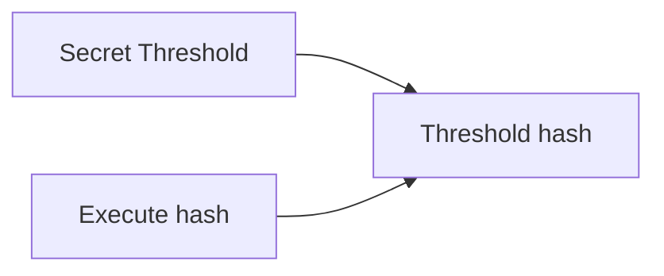
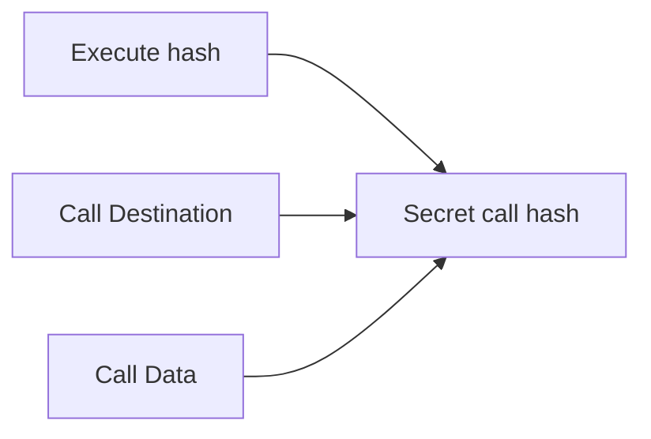

## Simple Summary

Allows user to select a list of trusted parties which can authorize calls protected by a secret only user knows. 
Allows an controller to set a private list of addresses that can authorize calls protected by a secret.

## Abstract

A bad experience of crypto-currencies in general is the lost or exposure of a private key, which can lead to irreversible situations.
Social Recovery is being seen as an option for decentralized recovery of account contracts, however the use of social brings the human factor which usually is the main point of vulnerability on safe systems. 

The main risks in Social Recovery are:
- Collusions: If some users know they are part of a certain recovery, they might perceive interest in executing an attack recovery. 
- Targeted attack: An external agent might learn about the owners of recovery and target the weakest points up to the threshold needed to execute attack recovery. 
- General exposure: An attacker which manage to infect a large user-base env dependency and get access to several identities could also side effect on unaffected users through recovery. 
- Impersonation attack: An targeted attack could learn about a user and impersonate the user to their social peers to execute an attack recovery. This becomes more concerning as AI research was capable of "deep fakes" of other persons voice and facial movements.

Although, there is no perfect solution to solve all these problems, the goal is "trust minimizing" the contract for it's controller, and enabling interoperability for different wallets users might be using.  

This standard proposes a way of defining a list of addresses stored in a merkle tree, but also removing any possibility of front running of those actors by mixing the reveal with signed messages tied to secret reveal and a partial reveal of user secret. 

This addresses, along with a threshold and user personal secret would compose a secret-set, which could be exposed without directly putting user at risk, as it would still require for human verification of threshold amount from address list. 
The secret set could be saved, for example, in web2 cloud-storage without highly compromising security, this is useful for some users that don't trust themselves, but also don't want to trust something in particular. 

The user data secret is optionally saved with the data, this greatly reduces security in case of exposure of the secret-set, but also reduces possible difficulties in recovery, as when not present, the user must remember how the secret was defined.

The user secret is never revealed in chain, instead it's hashed with a nonce, which increments at every recovery. The recovery setup takes a `hash of a hash` of this hashed secret nonce, the double hashing is used for mathematically proof that who is requesting a recovery knows the secret, but without revealing the secret.

## Motivation

Legacy Web UX, Security and Interoperability 

## Specifications

A user can configure a recovery by providing a secret, a list of addresses and a threshold. The secret should be semi-private information, such as a "randomly ordered personal information + secret answer", or user biometric data, or even a password. 

This information is processed to create the `secret_set` for recovery, which is shared from wallet to user, usually via QRCode, in a subset of [EIP-831] called Recovery Secret URL

### Recovery Secret URL

All needed information for a recovery will be stored in a url-type standard, 

    recovery          = erc831_part account_contract [ "@" chain_id ] "/" recovery_contract "/" secret_threshold  "/" private_hash | secret_type "/" address_list [ "?" parameters ] [ "#" notes ]
    erc831_part       = "ethereum:recovery-" 
    account_contract  = ADDRESS
    chain_id          = 1*DIGIT
    recovery_contract = ADDRESS
    secret_threshold  = UINT
    private_hash      = "0x" 64*HEXDIG
    secret_type       = UINT
    address_list      = ethereum_address *( ";" ethereum_address )
    ethereum_address  = ADDRESS / ENS_NAME [ "*" weight ]
    weight            = UINT
    ADDRESS           = "0x" 40*HEXDIG
    parameters        = parameter *( "&" parameter )
    parameter         = key "=" value
    key               = STRING
    value             = STRING
    notes             = STRING

`account_contract` required the account contract being recovered. Any account contract can be used, as the recovery contract can execute to any interface or address (like a regular multisig). 

`chain_id` defines the ethereum chain for all addresses, if not present pre-defaults to 1 (Mainnet).  

`recovery_contract` the contract which executes the recovery logic. Must support the ABI specified in this document. 

`secret_threshold` the amount of signatures needed. 

`secret_type` selects the standard used in the generation of `user_secret_data`, required when `private_hash` is not given.

`private_hash` the hash of a `user_secret_data`, in case not present, recovery will ask for `user_secret_data` using the selected standard in `secret_type`. 

`address_list` should preferably be another account contracts that signaled they are available for recovery requests, but any address could assist in recovery. ENS names can be used, and would be resolved during the recovery process.

`weight` if not present defaults to 1. 

`parameters` may be required by specific `secret_type`

`notes` can be used for password tips, if apply.

### Recovery Request URL

Wallets supporting this standard must generate and recognize recovery requests. These requests are encoded as another [EIP-831], the Recovery Request URL. 
The default ethereum wallet of the OS should recognize these URLs to aid users to help someone with the recovery.

This URL is constructed according to the following:

    recovery          = erc831_part account_contract [ "@" chain_id ] "/" recovery_contract "/" peer_address [ "?" parameters ]
    erc831_part       = "ethereum:helprecover-" 
    account_contract  = ADDRESS
    chain_id          = 1*DIGIT
    recovery_contract = ADDRESS
    peer_address      = ADDRESS | ENS_NAME 
    ADDRESS           = "0x" 40*HEXDIG
    parameters        = parameter *( "&" parameter )
    parameter         = key "=" value
    key               = STRING | "merkle_proof" | "peer_hash" | "secret_call" | "weight"
    value             = STRING | merkle_proof | peer_hash | secret_call | weight
    merkle_proof      = "\"" sister_leaf *( "," sister_leaf ) "\""
    sister_leaf       = "0x" 64*HEXDIG
    peer_hash         = "0x" 64*HEXDIG
    secret_call       = "0x" 64*HEXDIG

`account_contract` required the account contract being recovered. Any account contract can be used, as the recovery contract can execute to any interface or address (like a regular multisig). 

`chain_id` defines the ethereum chain for all addresses, if not present pre-defaults to 1 (Mainnet).  

`recovery_contract` the contract which executes the recovery logic. Must support the ABI specified in this document. 

`peer_address` defines where the approval must came from. If ENS_NAME, then is whatever address owns or resolves to that name.

`parameters` may be extended in future versions.  Currently can set the two needed values for the peers.

`merkle_proof` multisig list is stored as a merkle root and approval needs a proof.. 

`peer_hash` is a required parameter for validating the request, merkle leafs are obfuscated with this hash and is needed for verifying the `merkle_proof`. 

`secret_call` is a required parameter, is used for approving a specific call without revealing it. `peer_address` can sign a pre-signed message with this value, or use `merkle_proof` and `peer_hash` and call it directly. 

`weight` if not present defaults to 1. 

### User secret data hashing


`user_secret_data` is bytes data of user data in plain format. Is never exposed, its never saved. Should be requested to user when `private_hash` is unknown.

`private_hash` is `keccak256(user_secret_data)`.  Is never exposed, could be exported with secret-set.  This can be reused in all recoveries.

`hash_to_execute` is `keccak256(private_hash, address(recovery_contract), recovery_contract.nonce())`. Is exposed only at execution. Is unique per recovery, and is also known as the "reveal hash". Nonce and recovery contract address is used to allow the reuse of `private_hash`.

`hash_to_peer` is `keccak256(hash_to_execute)`. Is exposed at recovery authorization request, is used to proof user knows `hash_to_execute` by revealing the seed of `public_hash`. This is also known as a "partial reveal hash". 

`public_hash` is `keccak256(hash_to_peer)`. Is public since configuration. Can only be used once, and this is also used to prevent replay of execution. After execution successful, must be reconfigured with `setup(bytes32,uint256,bytes32,bytes32)`.

### User secret type

When the `private_hash` is not available, it must be generated from `user_secret_data` that is user input. This standard defines a few ways of generating a predictable user secret.

| Version | EIP      | Description      |
| ------- | -------- | :--------------- |
| 0       | EIP-2429 | Password Derived |
| 1       | EIP-2429 | Detailed Form    |
| 2       | EIP-2429 | Biometric        |

When biometrics are available, they should be used.

#### Biometrics derived

Most of sensors should be able to give more then one result for the same repeatable reading for the same finger, all those can be tested at every scan until the path to `public_hash` is found.

As optional parameters in `secret_set` URL:
- key = `bio_type`: allow biometric sensor type selection
    - default value: `finger`
    - alternative value: `eye`
- key = `i`: allow custom iterations
    - default value: `2`

#### Detailed form derived

When no biometrics, a set of standard form with lots questions that usually only the user knows can be given and used to generate the user_secret_data.
Defaults fields that are all optional:
`Name`, `Surname`, `Birth Date`, `Mother Name`, `Mother Birthdate`, `Nationality`, `First Love's Name`, `First Pet's Name`, `Childhood Nickname`. 

A minimum amount of fields would be necessary, if more are filled, the fields user would have to select what fields they want to use.
In the recovery time, user will have to fill correctly again the same fields with same data. If user don't knows what fields they selected, they simply need to enter the more fields they can, and the algorithm will try permutations until it discovers the path to `public_hash`.

As required parameter in `secret_set` URL:
- key = `fields`
    - value type: String, fields user selected separated by `;`
    - example value: `"Name;Surname;Birth_Date;Mother_Name;Mother_Birthdate;Nationality;First_Love_Name;First_Pet_Name;Childhood_Nickname"`

As optional parameters in `secret_set` URL:
- key = `i`: allow custom iterations
    - default value: `65536`


The `user_secret_data` is obtained by iterating `keccak256(user_answer)` the amount of configured times, which is default a medium value to slow down brute-forcing.

#### Password derived

_Inspired by https://lesspass.com/ and https://keybase.io/warp/_

Similar to Detailed Form, but user is asked for only a few inputs: `Full Name` and `Password`, and a heavier iteration is used by default.

As optional parameters in `secret_set` URL:
- key = `i`: allow custom iterations
    - default value: `1048576`

The `user_secret_data` is obtained by iterating `keccak256(full_name, password)` the amount of configured times, which is default a high value to slow down brute-forcing.

### Address List

The addresses are stored in a standard merkle tree, but each leaf must be hashed against the `hash_to_peer`. 

`address_list_merkle_root` is a standard merkle tree composed of leafs on this format `keccak256(hash_to_peer, ethereum_address, weight)`.

ENS is supported. If a ENS name is used, it is important that recovery contract is configured with the ENS node, not with the resolved address, and the lookup must be performed by the recovery contact by using a dedicated field in the approve function, which when present, the owner of that node or the resolved address must match the signer address. 

Addresses in the list can be account contracts, and if they are account contracts, they can call directly the approve function, or provide an [ERC-1271] signature. 
In case are externally owned accounts, the ecrecover logic applies, but they could also directly call the approve function.

The `weight` sets how much an approval from this address values against `threshold`.

### Secret Threshold

The `secret_threshold` is also hidden as it reveals how much effort a recovery have to take, and therefore this is revealed only at execution. 

`secret_threshold_hash` is `keccak256(hash_to_execute, secret_threshold)`, is exposed only at execution.



### Secret Call

There is no enforced ABI for the recovered contract, the `call_destination` and `call_data` are pre-approved by the `address_list`, however this parameters are secret and tied to `hash_to_execute`, with values revealed at execution.

`secret_call` is `keccak256(hash_to_execute, call_destination, call_data)`;




### Pre-Signed Messages

According to [EIP-191], for validator address should be the `recovery_contract` itself, in the only function that accepts EIP-191.
The `approvePreSigned` function, part of this specification, should construct the messages using for the application data

`signing_hash` is `keccak256(byte(0x19), byte(0x0), address(recovery_contract), uint256(chain_id), bytes32(public_hash), bytes32(secret_call)))`

The initial `0x19` byte is intended to ensure that the `signingHash` is not valid RLP.
The second `0x00` byte is the version 0 of [EIP-191]
`recovery_contract` is the identifier (validator) of the [EIP-191] version 0.
The remaining parameters are part of application specific data.
The `chain_id` must match [EIP-1344] returned data by EVM. 
As `public_hash` can only be used once per contract, it also serves to prevent the reuse of pre-signed approvals, even without nonce tracking.
The `secret_call` should be given to signer but the seed parameters should be kept secret until reveal in execute. 

In solidity:
```solidity
    bytes32 signingHash = ECDSA.toERC191SignedMessage(
        address(this),
        abi.encodePacked(
            chainID,
            publicHash, 
            _secretCall,
        )
    );
```

### Reconfiguration

A reconfiguration should be possible, however there is a delay period used to prevent a takeover from recovery.
The setup takes 4 parameters: `public_hash`, `setup_delay`, `secret_threshold_hash` and the `address_list_merkle_root`.
After a successful recovery, a reconfiguration is needed. 

### Solidity Interface

```solidity
interface ERC2429 {
    event SetupRequested(uint256 activation);
    event Activated();
    event Approved(bytes32 indexed secretHash, address approver);
    event Execution(bool success);
    
    /**
     * @notice Configure recovery parameters `emits Activated()` if there was no previous setup, or `emits SetupRequested(now()+setupDelay)` when reconfiguring.
     * @param _publicHash Double hash of executeHash
     * @param _setupDelay Delay for changes being active
     * @param _secretThresholdHash Secret Amount of approvals required
     * @param _addressListMerkleRoot Merkle root of secret address list
     */
    function setup(
        bytes32 _publicHash,
        uint256 _setupDelay,
        bytes32 _secretThresholdHash,
        bytes32 _addressListMerkleRoot
    )
        external;
    
    /**
     * @notice Cancels a pending setup to change the recovery parameters. `emits PendingSetup(0)` when successful.
     */
    function cancelSetup()
        external;
    
    /**
     * @notice Activate a pending setup of recovery parameters. `emits Activated()` when successful.
     */
    function activate()
        external;
    
    /**
     * @notice Approves a recovery.
     * This method is important for when the address is an contract (such as Identity).
     * @param _peerHash seed of `publicHash`
     * @param _secretCall Hash of the recovery call
     * @param _weight how much this values against threshold
     * @param _proof Merkle proof of friendsMerkleRoot with msg.sender
     * @param _ensNode if not `bytes32(0)`, the _proof is checked against _ensNode. 
     */
    function approve(bytes32 _peerHash, bytes32 _secretCall, uint256 _weight, bytes32[] calldata _proof, bytes32 _ensNode)
        external;
    
    /**
     * @notice Approve a recovery using an ethereum signed message
     * @param _signer address of _signature processor. if _signer is a contract, must be ERC1271.
     * @param _peerHash seed of `publicHash`
     * @param _secretCall Hash of the recovery call
     * @param _weight how much this values against threshold
     * @param _proof Merkle proof of friendsMerkleRoot with msg.sender
     * @param _signature ERC191 signature.
     * @param _ensNode if not `bytes32(0)`, the _proof is checked against _ensNode.
     */
    function approvePreSigned(address _signer, bytes32 _peerHash, bytes32 _secretCall, bytes32[] calldata _proof, bytes calldata _signature, bytes32 _ensNode)
        external;
    
    /**
     * @notice executes an approved transaction revaling userDataHash hash and friends addresses
     * @param _executeHash Seed of peerHash
     * @param _secretThreshold threshold revealed
     * @param _dest Address will be called
     * @param _data Data to be sent
     */
    function execute(
        bytes32 _executeHash,
        uint256 _secretThreshold,
        address _dest,
        bytes calldata _data
    ) external;
    
    /**
     * @notice reads how many executions this contract already done
     */
    function nonce() external view returns(uint256);
}
```

## Rationale

`user_secret_data` is never exposed, right after input its hashed once with keccak256 to become the `private_hash` which also is never exposed. This was done to standardize the `private_hash` format.  Should be based on biometrics because users are very unlikely to loose their biometrics. Biometrics are usually unsafe for generating a seed phrase because they are not really secret, any high resolution camera can in fact read most of biometrics, and this information is also usually known by governments.

When biometrics is not available, the user data form still gives a pretty good security, because the hashes stored in the contract are salted hashes that are very far related from the source data. Even if only the First Name is used as `user_secret_data` would be hard to discover. The less predictable this data is, the more is safer against targeted attacks, that would still require to discover the user list and receive enough authorizations. 

`user_secret_data` it's not used as single authentication, but it's used to: 

- control the execution flow: only secret holder can specify the recovery call parameters that address_list can authorize;  
- a challenge to avoid social engineering attacks: the secret can be partially revealed, so a user would only be notified of a recovery if the other party presented this proof.  

`merkle_leaf` uses the `hash_to_peer` to allow the reuse of same `address_list` without losing any security. `public_hash` was not used because it might reveal information on a reused `address_list`. 

After a successful execution, a reconfiguration is needed to enforce security at all times. The recovery contract must disable itself after a recovery, and wait for new configuration. 

## Security Considerations

It's important that wallets follows correctly the `public_hash` generation, specifically don't ignore the use of `recovery_contract` and `recovery_nonce` in the calculation of `hash_to_execute`. This was designed so that the secret answer can be reused and for the safety of `secret_call`. 

When a wallet provides option for `private_hash` included in the exported `secret_set` URL, it must advise users to never expose the `secret_set`, as it could open possible vectors for collusion and social engineering. A `secret_set` with `private_hash` should be stored in a tamper evident way, and user should reconfigure recovery in case of unauthorized access. 

In case of `secret_type = 0` (Password derived), the wallet should check the hash of password with "pwned" databases services/nodes and block user from defining a leaked password. The wallet should also show the strength of selected password. The wallet could show an estimation of how much ether could be mined with the hashing required to brute-force this password. 

In case of `secret_type = 1` (Detailed form derived), the wallet must show how much entropy the information added in the form. The fields are custom and saved with the `secret_set`, each wallet can implement their own fields.  

It's important that the `secret_set` is never lost, It would be difficult for a user to remember all parameters such as `address_list`, specially when a lot of time passed. The `setup_delay` allows reconfiguration in case `secret_set` is lost. Wallets can periodically recommend a sanity check on recoverability, because users are likely to only remember about the recovery when they need it.

The account contract being recovered should not allow the remove of recovery before a delay of the active `setup_delay`, and if the account contract is upgradeable through `DELEGATECALL`, then the accepted addresses for upgrade should be a limited list curated by other organization (as the account-contract developer). This is important to prevent take-overs of accounts in case of a compromised account management key. 

The account contract should only allow the change of the recovery contract by a call from the recovery, or after a time delay, in order to prevent account take-overs.

Wallets that support this EIP should consider that their users could potentially be requested to help recover others accounts, a request could be from anyone that knows the `secret_set`, the legitimate owner or an attacker that somehow obtained the `secret_set`.
- Wallets must ask user about legitimacy of the request, asking if the request was followed by a personal verification;  
- Users must know that they are responsible (moral, legal in some countries) for what they execute in chain, and they must verify the legitimacy of recovery requests;   
- Video calls might be faked through AI, but an attacker would need image and voice samples, such as a public speach in the internet;  
- Users recovering for famous people should never trust a video call, but also try contacting directly people around to check the legitimacy of request.  

## Test Cases

TBD

## Implementation

[Shinra Corporation ERC-2429 Repository](https://github.com/shinra-corp/ERC2429)

[Status.im Account-Contracts Repository](https://github.com/status-im/account-contracts/blob/develop/contracts/account/MultisigRecovery.sol)

## References

* [Status.im Idea-152]
* [EIP-1344]
* [EIP-831]
* [EIP-191]

## Copyright

Copyright and related rights waived via [CC0](https://creativecommons.org/publicdomain/zero/1.0/).

[Status.im Idea-152]: https://github.com/status-im/swarms/blob/master/ideas/152-friends-recovery.md
[EIP-1344]: https://eips.ethereum.org/EIPS/eip-1344
[EIP-831]: https://eips.ethereum.org/EIPS/eip-831
[EIP-191]: https://eips.ethereum.org/EIPS/eip-191