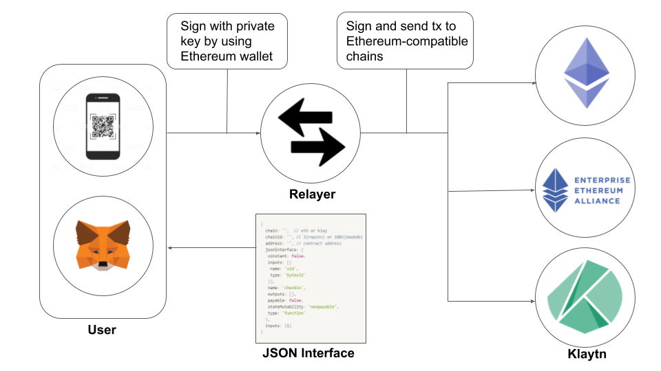

## Simple Summary
Interface standard for transaction transfer between blockchain networks compatible with Ethereum

## Abstract
This EIP is a document that defines a transaction relay standard that applies meta-tx between Ethereum and compatible chains with the same addressing system.

## Motivation
Just as having the same private key creates the same address (like Ethereum mainnet and testnet), Ethereum-compatible chains developed by forking Ethereum will generate the same address from the same private key.

The process of verifying the address of a transaction sender by verifying a signed transaction in each wallet of an Ethereum-compatible chain with the same private key is also the same.

Similarly, Ethereum-compatible chains can use the same smart contracts as Ethereum, and operate in the same way but with much faster TPS, with a few gas.

Therefore, the process of executing smart contracts by delegating gas bills to relays using the signed meta-tx in the standard Ethereum wallet is the same on the Ethereum mainnet and the Ethereum-compatible chain.

With this in mind, the Ethereum mainnet, a public chain, is used for popular purposes such as DID registry and verification. And Ethereum-compatible chains, which have the advantages of high TPS (!) And low gas cost (!), Can be used as side chains to quickly execute smart contract functions.

And with Ethereum standard wallets, you can implement high-availability services that operate by delegating gas to service providers with minimal development costs.


## Specification
The example is based on using Klaytn's smart contract by signing with an Ethereum wallet.

Here is an example of using an Ethereum wallet to execute a function in a smart contract in an Ethereum-compatible chain without gas costs.

1. The JSON below is provided by QR code or as a function argument.

```javascript
{
	chain: '',  // eth or klay
	chainid: '', // 3(ropstn) or 1001(baobab)
	address: '', // contract address
	jsonInterface: {
	 constant: false,
	 inputs: [{
	  name: 'uid',
	  type: 'bytes32'
	 }],
	 name: 'checkin',
	 outputs: [],
	 payable: false,
	 stateMutability: 'nonpayable',
	 type: 'function'
	},
	inputs: [1]
}
```

2. Sign in Ethereum.
```javascript
const timestamp = new Date().getTime()
const fee = 0
const data = web3.eth.abi.encodeFunctionCall(qr.jsonInterface, qr.inputs)
const hex = data + web3.utils.padLeft(web3.utils.toHex(fee), 64).slice(2) + web3.utils.padLeft(web3.utils.toHex(timestamp), 64).slice(2)
const pk = '[[privateKey]]'
const signature = web3.eth.accounts.sign(web3.utils.keccak256(hex), pk).signature
```

3. Meta-tx

When the signatures and parameters are sent to the Klaytn Service Provider's relayer, the relayer creates a transaction using its signature and parameters using the relayer's private key. Provider will use Klaytn's gas to run Klaytn's smart contracts.


<p align="center"></p>

## Rationale
In public chain Ethereum, gas costs can be reduced by using it for public purposes such as DID registration. Meta-tx can also be used to implement DID services that do not require any gas costs.

Developers no longer need to develop separate wallets for each Ethereum-compatible chain, and users can also avoid the hassle of installing a dedicated wallet for each blockchain.

Developers mix the pros and cons of Ethereum and Ethereum-compatible chain Can develop.

Developers take advantage of the strengths and weaknesses of Ethereum and Ethereum-compatible chains, and services that are important and publicly needed, such as DID services, use the public chain Ethereum.

And developers who want to provide gas-free services to their users with fast TPS and low-cost gas can quickly deliver usability by moving services to Ethereum-compatible chains without switching costs.

## Copyright
Copyright and related rights waived via [CC0](https://creativecommons.org/publicdomain/zero/1.0/).
