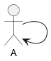
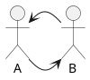
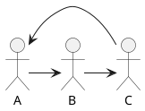
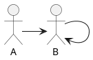
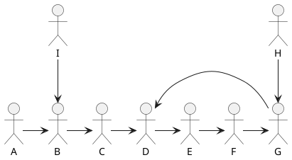
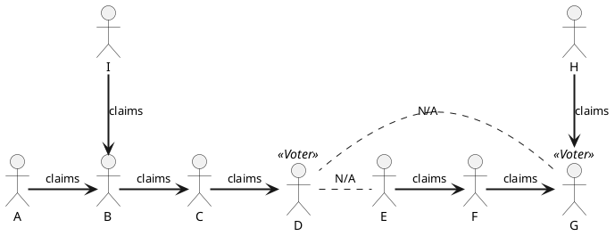
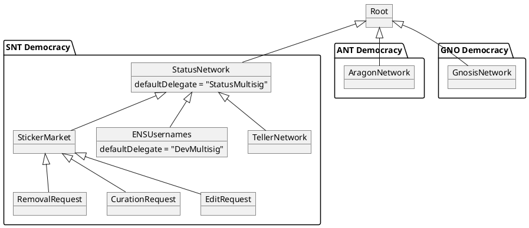
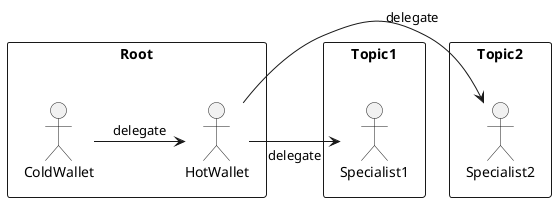

## Simple Summary

A common trust network for ethereum.

A general purpose hierarchy of delegations which can divided into micro topics. 

## Abstract

When "everything" becomes DAOable, it could become a problem to keep track of all the micro DAOs. Just like ERC20 have an allowance for other address spent on their behalf, 
Cold wallets usually don't want to be unlocked very often to be able to vote. 
Users might want to trust all their DAOs to other address for vote for them. 
A group of people want to trust each other to vote in topics.
DAOs might want to inherit the _root_ delegate of users for their own _topic_, where users could define a specific delegate..

## Motivation

Convergence of user delegations in a common trust network, allowing to specify specific delegates for specific sub topics.

Allows proposals to inherit a common and specialized trust network.

## Specification

This EIP defines the delegation behavior, a common interface for the delegations, the relationship between delegations hierarchy, and the address/deploy of the root delegation.

Every address can delegate to another address, by default, at root delegation, all users delegate to themselves:



When a user delegate to itself, it represents a circular delegation of size 0, the delegations always end up in a circular delegations, which can have other size, as of size 1:



A circular delegation of size 2 would be a triangular delegation:



Ultimately, all delegations paths will end in a circular delegation, as example, a delegation chain ending in a circular delegation of size 0:




Delegations chains may also end in a circular delegation of other sizes:



### Influence flow

The delegate which gets the influence is the first on the chain that vote, in the example above, if only `E` voted, it would accumulate the influence of all others and itself, `A,B,C,D,E,F,G,I`, while if `D` and `G` voted, then  `D` would be able to claim influence of `A,B,I,C,D`, while `G` would claim from `E,F,H,G`. 



### µTopic Delegations

The delegate of an address of a specific micro topic inherit the defined delegate at its parent topic. 

The Root topic should be used as parent when a topic represents the root topic of a democracy.

The example below demonstrates the relationship between topics.



#### Root Topic

The root topic is used for defining a one address to all delegations. This is very useful for managing of cold storage wallets, multisigs and other scenarios where regular voting becomes complicated. This hot wallet can then delegate to several other delegates in specific topics, or handle the voting by themselves, as desired by user.



#### Sub Delegations (Micro Topics)

Sub Delegations operate under their own rules, as having a Default Delegate, however would be common for them following the same rules as root delegation. 

When an address don't have a delegate set, it looks up in the parent delegation. If the parent delegation returns zero, the default delegate is looked up at the sub delegation. The address zero delegate (default delegate) is only looked up in the sub delegation.

##### Default Delegate

When a user didn't set a delegate in a parent delegation, it will lookup to the defaultDelegate, which in root topic is "undefined", but in sub topics a default delegate can be defined.  

The default delegate is a option sub delegations can implement to facilitate developers of building a DAO, where all stakeholders by default would delegate to the developer address. Some democracies may allow change of default delegate, others not. 

Technically, Default Delegate is the delegate of the address zero, which appears when a delegate was not set. At root delegation, the technical end of linear delegations is the address zero, which ends up in a circular delegation with itself. 


### Delegation Interface

```solidity
pragma solidity >=0.5.0 <0.7.0;

/**
 * @author Ricardo Guilherme Schmidt (Status Research & Development GmbH)
 */
interface Delegation {

    event Delegate(address who, address to);

    /**
     * @notice Set `msg.sender` delegate.
     * `_to == address(0)` resets to parent delegation
     * `_to == msg.sender` ends delegate chain.
     * @param _to Address the caller will delegate to.
     */
    function delegate(address _to) external;

    /**
     * @notice Reads `_who` configured delegation in this level or
     * from parent level if `_who` never defined/reset.
     * @param _who What address to lookup.
     * @return The address `_who` chosen delegate to.
     */
    function delegatedTo(address _who) external view returns (address);

    /**
     * @notice Reads `_who` configured delegation at block number `_block` or from parent level if `_who` never defined/reset.
     * @param _who What address to lookup.
     * @param _block Block number of what height in history.
     * @return The address `_who` chosen delegate to.
     */
    function delegatedToAt(address _who, uint _block) external view returns (address);
}
```

### Deployment 

#### Root Topic

The root delegation address, for any ethereum chain, is `0x2502205225022052250220522502205225022052` which is deployed by the Singleton Factory [ERC-2470] using the salt `0x2502205225022052250220522502205225022052250220522502` and using the bytecode provided below.

##### Deploy Init Code 

`0x250225022502250225022(...)`


#### Micro topics

Micro topics can be created by deploying a compatible Delegation and setting the root delegate as defined in this EIP.

#### Solidity Sources

```solidity
pragma solidity >=0.5.0 <0.7.0;

/**
 * @author Ricardo Guilherme Schmidt (Status Research & Development GmbH)
 */
contract Delegation  {

    address payable public controller;

    struct DelegateSet {
        uint96 fromBlock; //when this was updated
        address to; //who received this delegation
    }
    //default delegation proxy, being used when user didn't set any delegation at this level.
    Delegation public parentDelegation;

    //snapshots of changes, allow delegation changes be done at any time without compromising vote results.
    mapping (address => DelegateSet[]) public delegations;

    /**
     * @notice The address of the controller is the only address that can call a function with this modifier
     */
    modifier onlyController {
        require(msg.sender == controller, "Unauthorized");
        _;
    }

    /**
     * @param _parentDelegation Where to lookup for unset delegations (Sub Delegation only).
     * @param _controller Democracy which can set the default delegate (Sub Delegation only).
     */
    constructor(Delegation _parentDelegation, address _controller) public {
        parentDelegation = _parentDelegation;
        controller = _controller;
    }

    /**
     * @notice Changes the delegation of `msg.sender` to `_to`.
     *         In case of having a parent proxy, if never defined, fall back to parent proxy.
     *         If once defined and want to delegate to parent proxy, set `_to` as parent address.
     * @param _to To what address the caller address will delegate to.
     */
    function delegate(address _to) external {
        updateDelegate(msg.sender, _to);
    }

    /**
     * @notice Changes the delegation of `address(0)` to `_to`.
     *         By default accounts delegate to `address(0)`.
     *         Therefore the delegate of `address(0)` is the default delegate of all accounts.
     * @param _defaultDelegate default delegate address
     */
    function setDefaultDelegate(address _defaultDelegate) external onlyController {
        updateDelegate(address(0), _defaultDelegate);
    }
    
    /**
     * @notice Changes the controller of the contract
     * @param _newController The new controller of the contract
     */
    function changeController(address payable _newController) public onlyController {
        controller = _newController;
    }

    /**
     * @notice Reads `_who` configured delegation in this level,
     *         or from parent level if `_who` never defined/defined to parent address.
     * @param _who What address to lookup.
     * @return The address `_who` chosen delegate to.
     */
    function delegatedTo(address _who)
        external
        view
        returns (address)
    {
        return findDelegatedToAt(_who, block.number);
    }

    /**
     * @notice Reads `_who` configured delegation at block number `_block` in this level,
     *         or from parent level if `_who` never defined/defined to parent address.
     * @param _who What address to lookup.
     * @param _block Block number of what height in history.
     * @return The address `_who` chosen delegate to.
     */
    function delegatedToAt(
        address _who,
        uint _block
    )
        external
        view
        returns (address directDelegate)
    {
        return findDelegatedToAt(_who, _block);
    }

    /**
     * @dev Changes the delegation of `_from` to `_to`.
     * If `_to` is set to 0x00, fall to parent proxy.
     * If `_to == _from` removes delegation.
     * @param _from Address delegating.
     * @param _to Address delegated.
     */
    function updateDelegate(address _from, address _to) internal {
        emit Delegate(_from, _to);
        DelegateSet memory _newFrom; //allocate memory
        DelegateSet[] storage fromHistory = delegations[_from];

        //Add the new delegation
        _newFrom.fromBlock = uint96(block.number);
        _newFrom.to = _to; //delegate address

        fromHistory.push(_newFrom); //register `from` delegation update;
    }

    /**
      * @dev `_getDelegationAt` retrieves the delegation at a given block number.
      * @param checkpoints The memory being queried.
      * @param _block The block number to retrieve the value at.
      * @return The delegation being queried.
      */
    function getMemoryAt(DelegateSet[] storage checkpoints, uint _block) internal view returns (DelegateSet memory d) {
        // Case last checkpoint is the one;
        if (_block >= checkpoints[checkpoints.length-1].fromBlock) {
            d = checkpoints[checkpoints.length-1];
        } else {
            // Lookup in array;
            uint min = 0;
            uint max = checkpoints.length-1;
            while (max > min) {
                uint mid = (max + min + 1) / 2;
                if (checkpoints[mid].fromBlock <= _block) {
                    min = mid;
                } else {
                    max = mid-1;
                }
            }
            d = checkpoints[min];
        }
    }

     /**
     * @notice Reads `_who` configured delegation at block number `_block` in this level,
     *         or from parent level if `_who` never defined/defined to parent address.
     * @param _who What address to lookup.
     * @param _block Block number of what height in history.
     * @return The address `_who` chosen delegate to.
     */
    function findDelegatedToAt(
        address _who,
        uint _block
    )
        internal
        view
        returns (address directDelegate)
    {
        DelegateSet[] storage checkpoints = delegations[_who];

        //In case there is no registry
        if (checkpoints.length == 0) {
            return (
                address(parentDelegation) == address(0) ?
                address(0) : parentDelegation.delegatedToAt(_who, _block)
            );
        }
        return getMemoryAt(checkpoints, _block).to;
    }
}
```


## Rationale

Democracies are seen as a multisig of infinite participants, which signatures weight are on their voting token and the threshold as usually 50%+1 or more.

Being possible to approve something in qualified quorums becomes more difficult the wider the community of holders is, and approving very specific tasks can be complicated to evaluate for most of holders.

Therefore the design was around solving the problem of defining delegates in a common but optionally specialized way building a trust network which can easily and carefully approve proposals. 

The support for Circular Delegations is interesting to allow a trust bond between a closed community, where any of the community can have the voice of all if none others vote.

Default Delegate is useful for DAO startups, which need a Controlled, yet Trustless method of developing the system. 


## Backwards Compatibility

N/A

## Test Cases

TBD

## Implementation

Status.im µTopic Democracy Delegation

## Security Considerations

### Bribing effects

Bribing Token Holders is not considered a risk, because stakeholders ultimately are responsible by everything approved. 

The bribing of delegates should be mitigated by a veto period.

### Veto Period

Democracies willing to use Liquid Democracy for approving in chain actions should consider implementing a Veto Period

## References

https://docs.google.com/presentation/d/1FJkaJlp_Fs0D5KHsn8oEgDOhg9QKiBwxHOvUL0dvC5I/edit#slide=id.g50bded6ab0_0_10

## Copyright

Copyright and related rights waived via [CC0](https://creativecommons.org/publicdomain/zero/1.0/).