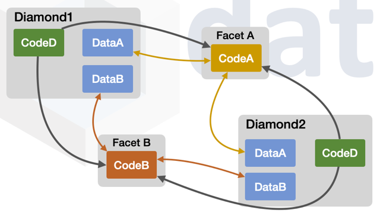
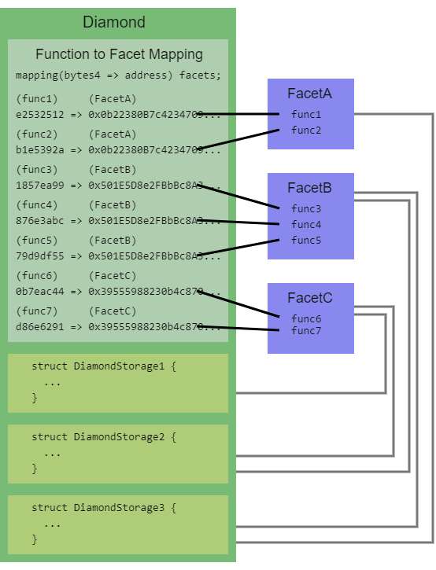
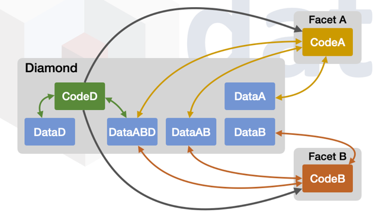

## Abstract


This proposal standardizes diamonds, which are modular smart contract systems that can be upgraded/extended after deployment, and have virtually no size limit. More technically, a **diamond** is a contract with external functions that are supplied by contracts called **facets**. Facets are separate, independent contracts that can share internal functions, libraries, and state variables.

## Motivation

There are a number of different reasons to use diamonds. Here are some of them:

1. **A single address for unlimited contract functionality.** Using a single address for contract functionality makes deployment, testing and integration with other smart contracts, software and user interfaces easier.
1. **Your contract exceeds the 24KB maximum contract size.** You may have related functionality that it makes sense to keep in a single contract, or at a single contract address. A diamond does not have a max contract size.
1. **A diamond provides a way to organize contract code and data.** You may want to build a contract system with a lot of functionality. A diamond provides a systematic way to isolate different functionality and connect them together and share data between them as needed in a gas-efficient way. 
1. **A diamond provides a way to upgrade functionality.** Upgradeable diamonds can be upgraded to add/replace/remove functionality. Because diamonds have no max contract size, there is no limit to the amount of functionality that can be added to diamonds over time. Diamonds can be upgraded without having to redeploy existing functionality. Parts of a diamond can be added/replaced/removed while leaving other parts alone.
1. **A diamond can be immutable.** It is possible to deploy an immutable diamond or make an upgradeable diamond immutable at a later time.
1. **A diamond can reuse deployed contracts.** Instead of deploying contracts to a blockchain, existing already deployed, onchain contracts can be used to create diamonds. Custom diamonds can be created from existing deployed contracts. This enables the creation of on-chain smart contract platforms and libraries.

This standard is an improvement of [EIP-1538](./eip-1538.md). The same motivations of that standard apply to this standard.

A deployed facet can be used by any number of diamonds.

The diagram below shows two diamonds using the same two facets.

- `FacetA` is used by `Diamond1`
- `FacetA` is used by `Diamond2`
- `FacetB` is used by `Diamond1`
- `FacetB` is used by `Diamond2`



### Upgradeable Diamond vs. Centralized Private Database

Why have an upgradeable diamond instead of a centralized, private, mutable database?

1. Decentralized Autonomous Organizations (DAOs) and other governance systems can be used to upgrade diamonds.
1. Wide interaction and integration with the Ethereum ecosystem.
1. With open storage data and verified source code it is possible to show a provable history of trustworthiness.
1. With openness bad behavior can be spotted and reported when it happens.
1. Independent security and domain experts can review the change history of contracts and vouch for their history of trustworthiness.
1. It is possible for an upgradeable diamond to become immutable and trustless.

### Some Diamond Benefits

1. A stable contract address that provides needed functionality.
1. A single address with the functionality of multiple contracts (facets) that are independent from each other but can share internal functions, libraries and state variables.
1. Emitting events from a single address can simplify event handling.
1. A way to add, replace and remove multiple external functions atomically (in the same transaction).
1. Fine-grained upgrades, so you can change just the parts of a diamond that need to be changed.
1. Have greater control over when and what functions exist.
1. Decentralized Autonomous Organizations (DAOs), multisig contracts and other governance systems can be used to upgrade diamonds.
1. An event that shows what functions are added, replaced and removed.
1. The ability to show all changes made to a diamond.
1. Increase trust over time by showing all changes made to a diamond.
1. A way to look at a diamond to see its current facets and functions.
1. Have an immutable, trustless diamond.
1. Solves the 24KB maximum contract size limitation. Diamonds can be any size.
1. Separate functionality can be implemented in separate facets and used together in a diamond.
1. Diamonds can be created from already deployed, existing onchain contracts.
1. Larger contracts have to reduce their size by removing error messages and other things. You can keep your full functionality that you need by implementing a diamond.
1. Enables zero, partial or full diamond immutability as desired, and when desired.
1. The ability to develop and improve an application over time with an upgradeable diamond and then make it immutable and trustless if desired.
1. Develop incrementally and let your diamond grow with your application.
1. Upgrade diamonds to fix bugs, add functionality and implement new standards.
1. Organize your code with a diamond and facets.
1. Diamonds can be large (have many functions) but still be modular because they are compartmented with facets.
1. Contract architectures that call multiple contracts in a single transaction can save gas by condensing those contracts into a single diamond and accessing state variables directly.
1. Save gas by converting external functions to internal functions. This done by sharing internal functions between facets.
1. Save gas by creating external functions for gas-optimized specific use cases, such as bulk transfers.
1. Diamonds are designed for tooling and user-interface software.


## Specification

### Terms

1. A **diamond** is a facade smart contract that `delegatecall`s into its facets to execute function calls. A diamond is stateful. Data is stored in the contract storage of a diamond.
1. A **facet** is a stateless smart contract or Solidity library with external functions. A facet is deployed and one or more of its functions are added to one or more diamonds. A facet does not store data within its own contract storage but it can define state and read and write to the storage of one or more diamonds. The term facet comes from the diamond industry. It is a side, or flat surface of a diamond.
1. A **loupe facet** is a facet that provides introspection functions. In the diamond industry, a loupe is a magnifying glass that is used to look at diamonds.
1. An **immutable function** is an external function that cannot be replaced or removed (because it is defined directly in the diamond, or because the diamond's logic does not allow it to be modified).
1. A **mapping** for the purposes of this EIP is an association between two things and does not refer to a specific implementation.

The term **contract** is used loosely to mean a smart contract or deployed Solidity library.

When this EIP uses **function** without specifying internal or external, it means external function.

In this EIP the information that applies to external functions also applies to public functions.

### Overview

A diamond calls functions from its facets using `delegatecall`.

In the diamond industry diamonds are created and shaped by being cut, creating facets. In this standard diamonds are cut by adding, replacing or removing functions from facets.

### A Note on Implementing Interfaces

Because of the nature of diamonds, a diamond can implement an interface in one of two ways: directly (`contract Contract is Interface`), or by adding functions to it from one or more facets. For the purposes of this proposal, when a diamond is said to implement an interface, either method of implementation is permitted.

### Fallback Function

When an external function is called on a diamond its fallback function is executed. The fallback function determines which facet to call based on the first four bytes of the call data (known as the function selector) and executes that function from the facet using `delegatecall`.

A diamond's fallback function and `delegatecall` enable a diamond to execute a facet's function as if it was implemented by the diamond itself. The `msg.sender` and `msg.value` values do not change and only the diamond's storage is read and written to.

Here is an illustrative example of how a diamond's fallback function might be implemented:

```solidity
// Find facet for function that is called and execute the
// function if a facet is found and return any value.
fallback() external payable {
  // get facet from function selector
  address facet = selectorTofacet[msg.sig];
  require(facet != address(0));
  // Execute external function from facet using delegatecall and return any value.
  assembly {
    // copy function selector and any arguments
    calldatacopy(0, 0, calldatasize())
    // execute function call using the facet
    let result := delegatecall(gas(), facet, 0, calldatasize(), 0, 0)
    // get any return value
    returndatacopy(0, 0, returndatasize())
    // return any return value or error back to the caller
    switch result
      case 0 {revert(0, returndatasize())}
      default {return (0, returndatasize())}
  }
}
```

This diagram shows the structure of a diamond:



### Storage

A state variable or storage layout organizational pattern is needed because Solidity's builtin storage layout system doesn't support proxy contracts or diamonds. The particular layout of storage is not defined in this EIP, but may be defined by later proposals. Examples of storage layout patterns that work with diamonds are [Diamond Storage](../assets/eip-2535/storage-examples/DiamondStorage.sol) and [AppStorage](../assets/eip-2535/storage-examples/AppStorage.sol).

Facets can share state variables by using the same structs at the same storage positions. Facets can share internal functions and libraries by inheriting the same contracts or using the same libraries. In these ways facets are separate, independent units but can share state and functionality.

The diagram below shows facets with their own data and data shared between them.

Notice that all data is stored in the diamond's storage, but different facets have different access to data.

In this diagram

- Only `FacetA` can access `DataA`
- Only `FacetB` can access `DataB`
- Only the diamond's own code can access `DataD`.
- `FacetA` and `FacetB` share access to `DataAB`.
- The diamond's own code, `FacetA` and `FacetB` share access to `DataABD`.



### Solidity Libraries as Facets

Smart contracts or deployed Solidity libraries can be facets of diamonds.

Only Solidity libraries that have one or more external functions can be deployed to a blockchain and be a facet. 

Solidity libraries that contain internal functions only cannot be deployed and cannot be a facet. Internal functions from Solidity libraries are included in the bytecode of facets and contracts that use them. Solidity libraries with internal functions only are useful for sharing internal functions between facets. 

Solidity library facets have a few properties that match their use as facets:
* They cannot be deleted.
* They are stateless. They do not have contract storage.
* Their syntax prevents declaring state variables outside Diamond Storage.

### Adding/Replacing/Removing Functions

#### `IDiamond` Interface

All diamonds must implement the `IDiamond` interface.

During the deployment of a diamond any immutable functions and any external functions added to the diamond must be emitted in the `DiamondCut` event.

**A `DiamondCut` event must be emitted any time external functions are added, replaced, or removed.** This applies to all upgrades, all functions changes, at any time, whether through `diamondCut` or not. 

```solidity
interface IDiamond {
    enum FacetCutAction {Add, Replace, Remove}
    // Add=0, Replace=1, Remove=2

    struct FacetCut {
        address facetAddress;
        FacetCutAction action;
        bytes4[] functionSelectors;
    }

    event DiamondCut(FacetCut[] _diamondCut, address _init, bytes _calldata);
}
```

The `DiamondCut` event records all function changes to a diamond.

#### `IDiamondCut` Interface

A diamond contains within it a mapping of function selectors to facet addresses. Functions are added/replaced/removed by modifying this mapping.

Diamonds should implement the `IDiamondCut` interface if after their deployment they allow modifications to their function selector mapping.

The `diamondCut` function updates any number of functions from any number of facets in a single transaction. Executing all changes within a single transaction prevents data corruption which could occur in upgrades done over multiple transactions.

`diamondCut` is specified for the purpose of interoperability. Diamond tools, software and user-interfaces should expect and use the standard `diamondCut` function.

```solidity
interface IDiamondCut is IDiamond {
    /// @notice Add/replace/remove any number of functions and optionally execute
    ///         a function with delegatecall
    /// @param _diamondCut Contains the facet addresses and function selectors
    /// @param _init The address of the contract or facet to execute _calldata
    /// @param _calldata A function call, including function selector and arguments
    ///                  _calldata is executed with delegatecall on _init
    function diamondCut(
        FacetCut[] calldata _diamondCut,
        address _init,
        bytes calldata _calldata
    ) external;
}
```

The `_diamondCut` argument is an array of `FacetCut` structs.

Each `FacetCut` struct contains a facet address and array of function selectors that are updated in a diamond.

For each `FacetCut` struct:

 * If the `action` is `Add`, update the function selector mapping for each `functionSelectors` item to the `facetAddress`. If any of the `functionSelectors` had a mapped facet, revert instead.
 * If the `action` is `Replace`, update the function selector mapping for each `functionSelectors` item to the `facetAddress`. If any of the `functionSelectors` had a value equal to `facetAddress` or the selector was unset, revert instead.
 * If the `action` is `Remove`, remove the function selector mapping for each `functionSelectors` item. If any of the `functionSelectors` were previously unset, revert instead.

Any attempt to replace or remove an immutable function must revert.

Being intentional and explicit about adding/replacing/removing functions helps catch and prevent upgrade mistakes.

##### Executing `_calldata`

After adding/replacing/removing functions the `_calldata` argument is executed with `delegatecall` on `_init`. This execution is done to initialize data or setup or remove anything needed or no longer needed after adding, replacing and/or removing functions.

If the `_init` value is `address(0)` then `_calldata` execution is skipped. In this case `_calldata` can contain 0 bytes or custom information.

### Inspecting Facets & Functions

> A loupe is a small magnifying glass used to look at diamonds.

Diamonds must support inspecting facets and functions by implementing the `IDiamondLoupe` interface.

#### `IDiamondLoupe` Interface

```solidity
// A loupe is a small magnifying glass used to look at diamonds.
// These functions look at diamonds
interface IDiamondLoupe {
    struct Facet {
        address facetAddress;
        bytes4[] functionSelectors;
    }

    /// @notice Gets all facet addresses and their four byte function selectors.
    /// @return facets_ Facet
    function facets() external view returns (Facet[] memory facets_);

    /// @notice Gets all the function selectors supported by a specific facet.
    /// @param _facet The facet address.
    /// @return facetFunctionSelectors_
    function facetFunctionSelectors(address _facet) external view returns (bytes4[] memory facetFunctionSelectors_);

    /// @notice Get all the facet addresses used by a diamond.
    /// @return facetAddresses_
    function facetAddresses() external view returns (address[] memory facetAddresses_);

    /// @notice Gets the facet that supports the given selector.
    /// @dev If facet is not found return address(0).
    /// @param _functionSelector The function selector.
    /// @return facetAddress_ The facet address.
    function facetAddress(bytes4 _functionSelector) external view returns (address facetAddress_);
}
```

See a [reference implementation](#reference-implementation) to see how this can be implemented.

The loupe functions can be used in user-interface software. A user interface calls these functions to provide information about and visualize diamonds.

The loupe functions can be used in deployment functionality, upgrade functionality, testing and other software.

### Implementation Points

A diamond must implement the following:

1. A diamond contains a fallback function and zero or more immutable functions that are defined within it.
1. A diamond associates function selectors with facets.
1. When a function is called on a diamond it executes immediately if it is an "immutable function" defined directly in the diamond. Otherwise the diamond's fallback function is executed. The fallback function finds the facet associated with the function and executes the function using `delegatecall`. If there is no facet for the function then optionally a default function may be executed. If there is no facet for the function and no default function and no other mechanism to handle it then execution reverts.
1. Each time functions are added, replaced or removed a `DiamondCut` event is emitted to record it.
1. A diamond implements the DiamondLoupe interface.
1. All immutable functions must be emitted in the `DiamondCut` event as new functions added. And the loupe functions must return information about immutable functions if they exist. The facet address for an immutable function is the diamond's address. Any attempt to delete or replace an immutable function must revert.

A diamond may implement the following:

1. [EIP-165](./eip-165.md)'s `supportsInterface`. If a diamond has the `diamondCut` function then the interface ID used for it is `IDiamondCut.diamondCut.selector`. The interface ID used for the diamond loupe interface is `IDiamondLoupe.facets.selector ^ IDiamondLoupe.facetFunctionSelectors.selector ^ IDiamondLoupe.facetAddresses.selector ^ IDiamondLoupe.facetAddress.selector`.

The diamond address is the address that users interact with. The diamond address does not change. Only facet addresses can change by using the `diamondCut` function, or other function.

## Rationale

### Using Function Selectors

User interface software can be used to retrieve function selectors and facet addresses from a diamond in order show what functions a diamond has.

This standard is designed to make diamonds work well with user-interface software. Function selectors with the ABI of a contract provide enough information about functions to be useful for user-interface software.

### Gas Considerations

Delegating function calls does have some gas overhead. This is mitigated in several ways:

1. Because diamonds do not have a max size limitation it is possible to add gas optimizing functions for use cases. For example someone could use a diamond to implement the [EIP-721](./eip-721.md) standard and implement batch transfer functions to reduce gas (and make batch transfers more convenient).
1. Some contract architectures require calling multiple contracts in one transaction. Gas savings can be realized by condensing those contracts into a single diamond and accessing contract storage directly.
1. Facets can contain few external functions, reducing gas costs. Because it costs more gas to call a function in a contract with many functions than a contract with few functions.
1. The Solidity optimizer can be set to a high setting causing more bytecode to be generated but the facets will use less gas when executed.

### Versions of Functions

Software or a user can verify what version of a function is called by getting the facet address of the function. This can be done by calling the `facetAddress` function from the `IDiamondLoupe` interface. This function takes a function selector as an argument and returns the facet address where it is implemented.

### Default Function

Solidity provides the `fallback` function so that specific functionality can be executed when a function is called on a contract that does not exist in the contract. This same behavior can optionally be implemented in a diamond by implementing and using a default function, which is a function that is executed when a function is called on a diamond that does not exist in the diamond.

A default function can be implemented a number of ways and this standard does not specify how it must be implemented.

### Loupe Functions & `DiamondCut` Event

To find out what functions a regular contract has it is only necessary to look at its verified source code.

The verified source code of a diamond does not include what functions it has so a different mechanism is needed.

A diamond has four standard functions called the loupe functions that are used to show what functions a diamond has.

The loupe functions can be used for many things including:
1. To show all functions used by a diamond.
1. To query services like Etherscan or files to retrieve and show all source code used by a diamond.
1. To query services like Etherscan or files to retrieve ABI information for a diamond.
1. To test or verify that a transaction that adds/replaces/removes functions on a diamond succeeded.
1. To find out what functions a diamond has before calling functions on it.
1. To be used by tools and programming libraries to deploy and upgrade diamonds.
1. To be used by user interfaces to show information about diamonds.
1. To be used by user interfaces to enable users to call functions on diamonds.

Diamonds support another form of transparency which is a historical record of all upgrades on a diamond. This is done with the `DiamondCut` event which is used to record all functions that are added, replaced or removed on a diamond. 

### Sharing Functions Between Facets

In some cases it might be necessary to call a function defined in a different facet. Here are ways to do this:

1. Copy internal function code in one facet to the other facet.
1. Put common internal functions in a contract that is inherited by multiple facets.
1. Put common internal functions in a Solidity library and use the library in facets.
1. A type safe way to call an external function defined in another facet is to do this: `MyOtherFacet(address(this)).myFunction(arg1, arg2)`
1. A more gas-efficient way to call an external function defined in another facet is to use delegatecall. Here is an example of doing that:
```solidity
DiamondStorage storage ds = diamondStorage();
bytes4 functionSelector = bytes4(keccak256("myFunction(uint256)"));
// get facet address of function
address facet = ds.selectorToFacet[functionSelector];
bytes memory myFunctionCall = abi.encodeWithSelector(functionSelector, 4);
(bool success, bytes memory result) = address(facet).delegatecall(myFunctionCall);
```
6. Instead of calling an external function defined in another facet you can instead create an internal function version of the external function. Add the internal version of the function to the facet that needs to use it.

### Facets can be Reusable and Composable

A deployed facet can be used by any number of diamonds.

Different combinations of facets can be used with different diamonds.

It is possible to create and deploy a set of facets that are reused by different diamonds over time.

The ability to use the same deployed facets for many diamonds reduces deployment costs.

It is possible to implement facets in a way that makes them usable/composable/compatible with other facets. It is also possible to implement facets in a way that makes them not usable/composable/compatible with other facets.

A function signature is the name of a function and its parameter types. Example function signature: `myfunction(uint256)`. A limitation is that two external functions with the same function signature can’t be added to the same diamond at the same time because a diamond, or any contract, cannot have two external functions with the same function signature.

All the functions of a facet do not have to be added to a diamond. Some functions in a facet can be added to a diamond while other functions in the facet are not added to the diamond.

## Backwards Compatibility

This standard makes upgradeable diamonds compatible with future standards and functionality because new functions can be added and existing functions can be replaced or removed.

## Reference Implementation

All the Solidity code for a complete reference implementation has been put in a single file here: [Diamond.sol](../assets/eip-2535/reference/Diamond.sol)

The same reference implementation has been organized into multiple files and directories and also includes a deployment script and tests. Download it as a zip file: [`EIP2535-Diamonds-Reference-Implementation.zip`](../assets/eip-2535/reference/EIP2535-Diamonds-Reference-Implementation.zip)

## Security Considerations

### Ownership and Authentication

> **Note:** The design and implementation of diamond ownership/authentication is **not** part of this standard. The examples given in this standard and in the reference implementation are just **examples** of how it could be done.

It is possible to create many different authentication or ownership schemes with this proposal. Authentication schemes can be very simple or complex, fine grained or coarse. This proposal does not limit it in any way. For example ownership/authentication could be as simple as a single account address having the authority to add/replace/remove functions. Or a decentralized autonomous organization could have the authority to only add/replace/remove certain functions.

Consensus functionality could be implemented such as an approval function that multiple different people call to approve changes before they are executed with the `diamondCut` function. These are just examples.

The development of standards and implementations of ownership, control and authentication of diamonds is encouraged.

### Arbitrary Execution with `diamondCut`

The `diamondCut` function allows arbitrary execution with access to the diamond's storage (through `delegatecall`). Access to this function must be restricted carefully.

### Do Not Self Destruct
Use of `selfdestruct` in a facet is heavily discouraged. Misuse of it can delete a diamond or a facet.

### Function Selector Clash

A function selector clash occurs when two different function signatures hash to the same four-byte hash. This has the unintended consequence of replacing an existing function in a diamond when the intention was to add a new function. This scenario is not possible with a properly implemented `diamondCut` function because it prevents adding function selectors that already exist.

### Transparency

Diamonds emit an event every time one or more functions are added, replaced or removed. All source code can be verified. This enables people and software to monitor changes to a contract. If any bad acting function is added to a diamond then it can be seen.

Security and domain experts can review the history of change of a diamond to detect any history of foul play.

## Copyright

Copyright and related rights waived via [CC0](../LICENSE.md).
