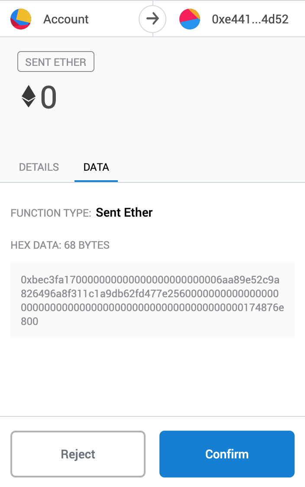
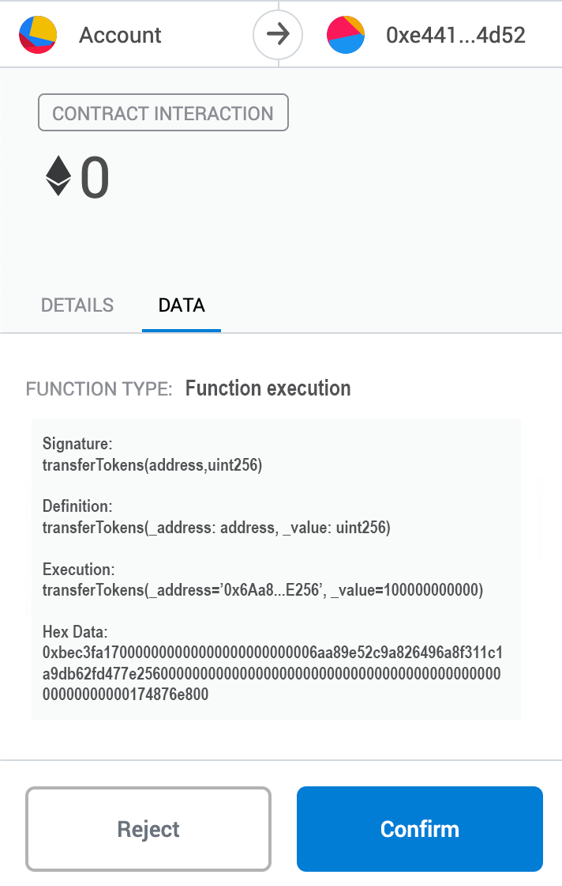

## Simple Summary
This EIP proposes a new Ethereum RPC method `eth_sendTransactionToContract` that accepts a human readable version of `eth_sendTransaction`'s `data` field. This change will allow ProviderWallets (hybrid Ethereum provider / wallet software) like Metamask and Geth to display confirmation screens with human readable details of a function call to a contract.

## Abstract
When a dapp prompts a user to execute a smart contract function via a ProviderWallet, confirmation screens displayed in the ProviderWallet layer cannot display the human readable details of the function to be called and the arguments to be passed. This is because the Ethereum RPC method used for contract function execution (`eth_sendTransaction`) accepts information about what function to call in a non-human readable (and non-recoverable) format. As such, when a ProviderWallet receives this non-human readable information from a dapp, they are unable to display a human readable version since they never received one and cannot recover one from the data.

This creates a poor and potentially dangerous user experience. For example, a malicious dapp could swap out the `address` argument in a token contract's `transfer(address,uint256)` function and reroute the tokens intended for someone else to themselves. This slight-of-hand would be quiet and unlikely to be picked up by a casual user glancing over the non-human readable data. By adding a new Ethereum RPC method (`eth_sendTransactionToContract`) that accepts a human readable version of the function-executing data, ProviderWallets can display the human readable details of contract function execution to users.

## Motivation
### ProviderWallet Definition
ProviderWallets like Metamask and Geth are hybrid software that combine an Ethereum API provider with an Ethereum wallet. This allows them to sign transactions on behalf of their users and also broadcast those signed transactions to the Ethereum network. ProviderWallets are used for both convenience and for the protection they give users through human readable confirmation prompts.

### Existing Solutions
Much discussion has been made in the past few years on the topic of human readable Ethereum transaction data. Aragon's [Radspec](https://github.com/aragon/radspec) addresses this issue by requiring contract developers to amend their contract functions with human readable comments. ProviderWallets can then use Aragon's Radspec software to parse these comments from the contract code and display them to the end user - substituting in argument values where necessary. Unfortunately, this approach cannot work with contracts that do not have Radspec comments (and may require integration with IPFS(?)).

[EIP 1138](https://github.com/ethereum/EIPs/issues/1138) also addresses this issue directly but contains serious security issues - allowing untrusted dapps to generate the human readable message displayed to users. In a similar train of thought, Geth's #2940 PR](https://github.com/ethereum/go-ethereum/pull/2940) and [EIPs 191](https://github.com/ethereum/EIPs/blob/master/EIPS/eip-191.md), [712](https://github.com/ethereum/EIPs/blob/master/EIPS/eip-712.md) all highlight the Ethereum community's desire for ProviderWallets to better inform users about what data they are actually acting upon. 

Finally, The ProviderWallet Metamask already includes some built-in magic for interactions with ERC20 contracts that allows confirmation prompts to display the intended *token* recipient and *token* value. Although this is accomplished in an ad hoc fashion for ERC20-like contracts only, the motivation is the same: users deserve better information about the execution of contract functions they are relying on ProviderWallets to perform. 

### Background
At one point or another, a dapp will ask a user to interact with a contract. The interaction between dapps and contracts is a large part of the Ethereum ecosystem and is most commonly brokered by a ProviderWallet. When a dapp asks a user to interact with a contract, it will do so by sending the `eth_sendTransaction` method name to the Ethereum API exposed by a ProviderWallet along with the relevant transaction data. The `data` field of the transaction data contains the information necessary for the Ethereum virtual machine to identify and execute the contract's function. This field has a specific formatting that is both non-human readable and non-recoverable to its human readable state.

The accepted format for `eth_sendTransaction`'s `data` field is the hexadecimal encoding of the first four bytes of the keccak256 digest of the function signature. This abbreviated hash is then concatenated with the ABI encoded arguments to the function. Since the keccak256 digest of the function signature cannot be converted back into the function signature, the `data` field is not only not non-human readable, its non-recoverable as well. On top of this, additional insight into the concatenated argument values is further obfuscated as information about their data types are held in the function signature preimage.

### Illustrated Example
When a ProviderWallet receives an `eth_sendTransaction` method call, it has the opportunity to display an information-rich confirmation prompt before signing and broadcasting the transaction to the Ethereum network. Unfortunately, as mentioned above, human readable contract function-execution data is not available at this stage. To illustrate, below we see a Metamask confirmation prompt. For context, this transaction executes the function `transferTokens(address,uint256)` at contract address `0xe44127f6fA8A00ee0228730a630fc1F3162C4d52`. The `from` address is aliased as `Account`, the value for the `address` argument passed to the function is `0x6Aa89e52c9a826496A8f311c1a9db62fd477E256`, and the `uint256` value is `100000000000`.



There are a two main issues with what we are seeing. First, the recipient address shown is the destination contract - not the token recipient. While this is technically correct, the user might not think about their action in this way. In their mind, they might think of the recipient as the address to which they are attempting to transfer tokens to. This distinction can become clear with human readable function-execution data. Second, the hexadecimal encoded function-execution data is not very readable. In fact it's very unlikely that a regular user will even look at this information - let alone parse any insight from it.

Let's compare what we see in the images above with what a user would see if a malicious dapp swaps out the address argument for one of their own. We will leave all other information the same but replace `0x6Aa89e52c9a826496A8f311c1a9db62fd477E256` with `0x9e0A8333984D617562a29a935123F17257aD4dEc`.


You can see how quiet this slight-of-hand is. The hexadecimal encoded function-execution data has changed to include the new address but it is very unlikely that this non-human readable data field would cause any user to suspect that a dapp is stealing from them. Although this attack would likely be obvious to many examining the dapps front end source code, we cannot assume that all users have the ability to identify such an attack. We should strive to give end users much better security when interacting with contracts. Something like the following can be easily imagined with the `eth_sendTransactionToContractFunction` method.



The Ethereum community is trending toward tools that better inform users about their actions. ProviderWallets will remain an integral part of the Ethereum community - serving as the backbone for dapp interconnectivity. The Ethereum RPC API specs should be augmented with methods like `eth_sendTransactionToContract` that allow ProviderWallets to better inform users.

## Specification
This EIP proposes increasing the set of Ethereum RPC methods to include a new  method - `eth_sendTransactionToContractFunction`. This method roughly parallels `eth_sendTransaction` with the only difference being the omission of the optional, non-human readable `data` field and the inclusion of the required, human readable `function` field.

Parameters

1. `Object` - The transaction object
  * `from`: `DATA`, 20 Bytes - The address the transaction is send from.
  * `to`: `DATA`, 20 Bytes - (optional when creating new contract) The address the transaction is directed to.
  * `gas`: `QUANTITY` - (optional, default: 90000) Integer of the gas provided for the transaction execution. It will return unused gas.
  * `gasPrice`: `QUANTITY` - (optional, default: To-Be-Determined) Integer of the gasPrice used for each paid gas
  * `value`: `QUANTITY` - (optional) Integer of the value sent with this transaction
  * `function`: `Object`
    * `abi`: `DATA` - The function ABI
    * `args`: `DATA` - The arguments to the function (not ABI encoded)
  * `nonce`: `QUANTITY` - (optional) Integer of a nonce. This allows to overwrite your own pending transactions that use the same nonce.

Example Parameters
```
  params: [{
    "from": "0x69e6F1b01f34A702Ce63bA6EF83c64fAEC37a227",
    "to": "0xe44127f6fA8A00ee0228730a630fc1F3162C4d52",
    "gas": "0x76c0", // 30400
    "gasPrice": "0x9184e72a000", // 10000000000000
    "value": "0x9184e72a", // 2441406250
    "function": {
      "abi": "{
        "inputs": [{
          "name": "_address",
          "type": "address"
        }, {
          "name": "_value",
          "type": "uint256"
        }],
        "name": "transferTokens",
        "outputs": [{
          "name": "success",
          "type": "bool"
        }],
        "stateMutability": "nonpayable",
        "type": "function"
      }",
      "args": [
        "0x6Aa89e52c9a826496A8f311c1a9db62fd477E256",
        100000000000
      ]
    }
}]
```

Returns
DATA, 32 Bytes - the transaction hash, or the zero hash if the transaction is not yet available.

Example
// Request
curl -X POST --data '{"jsonrpc":"2.0","method":"eth_sendTransactionToContractFunction","params":[{see above}],"id":1}'

// Result
{
  "id":1,
  "jsonrpc": "2.0",
  "result": "0xe670ec64341771606e55d6b4ca35a1a6b75ee3d5145a99d05921026d1527331"
}

## Rationale
With backwards compatibility in mind, this EIP proposes augmenting the set of Ethereum RPC methods with an additional method instead of mutating the existing paralleled method. Precedent for adding a new RPC method comes from [EIP 712](https://github.com/ethereum/EIPs/blob/master/EIPS/eip-712.md) in which adding the method `eth_signTypedData` is proposed for confirmation prompt security. As an alternate approach, the `eth_sendTransaction` method could be changed to accept its `data` argument in a human readable format, but this would break all existing code attempting to execute a contract function. Breaking this backwards compatibility would be a far bigger issue than the readability of an `data` argument so this EIP does not recommended this approach.

This EIP's proposed `eth_sendTransactionToContractFunction` method is intended to parallel `eth_sendTransaction` as much as possible since both methods result in the same behaviour when executing a contract function. This slightly vague `data` field was renamed to `function` to improve specificity. The `function` field accepts an object of its own with two required fields: `abi` and `args`. The `abi` field is an element of the contract's ABI that corresponds to the intended function. The `args` field is a non ABI-encoded array of arguments to be passed to the contract function. Dapps need not ABI-encode arguments as the data types of these arguments can be inferred from the `abi` field on the ProviderWallet side and encoded at that time.  

## Backwards Compatibility
This EIP does not break backwards compatibility and addresses that point above.

## Implementation
The `data` field from `eth_sendTransaction` can be reconstructed in its non-human readable format from the `abi` and `args` fields in `eth_sendTransactionToContractFunction`. This allows implementations to broadcast a transaction with data in the correct format for the Ethereum virtual machine. The function signature can be built and hashed from the function ABI, and the arguments can be ABI-encoded according to the data types specified in the function ABI.

## Security Considerations
Displaying the contract address, function name, and argument name/values can provide additional security to users but it is not a guarantee that a function will execute as the user expects. A poorly implemented contracy can still name its function `transfer` and accept `address` and `uint256` arguments - but there is nothing short of contract examination that will let a user know that this contract is indeed a valid ERC20 contract. This EIP does not intend to solve the larger problem around trust in a contract's code, but instead intends to give users better tools to understand exactly what is contained within the data they are broadcasting to the Ethereum network.

## Copyright
Copyright and related rights waived via [CC0](https://creativecommons.org/publicdomain/zero/1.0/).
