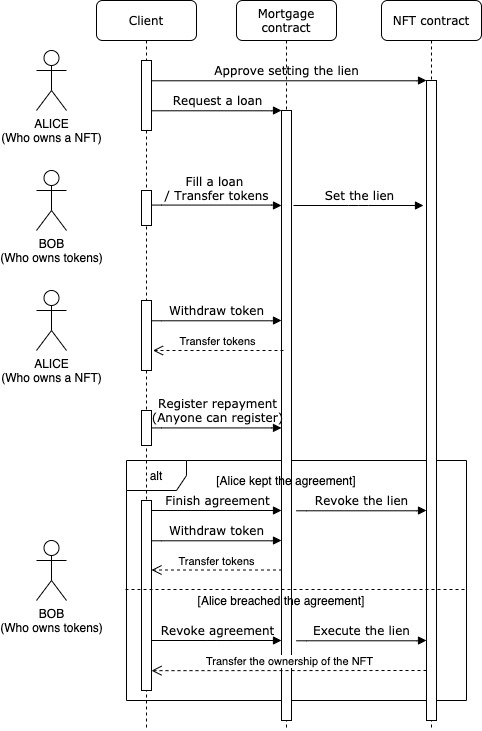
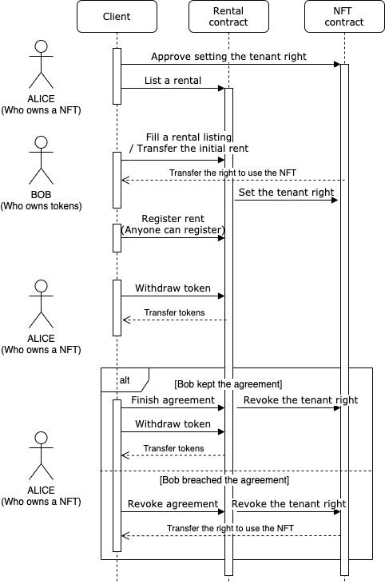

## Simple Summary

This standard proposes an extension to ERC721 Non-Fungible Tokens (NFTs) to support rental and mortgage functions. These functions are necessary for NFTs to emulate real property, just like those in the real world.

## Abstract

This standard is an extension of ERC721. It proposes additional roles, the right of tenants to enable rentals, and the right of lien.

With ERC2615, NFT owners will be able to rent out their NFTs and take out a mortgage by collateralizing their NFTs. For example, this standard can apply to:

- Virtual items (in-game assets, virtual artwork, etc.)
- Physical items (houses, automobiles, etc.)
- Intellectual property rights
- DAO membership tokens

NFT developers are also able to easily integrate ERC2615 since it is fully backwards-compatible with the ERC721 standard.

One notable point is that the person who has the right to use an application is not the owner but the user (i.e. tenant). Application developers must implement this specification into their applications.

## Motivation

It has been challenging to implement rental and mortgage functions with the ERC721 standard because it only has one role defined (which is the Owner).

Currently, a security deposit is needed for trustless renting with ERC721, and ownership lockup within a contract is necessary whenever one chooses to mortgage their ERC721 property. The tracking and facilitation of these relationships must be done separately from the ERC721 standard.

This proposal eliminates these requirements by integrating basic rights of tenantship and liens. By standardizing these functions, developers can more easily integrate rental and mortgage functions for their applications.

## Specification

This standard proposes three user roles: the **Lien Holder**, the **Owner**, and the **User**. Their rights are as follows:

- A **Lien Holder** has the right to:

  1. Transfer the **Owner** role
  2. Transfer the **User** role

- An **Owner** has the right to:

  1. Transfer the **Owner** role
  2. Transfer the **User** role

- A **User** has the right to:
  1. Transfer the **User** role

### ERC-2615 Interface

```solidity
event TransferUser(address indexed from, address indexed to, uint256 indexed itemId, address operator);
event ApprovalForUser(address indexed user, address indexed approved, uint256 itemId);
event TransferOwner(address indexed from, address indexed to, uint256 indexed itemId, address operator);
event ApprovalForOwner(address indexed owner, address indexed approved, uint256 itemId);
event ApprovalForAll(address indexed owner, address indexed operator, bool approved);
event LienApproval(address indexed to, uint256 indexed itemId);
event TenantRightApproval(address indexed to, uint256 indexed itemId);
event LienSet(address indexed to, uint256 indexed itemId, bool status);
event TenantRightSet(address indexed to, uint256 indexed itemId,bool status);

function balanceOfOwner(address owner) public view returns (uint256);
function balanceOfUser(address user) public view returns (uint256);
function userOf(uint256 itemId) public view returns (address);
function ownerOf(uint256 itemId) public view returns (address);

function safeTransferOwner(address from, address to, uint256 itemId) public;
function safeTransferOwner(address from, address to, uint256 itemId, bytes memory data) public;
function safeTransferUser(address from, address to, uint256 itemId) public;
function safeTransferUser(address from, address to, uint256 itemId, bytes memory data) public;

function approveForOwner(address to, uint256 itemId) public;
function getApprovedForOwner(uint256 itemId) public view returns (address);
function approveForUser(address to, uint256 itemId) public;
function getApprovedForUser(uint256 itemId) public view returns (address);
function setApprovalForAll(address operator, bool approved) public;
function isApprovedForAll(address requester, address operator) public view returns (bool);

function approveLien(address to, uint256 itemId) public;
function getApprovedLien(uint256 itemId) public view returns (address);
function setLien(uint256 itemId) public;
function getCurrentLien(uint256 itemId) public view returns (address);
function revokeLien(uint256 itemId) public;

function approveTenantRight(address to, uint256 itemId) public;
function getApprovedTenantRight(uint256 itemId) public view returns (address);
function setTenantRight(uint256 itemId) public;
function getCurrentTenantRight(uint256 itemId) public view returns (address);
function revokeTenantRight(uint256 itemId) public;
```

### ERC-2615 Receiver

```solidity
function onERCXReceived(address operator, address from, uint256 itemId, uint256 layer, bytes memory data) public returns(bytes4);
```

### ERC-2615 Extensions

Extensions here are provided to help developers build with this standard.

#### 1. ERC721 Compatible functions

This extension makes this standard compatible with ERC721. By adding the following functions, developers can take advantage of the existing tools for ERC721.

Transfer functions in this extension will transfer both the **Owner** and **User** roles when the tenant right has not been set. Conversely, when the tenant right has been set, only the **Owner** role will be transferred.

```solidity
function balanceOf(address owner) public view returns (uint256)
function ownerOf(uint256 itemId) public view returns (address)
function approve(address to, uint256 itemId) public
function getApproved(uint256 itemId) public view returns (address)
function transferFrom(address from, address to, uint256 itemId) public
function safeTransferFrom(address from, address to, uint256 itemId) public
function safeTransferFrom(address from, address to, uint256 itemId, bytes memory data) pubic
```

#### 2. Enumerable

This extension is analogous to the enumerable extension of the ERC721 standard.

```solidity
function totalNumberOfItems() public view returns (uint256);
function itemOfOwnerByIndex(address owner, uint256 index, uint256 layer)public view returns (uint256 itemId);
function itemByIndex(uint256 index) public view returns (uint256);
```

#### 3. Metadata

This extension is analogous to the metadata extension of the ERC721 standard.

```solidity
function itemURI(uint256 itemId) public view returns (string memory);
function name() external view returns (string memory);
function symbol() external view returns (string memory);
```

## How rentals and mortgages work

This standard does not deal with token or value transfer. Other logic (outside the scope of this standard) must be used to orchestrate these transfers and to implement validation of payment.

### Mortgage functions

The following diagram demonstrates the mortgaging functionality.



Suppose Alice owns an NFT and wants to take out a mortgage, and Bob wants to earn interest by lending tokens to Alice.

1. Alice approves the setting of a lien for the NFT Alice owns.
2. Alice sends a loan request to the mortgage contract.
3. Bob fills the loan request and transfers tokens to the mortgage contract. The lien is then set on the NFT by the mortgage contract.
4. Alice can now withdraw the borrowed tokens from the mortgage contract.
5. Alice registers repayment (anyone can pay the repayment).
6. Bob can finish the agreement if the agreement period ends and the agreement is kept (i.e. repayment is paid without delay).
7. Bob can revoke the agreement if the agreement is breached (e.g. repayment is not paid on time) and execute the lien and take over the ownership of the NFT.

### Rental functions

The following diagram demonstrates the rental functionality.



Suppose Alice owns NFTs and wants to rent out a NFT, and Bob wants to lease a NFT.

1. Alice approves the setting of a tenant-right for the NFT Alice owns.
2. Alice sends a rental listing to the rental contract.
3. Bob fills the rental request, and the right to use the NFT is transferred to Bob. At the same time, the tenant-right is set, and Alice becomes not able to transfer the right to use the NFT.
4. Bob registers rent (anyone can pay the rent).
5. Alice can withdraw the rent from the rental contract.
6. Alice can finish the agreement if the agreement period has ended and the agreement is kept (i.e. rent is paid without delay).
7. Alice can revoke the agreement if the agreement is breached (e.g. rent is not paid on time) and revoke the tenant-right and take over the right to use the NFT.

## Rationale

There have been some attempts to achieve rentals or mortgages with ERC721. However, as I noted before, it has been challenging to achieve. I will explain the reasons and advantages of this standard below.

### No security lockup for rentals

To achieve trustless rental of NFTs with ERC721, it has been necessary to deposit funds as security. This is required to prevent malicious activity from tenants, as it is impossible to take back ownership once it is transferred.

With this standard, security deposits are no longer needed since the standard natively supports rental and tenantship functions.

### No ownership escrow when taking out a mortgage

In order to take out a mortgage on NFTs, it has been necessary to transfer the NFTs to a contract as collateral. This is required to prevent the potential default risk of the mortgage.

However, secured collateral with ERC721 hurts the utility of the NFT. Since most NFT applications provide services to the canonical owner of a NFT, the NFT essentially cannot be utilized under escrow.

With ERC2615, it is possible to collateralize NFTs and use them at the same time.

### Easy integration

Because of the above reasons, a great deal of effort is required to implement rental and mortgage functions with ERC721. Adopting this standard is a much easier way to integrate rental and mortgage functionality.

### No money/token transactions within tokens

A NFT itself does not handle lending or rental functions directly. This standard is open-source, and there is no platform lockup. Developers can integrate it without having to worry about those risks.

## Backward compatibility

As mentioned in the specifications section, this standard can be fully ERC721 compatible by adding an extension function set.

In addition, new functions introduced in this standard have many similarities with the existing functions in ERC721. This allows developers to easily adopt the standard quickly.

## Test Cases

When running the tests, you need to create a test network with Ganache-CLI:

```
ganache-cli -a 15  --gasLimit=0x1fffffffffffff -e 1000000000
```

And then run the tests using Truffle: 

```
truffle test -e development
```

Powered by Truffle and Openzeppelin test helper.

## Implementation

[Github Reposotory](https://github.com/kohshiba/ERC-X).

## Security Considerations

Since the external contract will control lien or tenant rights, flaws within the external contract directly lead to the standard's unexpected behavior.

## Copyright

Copyright and related rights waived via [CC0](https://creativecommons.org/publicdomain/zero/1.0/).

