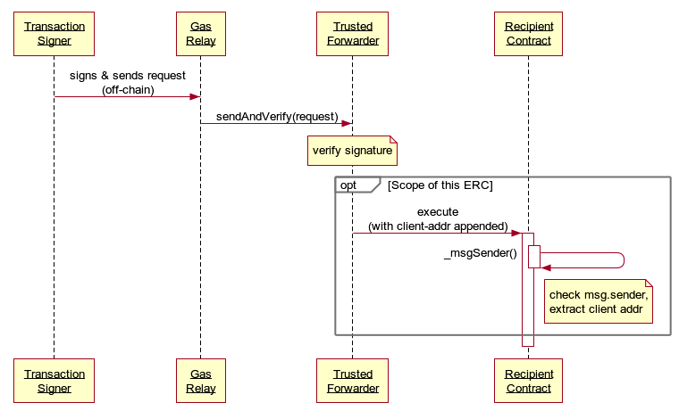

## Abstract

This EIP defines a contract-level protocol for `Recipient` contracts to accept meta-transactions through trusted `Forwarder` contracts. No protocol changes are made. `Recipient` contracts are sent the effective `msg.sender` (referred to as `_msgSender()`) and `msg.data` (referred to as `_msgData()`) by appending additional calldata. 

## Motivation

There is a growing interest in making it possible for Ethereum contracts to accept calls from externally owned accounts that do not have ETH to pay for gas. Solutions that allow for third parties to pay for gas costs are called meta transactions. For the purposes of this EIP, meta transactions are transactions that have been authorized by a **Transaction Signer** and relayed by an untrusted third party that pays for the gas (the **Gas Relay**). 

## Specification

The keywords "MUST", "MUST NOT", "REQUIRED", "SHALL", "SHALL NOT", "SHOULD", "SHOULD NOT", "RECOMMENDED", "MAY", and "OPTIONAL" in this document are to be interpreted as described in RFC 2119.

### Definitions

**Transaction Signer**: Signs & sends transactions to a Gas Relay

**Gas Relay**: Receives signed requests off-chain from Transaction Signers and pays gas to turn it into a valid transaction that goes through a Trusted Forwarder

**Trusted Forwarder**: A contract trusted by the `Recipient` to correctly verify signatures and nonces before forwarding the request from Transaction Signers

**Recipient**: A contract that accepts meta-transactions through a Trusted Forwarder

### Example Flow



### Extracting The Transaction Signer address

The **Trusted Forwarder** is responsible for calling the **Recipient** contract and MUST append the address of the **Transaction Signer** (20 bytes of data) to the end of the call data.

For example :

```solidity
(bool success, bytes memory returnData) = to.call.value(value)(abi.encodePacked(data, from));
```

The **Recipient** contract can then extract the **Transaction Signer** address by performing 3 operations:

1. Check that the **Forwarder** is trusted. How this is implemented is out of the scope of this proposal.
2. Extract the **Transaction Signer** address from the last 20 bytes of the call data and use that as the original `sender` of the transaction (instead of `msg.sender`)
3. If the `msg.sender` is not a trusted forwarder (or if the `msg.data` is shorter than 20 bytes), then return the original `msg.sender` as it is.

The **Recipient** MUST check that it trusts the Forwarder to prevent it from
extracting address data appended from an untrusted contract. This could result
in a forged address.

### Protocol Support Discovery Mechanism

Unless a **Recipient** contract is being used by a particular frontend that knows that this contract has support for native meta transactions, it would not be possible to offer the user the choice of using meta-transaction to interact with the contract. We thus need a mechanism by which the **Recipient** can let the world know that it supports meta transactions. 

This is especially important for meta transactions to be supported at the Web3 wallet level. Such wallets may not necessarily know anything about the **Recipient** contract users may wish to interact with.

As a **Recipient** could trust forwarders with different interfaces and capabilities (e.g., transaction batching, different message signing formats), we need to allow wallets to discover which Forwarder is trusted.

To provide this discovery mechanism a **Recipient** contract MUST implement this function:

```solidity
function isTrustedForwarder(address forwarder) external view returns(bool);
```

`isTrustedForwarder` MUST return `true` if the forwarder is trusted by the Recipient, otherwise it MUST return `false`. `isTrustedForwarder` MUST NOT revert.

Internally, the **Recipient** MUST then accept a request from forwarder.

`isTrustedForwarder` function MAY be called on-chain, and as such gas restrictions MUST be put in place. It SHOULD NOT consume more than 50,000 gas

## Rationale

* Make it easy for contract developers to add support for meta
  transactions by standardizing the simplest viable contract interface.
* Without support for meta transactions in the recipient contract, an externally owned 
  account can not use meta transactions to interact with the recipient contract.
* Without a standard contract interface, there is no standard way for a client
  to discover whether a recipient supports meta transactions.
* Without a standard contract interface, there is no standard way to send a
  meta transaction to a recipient.
* Without the ability to leverage a trusted forwarder every recipient contract
  has to internally implement the logic required to accept meta transactions securely.
* Without a discovery protocol, there is no mechanism for a client to discover
  whether a recipient supports a specific forwarder.
* Making the contract interface agnostic to the internal implementation
  details of the trusted forwarder, makes it possible for a recipient contract
  to support multiple forwarders with no change to code.
* `msg.sender` is a transaction parameter that can be inspected by a contract to determine who signed the transaction. The integrity of this parameter is guaranteed by the Ethereum EVM, but for a meta transaction securing `msg.sender` is insufficient.
  * The problem is that for a contract that is not natively aware of meta transactions, the `msg.sender` of the transaction will make it appear to be coming from the **Gas Relay** and not the **Transaction Signer**. A secure protocol for a contract to accept meta transactions needs to prevent the **Gas Relay** from forging, modifying or duplicating requests by the **Transaction Signer**.

## Reference Implementation

### Recipient Example 

```solidity
contract RecipientExample {

    function purchaseItem(uint256 itemId) external {
        address sender = _msgSender();
        // ... perform the purchase for sender
    }

    address immutable _trustedForwarder;
    constructor(address trustedForwarder) internal {
        _trustedForwarder = trustedForwarder;
    }

    function isTrustedForwarder(address forwarder) public returns(bool) {
        return forwarder == _trustedForwarder;
    }

    function _msgSender() internal view returns (address payable signer) {
        signer = msg.sender;
        if (msg.data.length>=20 && isTrustedForwarder(signer)) {
            assembly {
                signer := shr(96,calldataload(sub(calldatasize(),20)))
            }
        }    
    }

}
```

## Security Considerations

A malicious forwarder may forge the value of `_msgSender()` and effectively send transactions from any address. Therefore, `Recipient` contracts must be very careful in trusting forwarders. If a forwarder is upgradeable, then one must also trust that the contract won't perform a malicious upgrade.

In addition, modifying which forwarders are trusted must be restricted, since an attacker could "trust" their own address to forward transactions, and therefore be able to forge transactions. It is recommended to have the list of trusted forwarders be immutable, and if this is not feasible, then only trusted contract owners should be able to modify it.

## Copyright

Copyright and related rights waived via [CC0](../LICENSE.md).
