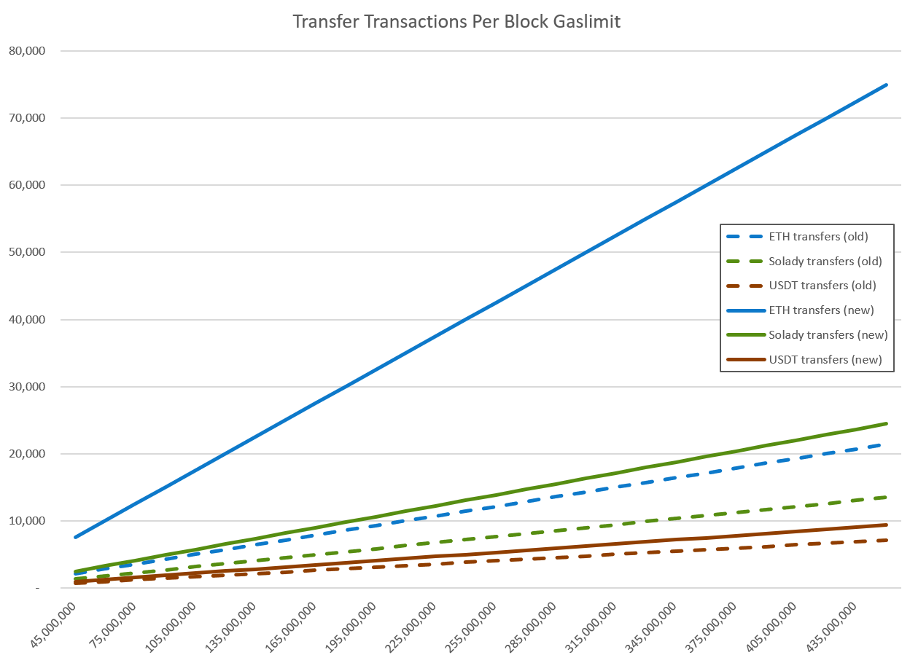

## Abstract

Reduce the intrinsic cost `TX_BASE_COST` from `21,000` to `4,500` and define a consistent gas accounting model based on actual state operations. This more granular approach makes a simple ETH transfer `7,756` due to additional costs related to the `to` account and the [EIP-7708](./eip-7708.md) transfer log.

If a non-create transaction has `value > 0` and targets a non-existent account, charge `GAS_NEW_ACCOUNT = 25,000` to align with `CALL` account creation and price in state growth. When this surcharge applies, the recipient pays exactly one cold non-code touch; no code-load cost applies.

This EIP does not change calldata or access-list metering. It also refines related gas schedule items used in derivation and execution accounting:

- Split cold-account touches into `COLD_ACCOUNT_COST_CODE = 2,600` and `COLD_ACCOUNT_COST_NOCODE = 500`.
- Introduce `STATE_UPDATE = 1,000` as the price of a single account-leaf write.
- Reprice value-moving calls as account-leaf writes, replacing `CALL_VALUE_COST = 9,000` with `CALL_VALUE_COST = 2 * STATE_UPDATE + TRANSFER_LOG_COST = 3,756`.
- Charge `TRANSFER_LOG_COST = 1,756` for the [EIP-7708](./eip-7708.md) transfer log emitted on every nonzero-value transfer to a different account.

Capacity impact (illustrative):

| Metric                      |            Result |  Change | Description                                                  |
| --------------------------- | ----------------: | ------: |------------------------------------------------------------- |
| Max (minimal txs)           | 13,333 tx / block |   +367% | 4,500-gas minimal transactions per 60 M block                |
| Max (ETH transfers)         |  7,735 tx / block |   +171% | 7,756-gas ETH transfers per 60 M block                       |
| Throughput (minimal txs)    |        ~1,111 TPS |   +367% | 4,500-gas minimal transactions per 60 M block per 12sec      |
| Throughput (ETH transfers)  |          ~645 TPS |   +171% | 7,756-gas ETH transfers per 60 M block per 12sec             |
| Equivalent gas-limit uplift |          ≈ +20.8% |       - | Effective throughput gain for avg tx usage (e.g., 60 M => ~72.5 M) |

## Motivation

**Monetary Context**

Money has three basic functions: a unit of account, a medium of exchange, and a store of value. ETH already meets the last two by design. It carries value without an issuer and settles with finality. Where it falls short is in everyday exchange - the friction of use rather than the nature of the asset.

ETH underpins most onchain liquidity. Pairs are denominated in it, and gas is paid in it - a de-facto tax base that anchors value. Bitcoin's monetary role now runs mainly through exchange pairs, hence its drift in focus to store-of-value rather than medium-of-exchange. ETH still clears real activity onchain, yet outside NFTs few people think in ETH terms. In that niche ETH already functions as both unit and medium, but only for high-value items.

For ETH to operate fully as money, it must also handle small transactions. That was impractical when gas sat at 300 gwei, or even 90 gwei on quiet weekends. Post-4844, blobs absorb L2's "pay at any price" data and higher gas limits ease congestion; cost, not capacity, is the bottleneck.

EIP-2780 lowers that fixed cost. By aligning the base gas with the real work of a transaction and by correcting `CALL` value pricing, it removes the legacy penalty on simple payments. Small transfers become viable again without subsidising calldata or storage. The same logic charges properly for new-account creation, so state growth remains priced in.

- **Unit of account:** When transfers are cheap and regular, people price in ETH because they use it directly. This proposal turns that habit into equilibrium rather than idealism.

- **Medium of exchange:** Reducing `TX_BASE_COST` eliminates the old friction that slowed native circulation. Settlement becomes frequent, not occasional.

- **Store of value:** Honest pricing reinforces confidence that ETH's cost structure is grounded in real computation, not arbitrary constants.

- **Velocity:** Lower friction raises the rate of final settlement; more frequent, smaller clears in native ETH, without altering calldata or storage economics.

- **Monetary competition:** Stablecoins and LSTs are welcome, but they compete for onchain "moneyness". Making native ETH easy to spend keeps it central; not just the fuel, but the money of the system.

**Note:** This proposal doesn't target ETH specifically, the lower base cost applies to every transaction type. However since `TX_BASE_COST` makes up nearly all of an ETH transfer's gas, while it's only a small fraction of contract calls, ETH loses the most friction and gains the most velocity.

**Specifics**

The legacy `21,000` base no longer matches the universal work path under warm/cold accounting. Decomposed into signature recovery, one account-leaf write for the sender (nonce + balance coalesced), and one cold non-code touch (sender), the universal path totals `4,500` gas.

State growth is underpriced for top-level value transfers that create accounts, while `CALL` pays explicit creation. Charging `25,000` when a transfer creates an account aligns entry points and internalizes state growth.

A lower base removes the distortion that over-incentivized batching solely to dodge `TX_BASE_COST`, without subsidizing calldata or storage. The refinement of value-transfer costs and cold-account pricing makes execution charges proportional to actual state work: account touches and leaf writes.

We intentionally do **not** charge per-byte gas for the transaction envelope (`nonce`, `gas*`, `to`, `value`, `v`, `r`, `s`). Calldata pricing applies only to `tx.data`. A plain ETH payment has empty `tx.data`, so it pays zero calldata gas. Lowering `TX_BASE_COST` to the universal work path makes ETH payments cheaper without subsidizing arbitrary calldata.

### Throughput, payload, and basefee dynamics

This EIP affects three independent levers:

1. **Gas-limit equivalence:** Reducing the base cost from `21,000` to `4,500` increases transaction capacity at a fixed block gaslimit by approximately +20.8%.

2. **Payload-size bounds:** Per [EIP-7934](./eip-7934.md) the execution payload cap is `MAX_RLP_BLOCK_SIZE = 10,485,760 - 2,097,152 = 8,388,608` bytes. Payload size, not gas, may become the dominant block-size constraint at high gaslimits.

3. **Basefee market dynamics:** Lower intrinsic gas reduces the average gas per tx, temporarily increasing utilisation and causing short-term downward adjustment in basefee. Over time, equilibrium restores as inclusion policies adapt.

These levers are independent; this proposal changes only intrinsic gas, not calldata metering or access-list pricing.

### Monetary Effects

Reducing ETH transfer cost from `21,000` => `7,756` gas increases both transaction frequency and viable payment granularity. At a fixed basefee, smaller payments become economical, raising the **velocity of money** - how often ETH changes hands on L1.

Let $g$ be gas per transaction, $b$ the basefee (in gwei), and $r$ the user's tolerated fee share of payment value.

$v_{\text{min}} = \frac{g \times b \times 10^{-9}}{r}$

Since $g$ drops from $21,000$ to $7,756$:

$\frac{v_{\text{min,new}}}{v_{\text{min,old}}} = \frac{7{,}756}{21{,}000} \approx 0.37$

The minimum economical L1 payment falls by about **63 %**, allowing more, smaller transfers to clear directly in ETH.

From the quantity relation $M V = P Q$, with $M$ and $P$ roughly constant over short periods:

$V_{\text{new}} / V_{\text{old}} \approx Q_{\text{new}} / Q_{\text{old}}$

Pure ETH-transfer capacity rises roughly **2.7x** (+171 %), and the lower $v_{\text{min}}$ further increases $Q$ as more small-value payments become viable.

Together these effects lift $V$, more frequent, smaller, native settlements without changing monetary supply.

ETH thus gains moneyness:

- **Medium of exchange:** direct use becomes routine, not exceptional.
- **Unit of account:** frequent native settlement encourages ETH-denominated pricing.
- **Store of value:** workload-based fees reinforce trust in cost realism.

Price volatility may still lead users to prefer stablecoins for predictability, but this change removes unnecessary friction, restoring ETH’s competitiveness wherever volatility is tolerable.

The `25,000` surcharge for new-account creation continues to price state growth honestly while everyday transfers become cheaper and faster.

### Equivalent gas-limit increase

Lowering `TX_BASE_COST` from `21,000` to `4,500` removes up to `16,500` gas per transaction. Using recent totals of 163 Ggas/day and 1.7 M tx/day:

| Metric                       | Calculation     | Result          | Change    |
| ---------------------------- | ---------------:| ---------------:| ---------:|
| Avg gas per tx               | 163Bn / 1.7M    | ≈ 95,882 gas    | -         |
| New avg gas per tx           | 95,882 − 16,500 | ≈ 79,382 gas    | -         |
| Throughput at fixed gaslimit | 95,882 / 79,382 | ≈ x1.208        | +20.08%   |
| Daily tx at same gas usage   | 1.7M × 1.208    | ≈ 2.053M tx/day | +340k/day |

Perfnet measurements show EL clients handle >300 MGas/s for pure ETH transfers. Expressed under a 4.5k base this corresponds to `300 * (4.5/21) ~ 64.3 MGas/s`, i.e. `~771 MGas` per 12 s slot. This indicates sufficient headroom and that the current base is significantly overcharged, so no extra engineering is required to improve performance to support this change.

Net effect equals raising a 45 M gas limit to ~54.4 M at unchanged calldata and access-list metering. This directly advances Scaling L1.

## Specification

### Parameter changes

Upon activation of this EIP, the following parameters of the gas model are updated:

| Name | Definition | Value | Description |
| :----: | :----: | :----: | :----: |
| `TX_BASE_COST` | `GAS_PRECOMPILE_ECRECOVER` + `COLD_ACCOUNT_ACCESS` + `ACCOUNT_WRITE` | 12,300 | Base cost of any transaction |
| `TRANSFER_LOG_COST` | `GAS_LOG` + 3 x `GAS_LOG_TOPIC` + 32 x `GAS_LOG_DATA_PER_BYTE` | 1,756 | Transfer log emitted for every nonzero-value transfer to a different account per [EIP-7708](./eip-7708.md) |

`COLD_ACCOUNT_ACCESS = 2,600` and `ACCOUNT_WRITE = 6,700` are updated in [EIP-8038](./eip-8038.md). The current numbers are not yet final.

### Intrinsic gas costs

A transaction’s intrinsic base cost is decomposed into the following explicit primitives:

- `tx.sender` is charged `TX_BASE_COST` in regular gas, accounting for one ECDSA recovery and the `sender`'s state access + write cost.
- `tx.to` is charged based on its type:
  - if self-transfer (`tx.sender` = `tx.to`), there are no charges;
  - if a precompile, there are no charges;
  - if `None` (contract creation transaction), charge `CREATE_ACCESS` in regular gas and `STATE_BYTES_PER_NEW_ACCOUNT x CPSB` in state gas;
  - otherwise, charge `COLD_ACCOUNT_ACCESS` in regular gas.
- `tx.value` is charged based on its value:
  - if zero, there are no charges;
  - if non-zero and self-transfer, there are no charges;
  - if non-zero and contract creation, charge `TRANSFER_LOG_COST` in regular gas;
  - otherwise, charge `TRANSFER_LOG_COST` + `ACCOUNT_WRITE` in regular gas.

`ACCOUNT_WRITE = 6,700` and `CREATE_ACCESS = 9,300`, per [EIP-8038](./eip-8038.md). These numbers are not yet final.

`STATE_BYTES_PER_NEW_ACCOUNT x CPSB` is set to `183,600`, per [EIP-8037](./eip-8037.md). This value can be updated by a fork when changing `CPSB`.

Regular gas and state gas semantics are derived from [EIP-8037](./eip-8037.md).

These charges replace the contract creation transaction charges. All other intrinsic costs (calldata, access list, and authorizations) remain unchanged.

### Transaction's top-level gas costs

During EVM execution, before any opcode is executed, the recipient account is loaded and the following gas costs are charged:

- If recipient is empty per [EIP-161](./eip-161.md) and `tx.value > 0`, charge `STATE_BYTES_PER_NEW_ACCOUNT x CPSB` in state gas;
- if recipient is an [EIP-7702](./eip-7702.md) delegated account, charge an additional `COLD_ACCOUNT_ACCESS` in regular gas;
- otherwise, there are no charges.

`STATE_BYTES_PER_NEW_ACCOUNT x CPSB` is set to `183,600`, per [EIP-8037](./eip-8037.md). This value can be updated by a fork when changing `CPSB`. Regular gas and state gas semantics are derived from [EIP-8037](./eip-8037.md).

If the transaction reverts at this point, it is still valid. In this case, `STATE_BYTES_PER_NEW_ACCOUNT x CPSB` is not charged and refilled back to the `state_gas_reservoir`, per [EIP-8037](./eip-8037.md). This is valid for both contract creation transactions and ETH transfers with value to new accounts.

### Transaction reference cases

| Case | Formula | Total Cost |
| :----: | :----: | :----: |
| ETH transfer to self | `TX_BASE_COST` | 12,300 |
| No-transfer to precompile | `TX_BASE_COST` | 12,300 |
| ETH transfer to precompile | `TX_BASE_COST` + `ACCOUNT_WRITE` + `TRANSFER_LOG_COST` | 20,756 |
| No-transfer to EOA | `TX_BASE_COST` + `COLD_ACCOUNT_ACCESS` | 14,900 |
| No-transfer to empty account | `TX_BASE_COST` + `COLD_ACCOUNT_ACCESS` | 14,900 |
| ETH Transfer to existing EOA | `TX_BASE_COST` + `COLD_ACCOUNT_ACCESS` + `ACCOUNT_WRITE` + `TRANSFER_LOG_COST` | 23,356 |
| No-transfer to contract | `TX_BASE_COST` + `COLD_ACCOUNT_ACCESS` + **execution** | 14,900 + **execution** |
| ETH Transfer to contract | `TX_BASE_COST` + `COLD_ACCOUNT_ACCESS` + `ACCOUNT_WRITE` + `TRANSFER_LOG_COST` + **execution** | 23,356 + **execution** |
| No-transfer to 7702 delegated | `TX_BASE_COST` + 2 x `COLD_ACCOUNT_ACCESS` + **execution** | 17,500 + **execution** |
| ETH Transfer to 7702 delegated | `TX_BASE_COST` + 2 x `COLD_ACCOUNT_ACCESS` + `ACCOUNT_WRITE` + `TRANSFER_LOG_COST` + **execution** | 25,956 + **execution** |
| Create transaction with `tx.value` = 0 | `TX_BASE_COST` + `CREATE_ACCESS` + `STATE_BYTES_PER_NEW_ACCOUNT x CPSB` | 205,200 |
| Create transaction with `tx.value` > 0 | `TX_BASE_COST` + `CREATE_ACCESS` + `STATE_BYTES_PER_NEW_ACCOUNT x CPSB` + `TRANSFER_LOG_COST` | 206,956 |
| ETH Transfer creating new account | `TX_BASE_COST` + `COLD_ACCOUNT_ACCESS` + `ACCOUNT_WRITE` + `STATE_BYTES_PER_NEW_ACCOUNT x CPSB` + `TRANSFER_LOG_COST` | 206,956 |

### Edits and interactions with other EIPs

- **[EIP-2930](./eip-2930.md) (Access List).** Access lists keep their existing per-entry charges and warming semantics.
- **Calldata-pricing EIPs (e.g. [EIP-7623](./eip-7623.md)).** Unchanged. This EIP does not alter calldata pricing.
- **[EIP-7702](./eip-7702.md) (Set EOA Code).** `TX_BASE_COST` remains `12,300` even if the sender temporarily assumes code for the transaction. Clients must not perform any disk code-load to determine sender type, since 7702 provides code inline. If the transaction executes code that reads or executes its own code, normal `COLD_ACCOUNT_ACCESS` or `WARM_ACCESS` costs apply at execution time as per the standard cold/warm model. When `tx.to` is a 7702-delegated account, it is charged `COLD_ACCOUNT_ACCESS` at the intrinsic level. Resolving the delegation requires loading code from the delegation target, which incurs its own `COLD_ACCOUNT_ACCESS` if the target is cold, or `WARM_ACCESS` if already warm. This also applies to calls made to delegated accounts.
- **[EIP-7708](./eip-7708.md) (ETH transfers emit a log).** EIP-7708 emits a LOG3-shaped transfer event on every non-zero-value ETH transfer to a different account, and a LOG2-shaped burn event when ETH leaves circulation. Under the legacy `21,000` intrinsic base, the LOG3 cost of a transfer event was implicitly absorbed; with `TX_BASE_COST` reduced to `12,300`, that subsidy disappears, and each emission must be priced explicitly. This EIP charges `TRANSFER_LOG_COST = 1,756` (LOG3 equivalent: `375 + 3×375 + 32×8`) at intrinsic gas computation for top-level value-transferring transactions.
- **[EIP-7928](./eip-7928.md) (Block-Level Access Lists).** The intrinsic costs already account for accessing the sender and recipient accounts. Therefore, these accounts should be included in the BAL even in cases where the transaction reverts.

## Rationale

Price only what every transaction always does: ECDSA recovery, warming `sender` and `to`, and one account-leaf write for the sender (nonce + balance change). That sums to `4,500` gas. Anything not universal should be metered separately.

Calldata remains metered per byte. No calldata allowance is folded into the base. This reinforces ETH as money and payments: a plain ETH transfer carries no calldata, executes no bytecode, and touches no contract storage slots. It adds exactly one recipient touch (when not a smart contract), one recipient leaf write, and one [EIP-7708](./eip-7708.md) transfer log, so its total is `7,756`.

The `GAS_NEW_ACCOUNT` surcharge does not apply to `CREATE`/`CREATE2`: the `GAS_CREATE = 32,000` opcode base already prices account creation, and top-level `CREATE` transactions are not charged `GAS_CREATE` at all. Top-level `CREATE` transactions with `value > 0` do pay `TRANSFER_LOG_COST` for the [EIP-7708](./eip-7708.md) transfer log. Access-list pricing is unchanged.

Legacy pricing undercharged top-level ETH transfers that created new accounts relative to internal `CALL`-based creations. This EIP corrects that by charging `GAS_NEW_ACCOUNT = 25,000`, identical to the `CALL` account-creation surcharge, ensuring consistent pricing for state growth regardless of entry path.

This removes cross-subsidies, aligns charges with resources, and keeps costs equal across paths that perform the same state growth.

Do not fold any calldata allowance into the base. The envelope RLP (`nonce`, `gas*`, `to`, `value`, `v`, `r`, `s`) is not charged as calldata and remains unmetered per byte. Only `tx.data` bytes are metered at the existing calldata schedule, and access lists keep their per-entry costs. A vanilla ETH transfer executes no bytecode and touches no contract storage slots; it performs signature recovery, warms the sender, and updates sender and recipient accounts. It therefore receives the base discount and pays only the additional recipient costs.

Bundling multiple transfers into a single contract call avoids repeated `TX_BASE_COST`, but those transfers then execute serially inside one EVM context. That blocks parallel execution. With a lower per-tx base cost, users have less incentive to bundle, so more transfers remain independent transactions. Independent transactions can be scheduled across threads, which improves parallelism at the client and execution-layer level.

Thus, reducing `TX_BASE_COST` not only corrects mispricing but also increases the share of transactions that are naturally parallelizable.

This EIP composes cleanly with calldata-pricing proposals such as [EIP-7623](./eip-7623.md) and [EIP-7976](./eip-7976.md). Those EIPs affect `tx.data` metering, while this EIP adjusts only transaction-level intrinsic accounting. There is no overlapping scope.

### Why not charge full tx data as calldata?

- **Intrinsic coupling to signed fields.** Pricing full-transaction bytes would make intrinsic gas depend on `gas_limit` and variable-length signature elements, creating fixed-point estimation issues and incentives for signature-length selection as well as iteration instability as `gas_limit` depends on signature which contains `gas_limit`.

- **Serialization neutrality.** A fee rule keyed to RLP size couples costs to one encoding and weakens [EIP-2718](./eip-2718.md) type neutrality and future formats such as SSZ. Calldata is treated as opaque bytes so it avoids this coupling.

- **Policy targeting and market floor.** Calldata floors (for example [EIP-7623](./eip-7623.md) or [EIP-7976](./eip-7976.md)) price bytes in `tx.data` to bound EL payload and steer data to blobs; envelope bytes are control-plane. The `TX_BASE_COST` is the smallest tx size, and having a low encoding-agnostic intrinsic base keeps the minimum inclusion price coupled to the basefee market, without opening a DoS vector.

- **Native settlement and unit-of-account.** Even though all transactions receive the same absolute gas reduction, it proportionally improves pristine ETH transfers more. With an ETH transfer at ~7,756 gas vs a permissioned ERC-20/LST/stablecoin transfer at ~48,000 gas, you get ~6x higher payment throughput per unit gas, which reinforces ETH as the settlement asset and reduces reliance on contract-based money (which carries smart contract risk, operator risk, governance risk and censorship risks via smart contract operator).

### Effects on transactions per block

For execution-payload size, use [EIP-7934](./eip-7934.md)’s 8 MiB uncompressed cap: `8,388,608 bytes`. A typical EIP-1559 ETH transfer encodes at roughly `~110 bytes`, yielding a size cap of `floor(8,388,608 / 110) = 76,260 tx` per block when size, not gas, is the binding constraint.

There are two useful ceilings to consider:

- Minimal transaction with no value and no execution: `TX_BASE_COST = 4,500` gas.
- Minimal ETH payment to an existing EOA: `7,756` gas (`TX_BASE_COST + COLD_ACCOUNT_COST_NOCODE + STATE_UPDATE + TRANSFER_LOG_COST`).

Counts below are `floor(gaslimit / per-tx-gas)`, then capped by `76,260` when the 8 MiB size limit binds. TPS figures round to the nearest integer.

#### Scenario A: minimal txs at 4,500 gas

Binding point for size-cap dominance: `76,260 * 4,500 = 343,170,000` gas. At gaslimits above ~343.17 M, block size, not gas, limits the tx count for 4,500-gas transactions.

| Block gaslimit | Old tx/bk (21k) | New tx/bk (4.5k) | TPS @ 12s | TPS @ 6s | TPS @ 3s | TPS @ 1.5s |
| -------------: | --------------: | ---------------: | --------: | -------: | -------: | ---------: |
|           45 M |           2,142 |           10,000 |       833 |    1,667 |    3,333 |      6,667 |
|           60 M |           2,857 |           13,333 |     1,111 |    2,222 |    4,444 |      8,889 |
|          100 M |           4,761 |           22,222 |     1,852 |    3,704 |    7,407 |     14,815 |
|          200 M |           9,523 |           44,444 |     3,704 |    7,407 |   14,815 |     29,629 |
|          450 M |          21,428 |          †76,260 |     6,355 |   12,710 |   25,420 |     50,840 |

  † Size cap binds at 450 M because 450 M > 343.17 M.

#### Scenario B: ETH transfers at 7,756 gas

Binding point for size-cap dominance: `76,260 * 7,756 = 591,472,560` gas. At gaslimits below ~591.47 M, gas limits tx count; above it, the 8 MiB size cap dominates.

| Block gaslimit | Old tx/bk (21k) | New tx/bk (7,756) | TPS @ 12s | TPS @ 6s | TPS @ 3s | TPS @ 1.5s |
| -------------: | --------------: | ----------------: | --------: | -------: | -------: | ---------: |
|           45 M |           2,142 |             5,801 |       483 |      967 |    1,934 |      3,867 |
|           60 M |           2,857 |             7,735 |       644 |    1,289 |    2,578 |      5,157 |
|          100 M |           4,761 |            12,893 |     1,074 |    2,149 |    4,298 |      8,595 |
|          200 M |           9,523 |            25,786 |     2,149 |    4,298 |    8,595 |     17,191 |
|          450 M |          21,428 |            58,019 |     4,835 |    9,670 |   19,340 |     38,680 |

#### Changes for common types of txs

| Transaction Type                   | Old Cost | New Cost | Change |
| ---------------------------------- | -------: | -------: | -----: |
| Simple ETH transfer (existing EOA) |   21,000 |    7,756 |  −63 % |
| ETH transfer creating new EOA      |   21,000 |   31,756 |  +51 % |
| ERC-20 transfer (typical)          |   63,200 |   48,200 |  −24 % |
| ERC-20 transfer (Solady)           |   33,400 |   18,400 |  −45 % |
| Uniswap v3 swap                    |  184,500 |  169,500 |   −8 % |
| Uniswap v3 add-liquidity           |  216,900 |  201,900 |   −7 % |

#### Reference MGas/s for gaslimit vs slot time

| Block gaslimit | MGas/s @ 12s | MGas/s @ 6s | MGas/s @ 3s | MGas/s @ 1.5s |
| -------------: | -----------: | ----------: | ----------: | ------------: |
|           45 M |         3.75 |        7.50 |       15.00 |         30.00 |
|           60 M |         5.00 |       10.00 |       20.00 |         40.00 |
|          100 M |         8.33 |       16.67 |       33.33 |         66.67 |
|          200 M |        16.67 |       33.33 |       66.67 |        133.33 |
|          450 M |        37.50 |       75.00 |      150.00 |        300.00 |

## Backwards Compatibility

This EIP is **not** backward compatible. It is a consensus gas repricing that must be activated at `FORK_BLOCK`.

Wallets, RPCs, gas estimators, and any logic that assumes a `21,000` base must update.

## Test Cases

While the benefits of reducing transactions' intrinsic cost are apparent, such a change should be applied if it imposes no negative externalities, or if such effects are negligible.

Tests should be created with blocks of just ETH transfers and tested on Perfnet across all EL clients to ensure the pricing is correct.

Add explicit test vectors (intrinsic gas only):

1. `value > 0` to an empty EOA (non-existent per EIP-161): intrinsic `31,756` (4,500 base + 500 + 25,000 surcharge + 1,756 transfer log).
2. `value > 0` to a precompile: intrinsic `6,256` (4,500 base + 1,756 transfer log; no surcharge; precompiles are warm at tx start).
3. `value = 0` to an empty address: intrinsic `4,500` (no creation, no surcharge).
4. `CREATE` transaction: unchanged from prior rules.
5. EIP-7702 transaction with and without access list: intrinsic uses `TX_BASE_COST` plus unchanged access-list costs.
6. Block of txs calling minimal gas contract execution with maximal contract size addresses (so VM is activated for every tx).
7. Warmth and access list interplay
    - ETH transfer to existing EOA without access list: charge `COLD_ACCOUNT_COST_NOCODE = 500` for recipient lookup.
    - Same transaction with recipient in access list: charge `WARM_STATE_READ = 100`.
8. 7702 interactions
    - 7702 tx where sender assumes code and calls nothing: intrinsic = 4,500, no extra cold-code cost.
    - 7702 tx where sender assumes code and executes self-code: charge `COLD_ACCOUNT_COST_CODE` when first loaded.
9. Precompile transfers
    - `value > 0` to `0x01`–`0x09`: intrinsic = 6,256 (4,500 base + 1,756 transfer log), no surcharge.
10. Self-transfer `from == to`: total = 4,500.
11. Internal CALL repricing
    - Internal `CALL` to existing EOA with value: `CALL_VALUE_COST = 3,756` plus cold/warm costs.
    - Internal `CALL` to EIP-161-empty: `CALL_VALUE_COST = 27,756`.
12. Zero-value edge cases `value = 0` to empty address: intrinsic = `4,500`.
13. Perfnet stress
    - Fill block with minimal 4,500-gas tx and 7,756-gas ETH transfers; confirm gas vs byte-size binding per [EIP-7934](./eip-7934.md).
14. SELFDESTRUCT test: Create-and-destroy in one tx; confirm normal value-transfer costs apply, no deletion repricing.

## Security Considerations

As this significantly increases the max tx per block, this carries risk.

However, this pricing should be the same as performing the component changes inside the transaction; and it factors in the additional costs from state growth which were not originally in the transaction base price.

Current gaslimit testing mostly uses a block with a single transaction; so this should not cause unexpected load compared to what is already being tested.

The semantics of `SELFDESTRUCT` remain unchanged. Following [EIP-6780](./eip-6780.md), only contracts created within the same transaction may be fully deleted. This EIP does not reprice or modify any `SELFDESTRUCT` side-effects.

## Copyright

Copyright and related rights waived via [CC0](../LICENSE.md).
