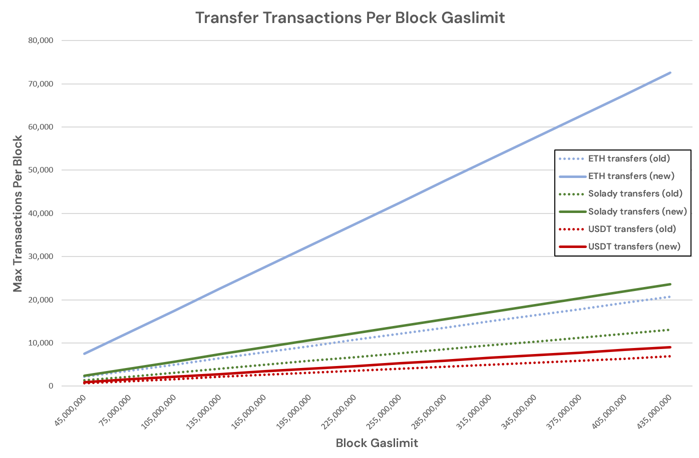

## Abstract

Reduce the intrinsic cost `TX_BASE_COST` from `21,000` to `6,000`.

If a non-create transaction has `value > 0` and targets a **non-existent** account add `GAS_NEW_ACCOUNT = 25,000` to align with `CALL` account creation and price in state growth.

This additional `GAS_NEW_ACCOUNT` cost is not applied in the case of a `CREATE` transaction as it is already applied in its cost structure.

Calldata and access-list metering are unchanged. This is a focused change targeted at the initial stage of processing a transaction and returning the gas overpricing to do more useful work.

Capacity Impact:

* **Average:** +18.5% more transactions per block.
* **Max:** +250% more minimal transactions (i.e. pure ETH transfers).
* **"Equivalent" gaslimit:** +18.5% effectual gaslimit increase (e.g. 45 M => 53.3 M); though nominally would remain the same.

## Motivation

The current `21,000` intrinsic gas is a legacy constant. It no longer matches the work all transactions must perform under warm/cold accounting. When decomposed into signature recovery, warming `sender` and `to`, and two warm writes for nonce and balance, the common path totals `6,000` gas.

Top-level value transfers that create new accounts do not pay an explicit new-account surcharge today, while `CALL` does. This underprices state growth. Charging `GAS_NEW_ACCOUNT = 25,000` on value transfers that create an account aligns entry points and internalizes state growth.

A high fixed base penalizes small ETH payments and encourages batching to dodge the base rather than for real efficiency. Lowering the base removes that distortion while leaving calldata and storage prices unchanged.

The result is cheaper ETH transfers without subsidies: state growth costs the same whether reached by `CALL` or by a top-level transfer. Access-list and 1559 mechanics are unchanged.

We intentionally do **not** charge per-byte gas for the transaction envelope (`nonce`, `gas*`, `to`, `value`, `v`,`r`,`s`). Calldata pricing applies only to `tx.data`. A plain ETH payment has empty tx.data, so it pays zero calldata gas. Lowering `TX_BASE_COST` to the universal work path makes ETH payments cheaper without subsidizing arbitrary calldata.

### Equivalent gas-limit increase

Lowering `TX_BASE_COST` from `21,000` to `6,000` removes `15,000` gas per transaction. Using recent totals of 163 Ggas/day and 1.7 M tx/day:

* Avg gas/tx: `163Bn / 1.7M ≈ 95,882 gas`.
* New avg: `95,882 − 15,000 ≈ 80,882 gas`.
* Throughput at fixed gaslimit: `95,882 / 80,882 ≈ 1.185` (+18.5%).
* Daily tx at same gas: `1.7M × 1.185 ≈ 2.015M` (+315k/day).

Perfnet ETH transfer tests show EL clients handle `>300 MGas/s` for pure ETH transfers today; expressed under a 6k base this is `300 × (6/21) ≈ 85.7 MGas/s`, i.e., `≈1,029 MGas` per 12 s slot.

This indicates the protocol-level processing headroom already exists; and that this portion of the tx is significantly overcharged, so isn't extra engineering required to improve preformance to support this change.

Net effect equals raising a 45 M gas limit to `≈53.3 M` at unchanged calldata and access-list metering. This directly advances Scaling L1.

## Specification

After `FORK_BLOCK`, set the following parameters and rules.

### Parameters

| Name              | Value  | Description                                                               |
| ----------------- | ------ | ------------------------------------------------------------------------- |
| `TX_BASE_COST`    | 6,000  | Base cost of any transaction                                              |
| `GAS_NEW_ACCOUNT` | 25,000 | Surcharge when a **value-transferring** transaction creates a new account |

### New-account surcharge

Apply `GAS_NEW_ACCOUNT` when **all** are true:

1. The transaction is not a `CREATE` transaction.
2. `value > 0`.
3. `to` is not a precompile.
4. `to` is **non-existent** per [EIP-161](./eip-161.md) emptiness at the start of transaction execution.

If these conditions hold the transfer results in account creation and `GAS_NEW_ACCOUNT` is added. This normalizes account-creation cost via EVM `CALL` or top-level transfer and addresses state growth concerns. For reference, this changes such transfers from `21,000` to `31,000` (+10,000 over current).

Notes:

* If `value = 0` and `to` is empty per EIP-161, no account is created and no surcharge applies.
* `CREATE` transactions are unchanged; their cost already includes account creation.

### Intrinsic gas computation

Clients must compute intrinsic gas exactly as today for each typed transaction **except**:

* Replace any hardcoded `21,000` with `TX_BASE_COST = 6,000`.
* Add `GAS_NEW_ACCOUNT` when the *New-account surcharge* conditions hold.

Pseudocode (normative):

```text
function CalculateIntrinsicGas(tx, state_at_start):
    gasCost = TX_BASE_COST

    // Existing rules for calldata and access lists remain unchanged by this EIP.
    gasCost += GasForCalldata(tx.data)                  // per active calldata pricing EIPs
    if tx.has_access_list():
        gasCost += GasForAccessList(tx.access_list)     // per EIP-2930

    if tx.is_create() == false
       and tx.value > 0
       and is_precompile(tx.to) == false
       and is_nonexistent_per_eip161(state_at_start, tx.to):
        gasCost += GAS_NEW_ACCOUNT

    return gasCost
```

### Code change example

In `transactions.py`:

```diff
-TX_BASE_COST = Uint(21000)
+TX_BASE_COST = Uint(6000)
```

Typed transactions defined in EIP-1559/EIP-2930 (and EIP-7702 where applicable) that reference the `21,000` base now inherit `TX_BASE_COST = 6,000`.

### Edits and interactions with other EIPs

* **EIP-2930 (Access List Transactions).** Replace references to a fixed `21,000` intrinsic gas with `TX_BASE_COST`. The intrinsic-gas formula remains otherwise unchanged.
* **EIP-7702 (Set EOA Code).** Where 7702 inherits intrinsic cost from EIP-2930, that value is `TX_BASE_COST` after `FORK_BLOCK`. No other changes.
* **EIP-7623 (Calldata cost changes).** This EIP does not modify calldata pricing. If EIP-7623 (or other calldata-pricing EIPs) is active, `GasForCalldata` uses those rules unchanged.

### Derivation (non-normative)

Sender is recovered from signature, so is ecrecover cost. Sender and `to` match **access-list pricing for touches**; these are **proxies for work**, not additional charges at the top level:

```
ECRECOVER_COST = 3,000
WARM_ACCOUNT_ACCESS_COST = 100
TX_OVERHEAD_COST = 2,800
GAS_NEW_ACCOUNT = 25,000
```

`TX_OVERHEAD_COST` bundles fixed per-transaction work that is not separately metered by EVM opcodes: envelope RLP decode and basic validity checks (nonce, gas, chain ID), fee accounting, two warm account updates to `sender.nonce` and `sender.balance`, and minimal trie/header reads and writes for `sender` and `to`. It also includes a conservative margin to cover implementation overhead across EL clients.

```
TX_BASE_COST =
    ECRECOVER_COST
    + 2 * WARM_ACCOUNT_ACCESS_COST
    + TX_OVERHEAD_COST
    = 6,000
```

## Rationale

Price only what every transaction always does: ECDSA recovery, warming `sender` and `to`, and two warm writes. That sums to `6,000` gas. Anything not universal should be metered separately.

Calldata remains metered per byte. No calldata allowance is folded into the base. This reinforces ETH as money and payments: a plain ETH transfer carries no calldata, executes no bytecode, and touches no contract storage slots. It only updates warm account nonce and balance, so it receives the discount.

When a value transfer creates a previously empty account, charge `GAS_NEW_ACCOUNT = 25,000`, identical to `CALL` account-creation pricing. `CREATE` is unchanged because its cost already includes account creation. Access-list pricing is unchanged.

This removes cross-subsidies, aligns charges with resources, and keeps costs equal across paths that perform the same state growth.

Do not fold any calldata allowance into the base. The envelope RLP (`nonce`, `gas*`, `to`, `value`, `v`,`r`,`s`) is not charged as calldata and remains unmetered per byte. Only `tx.data` bytes are metered at the existing calldata schedule, and access lists keep their per-entry costs. A vanilla ETH transfer executes no bytecode and touches no contract storage slots; it performs signature recovery, warms sender and to, and does two warm writes (nonce, balance). It therefore receives the base discount and zero calldata gas.

Bundling multiple transfers into a single contract call avoids repeated `TX_BASE_COST`, but those transfers then execute serially inside one EVM context. That blocks parallel execution. With a lower per-tx base cost, users have less incentive to bundle, so more transfers remain independent transactions. Independent transactions can be scheduled across threads, which improves parallelism at the client and execution-layer level.

Thus, reducing `TX_BASE_COST` not only corrects mispricing but also increases the share of transactions that are naturally parallelizable.

### Why not charge full tx data as calldata?

* **Intrinsic coupling to signed fields.** Pricing full-transaction bytes would make intrinsic gas depend on `gas_limit` and variable-length signature elements (`yParity`,`r`,`s` under RLP’s no-leading-zero rule), creating fixed-point estimation and incentives for signature-length selection as well as iteration unstablity as `gas_limit` depends on signiture which contains `gas_limit`.

* **Serialization neutrality.** A fee rule keyed to RLP size couples costs to one encoding and weakens EIP-2718 type neutrality and future formats such as SSZ. Call data is  treated as opaque bytes so doesn't have this encoding coupling.

* **Policy targeting and market floor.** Calldata floors ([EIP-7623](./eip-7623.md)/[EIP-7976](./eip-7976.md)) price bytes in `tx.data` to bound EL payload and steer data to blobs; envelope bytes are control-plane. The `TX_BASE_COST` is the smallest tx size, and having a low encoding-agnostic intrinsic base keeps the minimum inclusion price strongly coupled to the basefee market. While also not under pricing to open a DoS vector.

* **Native settlement and unit-of-account** Even though all transactions receive the same absolute gas reduction, it propritionatly improves pristine ETH transfers more. With an ETH transfer at ~6,000 gas versus a permissioned ERC-20/LST/stable coin transfer at ~48,000 gas yields an 8 x higher payment throughput per unit gas, which reinforces ETH as the settlement asset with greater money velocity potential and reduces reliance on contract-based money (which carries smart contract risk, operator risk, governance risk and censorship risks via operator).



## Backwards Compatibility

This EIP is **not** backward compatible. It is a consensus gas repricing that must be activated at `FORK_BLOCK`.

Wallets, RPCs, gas estimators, and any logic that assumes a `21,000` base must update.

### Effects on transactions per block

Median ETH transfer is 110 bytes of data, so at [EIP-7934](./eip-7934.md)'s 8MiB uncompressed execution block cap creating an effective max tx count by size of: `8,388,608 / 110 ≈ 76,260 tx`

This leads to upper limits on gaslimit for raw tx count. Although more complex smart contracts can make use of a higher block gaslimit. However the market dynamics become more complicated when approaching the block cap and there will be distortions in gas pricing; when other approaches would need to be considered

e.g. 

* Raising network max block size (currently 10MiB both in EL devp2p and CL specs)
* [EIP-7782](./eip-7782.md): Reduce Block Latency
* [EIP-7999](./eip-7999.md): Unified Multidimensional Fee Market

Below TPS are additionally given for [EIP-7782](./eip-7782.md) at 6sec and 3sec blocks; as it is an easily considered effect.

#### Transaction base fee 6000

Binding point for TX_BASE_COST = 6000: 76,260 × 6,000 = 457,560,000 gas. Above ~457.6 M gas, the 8 MiB size cap dominates.

| Block gaslimit | Old tx/bk (21k) | TPS @ 12s | New tx/bk (6k) | TPS @ 12s | TPS @ 6s | TPS @ 3s | TPS @ 1.5s |
| -------------: | --------------: | --------: | -------------: | --------: | -------: | -------: | ---------: |
|            45M |           2,143 |       179 |          7,500 |       625 |    1,250 |    2,500 |      5,000 |
|            60M |           2,857 |       238 |         10,000 |       833 |    1,667 |    3,333 |      6,667 |
|           100M |           4,762 |       397 |         16,667 |     1,389 |    2,778 |    5,556 |     11,111 |
|           200M |           9,524 |       794 |         33,333 |     2,778 |    5,556 |   11,111 |     22,222 |
|           450M |          21,429 |     1,786 |         75,000 |     6,250 |   12,500 |   25,000 |     50,000 |

* Simple ETH transfer tx to an existing EOA: intrinsic drops from `21,000` to `6,000`. (−71%)
* ETH transfer tx that creates a new EOA: intrinsic becomes `6,000 + 25,000` = `31,000`. (+48%)
* Simple ERC-20 token transfer tx (e.g., USDT) drops from `63,200` to `48,200`. (−24%)
* Solady ERC-20 token transfer tx drops from `33,400` to `18,400`. (-45%)
* Average Uniswap v3 Swap tx drops from `184,523` to `169,523`. (−8%)
* Average Uniswap v3 Add Liquidity tx drops from `216,912` to `201912`. (−7%)

#### Reference MGas/s for gaslimit / slot time

| Block gaslimit | MGas/s @ 12s | MGas/s @ 6s | MGas/s @ 3s | MGas/s @ 1.5s |
| -------------: | -----------: | ----------: | ----------: | ------------: |
|            45M |         3.75 |        7.50 |       15.00 |         30.00 |
|            60M |         5.00 |       10.00 |       20.00 |         40.00 |
|           100M |         8.33 |       16.67 |       33.33 |         66.67 |
|           200M |        16.67 |       33.33 |       66.67 |        133.33 |
|           450M |        37.50 |       75.00 |      150.00 |        300.00 |

## Test Cases

While the benefits of reducing transactions' intrinsic cost are apparent, such a change should be applied if it imposes no negative externalities, or if such effects are negligible.

Tests should be created with blocks of just ETH transfers and tested on Perfnet across all EL clients to ensure the pricing is correct.

Add explicit test vectors:

1. `value > 0` to an empty EOA (non-existent per EIP-161): intrinsic `31,000`.
2. `value > 0` to a precompile: intrinsic `6,000` (no surcharge).
3. `value = 0` to an empty address: intrinsic `6,000` (no creation, no surcharge).
4. `CREATE` transaction: unchanged from prior rules.
5. EIP-7702 transaction with and without access list: intrinsic uses `TX_BASE_COST` plus unchanged access-list costs.
6. Block of txs calling minimal gas contract execution with maximal contract size addresses (so VM is activated for every tx)

## Security Considerations

As this significantly increases the max tx per block this carries risk.

However this pricing should be the same as performing the component changes inside the transaction; and it factors in the additional costs from state growth which were not originally in the transaction base price.

Current gaslimit testing mostly uses a block with a single transaction; so this should not cause unexpected load compared to what is already being tested.

## Copyright

Copyright and related rights waived via [CC0](../LICENSE.md).
