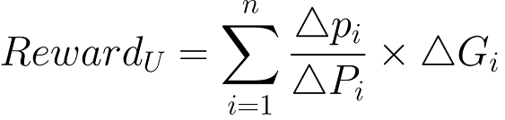

## Simple Summary
ERC2917 is a new standardization for on-chain calculation of staking reward.

## Abstract
Based on the product of effective collateral and time, ERC2917 calculates the reward a user can get at any time, and realize the real decentralized DeFi. Here below is the formula for the calculation of reward for a user U:



where ∆p<sub>i</sub> denotes individual productivity of the user U between the consecutive block numbers t<sub>i-1</sub>  and t<sub>i</sub>, ∆P<sub>i</sub> denotes global productivity between the consecutive block numbers t<sub>i-1</sub>  and t<sub>i</sub>, and ∆G<sub>i</sub> denotes gross product between the consecutive block numbers t<sub>i-1</sub>  and t<sub>i</sub>. The formula ensures that there is no benefit in case of exiting earlier or entering later in the computation. The reward a user can get for a period is based on his total productivity during that specific time. The formula has been simplified through Solidity and generalized design to make it available across all DeFi products. 
We note that the smart contract can be triggered for every computation of on the following events: 	
- whenever the productivity of a user changes (increase/decrease), 
- whenever a user withdraws.

## Motivation

One of the main drawbacks of many DeFi projects is the reward distribution mechanism within the smart contract. In fact, there are two main mechanisms are adopted so far.
1.	Distribution of rewards is only given when all users exit the contract
2.	The project collects on-chain data, conducts calculation off-chain, and sends the results
to the chain before starting rewards distribution accordingly

The first approach conducts all calculation in an on-chain fashion, the cycle of its rewards distribution is too long. Furthermore, users need to remove their collateral before getting the rewards, which can be harmful for their rewards. The second approach is a semi-decentralized model since the main algorithm involves an off-chain computation. Therefore, the fairness and transparency properties cannot be reflected and this can even create the investment barrier for users.

Since there is more DeFi projects coming out everyday, users could not find a proper way  to get to know:
1) amount of interests he/she would get
2) how the interest calculated
3) what is his/her contribution compare to the overall

By standardizing ERC2917, it abstracts the interface for interests generation process. Making wallet applications easier to collect each DeFi's metrics, user friendlier.

## Specification

Every ERC-2917 compliant contract must implement the ERC2917 and ERC20 interfaces (if necessary):

```solidity
interface IERC2917 is IERC20 {

    /// @dev This emit when interests amount per block is changed by the owner of the contract.
    /// It emits with the old interests amount and the new interests amount.
    event InterestRatePerBlockChanged (uint oldValue, uint newValue);

    /// @dev This emit when a users' productivity has changed
    /// It emits with the user's address and the the value after the change.
    event ProductivityIncreased (address indexed user, uint value);

    /// @dev This emit when a users' productivity has changed
    /// It emits with the user's address and the the value after the change.
    event ProductivityDecreased (address indexed user, uint value);

    
    /// @dev Return the current contract's interests rate per block.
    /// @return The amount of interests currently producing per each block.
    function interestsPerBlock() external view returns (uint);

    /// @notice Change the current contract's interests rate.
    /// @dev Note the best practice will be restrict the gross product provider's contract address to call this.
    /// @return The true/false to notice that the value has successfully changed or not, when it succeed, it will emite the InterestRatePerBlockChanged event.
    function changeInterestRatePerBlock(uint value) external returns (bool);

    /// @notice It will get the productivity of given user.
    /// @dev it will return 0 if user has no productivity proved in the contract.
    /// @return user's productivity and overall productivity.
    function getProductivity(address user) external view returns (uint, uint);

    /// @notice increase a user's productivity.
    /// @dev Note the best practice will be restrict the callee to prove of productivity's contract address.
    /// @return true to confirm that the productivity added success.
    function increaseProductivity(address user, uint value) external returns (bool);

    /// @notice decrease a user's productivity.
    /// @dev Note the best practice will be restrict the callee to prove of productivity's contract address.
    /// @return true to confirm that the productivity removed success.
    function decreaseProductivity(address user, uint value) external returns (bool);

    /// @notice take() will return the interests that callee will get at current block height.
    /// @dev it will always calculated by block.number, so it will change when block height changes.
    /// @return amount of the interests that user are able to mint() at current block height.
    function take() external view returns (uint);

    /// @notice similar to take(), but with the block height joined to calculate return.
    /// @dev for instance, it returns (_amount, _block), which means at block height _block, the callee has accumulated _amount of interests.
    /// @return amount of interests and the block height.
    function takeWithBlock() external view returns (uint, uint);

    /// @notice mint the available interests to callee.
    /// @dev once it mint, the amount of interests will transfer to callee's address.
    /// @return the amount of interests minted.
    function mint() external returns (uint);
}
```

### InterestRatePerBlockChanged

This emit when interests amount per block is changed by the owner of the contract. It emits with the old interests amount and the new interests amount.
 

### ProductivityIncreased

It emits with the user's address and the the value after the change.
 

### ProductivityDecreased

It emits with the user's address and the the value after the change. 

### interestsPerBlock

It returns the amount of interests currently producing per each block.
 
### changeInterestRatePerBlock

Note the best practice will be restrict the gross product provider's contract address to call this.

The true/false to notice that the value has successfully changed or not, when it succeed, it will emite the InterestRatePerBlockChanged event.
 
### getProductivity

It returns user's productivity and overall productivity. It returns 0 if user has no productivity proved in the contract. 

### increaseProductivity

It increases a user's productivity.

### decreaseProductivity

It decreases a user's productivity.

### take

It returns the interests that callee will get at current block height.

###  takeWithBlock

Similar to take(), but with the block height joined to calculate return.

For instance, it returns (_amount, _block), which means at block height _block, the callee has accumulated _amount of interests.

It returns amount of interests and the block height.

### mint
it mints the amount of interests will transfer to callee's address. It returns the amount of interests minted.

## Rationale
TBD

## Implementation
The implementation code is on the github:

- [ERC2917 Demo](https://github.com/gnufoo/ERC3000-Proposal)

## Security Considerations
TBD

## Copyright
Copyright and related rights waived via [CC0](https://creativecommons.org/publicdomain/zero/1.0/).
