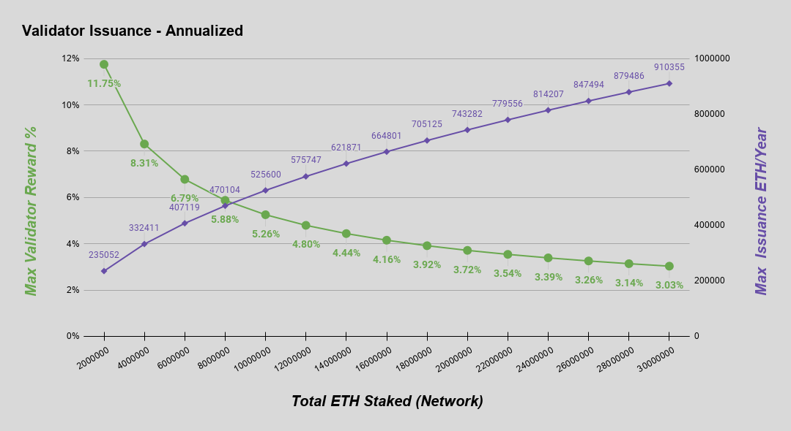

## Abstract

This EIP specifies Phase 0 of Serenity (eth2), a multi-phased upgrade to the consensus mechanism for Ethereum mainnet. In Phase 0, the existing PoW chain and mechanics are entirely unaffected, while a PoS chain -- the beacon chain -- is built in parallel to serve as the core of the upgraded consensus. In subsequent phases, the beacon chain is enhanced to support and secure the consensus of a number of parallel shard chains, ultimately incorporating current Ethereum mainnet as one of those shards.

At the core of the beacon chain is a proof of stake consensus mechanism called Casper the Friendly Finality Gadget (FFG) and a fork-choice rule called Latest Message Driven Greedy Heaviest Observed Sub-Tree (LMD-GHOST). Phase 0 is centered primarily around the mechanics and incentives of validators executing these algorithms. The detailed specifications for eth2 are contained in an independent repository from this EIP, and safety and liveness proofs can be found in the [Combining GHOST and Casper](../assets/eip-2982/arxiv-2003.03052-Combining-GHOST-and-Casper.pdf) paper. To avoid duplication, this EIP just references relevant spec files and releases.

Early phases of eth2 are executed without any breaking consensus changes on current Ethereum mainnet. This EIP serves to document the bootstrapping of this consensus mechanism and note the path for eth2 to supplant Ethereum's current proof-of-work (PoW) consensus.

## Motivation

Eth2 aims to fulfill the original vision of Ethereum to support an efficient, global-scale, general-purpose transactional platform while retaining high cryptoeconomic security and decentralization.

Today, Ethereum blocks are consistently full due to increasingly high demand for decentralized applications. Ever since the first serious spikes in adoption in 2017 (cryptokitties), the Ethereum community has consistently and vocally demanded scaling solutions.

Since day 0 of Ethereum, the investigation and expectation in scaling solutions has been two-pronged -- scale from both Layer 1 upgrades and Layer 2 adoption. This EIP represents the start to a multi-phased rollout of the former.

### Scaling through sharding

As the Ethereum network and the applications built upon it have seen increasing usage over the past 5 years, blocks have become regularly full and the gas price market continues to climb. Simple increases to the block gas-limit of the current Ethereum chain are unable to account for the increase in demand of the system without inducing an unsustainably high resource burden (in the form of bandwidth, computational, and disk resources) on consumer nodes. To retain decentralization while scaling up the Ethereum network, another path must be taken.

To provide more scale to Ethereum, while not inducing a restrictively high burden on both consumer and consensus nodes, eth2 introduces a "sharded" solution in which a number of blockchain shards -- each of similar capacity to Ethereum mainnet today -- run in parallel under a unified consensus mechanism. The core consensus (the beacon chain) and a small number of these shards can be processed via a single consumer machine, while the aggregate of the system provides much higher capacity.

### Decentralization and economic finality through proof-of-stake

Since the early days of Ethereum, proof-of-stake has been a long-awaited desideratum for the following:
* Increased decentralization of the core consensus by lowering the barrier to entry and technical requirements of participation 
* Increased cryptoeconomic security via in-protocol penalties for misbehaviour and the addition of economic finality
* Elimination of the energy hungry mining of the current PoW consensus mechanism

In addition to the above, PoS has synergies with the sharding scaling solution. Due to the random sampling requirement of sharding, PoS provides a more simple and direct access to the "active validator set" than PoW and thus allows for a more direct sharded protocol construction.

## Specification

Phase 0 is designed to require _no breaking consensus changes_ to existing Ethereum mainnet. Instead, this is the bootstrapping a new PoS consensus that can, once stable, supplant the current PoW consensus.

Phase 0 specifications are maintained in a repository independent of this EIP. `SPEC_RELEASE_VERSION` release of the specs at `SPEC_RELEASE_COMMIT` are considered the canonical Phase 0 specs for this EIP.

This EIP provides a high level view on the Phase 0 mechanisms, especially those that are relevant to Ethereum mainnet (e.g. the deposit contract) and users (e.g. validator mechanics and eth2 issuance). The extended and low level details remain in the `consensus-specs` repository

### Parameters

| Parameter | Value |
| - | - |
| `SPEC_RELEASE_VERSION` | `v1.0.0` |
| `SPEC_RELEASE_COMMIT` | `579da6d2dc734b269dbf67aa1004b54bb9449784` |
| `DEPOSIT_CONTRACT_ADDRESS` | `0x00000000219ab540356cBB839Cbe05303d7705Fa` |
| `MIN_GENESIS_TIME` | `1606824000` |
| `BASE_REWARD_FACTOR` | `2**6` (64) |
| `INACTIVITY_PENALTY_QUOTIENT` | `2**26` (67,108,864) |
| `PROPORTIONAL_SLASHING_MULTIPLIER` | `1` |
| `MIN_SLASHING_PENALTY_QUOTIENT` | `2**7` (128) |

_Note:_ Eth2 has many more Phase 0 configuration parameters but the majority are left out of this EIP for brevity.

### Validator deposit contract

In Phase 0, eth2 uses a contract deployed on Ethereum mainnet -- the Deposit Contract -- at `DEPOSIT_CONTRACT_ADDRESS` to onboard validators into the PoS consensus of the beacon chain.

To participate in the PoS consensus, users submit validator deposits to the deposit contract. The beacon chain comes to consensus on the state of this contract and processes new validator deposits. This uni-directional deposit mechanism is the only technical link between the two components of the system (Ethereum mainnet and beacon chain) in Phase 0.

### Beacon chain and validator mechanics

Users who choose to participate in eth2 consensus deposit ETH collateral into the deposit contract in order to be inducted into the beacon chain validator set. From there, these validators are responsible for constructing the **beacon chain** (note that these consensus participants in PoS are akin to miners in PoW).

The beacon chain is a pure PoS chain that in Phase 0 is primarily concerned with maintaining its own consensus and managing the registry of validators. The consensus rules define _roles_ (e.g. block proposal, block attesting) that validators are expected to participate in; validators who perform their roles well are rewarded, and validators who perform their roles poorly or are offline are penalized. Phase 0 does not yet include any ETH transfer, sharding or smart contract / VM execution capabilities.

In subsequent phases, additional mechanisms and validator responsibilities will be added to the beacon chain to manage the consensus of a number of parallel shard chains ("Phase 1"), to integrate the existing Ethereum system ("Phase 1.5") and to add full support for sharded smart contract execution ("Phase 2").

### Issuance

To incentivize validators to deposit ether collateral and participate in the eth2 consensus, we propose that rewards (in the form of Ethereum's native asset, ether) be regularly issued to consensus participants. Due to the beacon chain operating in parallel to the existing PoW chain in early phases of eth2, this issuance is _in addition to_ any PoW rewards until the existing chain is merged into eth2 as a shard.

The amount of ether issued to validators on the beacon chain is proportional to the square root of the total ether deposited. This issuance curve was chosen as a more stable and sustainable curve to the two obvious alternatives -- fixed total issuance and fixed issuance per ether staked. For a more technical discussion on this choice see [here](../assets/eip-2982/ef-Discouragement-Attacks.pdf).

In eth2, this curve is parameterized by `BASE_REWARD_FACTOR` in the context of slot time and epoch length. Below is the issuance curve as a function of ether staked, along with a table of examples for illustration. Note, all figures shown are annualized.

| Active Deposits | Max Annual Validator Reward\* | Max Annual ETH Issued\* |
| -------- | -------: | --------: |
| 0.5M ETH | 23.50%   | 117,527   |
| 1M ETH   | 16.60%   | 166,208   |
| 2M ETH   | 11.75%   | 235,052   |
| 4M ETH   |  8.31%   | 332,411   |
| 8M ETH   |  5.88%   | 470,104   |
| 16M ETH  |  4.16%   | 664,801   |
| 32M ETH  |  2.94%   | 940,167   |
| 64M ETH  |  2.08%   | 1,329,603 |
| 128M ETH |  1.47%   | 1,880,334 |

_\*Assuming validators are online 100% of the time and behaving optimally. Suboptimal validator behavior will lead to reduced rewards and/or penalties that reduce total issuance._

### Initial punitive parameters

For PoS protocols to be crypto-economically secure, in-protocol penalties are required. Small offline penalties incentivize validator liveness, whereas (potentially) much larger penalties provide protocol security in the event of tail-risk scenarios.

Specifically, the following significant penalties exist:
* **Inactivity Leak**: an offline penalty that increases each epoch is applied to validators during extended times of no finality (e.g. if one-third or more are offline or not on the canonical chain). This ensures the chain can eventually regain finality even under catastrophic conditions.
* **Slashing**: a penalty applied to validators that sign _explicitly malicious_ messages that could lead to the construction and finalization of two conflicting chains (e.g. two blocks or attestations in the same slot). This penalty is designed to scale up in proportion to the number of slashable validators in the same time period such that if a critical number (wrt chain safety) of slashings have occurred, validators are _maximally_ punished.

For the initial launch of Phase 0, the parameters defining the magnitude of these penalties -- `INACTIVITY_PENALTY_QUOTIENT`, `PROPORTIONAL_SLASHING_MULTIPLIER`, and `MIN_SLASHING_PENALTY_QUOTIENT` -- have been tuned to be less punitive than their final intended values. This provides a more forgiving environment for early validators and client software in an effort to encourage validation in this early, higher technical-risk stage.

_`INACTIVITY_PENALTY_QUOTIENT` is configured initially to four times its final value_. This results in a slower inactivity leak during times of non-finality, which means the chain is less responsive to such an event. If there is an extended time of non-finality during the early months of eth2, it is far more likely to be due to technical issues with client software rather than some sort of global catastrophic event. 

_`PROPORTIONAL_SLASHING_MULTIPLIER` is configured initially to one-third of its final value_. This results in a lower accountable safety margin in the event of an attack. If any validators are slashed in the early months of eth2, it is far more likely to be the result of user mismanagement of keys and/or issues with client software than an organized attack.

_`MIN_SLASHING_PENALTY_QUOTIENT` configured initially to four times its final value_. This results in a lower guaranteed minimum penalty for a slashable offense and thus reduces the baseline punitive incentive to keep an individual validator's system secure. As with `PROPORTIONAL_SLASHING_MULTIPLIER`, slashings during the early months of eth2 are far more likely to be due to user mismanagement, or issues with client software, than an organized attack.

## Rationale

### Principles

* **Simplicity**: especially since cryptoeconomic proof of stake and quadratic sharding are inherently complex, the protocol should strive for maximum simplicity in its decisions as much as possible. This is important because it (i) minimizes development costs, (ii) reduces risk of unforeseen security issues, and (iii) allows protocol designers to more easily convince users that parameter choices are legitimate. When complexity is unavoidable to achieve a given level of functionality, the preference order for where the complexity goes is: layer 2 protocols > client implementations > protocol spec.
* **Long-term stability**: the low levels of the protocol should ideally be built so that there is no need to change them for a decade or longer, and any needed innovation can happen on higher levels (client implementations or layer 2 protocols).
* **Sufficiency**: it should be fundamentally possible to build as many classes of applications as possible on top of the protocol.
* **Defense in depth**: the protocol should continue to work as well as possible under a variety of possible security assumptions (eg. regarding network latency, fault count, the motivations of users)
* **Full light-client verifiability**: given some assumptions (eg. network latency, bounds on attacker budget, 1-of-N or few-of-N honest minority), a client verifying a small fixed amount of data (ideally just the beacon chain) should be able to gain indirect assurance that all of the data in the full system is available and valid, even under a 51% attack (note: this is a form of defense-in-depth but it's important enough to be separate)

### The Layer 1 vs Layer 2 Tradeoff

The Ethereum roadmap uses a mixed layer 1 / layer 2 approach. We focus on serving a particular type of layer 2 (rollups) because it's the only kind of layer 2 that both inherits the security of layer 1 and provides scaling of general-purpose applications. However, rollups come at a cost: they require some on-chain data _per transaction_, and so a blockchain with really high capacity rollups must be able to handle a still quite high amount of data bandwidth. So make this more feasible, we are implementing on scalable data layer technologies, particularly data availability sampling.

The reason to not take a pure layer 2 approach is that pure layer 2 scaling can only be done either with trust-based solutions (not desirable), or with channels or plasma (which have inherent limitations and cannot support the full EVM.

The reason to not take a pure layer 1 approach is to enable more room for experimentation in execution layers, and allow the base protocol to be simpler and have less intensive governance.

### Why proof of stake

In short:

* **No need to consume large quantities of electricity** in order to secure a blockchain (e.g. it's estimated that both Bitcoin and Ethereum burn over $1 million worth of electricity and hardware costs per day as part of their consensus mechanism).
* Because of the lack of high electricity consumption, there is **not as much need to issue as many new coins** in order to motivate participants to keep participating in the network. It may theoretically even be possible to have negative net issuance, where a portion of transaction fees is "burned" and so the supply goes down over time.
* Proof of stake opens the door to a wider array of techniques that use game-theoretic mechanism design in order to better **discourage centralized cartels** from forming and, if they do form, from acting in ways that are harmful to the network (e.g. like selfish mining in proof of work).
* **Reduced centralization risks**, as economies of scale are much less of an issue. $10 million of coins will get you exactly 10 times higher returns than $1 million of coins, without any additional disproportionate gains because at the higher level you can afford better mass-production equipment, which is an advantage for Proof-of-Work.
* Ability to use economic penalties to **make various forms of 51% attacks vastly more expensive** to carry out than proof of work - to paraphrase Vlad Zamfir, "it's as though your ASIC farm burned down if you participated in a 51% attack".

### Why Casper

There are currently three major schools of proof of stake consensus algorithm:

* **Nakamoto-inspired** (Peercoin, NXT, Ouroboros...)
* **PBFT-inspired** (Tendermint, Casper FFG, Hotstuff...)
* **CBC Casper**

Within the latter two camps, there is also the question of whether and how to use security deposits and slashing (Nakamoto-inspired algorithms are incompatible with non-trivial slashing). All three are superior to proof of work, but we want to defend our own approach.

#### Slashing

Ethereum 2.0 uses a **slashing** mechanism where a validator that is detected to have misbehaved can be penalized, in the best case ~1% but in the worst case up to its entire deposit.

We defend our use of slashing as follows:

1. **Raising the cost of attack**: We want to be able to make a hard claim that a 51% attack on a proof of stake blockchain forces the attacker to incur a very large amount of expense (think: hundreds of millions of dollars worth of coins) that get burned, and any attack can be recovered from quickly. This makes the attack/defense calculus very unfavorable for attackers, and in fact makes attacks potentially _counterproductive_, because the disruption to service is outweighed by price gains to legitimate coin holders.
2. **Overcoming the validator's dilemma**: the most realistic immediate way for nodes to start to deviate from "honest" behavior is _laziness_ (ie. not validating things that one should be validating, signing everything just in case, etc). See [the validator's dilemma paper](../assets/eip-2982/iacr-2015-702-Demystifying-Incentives-in-the-Consensus-Computer.pdf) (Luu et al., CC BY) for theoretical reasoning and the Bitcoin SPV mining fork for examples of this happening and leading to very harmful consequences in the wild. Having very large penalties for self-contradicting or for signing incorrect things helps to alleviate this.

A more subtle instance of (2) can be seen as follows. In July 2019 a validator on Cosmos was slashed for signing two conflicting blocks. An investigation revealed that this happened because that validator was running a primary and a backup node (to ensure that one of the two going offline would not prevent them from getting rewards) and the two were accidentally turned on at the same time, leading to them contradicting each other.

If it became standard practice to have a primary and backup node, then an attacker could partition the network and get the primaries and the backups of all the validators to commit to different blocks, and thereby lead to two conflicting blocks being finalized. Slashing penalties help to heavily disincentivize this practice, reducing the risk of such a scenario taking place.

#### Choice of consensus algorithm

Only the BFT-inspired and CBC schools of consensus algorithm have a notion of finality, where a block is confirmed in such a way that a large portion (1/3 in BFT-inspired, 1/4 in CBC) of validators would need to misbehave and get slashed for that block to get reverted in favor of some conflicting block; Nakamoto-inspired (ie. longest-chain-rule) consensus algorithms have no way of achieving finality in this sense.

Note that finality requires a (super)majority of validators being online, but this is a requirement of the sharding mechanism already, as it requires 2/3 of a randomly sampled committee of validators to sign off on a crosslink for that crosslink to be accepted.

Our choice of [Casper FFG](../assets/eip-2982/arxiv-1710.09437-Casper-the-Friendly-Finality-Gadget.pdf) was simply a matter of it being the simplest algorithm available at the time that part of the protocol was being finalized. Details are still subject to long-term change; in particular, we are actively exploring solutions to achieve single slot finality.

### Sharding - or, why do we hate supernodes?

The main alternative to sharding for layer-1 scaling is the use of supernodes - simply requiring every consensus node to have a powerful server so that it can individually process every transaction. Supernode-based scaling is convenient because it is simple to implement: it works just the same way blockchains do now, except that more software-engineering work is required to build things in a way that is more parallelizable.

Our main objections to this approach are as follows:

* **Pool centralization risk**: in a supernode-based system, running a node has a high fixed cost, so far fewer users can participate. This is usually rebutted with "well consensus in most PoW and PoS coins is dominated by 5-20 pools anyway, and the pools will be able to run nodes just fine". However, this response ignores the risk of centralization pressure even between pools that can afford it. If the fixed cost of running a validator is significant relative to the returns, then larger pools will be able to offer smaller fees than smaller ones and this could lead to smaller pools being pushed out or feeling pressure to merge. In a sharded system, on the other hand, validators with more ETH need to verify more transactions, so costs are not fixed.
* **AWS centralization risk**: in a supernode-based system, home staking is infeasible and so it's more likely that most staking will happen inside cloud computing environments, of which there are only a few options to choose from. This creates a single point of failure.
* **Reduced censorship resistance**: making it impossible to participate in consensus without high computation+bandwidth requirements makes detection and censorship of validators easier.
* **Scalability**: as transaction throughput increases, in a supernode-based system the above risks increase, whereas sharded systems can more easily handle the increased load.

These centralization risks are also why we are NOT attempting to achieve super-low-latency (<1s) of the blockchain, instead opting for (relatively!) conservative numbers.

Instead, Ethereum is taking an approach where each validator is only assigned to process a small portion of all data. Only validators staking large amounts of ETH (think: tens of thousands or more) are required to process the entire data in the chain.

Note that there is a possible middle-ground in sharding design where block _production_ is centralized but (i) block _verification_ is decentralized and (ii) there exist "bypass channels" where users can send transactions and block producers are forced to include them, so even a monopoly producer cannot censor. We are actively considering sharding designs that lean somewhat in this direction to increase simplicity so that scaling can be deployed faster, though if desired even within this spec it's possible to run distributed builders and avoid centralization even there.

### Security models

It's commonly assumed that blockchains depend on an "honest majority" assumption for their security: that >=50% of participants will faithfully follow a prescribed protocol, even forgoing opportunities to defect for their own personal interest. In reality, (i) an honest majority model is unrealistic, with participants being "lazy" and signing off on blocks without validating them (see [the validator's dilemma paper](../assets/eip-2982/iacr-2015-702-Demystifying-Incentives-in-the-Consensus-Computer.pdf) and the Bitcoin SPV mining fork) being a very common form of defection, but fortunately (ii) blockchains maintain many or all of their security properties under much harsher models, and it's really important to preserve those extra guarantees.

A common harsher model is the _uncoordinated rational majority_ model, which states that participants act in their own self-interest, but no more than some percentage (eg. 23.21% in simple PoW chains) are cooperating with each other. An even harsher model is the worst-case model where there is a single actor that controls more than 50% of hashpower or stake, and the question becomes:

* Can we, even under that scenario, force the attacker to have to pay a very high cost to break the chain's guarantees?
* What guarantees can we unconditionally preserve?

Slashing in proof of stake chains accomplishes the first objective. In non-sharded chains, every node verifying every block accomplishes the second objective for two specific guarantees: (i) that the longest chain is valid, and (ii) that the longest chain is _available_.

A major challenge in sharding is getting the same two properties without requiring each node to verify the full chain. Our defense-in-depth approach with sharding accomplishes just that. The core idea is to combine together random committee sampling, proof of custody, fraud proofs, [data availability sampling (DAS)](../assets/eip-2982/arxiv-1809.09044-Fraud-and-Data-Availability-Proofs--Maximising-Light-Client-Security-and-Scaling-Blockchains-with-Dishonest-Majorities.pdf) and eventually ZK-SNARKs, to allow clients to detect and reject invalid or unavailable chains without downloading and verifying all of the data, even if the invalid chains are supported by a majority of all proof of stake validators.

Censorship of transactions can potentially be detected by clients in a consensus-preserving way, but this research has not yet been incorporated into the ethereum roadmap.

Here is the current expected security properties expressed in a table:

| | Network delay <3s |Network delay 3s - 6 min|Network delay > 6 min|
|---|---|---|---|
|>2/3 validators honest|Perfect operation|Imperfect but acceptable operation. No rigorous proof of liveness, but liveness expected in practice.|Likely intermittent liveness failures, no safety failures|
|>2/3 validators rational, <1/3 coordinated|Perfect operation|Imperfect but acceptable operation, heightened centralization risk|Likely intermittent liveness failures, no safety failures, very high centralization risk|
|51% attacker|Can revert finality or censor, but at high cost; cannot force through invalid or unavailable chains|Can revert finality or censor, but at high cost; cannot force through invalid or unavailable chains|Can revert finality or censor; cannot force through invalid or unavailable chains|

### Why are the Casper incentives set the way they are?

#### Base rewards

During each epoch, every validator is expected to make an "attestation", a signature that expresses that validator's opinion on what the head of the chain is. There is a reward for having one's attestation included, with four components (called "duties"):

1. Reward for the attestation getting included at all
2. Reward for the attestation specifying the correct epoch checkpoint
3. Reward for the attestation specifying the correct chain head
4. Reward for correctly participating in sync committee signatures

Note also that mixed into these duties is a timeliness requirement: your attestation has to be included within a certain time to be eligible for the rewards, and for the "correct head" duty that time limit is 1 slot.

For each duty, the actual reward is computed as follows. If:

* $R = B * \frac{nom}{den}$ equals the base reward multiplied by the fraction $\frac{nom}{den}$ that corresponds to that particular duty
* $P$ is the portion of validators that did the desired action

Then:

* Any validator that fulfilled the duty gets a reward of $R * P$
* Any validator that did not fulfill the duty gets a penalty $-R$

The purpose of this "collective reward" scheme where "if anyone performs better, everyone performs better" is to bound griefing factors (see [this paper](../assets/eip-2982/ef-Discouragement-Attacks.pdf) for one description of griefing factors and why they are important).

The base reward $B$ is itself calculated as $k * \frac{D_i}{\sqrt{\sum_{j=1}^{n} D_j}}$ where $D_1 ... D_n$ are deposit sizes and $k$ is a constant; this is a halfway compromise between two common models, (i) fixed reward rate, ie. $k * D_i$, and (ii) fixed total reward, ie. $k * \frac{D_i}{\sum_{j=1}^{n} D_j}$.

The main argument against (i) is that it imposes too much uncertainty on the network of two kinds: uncertainty of the total level of issuance, and uncertainty of the total level of deposits (as if a fixed reward rate is set too low then almost no one will participate, threatening the network, and if a rate is set too high then very many validators will participate, leading to unexpectedly high issuance). The main argument against (ii) is greater vulnerability to discouragement attacks (again see the [discouragement attacks paper](../assets/eip-2982/ef-Discouragement-Attacks.pdf)). The inverse-square-root approach compromises between the two and avoids the worst consequences of each one.

When an attestation gets a reward, the proposer gets a fraction of that reward. This is to encourage proposers to listen well for messages and accept as many as possible.

Note also that the rewards are designed to be forgiving to validators who are offline often: being offline 1% of the time only sacrifices about 1.6% of your reward. This is also to promote decentralization: the goal of a decentralized system is to create a reliable whole out of unreliable parts, so we should not be trying to force each individual node to be extremely reliable.

#### Inactivity leak

If the chain fails to finalize for $tsf > 4$ epochs ($tsf$ = "time since finality"), then a penalty is added so that the maximum possible reward is zero (validators performing imperfectly get penalized), and a second penalty component is added, proportional to $tsf$ (that is, the longer the chain has not finalized, the higher the _per-epoch_ penalty for being offline). This ensures that if more than 1/3 of validators drop off, validators that are not online get penalized much more heavily, and the total penalty goes up quadratically over time.

This has three consequences:

* Penalizes being offline much more heavily in the case where you being offline is actually preventing blocks from being finalized
* Serves the goals of being an anti-correlation penalty (see section below)
* Ensures that if more than 1/3 do go offline, eventually the portion online goes back up to 2/3 because of the declining deposits of the offline validators

With the current parametrization, if blocks stop being finalized, validators lose 1% of their deposits after 2.6 days, 10% after 8.4 days, and 50% after 21 days. This means for example that if 50% of validators drop offline, blocks will start finalizing again after 21 days.

#### Slashing and anti-correlation penalties

If a validator is caught violating the Casper FFG slashing condition, they get penalized a portion of their deposit equal to three times the portion of validators that were penalized around the same time as them (specifically, between 18 days before they were penalized and roughly the time they withdrew). This is motivated by several goals:

* A validator misbehaving is only really bad for the network if they misbehave at the same time as many other validators, so it makes sense to punish them more in that case
* It heavily penalizes actual attacks, but applies very light penalties to single isolated failures that are likely to be honest mistakes
* It ensures that smaller validators take on less risk than larger validators (as in the normal case, a large validator would be the only one failing at the same time as themselves)
* It creates a disincentive against everyone joining the largest pool

### BLS Signatures

BLS signatures are used because of their aggregation-friendliness: any two signatures $S_1$ and $S_2$ of a message $M$ signed by keys $k_1$ and $k_2$ (corresponding pubkeys $K_1 = G * k_1$ and $K_2 = G * k_2$ where $G$ is the generator of the elliptic curve) can simply be aggregated by elliptic curve point addition: $S_1 + S_2$, which verifies against the public key $K_1 + K_2$. This allows many thousands of signatures to be aggregated, with the marginal cost of one signature being one bit of data (to express that a particular public key is present in the aggregate signature) and one elliptic curve addition for computation.

Note that BLS signatures of this form are vulnerable to _rogue key attacks_: if you see that other validators have already published public keys $K_1 ... K_n$, then you can generate a private key $r$ and publish a public key $G * r - K_1 - ... - K_n$. The aggregate public key would simply be $G * r$, so you would be able to make a signature that verifies against the combined public key by yourself. The standard way to get around this is to require a _proof of possession_: basically, a signature of a message (that depends on the public key, and that would normally not be signed) that verifies against the public key by itself (ie. $sign(message=H'(K), key=k)$ for privkey $k$ and pubkey $K$, where $H'$ is a hash function). This ensures that you personally control the private key connected to the public key that you publish.

We use the signature of a deposit message (which specifies the signing key but also other important data such as the withdrawal key) as a proof of possession.

### Why 32 ETH validator sizes?

Any BFT consensus algorithm with accountable fault tolerance (ie. if two conflicting blocks get finalized you can identify which 1/3 of nodes were responsible) must have all validators participate, and furthermore for technical reasons you need two rounds of every validator participating to finalize a message.

This leads to the decentralization / finality time / overhead tradeoff: if $n$ is the number of validators in a network, $f$ is the time to finalize a block, and $\omega$ is the overhead in messages per second, then we have:

$$\omega \ge \frac{2 * n}{f}$$

For example, if we are ok with an overhead of 10 messages per second, then a 10000-node network could only have a finality time of at least 2000 seconds (~33 minutes).

In Ethereum's case, if we assume a total ETH supply of $\approx 2^{27}$ ETH, then with 32 ETH deposit sizes, there are at most $2^{22}$ validators (and that's if everyone validates; in general we expect ~10x less ETH validating). With a finality time of 2 epochs (2 * 32 * 12 = 768 seconds), that implies a max overhead of $\frac{2^{22}}{768} \approx 5461$ messages per second. We can tolerate such high overhead due to BLS aggregation reducing the marginal size of each signature to 1 bit and the marginal verification complexity to one elliptic curve addition.

32 slots is a safe minimum for another reason: if an attacker manipulates the randomness used for proposer selection, this number still provides enough space to ensure that there will be at least one honest proposer in each epoch, which is sufficient to ensure blocks keep finalizing. Our calculations suggest that current levels of overhead are acceptable, but higher levels would make running a node too difficult. Finally, the validator deposit size is ideal for shard crosslinking (see below).

### Random sampling

#### Seed selection

The seed used for randomness is updated every block by "mixing in" (ie. `seed <- xor(seed, new_data)`) a value that must be revealed by the proposer of the block. Just like proof of custody subkeys, a validator's values are all pre-determined once the validator has deposited, third parties cannot compute subkeys but can verify subkeys that are revealed voluntarily (this mechanism is sometimes called RANDAO).

This ensures that each proposer has one "bit of manipulation" over the seed: they can either make a block or not make a block. Not making a block is expensive in that the proposer misses out on many rewards. Furthermore, because the persistent and beacon committee sizes (see below) are large, manipulation of the randomness almost certainly cannot allow minority attackers to get 2/3 of any committee.

In the future we plan to use verifiable delay functions (VDFs) to further increase the random seeds' robustness against manipulation.

#### Shuffling

We use the swap-or-not shuffle described by Viet Tung Hoang, Ben Morris, and Phillip Rogaway to shuffle the validator set and assign responsibilities every epoch. This algorithm ensures that:

* As the shuffle is a permutation, each validator is assigned to be a member of exactly one committee during each epoch (keeping their load stable and reducing the chance manipulation of randomness can be profitable)
* As the shuffle is pointwise-evaluable in the forward direction, a validator can determine their own responsibilities in O(1) time
* As the shuffle is pointwise-evaluable in the reverse direction, the members of any specific committee or the proposer of any specific block can be computed in O(1) time

#### Shuffling by slot

There are 32 slots in an epoch, and the validators responsible for attesting to each slot are chosen by shuffling. This ensures that attackers with a significant but still small portion of total stake cannot take over specific slots and cause short-range reorgs.

#### Beacon committees

The committee for each slot is in turn split up into some number of _beacon committees_. Today (2022 Jan), this design does serve one useful function, allowing different subsets of attestations to get aggregated in separate subnets and thus making the p2p network more efficient. However, it does not serve any other useful consensus-related role.

In the original sharding design, the intention was that each beacon committee would be responsible for verifying a specific shard. However, this approach is likely deprecated if we switch to a single-proposer model. Hence, the more fine-grained beacon committees may well only be there vestigially and could eventually be removed or re-structured in a different way to focus on facilitating attestation aggregation.

#### Sync committee

A sync committee of 512 validators is selected once every ~27 hours to sign a block; this committee's pubkeys are saved in an easily accessible list, allowing signatures to be easily verified by ultra-light clients.

### LMD GHOST fork choice rule

The beacon chain uses an LMD GHOST fork choice rule.

The LMD GHOST fork choice rule incorporates information from all validators, hundreds in each slot, making it extremely unlikely in the normal case that even a single block will be reverted. Because the fork choice is dependent on all validators, this also ensures that blocks cannot be reverted unless an attacker really does control close to 50% of the entire validator set; one cannot achieve a large advantage by manipulating the randomness.

### The proof of custody game

For each 9-day period, each validator has the ability to privately generate a "period subkey". The validator's public key uniquely determines their period subkey for every period, so once a validator has deposited they have no further freedom to choose what their subkeys are. No one can compute any given validator's subkey except the validator themselves, but once a validator reveals a subkey voluntarily, anyone can verify its correctness (this is all done via BLS magic, and if quantum-safety is required in the future it can be done with hash-based commitments).

When signing a block with data $D$ with root $R$ during period $j$, letting $s$ being the period-$j$ secret of that validator, a validator is required to compute a bitfield $M$ as follows:

* Split $D$ into 512-byte chunks $D[0] ... D[n-1]$
* Set $M$ to be the bitfield where the i'th bit is $M[i] = mix(s, D[i])$

They include `get_chunk_bits_root(M)` (this is called the **custody bit**) as part of what they are signing. `mix` and `get_chunk_bits_root` can both be viewed as hash-like functions that output a single bit (but are designed for multi-party-computation friendliness).

If a crosslink includes multiple blocks $B_1 ... B_n$ and the validator computes custody bits $c_1 ... c_n$ for these blocks, then the validator signs all $(B_i, c_i, i)$ tuples and aggregates them. This unconventional self-aggregation is used to ensure that there are only $2n$ different messages (n different block/index pairs * 2 different bit values) being signed by different validators, reducing the number of pairings needed to verify the signatures.

If a validator publishes their period $j$ subkey during or before period $j$, any other validator can publish a proof-of-knowledge of the subkey to the chain, which then penalizes the validator whose subkey was revealed. The proof of knowledge also proves which validator created it; this prevents block proposers from "stealing" the whistleblowing reward (once again all done via BLS magic, if quantum-safety is required in the future this can be done with STARKs). The goal of this is to make it dangerous to outsource computation of $M$.

After a validator publishes their period $j$ subkey, anyone else can check their work for any block that they signed. If they discover that a validator provided an incorrect custody bit, they can challenge this on-chain, and slash that validator. In general, random guessing (or any procedure that does not involve all of $D$) will only give a correct answer half the time, leading to a 50% risk of slashing per block signed.

The purpose of this mechanism is to mitigate the [validator's dilemma](../assets/eip-2982/iacr-2015-702-Demystifying-Incentives-in-the-Consensus-Computer.pdf) problem, where validators have an incentive to avoid verifying data out of laziness and piggyback on the assumption that all _other_ validators are honest; if too many validators think in this way, it could lead to a tragedy of the commons leading to the chain accepting invalid blocks. With this scheme, if a validator attempts to commit to data that they did not personally process, then they would not be able to compute $M$, and so would lose the interactive challenge game.

### SSZ

The SimpleSerialize suite contains the following algorithms:

* A serialization algorithm
* A hashing algorithm (called `SSZTreeHash` or `hash_tree_root`)
* A generalized Merkle proof algorithm (called "SSZ partials") that can handle proofs for multiple values and optimally deduplicates Merkle tree sister nodes in such cases.

The serialization algorithm has the following design goals:

* Simplicity (eg. no three clauses like RLP has for long / list encoding depending on item length)
* Being equivalent to simple concatenation in the case of entirely fixed-size objects
* Being usable as both a consensus-layer serialization algorithm and an application-layer ABI

Note that the resulting SSZ serialization spec is very similar to the ethereum 1.0 ABI, with the major differences being (i) different basic data types and (ii) replacing the 32 byte length/position record size with a 4 byte size.

The hashing algorithm has the following design goals:

* Efficiency of computing the hash of an updated object, especially in the case where the object is very large and/or complex and the change is relatively small
* Efficiency (in terms of verification complexity _and_ witness size) of proving the value of a specific field even in a large or complex object with a given hash

These requirements together make a Merkle tree structure the obvious choice.

#### Generalized indices

See https://github.com/ethereum/eth2.0-specs/blob/dev/ssz/merkle-proofs.md for a description of generalized indices, and how they allow for very easy verification of Merkle proofs "poking into" arbitrary positions in an object by representing paths as an integer or bitfield.

### The validator lifecycle

#### Depositing

A validator deposits by sending a transaction that calls a function on the deposit contract on the eth1 chain (eventually, a way to deposit from inside eth2 will also be added). A deposit specifies:

* The public key corresponding to the private key that will be used to sign messages
* The withdrawal credentials (hash of the public key that will be used to withdraw funds once the validator is done validating)
* The deposit amount

These values are all signed by the signing key. The goal of having separate signing and withdrawal keys is to allow the more dangerous withdrawal key to be kept more securely (offline, not shared with any staking pools, etc) while the signing key is used to actively sign a message every epoch.

The deposit contract maintains a Merkle root of all deposits made so far. Once a merkle root containing the deposit gets included into the eth2 chains (via the Eth1Data voting mechanism), an eth2 block proposer can submit a Merkle proof of the deposit and start the deposit process.

#### Activation

The validator immediately joins the validator registry, but is at first inactive. The validator becomes active after $N \ge 4$ epochs; the minimum of 4 is there to ensure the RANDAO is not manipulable, and $N$ may exceed 4 if too many validators try to join at the same time. If the active validator set has size $|V|$, a maximum of $max(4, \frac{|V|}{65536})$ validators can join per epoch; if more validators try to join, they are put in a queue and processed as quickly as possible.

#### Exiting

When a validator exits (whether by publishing a voluntary exit message or being slashed), they are similarly put into an exit queue with the same maximum throughput.

The reason for the entrance/exit queue limits is to ensure that the validator set cannot change too quickly between any two points in time, which ensures that finality guarantees still remain between two chains as long as a validator logs on often enough (once every ~1-2 months if $|V| \ge 262144$). See here https://ethresear.ch/t/rate-limiting-entry-exits-not-withdrawals/4942 for rationale (and specifically why to use a rate limit instead of a fixed waiting time) and https://ethresear.ch/t/weak-subjectivity-under-the-exit-queue-model/5187 for how to calculate safety margin for a client that has been offline for some amount of time.

#### Withdrawal

Once a validator leaves the exit queue, there is a ~27 hour period until they can withdraw. This period has several functions:

* It ensures that if a validator misbehaved there is a period of time within which the error can be caught and the validator can be slashed even if the exit queue is nearly empty.
* It provides time for the last period of shard rewards to be included.
* It provides time for proof of custody challenges to be made.

If a validator is slashed, a further delay of ~36 days is imposed. This further penalizes them (and forces them to hold the ETH; this makes the penalty somewhat larger for malicious validators that are trying to destroy the ethereum blockchain than those validators that want to support the platform but just made a mistake, as the former category would have to risk the exposure or pay for derivatives to cancel it out), but also allows for a period during which the number of other validators that got slashed can be calculated.

In phase 0, a "withdrawn" validator cannot actually withdraw to anywhere yet; the only distinction is that it is protected from validator penalties and does not have any responsibilities. In later phases, the ability to move funds from a withdrawn validator slot to an execution environment will be made available.

#### Effective balances

Most calculations based on a validator's balance use the validator's "effective balance"; the only exception is calculations that increase or decrease the validator's balance. Only when the validators's balance $B$ falls below $EB$ or goes above $EB + 1.5$ is $EB$ adjusted to equal $floor(B)$. This is done to ensure that effective balance changes infrequently, reducing the amount of hashing needed to recompute the state every epoch; on average, only the balances need to all be updated, and the effective balances only get updated relatively rarely per validator. Balances are all stored in a dedicated vector, so $2 * \frac{N * 8}{32} = \frac{N}{2}$ hashes are needed to recompute a balance array, whereas effective balances are stored in validator record objects, where at least $5N$ hashes would be needed per validator to adjust the SSZ hash roots. Additionally, $EB$ can be compressed more easily into a CompactValidator object, as it's only one byte.

### Fork mechanism

The `Fork` data structure contains (i) the current "fork ID", (ii) the previous fork ID and (iii) the switchover slot. The fork ID at the current height influences the valid signatures of all messages; hence, a message signed with one fork ID is invalid to a verification function using any other fork ID.

A fork is done by adding a state transition at some "fork slot" $n$ which sets the previous fork ID to the current fork ID, the current fork ID to a new value, and the switchover slot to $n$. Signature verification functions will verify messages using the fork ID at the slot the message is for, which could be the previous fork ID or the current one (eg. consider the case of attestations included after a delay; an attestation from before the fork slot could be included after the fork slot).

If any users do not want to join the fork, they can simply continue the chain that does not change the fork ID at the fork slot. The two chains would be able to proceed and validators would be free to validate on both without getting slashed.

## Backwards Compatibility

Although this EIP does not introduce any immediate changes to the current Ethereum mainnet, this EIP lays the groundwork for future backwards incompatibilities through the introduction of the new eth2 consensus mechanism in which Ethereum will be integrated in subsequent phases. To secure this mechanism, users move ether into the beacon chain and additional ether is issued. This EIP is a commitment to this path being canonical, as well as directly informing the future and roadmap of Ethereum mainnet.

## Security Considerations

Eth2 is a major overhaul of the Ethereum's core consensus from PoW to a sharded PoS. There are inherent risks in this migration but there is extensive research literature analyzing security and trade-offs. _The following only represents a high level selection of the resources available:_

* [Casper FFG](../assets/eip-2982/arxiv-1710.09437-Casper-the-Friendly-Finality-Gadget.pdf)
* [Combining GHOST and Casper](../assets/eip-2982/arxiv-2003.03052-Combining-GHOST-and-Casper.pdf)

In addition to the research supporting this path, a number of audits and formal verification of specs, cryptography, and client implementations have been performed. _Many client and utility library audits are currently in progress and will be appended here upon completion._

## Copyright
Copyright and related rights waived via [CC0](../LICENSE.md).
