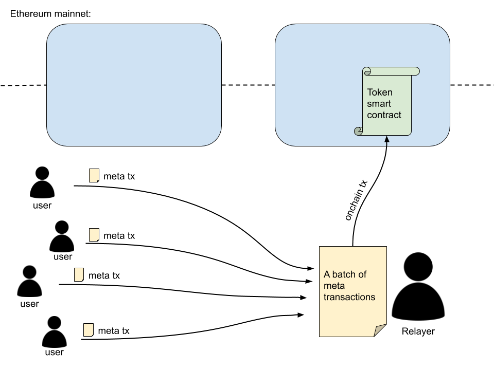

## Simple Summary

Defines an extension function for ERC-20 (and other fungible token standards), which allows receiving and processing a batch of meta transactions.

## Abstract

This EIP defines a new function called `processMetaBatch()` that extends any fungible token standard, and enables batched meta transactions coming from many senders in one on-chain transaction. 

The function must be able to receive multiple meta transactions data and process it. This means validating the data and the signature, before proceeding with token transfers based on the data.

The function enables senders to make gasless transactions, while reducing the relayer's gas cost due to batching.

## Motivation

Meta transactions have proven useful as a solution for Ethereum accounts that don't have any ether, but hold ERC-20 tokens and would like to transfer them (gasless transactions).

The current meta transaction relayer implementations only allow relaying one meta transaction at a time. Some also allow batched meta transactions from the same sender. But none offers batched meta transactions from **multiple** senders.

The motivation behind this EIP is to find a way to allow relaying batched meta transactions from **many senders** in **one on-chain transaction**, which also **reduces the total gas cost** that a relayer needs to cover.



## Specification

The key words "MUST", "MUST NOT", "REQUIRED", "SHALL", "SHALL NOT", "SHOULD", "SHOULD NOT", "RECOMMENDED",  "MAY", and "OPTIONAL" in this document are to be interpreted as described in RFC 2119.

The key words "MUST (BUT WE KNOW YOU WON'T)", "SHOULD CONSIDER", "REALLY SHOULD NOT", "OUGHT TO", "WOULD PROBABLY", "MAY WISH TO", "COULD", "POSSIBLE", and "MIGHT" in this document are to be interpreted as described in RFC 6919.  

### Meta transaction data

In order to successfully validate and transfer tokens, the `processMetaBatch()` function MUST process the following data about a meta transaction:

- sender address
- receiver address
- token amount
- relayer fee
- a (meta tx) nonce
- an expiration date (this COULD be a block number, or it COULD be a block timestamp)
- a token address
- a relayer address
- a signature

Not all of the data needs to be sent to the function by the relayer (see the function interface specification). Some of the data can be deduced or extracted from other sources (from transaction data and contract state).

### `processMetaBatch()` function input data

The `processMetaBatch()` function MUST receive the following data:

- sender address
- receiver address
- token amount
- relayer fee
- an expiration date (this COULD be a block number, or it COULD be a block timestamp)
- a signature

The following data is OPTIONAL to be sent to the function, because it can be extracted or derived from other sources:

- a (meta tx) nonce
- a token address
- a relayer address

### Meta transaction data hash

The pseudocode for creating a hash of meta transaction data is the following:

```
keccak256(address(sender)
	   ++ address(recipient)
	   ++ uint256(amount)
	   ++ uint256(relayerFee)
	   ++ uint256(nonce)
	   ++ uint256(expirationDate)
	   ++ address(tokenContract)
	   ++ address(relayer)
)
```

The created hash MUST then be signed with the sender's private key.

### Validation rules

- Nonce of a new transaction MUST always be bigger by exactly 1 from the nonce of the last successfully processed meta transaction of the same sender to the same token contract.
- Sending to and from a 0x0 address MUST be prohibited.
- A meta transaction MUST be processed before the expiration date.
- Each sender's token balance MUST be equal or greater than the sum of their respective meta transaction token amount and relayer fee.
- A transaction where at least one meta transaction in the batch does not satisfy the above requirements MUST not be reverted. Instead, a failed meta transaction MUST be skipped or ignored.

### `processMetaBatch()` function interface

The `processMetaBatch()` function MUST have the following interface:

```solidity
function processMetaBatch(address[] memory senders,
                          address[] memory recipients,
                          uint256[] memory amounts,
                          uint256[] memory relayerFees,
                          uint256[] memory blocks,
                          uint8[] memory sigV,
                          bytes32[] memory sigR,
                          bytes32[] memory sigS) public returns (bool);
```

The overview of parameters that are passed:

- `senders`: an array of meta transaction sender addresses (token senders)
- `recipients `: an array of token recipients addresses
- `amounts`: an array of token amounts that are sent from each sender to each recipient, respectively
- `relayerFees`: an array of the relayer fees paid in tokens by senders. The fee receiver is a relayer (`msg.address`)
- `blocks`: an array of block numbers that represent an expiration date by which the meta transaction must be processed (alternatively, a timestamp could be used instead of a block number)
- `sigV`, `sigR`, `sigS`: three arrays that represent parts of meta transaction signatures

Each entry in each of the arrays MUST represent data from one meta transaction. The order of the data is very important. Data from a single meta transaction MUST have the same index in every array.

### Meta transaction nonce

The token smart contract must keep track of a meta transaction nonce for each token holder.

```solidity
mapping (address => uint256) private _metaNonces;
```

The interface for the `nonceOf()` function is the following:

```solidity
function nonceOf(address account) public view returns (uint256);
```

### Token transfers

After a meta transaction is successfully validated, the meta nonce of the meta transaction sender MUST be increased by 1. 

Then two token transfers MUST occur:

- The specified token amount MUST go to the recipient.
- The relayer fee MUST go to the relayer (`msg.sender`).

## Implementation

The **reference implementation** adds a couple of functions to the existing ERC-20 token standard:

- `processMetaBatch()`
- `nonceOf()`

You can see the implementation of both functions in this file: [ERC20MetaBatch.sol](https://github.com/defifuture/erc20-batched-meta-transactions/blob/master/contracts/ERC20MetaBatch.sol). This is an extended ERC-20 contract with added meta transaction batch transfer capabilities.

### `processMetaBatch()`

The `processMetaBatch()` function is responsible for receiving and processing a batch of meta transactions that change token balances.

```solidity
function processMetaBatch(address[] memory senders,
                          address[] memory recipients,
                          uint256[] memory amounts,
                          uint256[] memory relayerFees,
                          uint256[] memory blocks,
                          uint8[] memory sigV,
                          bytes32[] memory sigR,
                          bytes32[] memory sigS) public returns (bool) {
    
    address sender;
    uint256 newNonce;
    uint256 relayerFeesSum = 0;
    bytes32 msgHash;
    uint256 i;

    // loop through all meta txs
    for (i = 0; i < senders.length; i++) {
        sender = senders[i];
        newNonce = _metaNonces[sender] + 1;

        if(sender == address(0) || recipients[i] == address(0)) {
            continue; // sender or recipient is 0x0 address, skip this meta tx
        }

        // the meta tx should be processed until (including) the specified block number, otherwise it is invalid
        if(block.number > blocks[i]) {
            continue; // if current block number is bigger than the requested number, skip this meta tx
        }

        // check if meta tx sender's balance is big enough
        if(_balances[sender] < (amounts[i] + relayerFees[i])) {
            continue; // if sender's balance is less than the amount and the relayer fee, skip this meta tx
        }

        // check if the signature is valid
        msgHash = keccak256(abi.encode(sender, recipients[i], amounts[i], relayerFees[i], newNonce, blocks[i], address(this), msg.sender));
        if(sender != ecrecover(keccak256(abi.encodePacked("\x19Ethereum Signed Message:\n32", msgHash)), sigV[i], sigR[i], sigS[i])) {
            continue; // if sig is not valid, skip to the next meta tx
        }

        // set a new nonce for the sender
        _metaNonces[sender] = newNonce;

        // transfer tokens
        _balances[sender] -= (amounts[i] + relayerFees[i]);
        _balances[recipients[i]] += amounts[i];
        relayerFeesSum += relayerFees[i];
    }

	// give the relayer the sum of all relayer fees
    _balances[msg.sender] += relayerFeesSum;

    return true;
}
```

### `nonceOf()`

Nonces are needed due to the replay protection (see *Replay attacks* under *Security Considerations*).

```solidity
mapping (address => uint256) private _metaNonces;

// ...

function nonceOf(address account) public view returns (uint256) {
    return _metaNonces[account];
}
```

The link to the complete implementation (along with gas usage results) is here: [https://github.com/defifuture/erc20-batched-meta-transactions](https://github.com/defifuture/erc20-batched-meta-transactions).

> Note that the OpenZeppelin ERC-20 implementation was used here. Some other implementation may have named the `_balances` mapping differently, which would require minor changes in the `processMetaBatch()` function.

## Rationale

### All-in-one

Alternative implementations (like GSN) use multiple smart contracts to enable meta transactions, although this increases gas usage. This implementation (EIP-3005) intentionally keeps everything within one function which reduces complexity and gas cost.

The `processMetaBatch()` function thus does the job of receiving a batch of meta transactions, validating them, and then transferring tokens from one address to another.

### Function parameters

As you can see, the `processMetaBatch()` function in the reference implementation takes the following parameters:

- an array of **sender addresses** (meta txs senders, not relayers)
- an array of **receiver addresses**
- an array of **amounts**
- an array of **relayer fees** (relayer is `msg.sender`)
- an array of **block numbers** (a due "date" for meta tx to be processed)
- Three arrays that represent parts of a **signature** (v, r, s)

**Each item** in these arrays represents **data of one meta transaction**. That's why the **correct order** in the arrays is very important.

If a relayer gets the order wrong, the `processMetaBatch()` function would notice that (when validating a signature), because the hash of the meta transaction values would not match the signed hash. A meta transaction with an invalid signature is **skipped**.

### The alternative way of passing meta transaction data into the function

The reference implementation takes parameters as arrays. There's a separate array for each meta transaction data category (the ones that cannot be deduced or extracted from other sources).

A different approach would be to bitpack all data of a meta transaction into one value and then unpack it within the smart contract. The data for a batch of meta transactions would be sent in an array, but there would need to be only one array (of packed data), instead of multiple arrays.

### Why is nonce not one of the parameters in the reference implementation?

Meta nonce is used for constructing a signed hash (see the `msgHash` line where a `keccak256` hash is constructed - you'll find a nonce there). 

Since a new nonce has to always be bigger than the previous one by exactly 1, there's no need to include it as a parameter array in the `processMetaBatch()` function, because its value can be deduced.

This also helps avoid the "Stack too deep" error.

### Can EIP-2612 nonces mapping be re-used?

The EIP-2612 (`permit()` function) also requires a nonce mapping. At this point, I'm not sure yet if this mapping should be **re-used** in case a smart contract implements both EIP-3005 and EIP-2612. 

At the first glance, it seems the `nonces` mapping from EIP-2612 could be re-used, but this should be thought through (and tested) for possible security implications.

### Token transfers

Token transfers in the reference implementation could alternatively be done by calling the `_transfer()` function (part of the OpenZeppelin ERC-20 implementation), but it would increase the gas usage and it would also revert the whole batch if some meta transaction was invalid (the current implementation just skips it).

Another gas usage optimization is to assign total relayer fees to the relayer at the end of the function, and not with every token transfer inside the for loop (thus avoiding multiple SSTORE calls that cost 5'000 gas).

## Backwards Compatibility

The code implementation of batched meta transactions is backwards compatible with any fungible token standard, for example, ERC-20 (it only extends it with one function).

## Test Cases

Link to tests: [https://github.com/defifuture/erc20-batched-meta-transactions/tree/master/test](https://github.com/defifuture/erc20-batched-meta-transactions/tree/master/test).

## Security Considerations

Here is a list of potential security issues and how are they addressed in this implementation.

### Forging a meta transaction

The solution against a relayer forging a meta transaction is for a user to sign the meta transaction with their private key.

The `processMetaBatch()` function then verifies the signature using `ecrecover()`.

### Replay attacks

The `processMetaBatch()` function is secure against two types of a replay attack:

**Using the same meta transaction twice in the same token smart contract**

A nonce prevents a replay attack where a relayer would send the same meta transaction more than once.

**Using the same meta transaction twice in different token smart contracts**

A token smart contract address must be added into the signed hash (of a meta transaction). 

This address does not need to be sent as a parameter into the `processMetaBatch()` function. Instead, the function uses `address(this)` when constructing a hash in order to verify the signature. This way a meta transaction not intended for the token smart contract would be rejected (skipped).

### Signature validation

Signing a meta transaction and validating the signature is crucial for this whole scheme to work.

The `processMetaBatch()` function validates a meta transaction signature, and if it's **invalid**, the meta transaction is **skipped** (but the whole on-chain transaction is **not reverted**).

```solidity
msgHash = keccak256(abi.encode(sender, recipients[i], amounts[i], relayerFees[i], newNonce, blocks[i], address(this), msg.sender));

if(sender != ecrecover(keccak256(abi.encodePacked("\x19Ethereum Signed Message:\n32", msgHash)), sigV[i], sigR[i], sigS[i])) {
    continue; // if sig is not valid, skip to the next meta tx
}
```

Why not reverting the whole on-chain transaction? Because there could be only one problematic meta transaction, and the others should not be dropped just because of one rotten apple.

That said, it is expected of relayers to validate meta transactions in advance before relaying them. That's why relayers are not entitled to a relayer fee for an invalid meta transaction.

### Malicious relayer forcing a user into over-spending

A malicious relayer could delay sending some user's meta transaction until the user would decide to make the token transaction on-chain.

After that, the relayer would relay the delayed meta transaction which would mean that the user would have made two token transactions (over-spending).

**Solution:** Each meta transaction should have an "expiry date". This is defined in a form of a block number by which the meta transaction must be relayed on-chain.

```solidity
function processMetaBatch(...
                          uint256[] memory blocks,
                          ...) public returns (bool) {
    
    //...

	// loop through all meta txs
    for (i = 0; i < senders.length; i++) {

        // the meta tx should be processed until (including) the specified block number, otherwise it is invalid
        if(block.number > blocks[i]) {
            continue; // if current block number is bigger than the requested number, skip this meta tx
        }

        //...
```

### Front-running attack

A malicious relayer could scout the Ethereum mempool to steal meta transactions and front-run the original relayer.

**Solution:** The protection that `processMetaBatch()` function uses is that it requires the meta transaction sender to add the relayer's Ethereum address as one of the values in the hash (which is then signed).

When the `processMetaBatch()` function generates a hash it includes the `msg.sender` address in it:

```solidity
msgHash = keccak256(abi.encode(sender, recipients[i], amounts[i], relayerFees[i], newNonce, blocks[i], address(this), msg.sender));

if(sender != ecrecover(keccak256(abi.encodePacked("\x19Ethereum Signed Message:\n32", msgHash)), sigV[i], sigR[i], sigS[i])) {
    continue; // if sig is not valid, skip to the next meta tx
}
```

If the meta transaction was "stolen", the signature check would fail because the `msg.sender` address would not be the same as the intended relayer's address.

### A malicious (or too impatient) user sending a meta transaction with the same nonce through multiple relayers at once

A user that is either malicious or just impatient could submit a meta transaction with the same nonce (for the same token contract) to various relayers. Only one of them would get the relayer fee (the first one on-chain), while the others would get an invalid meta transaction.

**Solution:** Relayers could **share a list of their pending meta transactions** between each other (sort of an info mempool).

The relayers don't have to fear that someone would steal their respective pending transactions, due to the front-running protection (see above).

If relayers see meta transactions from a certain sender address that have the same nonce and are supposed to be relayed to the same token smart contract, they can decide that only the first registered meta transaction goes through and others are dropped (or in case meta transactions were registered at the same time, the remaining meta transaction could be randomly picked).

At a minimum, relayers need to share this meta transaction data (in order to detect meta transaction collision):

- sender address
- token address
- nonce

### Too big due block number

The relayer could trick the meta transaction sender into adding too big due block number - this means a block by which the meta transaction must be processed. The block number could be far in the future, for example, 10 years in the future. This means that the relayer would have 10 years to submit the meta transaction.

**One way** to solve this problem is by adding an upper bound constraint for a block number within the smart contract. For example, we could say that the specified due block number must not be bigger than 100'000 blocks from the current one (this is around 17 days in the future if we assume 15 seconds block time).

```solidity
// the meta tx should be processed until (including) the specified block number, otherwise it is invalid
if(block.number > blocks[i] || blocks[i] > (block.number + 100000)) {
    // If current block number is bigger than the requested due block number, skip this meta tx.
    // Also skip if the due block number is too big (bigger than 100'000 blocks in the future).
    continue;
}
```

This addition could open new security implications, that's why it is left out of this proof-of-concept. But anyone who wishes to implement it should know about this potential constraint, too.

**The other way** is to keep the `processMetaBatch()` function as it is and rather check for the too big due block number **on the relayer level**. In this case, the user could be notified about the problem and could issue a new meta transaction with another relayer that would have a much lower block parameter (and the same nonce).

## Copyright

Copyright and related rights are waived via [CC0](../LICENSE.md).