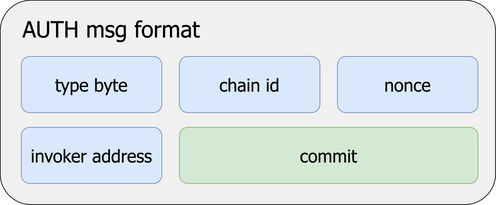
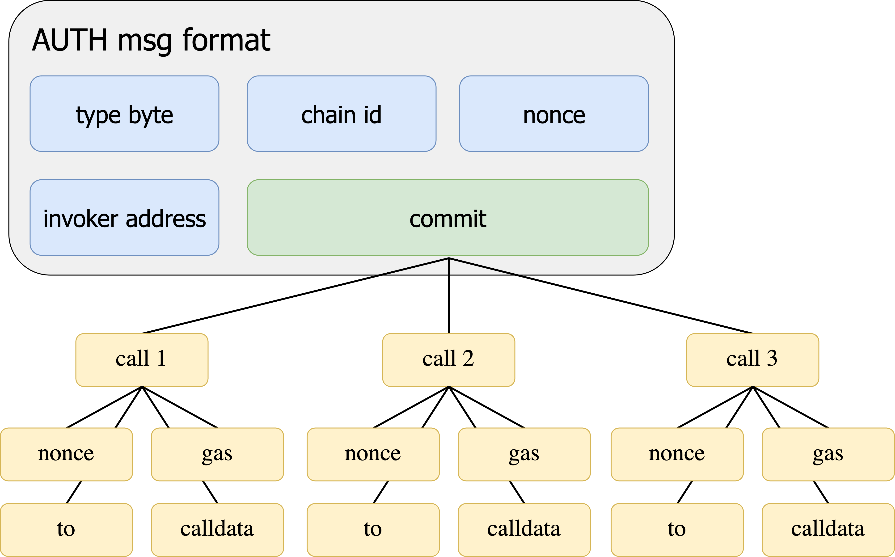
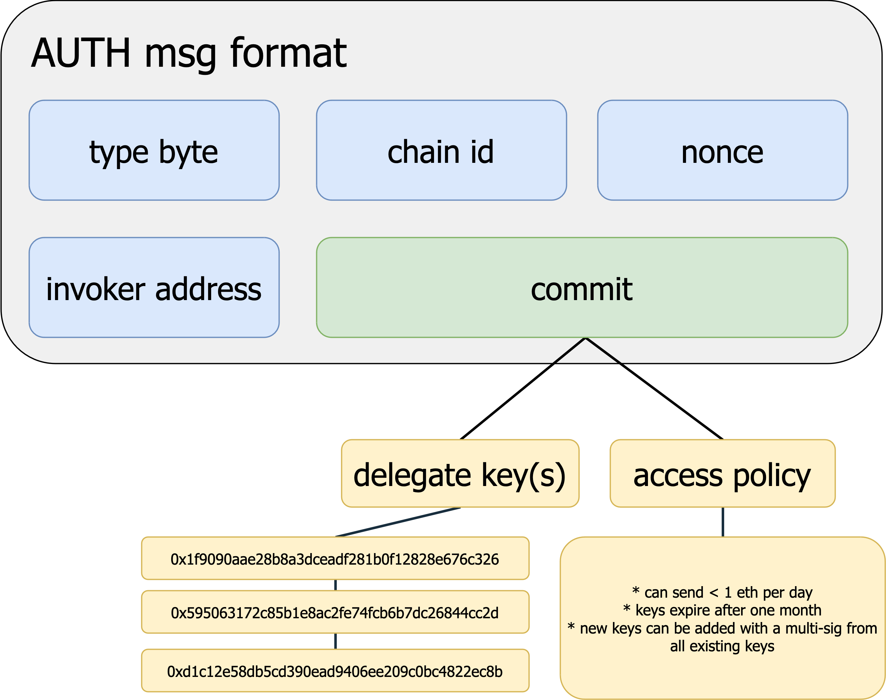

## Abstract

This EIP introduces two EVM instructions `AUTH` and `AUTHCALL`. The first sets a context variable `authorized` based on an ECDSA signature. The second sends a call as the `authorized` account. This essentially delegates control of the externally owned account (EOA) to a smart contract.

## Motivation

Adding more functionality to EOAs has been a long-standing feature request. The requests have spanned from implementing batching capabilities, allowing for gas sponsoring, expirations, scripting, and beyond. These changes often mean increased complexity and rigidity of the protocol. In some cases, it also means increased attack surfaces.

This EIP takes a different approach. Instead of enshrining these capabilities in the protocol as transaction validity requirements, it allows users to *delegate* control of their EOA to a contract. This gives developers a flexible framework for developing novel transaction schemes for EOAs. A motivating use case of this EIP is that it allows any EOA to act like a smart contract wallet *without* deploying a contract.

Although this EIP provides great benefit to individual users, the leading motivation for this EIP is "sponsored transactions". This is where the fee for a transaction is provided by a different account than the one that originates the call.

With the extraordinary growth of tokens on Ethereum, it has become common for EOAs to hold valuable assets without holding any ether at all. Today, these assets must be converted to ether before they can be used to pay gas fees. However, without ether to pay for the conversion, it's impossible to convert them. Sponsored transactions break the circular dependency.

## Specification

### Conventions

 - **`top - N`** - the `N`th most recently pushed value on the EVM stack, where `top - 0` is the most recent.
 - **`||`** - byte concatenation operator.
 - **invalid execution** - execution that is invalid and must exit the current execution frame immediately, consuming all remaining gas (in the same way as a stack underflow or invalid jump).

### Constants

|     Constant     | Value  |
| ---------------- | ------ |
| `MAGIC`          | `0x04` |

`MAGIC` is used for [EIP-3074](./eip-3074.md) signatures to prevent signature collisions with other signing formats.

### Context Variables

|     Variable        | Type      | Initial Value |
| ------------------- | --------- |:------------- |
| `authorized`        | `address` | unset         |

The context variable `authorized` shall indicate the active account for `AUTHCALL` instructions in the current frame of execution. If set, `authorized` shall only contain an account which has given the contract authorization to act on its behalf. An unset value shall indicate that no such account is set and that there is not yet an active account for `AUTHCALL` instructions in the current frame of execution.

The variable has the same scope as the program counter -- `authorized` persists throughout a single frame of execution of the contract, but is not passed through any calls (including `DELEGATECALL`). If the same contract is being executed in separate execution frames (ex. a `CALL` to self), both frames shall have independent values for `authorized`. Initially in each frame of execution, `authorized` is always unset, even if a previous execution frame for the same contract has a value.

### `AUTH` (`0xf6`)

A new opcode `AUTH` shall be created at `0xf6`. It shall take three stack element inputs (the last two describing a memory range), and it shall return one stack element.

#### Input

##### Stack

| Stack      | Value        |
| ---------- | ------------ |
| `top - 0`  | `authority`  |
| `top - 1`  | `offset`     |
| `top - 2`  | `length`     |

##### Memory

The final two stack arguments (`offset` and `length`) describe a range of memory. The format of the contents of that range is:

 - `memory[offset    : offset+1 ]` - `yParity`
 - `memory[offset+1  : offset+33]` - `r`
 - `memory[offset+33 : offset+65]` - `s`
 - `memory[offset+65 : offset+97]` - `commit`

#### Output

##### Stack

| Stack      | Value        |
| ---------- | -------------|
| `top - 0`  | `success`    |

##### Memory

Memory is not modified by this instruction.

#### Behavior

If `length` is greater than 97, the extra bytes are ignored for signature verification (they still incur a gas cost as defined later). Bytes outside the range (in the event `length` is less than 97) are treated as if they had been zeroes.

`authority` is the address of the account which generated the signature. If `EXTCODESIZE` of `authority` is not zero, consider the operation unsuccessful and unset `authorized`.

The arguments (`yParity`, `r`, `s`) are interpreted as an ECDSA signature on the secp256k1 curve over the message `keccak256(MAGIC || chainId || nonce || invokerAddress || commit)`, where:

 - `chainId` is the current chain's [EIP-155](./eip-155.md) unique identifier padded to 32 bytes.
 - `nonce` is the signer's current nonce, left-padded to 32 bytes.
 - `invokerAddress` is the address of the contract executing `AUTH` (or the active state address in the context of `CALLCODE` or `DELEGATECALL`), left-padded with zeroes to a total of 32 bytes (ex. `0x000000000000000000000000AAAAAAAAAAAAAAAAAAAAAAAAAAAAAAAAAAAAAAAA`).
 - `commit`, one of the arguments passed into `AUTH`, is a 32-byte value that can be used to commit to specific additional validity conditions in the invoker's pre-processing logic.

Signature validity and signer recovery are handled analogously to transaction signatures, including the stricter `s` range for preventing ECDSA malleability. Note that `yParity` is expected to be `0` or `1`.

If the signature is valid and the signer address is equal to `authority`, the context variable `authorized` is set to the `authority`. In particular, this is also true if `authority == tx.origin`, which used to be handled separately in earlier versions of this EIP (see Security Considerations). If the signature is instead invalid or the signer address does not equal `authority`, `authorized` is reset to an unset value.

`AUTH` returns `1` if `authorized` is set, or `0` otherwise.

#### Gas Cost

The gas cost for `AUTH` is equal to the sum of:

 - fixed fee `3100`.
 - memory expansion gas cost (`auth_memory_expansion_fee`).
 - `100` if `authority` is warm, `2600` if it is cold (per [EIP-2929](./eip-2929.md)).

The fixed fee is equal to the cost for the `ecrecover` precompile, plus a bit extra to cover a keccak256 hash and some additional logic.

The memory expansion gas cost (`auth_memory_expansion_fee`) shall be calculated in the same way as `RETURN`, where memory is expanded if the specified range is outside the current allocation.

### `AUTHCALL` (`0xf7`)

A new opcode `AUTHCALL` shall be created at `0xf7`. It shall take seven stack elements and return one stack element. It matches the behavior of the existing `CALL` (`0xF1`) instruction, except where noted below.

#### Input

| Stack     | Value        |
| --------- | ------------ |
| `top - 0` | `gas`        |
| `top - 1` | `addr`       |
| `top - 2` | `value`      |
| `top - 3` | `argsOffset` |
| `top - 4` | `argsLength` |
| `top - 5` | `retOffset`  |
| `top - 6` | `retLength`  |

#### Output

| Stack      | Value     |
| ---------- | --------- |
| `top - 0`  | `success` |

#### Behavior

`AUTHCALL` is interpreted the same as `CALL`, except for (note: this list is also the order of precedence for the logical checks):

 - If `authorized` is unset, execution is invalid (as defined above). Otherwise, the caller address for the call is set to `authorized`.
 - The gas cost, including how much gas is available for the subcall, is specified in the Gas Cost section.
 - If the `gas` operand is equal to `0`, the instruction will send all available gas as per [EIP-150](./eip-150).
 - If the gas available for the subcall would be less than `gas`, execution is invalid.
 - There is no gas stipend, even for non-zero `value`.
 - `value` is deducted from the balance of `authorized`. If `value` is higher than the balance of `authorized`, execution is invalid.

`AUTHCALL` must increase the call depth by one. `AUTHCALL` must not increase the call depth by two as it would if it first called into the authorized account and then into the target.

The return data area accessed with `RETURNDATASIZE` (`0x3d`) and `RETURNDATACOPY` (`0x3e`) must be set in the same way as the `CALL` instruction.

Importantly, `AUTHCALL` does not reset `authorized`, but leaves it unchanged.

#### Gas Cost

The gas cost for `AUTHCALL` shall be the **sum** of:

 - static gas cost (`warm_storage_read`)
 - memory expansion gas cost (`memory_expansion_fee`)
 - dynamic gas cost (`dynamic_gas`)
 - gas available for execution in the subcall (`subcall_gas`)

The memory expansion gas cost (`memory_expansion_fee`) shall be calculated in the same way as `CALL`.

The dynamic gas portion (`dynamic_gas`), and the gas available for execution in the subcall (`subcall_gas`) shall be calculated as:

```
dynamic_gas = 0

if addr not in accessed_addresses:
    dynamic_gas += 2500         # cold_account_access - warm_storage_read

if value > 0:
    dynamic_gas += 6700         # NB: Not 9000, like in `CALL`
    if is_empty(addr):
        dynamic_gas += 25000

remaining_gas = available_gas - dynamic_gas
all_but_one_64th = remaining_gas - (remaining_gas // 64)

if gas == 0:
    subcall_gas = all_but_one_64th
elif all_but_one_64th < gas:
    raise                       # Execution is invalid.
else:
    subcall_gas = gas
```

As with `CALL`, the full gas cost is charged immediately, independently of actually executing the call.

## Rationale

### Signature in Memory

The signature format (`yParity`, `r`, and `s`) is fixed, so it might seem curious that `auth` accepts a dynamic memory range. The signature is placed in memory so that `auth` can be upgraded in the future to work with contract accounts (which might use non-ECDSA signatures) and not just EOAs.

### Signing Address `auth` Argument

Including `authority` (the signing address) as an argument to `auth` allows future upgrades to the instruction to work with contract accounts, and not just EOAs.

If `authority` were not included and multiple signature schemes allowed, it would not be possible to compute the authorizing account's address from just the signature alone.

### Reserving One Sixty-Fourth of Available Gas

`AUTHCALL` will not pass more than 63/64th of the available gas for the reasons enumerated in [EIP-150](./eip-150.md).

### Throwing for Unset `authorized` During `AUTHCALL`

A well-behaved contract should never reach an `AUTHCALL` without having successfully set `authorized` beforehand. The safest behavior, therefore, is to exit the current frame of execution immediately. This is especially important in the context of transaction sponsoring / relaying, which is expected to be one of the main use cases for this EIP. In a sponsored transaction, the inability to distinguish between a sponsee-attributable fault (like a failing sub-call) and a sponsor-attributable fault (like a failing `AUTH`) is especially dangerous and should be prevented because it charges unfair fees to the sponsee.

### Another Sponsored Transaction EIP

There are two general approaches to separating the "fee payer" from the "action originator".

The first is introducing a new transaction type. This requires significant changes to clients to support and is generally less upgradeable than other solutions (e.g. this EIP). This approach is also not immediately compatible with account abstraction (AA). These proposals require a *signed* transaction from the sponsor's account, which is not possible from an AA contract, because it has no private key to sign with. The main advantage of new transaction types is that the validity requirements are enforced by the protocol, therefore invalid transactions do not pollute block space.

The other main approach is to introduce a new mechanism in the EVM to masquerade as other accounts. This EIP introduces `AUTH` and `AUTHCALL` to make calls as EOAs. There are many different permutations of this mechanism. An alternative mechanism would be to add an opcode that can make arbitrary calls based on a similar address creation scheme as `CREATE2`. Although this mechanism would not benefit users today, it would immediately allow for those accounts to send and receive ether -- making it feel like a more first-class primitive.

Besides better compatibility with AA, introducing a new mechanism into the EVM is a much less intrusive change than a new transaction type. This approach requires no changes in existing wallets, and little change in other tooling.

`AUTHCALL`'s single deviation from `CALL` is to set `CALLER`. It implements the minimal functionality to enable sender abstraction for sponsored transactions. This single mindedness makes `AUTHCALL` significantly more composable with existing Ethereum features.

More logic can be implemented around the `AUTHCALL` instruction, giving more control to invokers and sponsors without sacrificing security or user experience for sponsees.

### What to Sign?

As originally written, this proposal specified a precompile with storage to track nonces. Since a precompile with storage is unprecedented, a revision moved replay protection into the invoker contract, necessitating a certain level of user trust in the invoker. Expanding on this idea of trusted invokers, the other signed fields were eventually eliminated, one by one, until only `invoker` and `commit` remained. To appease concerns about cross-chain replay attacks and irrevocable signatures, the `chainId` and `nonce` fields returned to the signed message.

The `invoker` binds a particular signed message to a single invoker. If invoker was not part of the message, any invoker could reuse the signature to completely compromise the EOA. This allows users to trust that their message will be validated as they expect, particularly the values committed to in `commit`.

### Understanding `commit`

Earlier iterations of this EIP included mechanisms for replay protection, and also signed over value, gas, and other arguments to `AUTHCALL`. After further investigation, we revised this EIP to its current state: explicitly delegate these responsibilities to the invoker contract.

A user will specifically interact with an invoker they trust. Because they trust this contract to execute faithfully, they will "commit" to certain properties of a call they would like to make by computing a hash of the call values. They can be certain that the invoker will only allow the call to proceed if it is able to verify the values committed to (e.g. a nonce to protect against replay attacks). This certainty arises from the `commit` value that is signed over by the user. This is the hash of values which the invoker will validate. A safe invoker should accept the values from the user and compute the commit hash itself. This ensures that invoker operated on the same input that user authorized.



Using `commit` as a hash of values allows for invokers to implement arbitrary constraints. For example, they could allow accounts to have `N` parallel nonces. Or, they could allow a user to commit to multiple calls with a single signature. This would allow multi-tx flows, such as [ERC-20](./eip-20.md) `approve`-`transfer` actions, to be condensed into a single transaction with a single signature verification. A commitment to multiple calls would look something like the diagram below.



Another interesting use is to delegate control of the EOA to other key(s). This would mean the EOA signs a `commit` message with the address of the key(s) and an access policy, if applicable. When the delegate wants to make a call as the EOA it will construct a signature over the invoker-specified call format and relay it (with the actual call data) onto chain with the signature and commit that granted it access to the account. The invoker will then be able to determine that the EOA has allowed this alternative key to make calls on its behalf.




### Invoker Contracts

The invoker contract is a trustless intermediary between the sponsor and sponsee. A sponsee signs over `invoker` to require the transaction to be processed only by a contract they trust. This allows them to interact with sponsors without needing to trust them.

Choosing an invoker is similar to choosing a smart contract wallet implementation. It's important to choose one that has been thoroughly reviewed, tested, and accepted by the community as secure. We expect a few invoker designs to be utilized by most major transaction relay providers, with a few outliers that offer more novel mechanisms.

An important note is that invoker contracts **MUST NOT** be upgradeable. If an invoker can be redeployed to the same address with different code, it would be possible to redeploy the invoker with code that does not properly verify `commit` and any account that signed a message over that invoker would be compromised. Although this sounds scary, it is no different than using a smart contract wallet via `DELEGATECALL`. If the wallet is redeployed with different logic, all wallets using its code could be compromised.

### On Call Depth

The EVM limits the maximum number of nested calls, and naively allowing a sponsor to manipulate the call depth before reaching the invoker would introduce a griefing attack against the sponsee. That said, with the 63/64th gas rule, and the cost of `AUTHCALL`, the stack is effectively limited to a much smaller depth than the hard maximum by the `gas` parameter.

It is, therefore, sufficient for the invoker to guarantee a minimum amount of gas, because there is no way to reach the hard maximum call depth with any reasonable (i.e. less than billions) amount of gas.

### Source of `value`

In previous iterations of this EIP, it was thought that deducting value from an EOA mid-execution was problematic. This was due to an invariant of pending transactions which allows tx pools to statically determine the validity of a given transaction.

However, after further investigation we found that breaking the invariant is safe. This is mostly due to the fact that the worst case is similar in both instances.

Currently an attacker can queue many transactions in the tx pool, across many accounts, and invalidate them all at once with a block where each of the queued accounts send a tx moving their entire balance. This attack will become easier and cheaper after this EIP, because it will no longer require direct access to the block builder and will not cost a full 21000 gas to originate each tx. However, the attack does not have a substantial impact on the network, so reducing the difficulty and cost is not of concern.

### Allowing `tx.origin` as Signer

Allowing `authorized` to equal `tx.origin` enables simple transaction batching, where the sender of the outer transaction would be the signing account. The ERC-20 approve-then-transfer pattern, which currently requires two separate transactions, could be completed in a single transaction with this proposal.

`AUTH` allows for signatures to be signed by `tx.origin`. For any such signatures, subsequent `AUTHCALL`s have `msg.sender == tx.origin` in their first layer of execution. Without EIP-3074, this situation can only ever arise in the topmost execution layer of a transaction. This EIP breaks that invariant and so affects smart contracts containing `require(msg.sender == tx.origin)` checks. This check can be used for at least three purposes:

 1. Ensuring that `msg.sender` is an EOA (given that `tx.origin` always has to be an EOA). This invariant does not depend on the execution layer depth and, therefore, is not affected.
 2. Protecting against atomic sandwich attacks like flash loans, that rely on the ability to modify state before and after the execution of the target contract as part of the same atomic transaction. This protection would be broken by this EIP. However, relying on `tx.origin` in this way is considered bad practice, and can already be circumvented by miners conditionally including transactions in a block.
 3. Preventing reentrancy.

Examples of (1) and (2) can be found in contracts deployed on Ethereum mainnet, with (1) being more common (and unaffected by this proposal.) On the other hand, use case (3) is more severely affected by this proposal, but the authors of this EIP did not find any examples of this form of reentrancy protection, though the search was non-exhaustive.

This distribution of occurrences—many (1), some (2), and no (3)—is exactly what the authors of this EIP expect, because:

 - Determining if `msg.sender` is an EOA without `tx.origin` is difficult (if not impossible.)
 - The only execution context which is safe from atomic sandwich attacks is the topmost context, and `tx.origin == msg.sender` is the only way to detect that context.
 - In contrast, there are many direct and flexible ways of preventing reentrancy (ex. using a storage variable.) Since `msg.sender == tx.origin` is only true in the topmost context, it would make an obscure tool for preventing reentrancy, rather than other more common approaches.

There are other approaches to mitigate this restriction which do not break the invariant:

 - Set `tx.origin` to a constant `ENTRY_POINT` address for `AUTHCALL`s.
 - Set `tx.origin` to the invoker address for `AUTHCALL`s.
 - Set `tx.origin` to a special address derived from any of the sender, invoker, and/or signer addresses.
 - Disallow `authorized == tx.origin`. This would make the simple batching use cases impossible, but could be relaxed in the future.

### `AUTHCALL` cheaper than `CALL` when sending value

Sending non-zero value with `CALL` increases its cost by 9,000. Of that, 6,700 covers the increased overhead of the balance transfer and 2,300 is used as a stipend into the subcall to seed its gas counter. `AUTHCALL` does not provide a stipend and thus only charges the base 6,700.

### In-Protocol Revocation

This EIP has gone [back and forth](#what-to-sign) on how to deal with `AUTH` message revocation. Without revocation, this EIP is a supremely powerful and flexible primitive for developers. However, it does have risk for users who use insecure and/or actively malicious invokers.

Much of the risk is due to the new ability for users to batch many operations in a single transaction. It becomes easier for an account to be drained. This is a risk that will continue to grow, regardless of the adoption of this EIP, due to overwhelming desire for the feature and attempts to support it at the protocol level and at the app level.

A new class of risk is introduced for insecure and buggy invokers. If an invoker has implemented replay protection, as per the authors' recommendation, this should substantially contain the blast radius. However, if the bug allows an adversary to circumvent the replay protection mechanism, it may give them full access to any EOA which has interacted with the vulnerable invoker.

Although this is a truly catastrophic event which is not expected to be possible via reputable wallets, it is a serious consideration. Without in-protocol revocation, users have no way to remove their account from the vulnerable invoker.

For this reason, `AUTH` requires the `nonce` in the message to be equal to the signer's current nonce. This way, a single tx from the EOA will cause the nonce to increase, invalidating all outstanding authorizations.

### Failing on `EXTCODESIZE` check

In [EIP-3607](./eip-3607), it was determined that the protocol should reject any transaction which originates from an account with code. Although this EIP focused on transaction origination, the authors of EIP-3074 feel the intention is clear: an account that has both code and a known private key should not be allowed to make arbitrary calls on behalf of said account. Therefore, the property is upheld in this EIP. For full rationale, please refer to [EIP-3607](./eip-3607).

## Backwards Compatibility

Although this EIP poses no issues for backwards compatibility, there are concerns that it limits future changes to accounts by further enshrining ECDSA signatures. For example, it might be desirable to eradicate the concept of EOAs altogether, and replace them with smart contract wallets that emulate the same behavior. This is fully compatible with the EIP as written, however, it gets tricky if users can then elect to "upgrade" their smart contract wallets to use other methods of authentication -- e.g. convert into a multi-sig. Without any changes, `AUTH` would not respect this new logic and continue allowing the old private key to perform actions on behalf of the account.

A solution to this would be at the same time that EOAs are removed, to modify the logic of `AUTH` to actually call into the account with some standard message and allow the account to determine if the signature / witness is valid. Further research should be done to understand how invokers would need to change in this situation and how best to write them in a future-compatible manner.

## Security Considerations

### Secure Invokers

The following is a non-exhaustive list of checks/pitfalls/conditions that invokers *should* be wary of:

 - Replay protection (ex. a nonce) should be implemented by the invoker, and included in `commit`. Without it, a malicious actor can reuse a signature, repeating its effects.
 - `value` should be included in `commit`. Without it, a malicious sponsor could cause unexpected effects in the callee.
 - `gas` should be included in `commit`. Without it, a malicious sponsor could cause the callee to run out of gas and fail, griefing the sponsee.
 - `addr` and `calldata` should be included in `commit`. Without them, a malicious actor may call arbitrary functions in arbitrary contracts.

A poorly implemented invoker can *allow a malicious actor to take near complete control over a signer's EOA*.

### Allowing `tx.origin` as Signer

Allowing `authorized` to equal `tx.origin` has the possibility to:

 - Break atomic sandwich protections which rely on `tx.origin`;
 - Break reentrancy guards of the style `require(tx.origin == msg.sender)`.

The authors of this EIP believe the risks of allowing `authorized` to equal `tx.origin` are acceptable for the reasons outlined in the Rationale section.

### Sponsored Transaction Relayers

It is possible for the `authorized` account to cause sponsored transaction relayers to spend gas without being reimbursed by either invalidating the authorization (i.e. increasing the account's nonce) or by sweeping the relevant assets out of the account. Relayers should be designed with these cases in mind, possibly by requiring a bond to be deposited or by implementing a reputation system.

## Copyright

Copyright and related rights waived via [CC0](../LICENSE.md).
