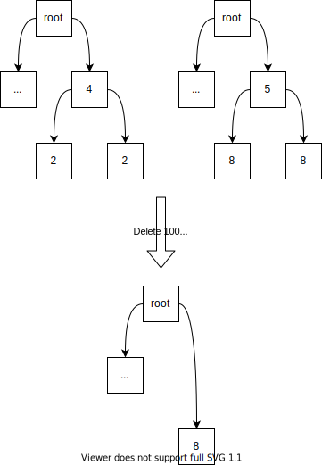

## Simple Summary

Change the storage structure from hexary to binary, merge the account and storage tries, and use blake2b.

## Abstract

This proposal presents a binary structure and merkelization rule for the account and storage tries, which are merged into a single “state” trie. RLP and most of the MPT’s optimizations are dropped to simplify the design. Keccak256 is replaced with blake2b.

## Motivation

The current design of the Merkle Patricia Trie (MPT) uses an hexary trie. Hexary Merkle trees are more shallow than their binary counterparts, which means less hashing.
Over the course of the 5 years of Ethereum’s existence, it has become apparent that disk accesses are a greater bottleneck than hashing. Clients are therefore moving away from a storage model in which all internal nodes are stored, in favor of a flat (key, value) storage model first used by turbo-geth, in which the intermediate nodes are recalculated only when needed.

There is a push for making Ethereum easier to use in a stateless fashion. Binary tries make for smaller (~4x) proofs than hexary tries, making it the design of choice for a stateless-friendly Ethereum.

For that same reason, the account and storage tries are merged in order to have a single proof for all changes.

The MPT design is also rife with uncanny optimizations for size, that have a limited effect - at the cost of prohibitive complexity. For example, nesting for children whose RLP is less than 32 bytes saves an estimated 1MB of disk space. A paltry compared to the 300GB required by a fast sync at the time of this writing. These optimizations are a significant source of errors, and therefore a consensus-breaking risk.
The reliance on RLP has also been criticized for its complexity, while the overhead of a general-purpose encoding scheme isn’t warranted for the rigid structure of a Merkle trie.

The desire to switch the storage model from an hexary trie to a binary trie provides an opportunity to adopt a simpler trie architecture that pushes optimizations from the protocol level down to that of the client implementors.

## Specification

### Conventions

| Code      | Description                                      |
| :-:       | -                                                |
| `u256(x)` | Big endian, 32-byte representation of number _x_ |
|`||`          | Byte-wise concatenation operator|
| `++`         | Bit-wise concatenation operator                                                                                                |
| `0b0101`     | The binary string `0101`                                                                                                       |
| `hash()`     | The usual hashing function                                                                                                     |
| `empty_hash` | The empty hash: `hash("")`                                                                                                     |
| `length(x)`  | The byte length of object `x`                                                                                                  |
| `d[a..b]`    | The big-endian bit sequence taken from byte sequence `d`, starting at bit index `a`, up to and including the bit at index `b`. |

### Notable changes from the hexary structure

 * Account and storage tries are merged, with key length between 32 and 64 bytes;
 * RLP is no longer used;
 * The "leaf marker" bit used in the hex prefix is also dropped. Leaves are identified as nodes with no children;
 * Serialized nodes are hashed, no matter how small the byte length of the serialized nodes.

### The trie

#### Structure

The trie structure is made up of _nodes_. A node `N ≡ (N_l,N_r,N_p,N_v)` has the following 4 components:

 * `N_l` is the hash to the node's _left child_. If the node does not have a left child, then `N_l` is the empty hash `empty_hash`;
 * `N_r` is the hash to the node's _right child_. If the node does not have a right child, then `N_r` is the empty hash `empty_hash`;
 * the optional `N_p` is the node's _prefix_ : every key into the subtrie rooted at `N` is prefixed by this bit string;
 * `N_v` is the _value_ stored at this node. The value is **only present in leaf nodes**.

Nodes with `empty_hash` as both children are called _leaf nodes_, and the remaining nodes are known as _internal nodes_.

#### Accessing account's balance, nonce, code, storage root and storage slots

Assuming an account `A ≡ (A_b, A_n, A_c, A_s)` at address `A_a`, the following elements can be found at the following addresses:

 * The account balance `A_b` can be found at key `hash(A_a)[0..253] ++ 0b00` and is of type `uint256`;
 * The account nonce `A_n` can be found at key `hash(A_a)[0..253] ++ 0b01` and is of type `uint64`;
 * The code `A_c` is an arbitrary-length byte sequence that can be found at key `hash(A_a)[0..253] ++ 0b10`;
 * The root of the storage trie `A_s` can be found at key `hash(A_a)[0..253] ++ 0b11`
     * The storage slot number `k` can be found at key `hash(A_a)[0..253] ++ 0b11 ++ hash(k)`.

After [EIP-2926](./eip-2926.md) has been rolled out, `A_c` will represent the root of the code merkelization tree. The key accessing code chunk number `c` is `hash(A_a)[0..253] ++ 0b10 ++ u256(c)`.

In the unlikely future case that extra items are to be added to the trie at account level, a third bit can be reserved for future use.

### Node merkelization rule

Leaves and nodes that have no prefix are hashed according to the rule below:

```
internal_hash = hash(left_child_hash || right_child_hash)
leaf_hash = hash(hash(key) || hash(leaf_value))
```

If a prefix is present, the length of the path from the root to the prefixed node is further concatenated with the output of the prefix-less rule, and hashed again:

```
internal_hash_with_prefix = hash(u256(path_length_u256 - 1) || internal_hash)
leaf_hash_with_prefix = hash(u256(path_length_u256 - 1) || leaf_hash)
```

## Rationale

### blake2b

BLAKE2 offers better performance, which is key to compensate for the loss of performance associated to a ~4x increase in the number of nodes.

BLAKE3 offers even better performance. No official golang release exists at the time of the writing of this document. This presents a security risk, and therefore BLAKE2 is considered instead.

### Merging of the account and storage tries

The trend in clients is to store the keys and values in a "flat" database. Having the key of any storage slot prefixed with the address key of the account it belongs to helps grouping all of an account's data on disk, as well as simplifying the witness structure.

### Prefixes and extension nodes

An alternative proposal has been made, which provides optimal witnesses. The trade-off is that extension nodes must be removed.

```
node_hash = hash(left_child_hash || right_child_hash)
leaf_hash = hash(0 || leaf_value)
```

The removal of extension nodes induces 40x higher hashing costs (on the order of 25ms for a trie with only 1k leaves) and as a result they have been kept.

An attempt to keep extension nodes for witness and not the merkelization rule can be found [here](https://notes.ethereum.org/m5VMkX8FRvi0Q_OOR7TF4A).

Getting rid of complex methods like RLP, the hex prefix and children nesting is already offering great simplification.

### 2x32-byte inputs 

It has been requested to keep each node hash calculation as a function that takes two 256-bit integer as an input and outputs one 256-bit integer. This property is expected to play nice with circuit constructions and is therefore expected to greatly help with future zero-knowledge applications.

### Binary tries

Binary tries have been chosen primarily because they reduce the witness size. In general, in an `N`-element tree with each element having `k` children, the average length of a branch is roughly `32 * (k-1) * log(N) / log(k)` plus a few percent for overhead. 32 is the length of a hash; the `k-1` refers to the fact that a Merkle proof needs to provide all `k-1` sister nodes at each level, and `log(N) / log(k)` is an approximation of the number of levels in the tree (eg. a tree where each node has 5 children, with 625 nodes total, would have depth 4, as `625 = 5**4` and so `log(625) / log(5) = 4`).

For any `N`, the expression is minimized at `k = 2`. Here's a table of branch lengths for different `k` values assuming `N = 2**24`:

| `k` (children per node) | Branch length (chunks) | Branch length (bytes) |
| - | - | - |
| 2 | 1 * 24 = 24 | 768 |
| 4 | 3 * 12 = 36 | 1152 |
| 8 | 7 * 8 = 56 | 1792 |
| 16 | 15 * 6 = 90 | 2880 |

Actual branch lengths will be slightly larger than this due to uneven distribution and overhead, but the pattern of `k=2` being by far the best remains.

The ethereum tree was originally hexary because this would reduce the number of database reads (eg. 6 instead of 24 in the above example). It is now understood that this reasoning was flawed, because nodes can still "pretend" that a binary tree is a hexary (or even 256-ary) tree at the database layer (eg. see https://ethresear.ch/t/optimizing-sparse-merkle-trees/3751), and thereby get the best-of-both-worlds of having the low proof sizes of the tree being binary from a hash-structure perspective and at the same time a much more efficient representation in the database.

Additionally, binary trees are expected to be widely used in Eth2, so this path improves forward-compatibility and reduces long-run total complexity for the protocol.

### Path length instead of bit prefix

In order to remove the complexity associated with byte manipulation, only the bit-length of the extension is used to merkelize a node with a prefix.

Storing the length of the path from the root node instead of that from the parent node has the nice property that siblings need not be hashed when deleting a leaf.



_On the left, a trie with the prefix length, and on the right, a trie with the full path length. Each both have values `10000100` and `10000000`. After deleting `10000100`,the sibling node has to be updated in the left tree, while it need not be in the case on the right._

### Value hashing

Except for the code, all values in the trie are less than 32 bytes. EIP-2926 introduces code chunks, with `CHUNK_SIZE = 32 bytes`. The hashing of the leaf's value could therefore be saved. The authors of the EIP are however considering a future increase of `CHUNK_SIZE`, making `hash(value)` the future-proof choice.

## Backwards Compatibility

A hard fork is required in order for blocks to have a trie root using a different structure.

## Test Cases

TBD

## Implementation

 * As of [commit 0db87e187dc0bfb96046a47e3d6768c93a2e3331](https://github.com/gballet/multiproof-rs/commit/6d22b1aef9548581826b3c04b3e00d6cc709388c), [multiproof-rs](https://github.com/gballet/multiproof-rs) implements this merkelization rule in the `hash_m5()` function, found in file `src/binary_tree.rs`.
 * An implementation of this structure for go-ethereum is available [in this branch](https://github.com/gballet/go-ethereum/tree/rebased-binary-trie-m5-full-path).

## Security Considerations

Issues could arise when performing the transition. In particular, a heavy conversion process could incentivize clients to wait the transition out. This could lead to a lowered network security at the time of the transition. A transition process has been proposed with [EIP-2584](./eip-2584.md).

## Copyright

Copyright and related rights waived via [CC0](../LICENSE.md).
