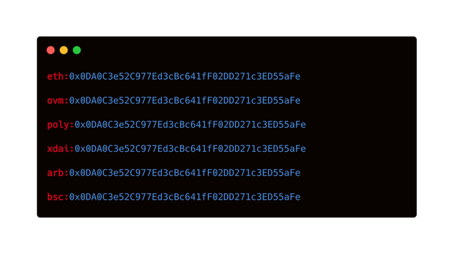

## Abstract

[ERC-3770](./eip-3770.md) introduces a new address standard to be adapted by wallets and dApps to display chain-specific addresses by using a human-reacable prefix.
  
## Motivation

The need for this proposal emerges from the increasing adoption of non-Ethereum Mainnet chains that use the Ethereum Virtual Machine (EVM). In this context, addresses become ambiguous, as the same address may refer to an EOA on chain X or a smart contract on chain Y. This will eventually lead to Ethereum users losing funds due to human error. For example, users sending funds to a smart contract wallet address which was not deployed on a particular chain.

Therefore we should prefix addresses with a unique identifier that signals to Dapps and wallets on what chain the target account is. In theory, this prefix could be a [EIP-155](./eip-155.md) chainID. However, these chain IDs are not meant to be displayed to users in dApps or wallets, and they were optimized for developer interoperability, rather than human readability.

## Specification

This proposal extends addresses with a human-readable blockchain short name.

### Syntax

A chain-specific address is prefixed with a chain shortName, separated with a colon sign (:).

Chain-specific address = "`shortName`" "`:`" "`address`"

- `shortName` = STRING

- `address` = STRING

### Semantics

```

`shortName` is mandatory and MUST be a valid chain short name from https://github.com/ethereum-lists/chains
  
`address` is mandatory and MUST be a [ERC-55](./eip-55.md) compatible hexadecimal address

```

### Examples



## Rationale

To solve the initial problem of user-facing addresses being ambiguous in a multichain context, we need to map EIP-155 chain IDs with a user-facing format of displaying chain identifiers.

## Backwards Compatibility

Ethereum addresses without the chain specifier will continue to require additional context to understand which chain the address refers to.

## Security Considerations

The Ethereum List curators must consider how similar looking chain short names can be used to confuse users.

## Copyright

Copyright and related rights waived via [CC0](../LICENSE.md).
