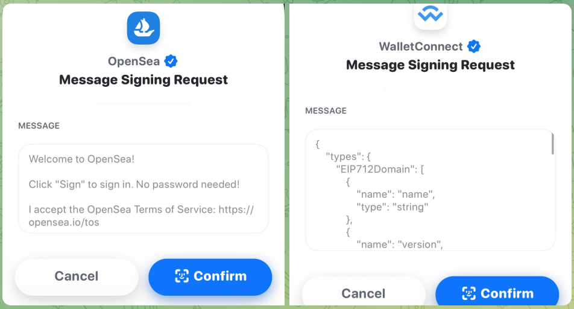

## Abstract

Sign-In with Ethereum describes how Ethereum accounts authenticate with off-chain services by signing a standard message format parameterized by scope, session details, and security mechanisms (e.g., a nonce). The goals of this specification are to provide a self-custodied alternative to centralized identity providers, improve interoperability across off-chain services for Ethereum-based authentication, and provide wallet vendors a consistent machine-readable message format to achieve improved user experiences and consent management.

## Motivation

When signing in to popular non-blockchain services today, users will typically use identity providers (IdPs) that are centralized entities with ultimate control over users' identifiers, for example, large internet companies and email providers. Incentives are often misaligned between these parties. Sign-In with Ethereum offers a new self-custodial option for users who wish to assume more control and responsibility over their own digital identity.

Already, many services support workflows to authenticate Ethereum accounts using message signing, such as to establish a cookie-based web session which can manage privileged metadata about the authenticating address. This is an opportunity to standardize the sign-in workflow and improve interoperability across existing services, while also providing wallet vendors a reliable method to identify signing requests as Sign-In with Ethereum requests for improved UX.

## Specification

The key words "MUST", "MUST NOT", "REQUIRED", "SHALL", "SHALL NOT", "SHOULD", "SHOULD NOT", "RECOMMENDED", "NOT RECOMMENDED", "MAY", and "OPTIONAL" in this document are to be interpreted as described in RFC 2119 and RFC 8174.

### Overview

Sign-In with Ethereum (SIWE) works as follows:

1. The relying party generates a SIWE Message and prefixes the SIWE Message with `\x19Ethereum Signed Message:\n<length of message>` as defined in [ERC-191](./eip-191.md).
2. The wallet presents the user with a structured plaintext message or equivalent interface for signing the SIWE Message with the [ERC-191](./eip-191.md) signed data format.
3. The signature is then presented to the relying party, which checks the signature's validity and SIWE Message content.
4. The relying party might further fetch data associated with the Ethereum address, such as from the Ethereum blockchain (e.g., ENS, account balances, [ERC-20](./eip-20.md)/[ERC-721](./eip-721.md)/[ERC-1155](./eip-1155.md) asset ownership), or other data sources that might or might not be permissioned.

### Message Format

#### ABNF Message Format

A SIWE Message MUST conform with the following Augmented Backus–Naur Form (ABNF, RFC 5234) expression (note that `%s` denotes case sensitivity for a string term, as per RFC 7405).

```abnf
sign-in-with-ethereum =
    [ scheme "://" ] domain %s" wants you to sign in with your Ethereum account:" LF
    address LF
    LF
    [ statement LF ]
    LF
    %s"URI: " uri LF
    %s"Version: " version LF
    %s"Chain ID: " chain-id LF
    %s"Nonce: " nonce LF
    %s"Issued At: " issued-at
    [ LF %s"Expiration Time: " expiration-time ]
    [ LF %s"Not Before: " not-before ]
    [ LF %s"Request ID: " request-id ]
    [ LF %s"Resources:"
    resources ]

scheme = ALPHA *( ALPHA / DIGIT / "+" / "-" / "." )
    ; See RFC 3986 for the fully contextualized
    ; definition of "scheme".

domain = authority
    ; From RFC 3986:
    ;     authority     = [ userinfo "@" ] host [ ":" port ]
    ; See RFC 3986 for the fully contextualized
    ; definition of "authority".

address = "0x" 40*40HEXDIG
    ; Must also conform to captilization
    ; checksum encoding specified in EIP-55
    ; where applicable (EOAs).

statement = *( reserved / unreserved / " " )
    ; See RFC 3986 for the definition
    ; of "reserved" and "unreserved".
    ; The purpose is to exclude LF (line break).

uri = URI
    ; See RFC 3986 for the definition of "URI".

version = "1"

chain-id = 1*DIGIT
    ; See EIP-155 for valid CHAIN_IDs.

nonce = 8*( ALPHA / DIGIT )
    ; See RFC 5234 for the definition
    ; of "ALPHA" and "DIGIT".

issued-at = date-time
expiration-time = date-time
not-before = date-time
    ; See RFC 3339 (ISO 8601) for the
    ; definition of "date-time".

request-id = *pchar
    ; See RFC 3986 for the definition of "pchar".

resources = *( LF resource )

resource = "- " URI
```

#### Message Fields

This specification defines the following SIWE Message fields that can be parsed from a SIWE Message by following the rules in [ABNF Message Format](#abnf-message-format):

- `scheme` OPTIONAL. The URI scheme of the origin of the request. Its value MUST be a RFC 3986 URI scheme.
- `domain` REQUIRED. The domain that is requesting the signing. Its value MUST be a RFC 3986 authority. The authority includes an OPTIONAL port. If the port is not specified, the default port for the provided `scheme` is assumed (e.g., 443 for HTTPS). If `scheme` is not specified, HTTPS is assumed by default.
- `address` REQUIRED. The Ethereum address performing the signing. Its value SHOULD be conformant to mixed-case checksum address encoding specified in [ERC-55](./eip-55.md) where applicable.
- `statement` OPTIONAL. A human-readable ASCII assertion that the user will sign which MUST NOT include `'\n'` (the byte `0x0a`).
- `uri` REQUIRED. An RFC 3986 URI referring to the resource that is the subject of the signing (as in the _subject of a claim_).
- `version` REQUIRED. The current version of the SIWE Message, which MUST be `1` for this specification.
- `chain-id` REQUIRED. The [EIP-155](./eip-155.md) Chain ID to which the session is bound, and the network where Contract Accounts MUST be resolved.
- `nonce` REQUIRED. A random string typically chosen by the relying party and used to prevent replay attacks, at least 8 alphanumeric characters.
- `issued-at` REQUIRED. The time when the message was generated, typically the current time. Its value MUST be an ISO 8601 datetime string.
- `expiration-time` OPTIONAL. The time when the signed authentication message is no longer valid. Its value MUST be an ISO 8601 datetime string.
- `not-before` OPTIONAL. The time when the signed authentication message will become valid. Its value MUST be an ISO 8601 datetime string.
- `request-id` OPTIONAL. An system-specific identifier that MAY be used to uniquely refer to the sign-in request.
- `resources` OPTIONAL. A list of information or references to information the user wishes to have resolved as part of authentication by the relying party. Every resource MUST be a RFC 3986 URI separated by `"\n- "` where `\n` is the byte `0x0a`.

#### Informal Message Template

A Bash-like informal template of the full SIWE Message is presented below for readability and ease of understanding, and it does not reflect the allowed optionality of the fields. Field descriptions are provided in the following section. A full ABNF description is provided in [ABNF Message Format](#abnf-message-format).

```
${scheme}:// ${domain} wants you to sign in with your Ethereum account:
${address}

${statement}

URI: ${uri}
Version: ${version}
Chain ID: ${chain-id}
Nonce: ${nonce}
Issued At: ${issued-at}
Expiration Time: ${expiration-time}
Not Before: ${not-before}
Request ID: ${request-id}
Resources:
- ${resources[0]}
- ${resources[1]}
...
- ${resources[n]}
```

#### Examples

The following is an example SIWE Message with an implicit scheme:

```
example.com wants you to sign in with your Ethereum account:
0xC02aaA39b223FE8D0A0e5C4F27eAD9083C756Cc2

I accept the ExampleOrg Terms of Service: https://example.com/tos

URI: https://example.com/login
Version: 1
Chain ID: 1
Nonce: 32891756
Issued At: 2021-09-30T16:25:24Z
Resources:
- ipfs://bafybeiemxf5abjwjbikoz4mc3a3dla6ual3jsgpdr4cjr3oz3evfyavhwq/
- https://example.com/my-web2-claim.json
```

The following is an example SIWE Message with an implicit scheme and explicit port:

```
example.com:3388 wants you to sign in with your Ethereum account:
0xC02aaA39b223FE8D0A0e5C4F27eAD9083C756Cc2

I accept the ExampleOrg Terms of Service: https://example.com/tos

URI: https://example.com/login
Version: 1
Chain ID: 1
Nonce: 32891756
Issued At: 2021-09-30T16:25:24Z
Resources:
- ipfs://bafybeiemxf5abjwjbikoz4mc3a3dla6ual3jsgpdr4cjr3oz3evfyavhwq/
- https://example.com/my-web2-claim.json
```

The following is an example SIWE Message with an explicit scheme:

```
https://example.com wants you to sign in with your Ethereum account:
0xC02aaA39b223FE8D0A0e5C4F27eAD9083C756Cc2

I accept the ExampleOrg Terms of Service: https://example.com/tos

URI: https://example.com/login
Version: 1
Chain ID: 1
Nonce: 32891756
Issued At: 2021-09-30T16:25:24Z
Resources:
- ipfs://bafybeiemxf5abjwjbikoz4mc3a3dla6ual3jsgpdr4cjr3oz3evfyavhwq/
- https://example.com/my-web2-claim.json
```

### Signing and Verifying Messages with Ethereum Accounts

- For Externally Owned Accounts (EOAs), the verification method specified in [ERC-191](./eip-191.md) MUST be used.

- For Contract Accounts,
    - The verification method specified in [ERC-1271](./eip-1271.md) SHOULD be used, and if it is not, the implementer MUST clearly define the verification method to attain security and interoperability for both wallets and relying parties.
    - When performing [ERC-1271](./eip-1271.md) signature verification, the contract performing the verification MUST be resolved from the specified `chain-id`.
    - Implementers SHOULD take into consideration that [ERC-1271](./eip-1271.md) implementations are not required to be pure functions, and can return different results for the same inputs depending on blockchain state. This can affect the security model and session validation rules. For example, a service with [ERC-1271](./eip-1271.md) signing enabled could rely on webhooks to receive notifications when state affecting the results is changed. When it receives a notification, it invalidates any matching sessions.

### Resolving Ethereum Name Service (ENS) Data

- The relying party or wallet MAY additionally perform resolution of ENS data, as this can improve the user experience by displaying human-friendly information that is related to the `address`. Resolvable ENS data include:
    - The [primary ENS name](./eip-181.md).
    - The ENS avatar.
    - Any other resolvable resources specified in the ENS documentation.
- If resolution of ENS data is performed, implementers SHOULD take precautions to preserve user privacy and consent, as their `address` could be forwarded to third party services as part of the resolution process.

### Relying Party Implementer Steps

#### Specifying the Request Origin

- The `domain` and, if present, the `scheme`, in the SIWE Message MUST correspond to the origin from where the signing request was made. For instance, if the signing request is made within a cross-origin iframe embedded in a parent browser window, the `domain` (and, if present, the `scheme`) have to match the origin of the iframe, rather than the origin of the parent. This is crucial to prevent the iframe from falsely asserting the origin of one of its ancestor windows for security reasons. This behavior is enforced by conforming wallets.

#### Verifying a signed Message

- The SIWE Message MUST be checked for conformance to the ABNF Message Format in the previous sections, checked against expected values after parsing (e.g., `expiration-time`, `nonce`, `request-uri` etc.), and its signature MUST be checked as defined in [Signing and Verifying Messages with Ethereum Accounts](#signing-and-verifying-messages-with-ethereum-accounts).

#### Creating Sessions

- Sessions MUST be bound to the `address` and not to further resolved resources that can change.

#### Interpreting and resolving Resources

- Implementers SHOULD ensure that that URIs in the listed `resources` are human-friendly when expressed in plaintext form.
- The intepretation of the listed `resources` in the SIWE Message is out of scope of this specification.

### Wallet Implementer Steps

#### Verifying the Message Format

- The full SIWE message MUST be checked for conformance to the ABNF defined in [ABNF Message Format](#abnf-message-format).
- Wallet implementers SHOULD warn users if the substring `"wants you to sign in
  with your Ethereum account"` appears anywhere in an [ERC-191](./eip-191.md) message signing
  request unless the message fully conforms to the format defined [ABNF Message Format](#abnf-message-format).

#### Verifying the Request Origin

- Wallet implementers MUST prevent phishing attacks by verifying the origin of the request against the `scheme` and `domain` fields in the SIWE Message. For example, when processing the SIWE message beginning with `"example.com wants you to sign in..."`, the wallet checks that the request actually originated from `https://example.com`.
- The origin SHOULD be read from a trusted data source such as the browser window or over WalletConnect ([ERC-1328](./eip-1328.md)) sessions for comparison against the signing message contents.
- Wallet implementers MAY warn instead of rejecting the verification if the origin is pointing to localhost.

The following is a RECOMMENDED algorithm for Wallets to conform with the requirements on request origin verification defined by this specification.

The algorithm takes the following input variables:

- fields from the SIWE message.
- `origin` of the signing request - in the case of a browser wallet implementation - the origin of the page which requested the signin via the provider.
- `allowedSchemes` - a list of schemes allowed by the Wallet.
- `defaultScheme` - a scheme to assume when none was provided. Wallet implementers in the browser SHOULD use `https`.
- developer mode indication - a setting deciding if certain risks should be a warning instead of rejection. Can be manually configured or derived from `origin` being localhost.

The algorithm is described as follows:

- If `scheme` was not provided, then assign `defaultScheme` as `scheme`.
- If `scheme` is not contained in `allowedSchemes`, then the `scheme` is not expected and the Wallet MUST reject the request. Wallet implementers in the browser SHOULD limit the list of `allowedSchemes` to just `'https'` unless a developer mode is activated.
- If `scheme` does not match the scheme of `origin`, the Wallet SHOULD reject the request. Wallet implementers MAY show a warning instead of rejecting the request if a developer mode is activated. In that case the Wallet continues processing the request.
- If the `host` part of the `domain` and `origin` do not match, the Wallet MUST reject the request unless the Wallet is in developer mode. In developer mode the Wallet MAY show a warning instead and continues procesing the request.
- If `domain` and `origin` have mismatching subdomains, the Wallet SHOULD reject the request unless the Wallet is in developer mode. In developer mode the Wallet MAY show a warning instead and continues procesing the request.
- Let `port` be the port component of `domain`, and if no port is contained in `domain`, assign `port` the default port specified for the `scheme`.
- If `port` is not empty, then the Wallet SHOULD show a warning if the `port` does not match the port of `origin`.
- If `port` is empty, then the Wallet MAY show a warning if `origin` contains a specific port. (Note 'https' has a default port of 443 so this only applies if `allowedSchemes` contain unusual schemes)
- Return request origin verification completed.

#### Creating Sign-In with Ethereum Interfaces

- Wallet implementers MUST display to the user the following fields from the SIWE Message request by default and prior to signing, if they are present: `scheme`, `domain`, `address`, `statement`, and `resources`. Other present fields MUST also be made available to the user prior to signing either by default or through an extended interface.
- Wallet implementers displaying a plaintext SIWE Message to the user SHOULD require the user to scroll to the bottom of the text area prior to signing.
- Wallet implementers MAY construct a custom SIWE user interface by parsing the ABNF terms into data elements for use in the interface. The display rules above still apply to custom interfaces.

#### Supporting internationalization (i18n)

- After successfully parsing the message into ABNF terms, translation MAY happen at the UX level per human language.

## Rationale

### Requirements

Write a specification for how Sign-In with Ethereum should work. The specification should be simple and generally follow existing practices. Avoid feature bloat, particularly the inclusion of lesser-used projects who see getting into the specification as a means of gaining adoption. The core specification should be decentralized, open, non-proprietary, and have long-term viability. It should have no dependence on a centralized server except for the servers already being run by the application that the user is signing in to. The basic specification should include: Ethereum accounts used for authentication, ENS names for usernames (via reverse resolution), and data from the ENS name’s text records for additional profile information (e.g. avatar, social media handles, etc).

Additional functional requirements:

1. The user must be presented a human-understandable interface prior to signing, mostly free of machine-targeted artifacts such as JSON blobs, hex codes (aside from the Ethereum address), and baseXX-encoded strings.
2. The application server must be able to implement fully usable support for its end without forcing a change in the wallets.
3. There must be a simple and straightforward upgrade path for both applications and wallets already using Ethereum account-based signing for authentication.
4. There must be facilities and guidelines for adequate mitigation of Man-in-the-Middle (MITM) attacks, replay attacks, and malicious signing requests.

### Design Goals

1. Human-Friendly
2. Simple to Implement
3. Secure
4. Machine Readable
5. Extensible

### Technical Decisions

- Why [ERC-191](./eip-191.md) (Signed Data Standard) over [EIP-712](./eip-712.md) (Ethereum typed structured data hashing and signing)
    - [ERC-191](./eip-191.md) is already broadly supported across wallets UX, while [EIP-712](./eip-712.md) support for friendly user display is pending. **(1, 2, 3, 4)**
    - [ERC-191](./eip-191.md) is simple to implement using a pre-set prefix prior to signing, while [EIP-712](./eip-712.md) is more complex to implement requiring the further implementations of a bespoke Solidity-inspired type system, RLP-based encoding format, and custom keccak-based hashing scheme. **(2)**
    - [ERC-191](./eip-191.md) produces more human-readable messages, while [EIP-712](./eip-712.md) creates signing outputs for machine consumption, with most wallets not displaying the payload to be signed in a manner friendly to humans. **(1)**

    - [EIP-712](./eip-712.md) has the advantage of on-chain representation and on-chain verifiability, such as for their use in metatransactions, but this feature is not relevant for the specification's scope. **(2)**
- Why not use JWTs? Wallets don't support JWTs. The keccak hash function is not assigned by IANA for use as a JOSE algorithm. **(2, 3)**
- Why not use YAML or YAML with exceptions? YAML is loose compared to ABNF, which can readily express character set limiting, required ordering, and strict whitespacing. **(2, 3)**

### Out of Scope

The following concerns are out of scope for this version of the specification to define:

- Additional authentication not based on Ethereum addresses.
- Authorization to server resources.
- Interpretation of the URIs in the `resources` field as claims or other resources.
- The specific mechanisms to ensure domain-binding.
- The specific mechanisms to generate nonces and evaluation of their appropriateness.
- Protocols for use without TLS connections.

### Considerations for Forwards Compatibility

The following items are considered for future support in either through an iteration of this specification or new work items using this specification as a dependency.

- Possible support for Decentralized Identifiers and Verifiable Credentials.
- Possible cross-chain support.
- Possible SIOPv2 support.
- Possible future support for [EIP-712](./eip-712.md).
- Version interpretation rules, e.g., sign with minor revision greater than understood, but not greater major version.

## Backwards Compatibility

- Most wallet implementations already support [ERC-191](./eip-191.md), so this is used as a base pattern with additional features.
- Requirements were gathered from existing implementations of similar sign-in workflows, including statements to allow the user to accept a Terms of Service, nonces for replay protection, and inclusion of the Ethereum address itself in the message.

## Reference Implementation

A reference implementation is available [here](../assets/eip-4361/example.js).

## Security Considerations

### Identifier Reuse

- Towards perfect privacy, it would be ideal to use a new uncorrelated identifier (e.g., Ethereum address) per digital interaction, selectively disclosing the information required and no more.
- This concern is less relevant to certain user demographics who are likely to be early adopters of this specification, such as those who manage an Ethereum address and/or ENS names intentionally associated with their public presence. These users often prefer identifier reuse to maintain a single correlated identity across many services.
- This consideration will become increasingly important with mainstream adoption. There are several ways to move towards this model, such as using HD wallets, signed delegations, and zero-knowledge proofs. However, these approaches are out of scope for this specification and better suited for follow-on specifications.

### Key Management

- Sign-In with Ethereum gives users control through their keys. This is additional responsibility that mainstream users may not be accustomed to accepting, and key management is a hard problem especially for individuals. For example, there is no "forgot password" button as centralized identity providers commonly implement.
- Early adopters of this specification are likely to be already adept at key management, so this consideration becomes more relevant with mainstream adoption.
- Certain wallets can use smart contracts and multisigs to provide an enhanced user experiences with respect to key usage and key recovery, and these can be supported via [ERC-1271](./eip-1271.md) signing.

### Wallet and Relying Party combined Security

- Both the wallet and relying party have to implement this specification for improved security to the end user. Specifically, the wallet has to confirm that the SIWE Message is for the correct request origin or provide the user means to do so manually (such as instructions to visually confirming the correct domain in a TLS-protected website prior to connecting via QR code or deeplink), otherwise the user is subject to phishing attacks.

### Minimizing Wallet and Server Interaction

- In some implementions of wallet sign-in workflows, the server first sends parameters of the SIWE Message to the wallet. Others generate the SIWE message for signing entirely in the client side (e.g., dapps). The latter approach without initial server interaction SHOULD be preferred when there is a user privacy advantage by minimizing wallet-server interaction. Often, the backend server first produces a `nonce` to prevent replay attacks, which it verifies after signing. Privacy-preserving alternatives are suggested in the next section on preventing replay attacks.
- Before the wallet presents the SIWE message signing request to the user, it MAY consult the server for the proper contents of the message to be signed, such as an acceptable `nonce` or requested set of `resources`. When communicating to the server, the wallet SHOULD take precautions to protect user privacy by mitigating user information revealed as much as possible.
- Prior to signing, the wallet MAY consult the user for preferences, such as the selection of one `address` out of many, or a preferred ENS name out of many.

### Preventing Replay Attacks

- A `nonce` SHOULD be selected per session initiation with enough entropy to prevent replay attacks, a man-in-the-middle attack in which an attacker is able to capture the user's signature and resend it to establish a new session for themselves.
- Implementers MAY consider using privacy-preserving yet widely-available `nonce` values, such as one derived from a recent Ethereum block hash or a recent Unix timestamp.

### Preventing Phishing Attacks

- To prevent phishing attacks Wallets have to implement request origin verification as described in [Verifying the Request Origin](#verifying-the-request-origin).

### Channel Security

- For web-based applications, all communications SHOULD use HTTPS to prevent man-in-the-middle attacks on the message signing.
- When using protocols other than HTTPS, all communications SHOULD be protected with proper techniques to maintain confidentiality, data integrity, and sender/receiver authenticity.

### Session Invalidation

There are several cases where an implementer SHOULD check for state changes as they relate to sessions.

- If an [ERC-1271](./eip-1271.md) implementation or dependent data changes the signature computation, the server SHOULD invalidate sessions appropriately.
- If any resources specified in `resources` change, the server SHOULD invalidate sessions appropriately. However, the interpretation of `resources` is out of scope of this specification.

### Maximum Lengths for ABNF Terms

- While this specification does not contain normative requirements around maximum string lengths, implementers SHOULD choose maximum lengths for terms that strike a balance across the prevention of denial of service attacks, support for arbitrary use cases, and user readability.

## Copyright

Copyright and related rights waived via [CC0](../LICENSE.md).
