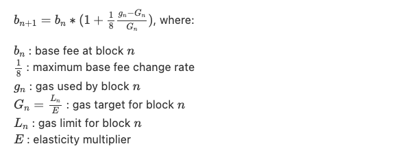
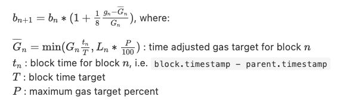
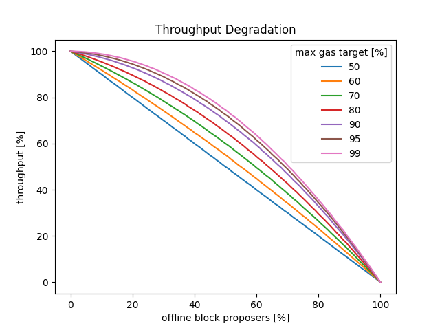
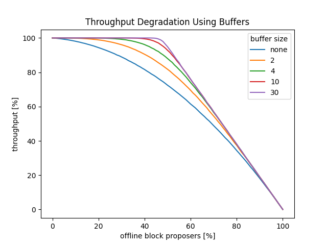
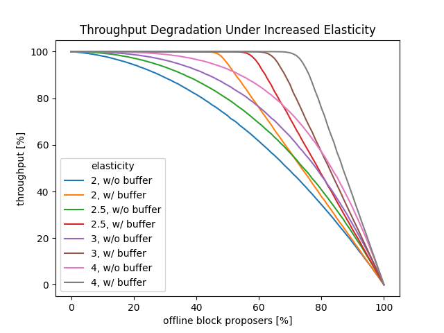

## Abstract
This EIP proposes accounting for time between blocks in the base fee calculation to target a stable throughput by time, instead of by block. Aiming to minimize changes to the calculation, it only introduces a variable block gas target proportional to the block time. The EIP can, in principle, be applied to either a Proof-of-Work or a Proof-of-Stake chain, however the security implications for the Proof-of-Work case remain unexplored.

## Motivation

The current base fee calculation chooses the gas usage of a block as the signal to determine whether demand for block space is too low (indicating that the base fee should be lowered) or too high (indicating that the base fee should be increased). While simple, this choice of signal has drawbacks: it does not take the block time into account. Assuming a relatively constant demand, a proposer constructing a block after 20 seconds will have transactions available with twice the gas of a proposer constructing a block after 10 seconds. Using the same gas target for both is accordingly sub-optimal. In practice, there are several undesirable consequences of this flawed signal:

### Base Fee Volatility Under Proof-of-Work

Under Proof-of-Work (PoW), block times are stochastic, and for that reason there exists large block time variability. This variability contributes to the base fee volatility, where the base fee can be expected to oscillate around the equilibrium value even under perfectly stable demand.

### Missed Slots

Under Proof-of-Stake (PoS), block times are ideally uniform (always 12s), but missed slots lead to individual blocks with increased block time (24s, 36s, ...). Such missed slots will result in the next block being overfull, and with the current update rule, signal a fake demand spike and thus cause a small unwarranted base fee spike.

More importantly, these missed slots directly reduce the overall throughput of the execution chain by the gas target of one block. While the next block can be expected to include the "delayed" transactions of the missed slot, the resulting base fee spike then results in some number of under-full blocks. In the end the block space of the missed slot is lost for the chain.

This is particularly problematic because a Denial-of-Service (DoS) attack on block proposers can cause them to miss slots, and compromises the overall chain performance.

### Throughput Degradation During Consensus Issues

A more severe version of individual missed slots can be caused by consensus issues that prevent a significant portion of block proposers from continuing to create blocks. This can be due to block proposers forking off (and creating blocks on their own fork), being unable to keep up with the current chain head for another reason, or simply being unable to create valid blocks.

In all these situations, average block times go up significantly, causing chain throughput to fall by the same fraction. While this effect is already present under PoW, the self-healing mechanism of difficulty adjustments is relatively quick to kick in and restore normal block times. On the other hand, under PoS the automatic self-healing mechanism can be extremely slow: potentially several months to return to normal with up to a third of slots missed, or several weeks if more than a third of slots are missed.

For all these reasons, it would be desirable to target a stable throughput per time instead of per block, by taking block time into account during the base fee calculation.

To maximize the chance of this EIP being included in the merge fork, the adjustments are kept to a minimum, with more involved changes discussed in the rationale section.

## Specification
Using the pseudocode language of [EIP-1559](./eip-1559.md), the updated base fee calculation becomes:

```python
...

BASE_FEE_MAX_CHANGE_DENOMINATOR = 8
BLOCK_TIME_TARGET = 12
MAX_GAS_TARGET_PERCENT = 95

class World(ABC):
    def validate_block(self, block: Block) -> None:
        parent_gas_limit = self.parent(block).gas_limit
        parent_block_time = self.parent(block).timestamp - self.parent(self.parent(block)).timestamp
        parent_base_gas_target = parent_gas_limit // ELASTICITY_MULTIPLIER
        parent_adjusted_gas_target = min(parent_base_gas_target * parent_block_time // BLOCK_TIME_TARGET, parent_gas_limit * MAX_GAS_TARGET_PERCENT // 100)
        parent_base_fee_per_gas = self.parent(block).base_fee_per_gas
        parent_gas_used = self.parent(block).gas_used

        ...

        if parent_gas_used == parent_adjusted_gas_target:
            expected_base_fee_per_gas = parent_base_fee_per_gas
        elif parent_gas_used > parent_adjusted_gas_target:
            gas_used_delta = parent_gas_used - parent_adjusted_gas_target
            base_fee_per_gas_delta = max(parent_base_fee_per_gas * gas_used_delta // parent_base_gas_target // BASE_FEE_MAX_CHANGE_DENOMINATOR, 1)
            expected_base_fee_per_gas = parent_base_fee_per_gas + base_fee_per_gas_delta
        else:
            gas_used_delta = parent_adjusted_gas_target - parent_gas_used
            base_fee_per_gas_delta = parent_base_fee_per_gas * gas_used_delta // parent_base_gas_target // BASE_FEE_MAX_CHANGE_DENOMINATOR
            expected_base_fee_per_gas = parent_base_fee_per_gas - base_fee_per_gas_delta
        
        ...

    ...
```

## Rationale

### Mechanism

The proposed new base fee calculation only adjusts the block gas target by scaling it with the block time, capped at a maximum percent of the overall block gas limit:

#### Current Base Fee Calculation



#### Proposed Base Fee Calculation



This new calculation thus targets a stable throughput per time instead of per block.

### Limitations

Under PoS, block time increases always come in multiples of full blocks (e.g. a single missed slot = 24s instead of 12s block time). Accounting for this already requires doubling the block gas target, even for a single missed slot. However, with the block elasticity currently set to 2, this target would be equal to the block gas limit. Having the new target equal to the block gas limit is less than ideal, and thus is reduced slightly, according to the `MAX_GAS_TARGET_PERCENT` parameter. The reason for the existence of this parameter is twofold:

- Ensure that the signal remains meaningful: A target equal to or greater than the gas limit could never be reached, so the base fee would always be reduced after a missed slot.
- Ensure that the base fee can still react to genuine demand increases: During times of many offline block proposers (and thus many missed slots), genuine demand increases still need a way to eventually result in a base fee increase, to avoid a fallback to a first-price priority fee auction.

However, this means that even a single missed slot cannot be fully compensated. Even worse, any second or further sequential missed slot cannot be compensated for at all, as the gas target is already at its max. This effect becomes more pronounced as the share of offline validators increases:



As can be observed, while this EIP does indeed increase the robustness of the network throughput in cases of offline validators, it does so imperfectly. Furthermore, there is a tradeoff effected by the `MAX_GAS_TARGET_PERCENT` parameter, with a higher value resulting in a higher network robustness, but a more impaired base fee adjustment mechanism during times of frequent missed slots.

### Possible Extensions

These limitations directly result from the design goal of a minimal change, to maximize chances of being included in the merge. There are natural ways of extending the EIP design to more effectively handle offline validators, at the expense of somewhat more extensive changes:

#### Persistent Multi-Slot Buffer

To be able to compensate multiple consecutive missed slots, a gas buffer could be introduced, that would allow the gas beyond the block elasticity to be carried forward to future blocks. To avoid long-run buffer accumulation that would delay a return to normal operations once block proposers are back online, a cap on the buffer would be added. Even for a relatively small buffer cap, the throughput robustness is significantly improved:



With an elasticity still at 2, there is no way of avoiding the eventual breakdown for more than 50% offline block proposers.

The main implementation complexity for this approach comes from the introduction of the buffer as a new persistent field. To retain the ability for calculating base fees only based on headers, it would have to be added to the block header.

#### Increased Block Elasticity

In addition to the introduction of a buffer, increasing the block elasticity is another tool for increasing throughput robustness. The following diagram shows the effect of different elasticity levels, both in the presence and absence of a persistent buffer:



Again, a clear positive effect can be observed.

The main additional complexity here would come from the increased peak load (networking, compute & disk access) of multiple sequential overfull blocks. Note though that PoS with its minimum block time of 12s significantly reduces worst case peak stress as compared to PoW.

## Backwards Compatibility

The EIP has minimal impact on backwards compatibility, only requiring updates to existing base fee calculation tooling.

## Test Cases
tbd

## Reference Implementation
tbd

## Security Considerations

### Timestamp Manipulation

Under PoW, miners are in control over the timestamp field of their blocks. While there are some enforced limits to valid timestamps, implications regarding potential timestamp manipulation are nontrivial and remain unexplored for this EIP.

Under PoS, each slot has a [fixed assigned timestamp](https://github.com/ethereum/consensus-specs/blob/v1.1.3/specs/merge/beacon-chain.md#process_execution_payload), rendering any timestamp manipulation by block proposers impossible.

### Suppressing Base Fee Increases
As discussed in the rationale, a high value for `MAX_GAS_TARGET_PERCENT` during times of many offline block proposers results in a small remaining signal space for genuine demand increases that should result in base fee increases. This in turn decreases the cost for block proposers for suppresing these base fee increases, instead forcing the fallback to a first-price priority fee auction.

While the arguments of incentive incompatibility for base fee suppression of the the base EIP-1559 case still apply here, with a decreasing cost of this individually irrational behavior the risk for overriding psychological factors becomes more significant.

Even in such a case the system degradation would however be graceful, as it would only temporarily suspend the base fee burn. As soon as the missing block proposers would come back online, the system would return to its ordinary EIP-1559 equilibrium.

## Copyright
Copyright and related rights waived via [CC0](../LICENSE.md).
