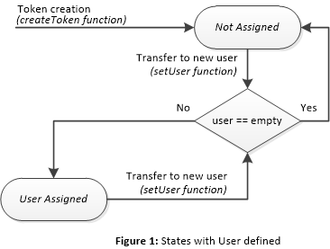
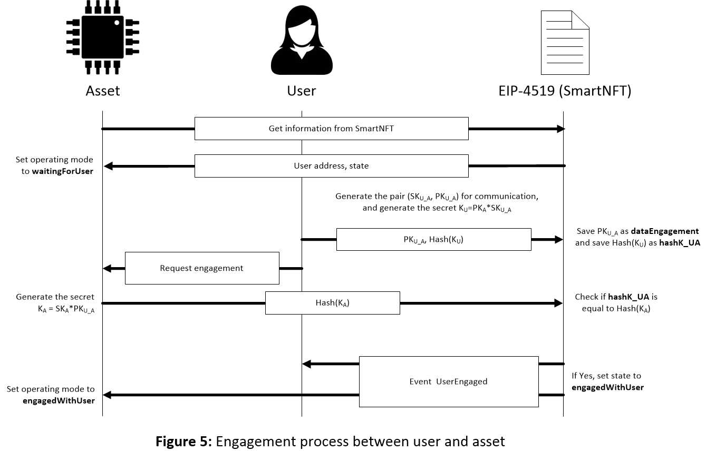

## Abstract
This EIP proposes a Non-Fungible Token Standard to represent a physical asset, such as an Internet of Things (IoT) device. A SmartNFT is tied to a physical asset which can check if the tie is authentic or not. The SmartNFT can include an Ethereum address of the physical asset, consequently the physical asset can sign messages or transactions. Likewise, the physical asset can operate with an operating mode that is defined by its SmartNFT with an attribute named state. The token state can define if the token owner or the token user can use the asset or not. A cryptographically secure mutual authentication process can be carried out between the physical asset and its owner or its user. SmartNFTs extend [ERC-721](./eip-721.md) non-fungible tokens, which only allow representing assets by a unique identifier, but not an Ethereum address, and include owners but not users.
 
## Motivation
This SmartNFT was developed because the ERC-721 standard does not include the users of an asset (only include the owners) and does not include the Ethereum address of the asset. Smart assets (for example, IoT devices) are increasing nowadays. If smart assets are tied to SmartNFTs then they can be managed in a secure and traceable way. The reason is that SmartNFTs, unlike ERC-721, allow establishing secure communication channels between the physical asset and its owner and its user. In this way, assets, owners and users can be assured of exchanging information only with trusted parties.

**Secure Physical Asset Tied to a SmartNFT**
Current non-fungible tokens are associated with passive assets, either virtual or physical things, but they do not include any standardized mechanism to tie the non-fungible token to the asset. Tying physical assets to NFTs is interesting because the asset can know anytime its owner, user, operating mode, and how to establish secure communication channels with its owner and user. The assets, owners and users are identified by their Ethereum addresses and the Ethereum address of the asset can be obtained from a unique physical property of the physical asset. The asset can be an active part in any transfer of ownership and use. In addition, the asset is smart, for example to not obey orders from a non-authorized user, or to be inoperative until the authentication with the user or the owner is carried out.

**User Management Mechanism**
SmartNFTs allow implementing a new and useful user management mechanism. In the last few years, many projects concerning assets sharing (for example, vehicles) have been created and developed. SmartNFTs incorporate the Ethereum account of the user as another attribute of the token in order to distinguish between the user, who employs the asset for a specific application, and the owner, who assigns the token to users. Hence, both users and owners can be traced by the blockchain.

**Secure Key Exchange Mechanism**
The engagement of the asset with an owner or a user is carried out after a mutual authentication protocol (for example, based on elliptic curve Diffie-Hellman key exchange protocol). This protocol can be employed for a key agreement between the asset and its owner, in the one side, and the asset and its user, in the other side. 

## Specification
The attributes asset and user include, respectively, the Ethereum addresses of the physical asset and the user. Asset and user are optional attributes but at least one of them should be used in a SmartNFT. In the case of using only the attribute user, two states define if the token is assigned or not to a user. Figure 1 shows the corresponding states in a flow chart. When a token is created, transferred or unassigned, the token state is set to “notAssigned”. If the token is assigned to a valid user, the state is set to "userAssigned".


  
In the case of defining the attribute asset but not the attribute user, two states define if the token is waiting for authentication with the owner or if authentication has finished successfully. Figure 2 shows the corresponding states in a flow chart. When a token is created or transferred to a new owner, then the token changes its state to "waitingForOwner". In this state, the token is waiting for the mutual authentication between the asset and the owner. Once authentication is finished successfully, the token changes its state to "engagedWithOwner".


 
Finally, if both the asset and user attributes are defined, the states define if the asset has been authenticated or not by the owner or the user (waitingForOwner, engagedWithOwner, waitingForUser and engagedWithUser). The flow chart in Figure 3 shows all the possible state changes. The states related to the owner are the same as in Figure 2. The difference is that, from the state “EngagedWithOwner”, the token can be assigned to a user. When a user is assigned, from the states "EngagedWithOwner", "waitingForUser" or "engagedWithUser", the token changes its state to "waitingForUser". Once the asset is authenticated by the user, the state of its associated token is set to "engagedWithUser", and the user is able to use the token or asset.

 
 
In order to complete an ownership transfer of a token, the new owner must carry out a mutual authentication process with the asset, which is off-chain with the asset and on-chain with the token, by using their Ethereum addresses. Similarly, a new user must carry out a mutual authentication process with the asset to complete a use transfer. SmartNFTs define how the authentication processes start and finish. These authentication processes allow deriving fresh session cryptographic keys for secure communication between assets and owners, and between assets and users. Therefore, the trustworthiness of the assets can be traced even if new owners and users manage them. 
 
When the SmartNFT is created or when the ownership is transferred, the operating mode of the asset defined by the token state is "waitingForOwner". Assuming that the asset is an electronic physical asset, it saves in its memory the owner address. The owner generates a pair of keys using the elliptic curve secp256k1 and the primitive element P used on this curve: a secret key (SK<sub>O_D</sub>) and a Public Key (PK<sub>O_D</sub>), so that PK<sub>O_D</sub> = SK<sub>O_D</sub>*P. To generate the shared key between the owner and the asset, (K<sub>O</sub>), the public key of the asset, (PK<sub>DEV</sub>), is employed as follows:

K<sub>O</sub>=PK<sub>DEV</sub>*SK<sub>O_D</sub>

Using the function startOwnerEngagement, the owner saves PK<sub>O_D</sub> as the attribute dataEngagement and the hash of K<sub>O</sub> as the attribute hashK_OD in the SmartNFT. The owner sends PK<sub>O_D</sub> signed to the asset. The asset checks the signature and PK<sub>O_D</sub> on the attribute dataEngagement of its token to verify the identity of the owner and calculates:

K<sub>O_D</sub> = SK<sub>DEV</sub>*PK<sub>O_D</sub>

If everything is correctly done, K<sub>O</sub> and K<sub>O_D</sub> are the same since:

K<sub>O</sub>=PK<sub>DEV</sub>*SK<sub>O_D</sub>=(SK<sub>DEV</sub>*P)*SK<sub>O_D</sub>= SK<sub>DEV</sub>*(SK<sub>O_D</sub>*P)=SK<sub>DEV</sub>*PK<sub>O_D</sub>

Using the function ownerEngagement, the asset sends the K<sub>O_D</sub> obtained and if it is the same than K<sub>O</sub>, then the state of the token changes to "engagedWithOwner" and the event OwnerEngaged is sent. Once the asset receives the event, it changes its operation mode to "engagedWith Owner". This process is shown in Figure 4. From this moment, the asset can be managed by the owner. 

 

If the asset consults the blockchain and the state of its SmartNFT is "waitingForUser", the asset (assuming it is an electronic physical asset) saves in its memory the user address. Then, a mutual authentication process is carried out with the user, as already done with the owner. If the user verifies the asset, the user sends the transaction associated with the function startUserEngagement. As in starOwnerEngagement, this function saves the public key generated by the user, PK<sub>U_D</sub>, as the attribute dataEngagement and the hash of K<sub>U</sub>=PK<sub>DEV</sub>*SK<sub>U_D</sub> as the attribute hashK_UD in the SmartNFT.

The user sends PK<sub>U_D</sub> signed to the asset. The latter checks the signature and PK<sub>U_D</sub> on the attribute dataEngagement of its token. If the user is verified, the asset calculates:
K<sub>U_D</sub> = SK<sub>DEV</sub>*PK<sub>U_D</sub>:

If everything is correctly done, K<sub>U</sub> and K<sub>U_D</sub> are the same since:
K<sub>U</sub>=PK<sub>DEV</sub>*SK<sub>U_D</sub>=(SK<sub>DEV</sub>*P)*SK<sub>U_D</sub>= SK<sub>DEV</sub>*(SK<sub>U_D</sub>*P)=SK<sub>DEV</sub>*PK<sub>U_D</sub>

Using the function userEngagement, the asset sends the K<sub>U_D</sub> obtained and if it is the same as K<sub>U</sub>, then the state of the token changes to "engagedWithUser" and the event UserEngaged is sent. Once the asset receives the event, it changes its operation mode to "engagedWithUser". This process is shown in Figure 5. From this moment, the asset can be managed by the user. 

 

Since the establishment of a shared secret is very important for a secure communication, SmartNFTs include the attributes hashK_OD, hashK_UD and dataEngagement. The first two attributes define, respectively, the hash of the secret shared between the asset and its owner and between the asset and its user. Assets, owners and users should check they are using the correct shared secrets. The attribute dataEngagement defines the public data needed for the agreement. If the mutual authentication fails, dataEngagement allows detecting which part failed. 

```solidity
pragma solidity ^0.8.0;

 /// @title SmartNFT: Extension of ERC-721 Non-Fungible Token Standard. 
///  Note: the ERC-165 identifier for this interface is 0x8a68abe3
 interface SmartNFT is ERC721/*,ERC165*/{
    /// @dev This emits when the NFT is assigned as utility of a new user.
    ///  This event emits when the user of the token changes.
    ///  (`_addressUser` == 0) when no user is assigned.
    event UserAssigned(uint256 indexed tokenID, address indexed _addressUser);
    
    /// @dev This emits when user and asset finish mutual authentication process successfully.
    ///  This event emits when both the user and the asset prove they share a secure communication channel.
    event UserEngaged(uint256 indexed tokenID);
    
    /// @dev This emits when owner and asset finish mutual authentication process successfully.
    ///  This event emits when both the owner and the asset prove they share a secure communication channel.
    event OwnerEngaged(uint256 indexed tokenID);
    
    /// @dev This emits when it is checked that the timeout has expired.
    ///  This event emits when the timestamp of the SmartNFT is not updated in timeout.
    event TimeoutAlarm(uint256 indexed tokenID);

    /// @notice This function defines how the NFT is assigned as utility of a new user (if user is defined).
    /// @dev Only the owner of the SmartNFT can assign a user. If asset is defined, then the state of the token must be
    /// "engagedWithOwner","waitingForUser" or "engagedWithUser" and this function changes the state of the token defined by "_tokenID" to
    /// "waitingForUser". If asset is not defined, the state is set to "userAssigned". In both cases, this function sets the parameter 
    /// "addressUser" to "_addressUser". 
    /// @param _tokenId is the tokenID of the SmartNFT bound to the asset.
    /// @param _addressUser is the address of the new user.
    function setUser(uint256 _tokenId, address _addressUser) external; 

    /// @notice This function defines the initialization of the mutual authentication process between the owner and the asset.
    /// @dev Only the owner of the token can start this authentication process if asset is defined and the state of the token is "waitingForOwner".
    /// The function does not change the state of the token and saves "_dataEngagement" 
    /// and "_hashK_O" in the parameters of the token.
    /// @param _tokenId is the tokenID of the SmartNFT bound to the asset.
    /// @param _dataEngagement is the public data proposed by the owner for the agreement of the shared key.
    /// @param _hashK_O is the hash of the secret proposed by the owner to share with the asset.
    function startOwnerEngagement(uint256 _tokenId, uint256 _dataEngagement, uint256 _hashK_O) external;
 
    /// @notice This function completes the mutual authentication process between the owner and the asset.
    /// @dev Only the asset bound to the token can finish this authentication process provided that the state of the token is
    /// "waitingForOwner" and dataEngagement is different from 0. This function compares hashK_O saved in
    /// the token with hashK_A. If they are equal then the state of the token changes to "engagedWithOwner", dataEngagement is set to 0,
    /// and the event "OwnerEngaged" is emitted.
    /// @param _hashK_A is the hash of the secret generated by the asset to share with the owner.
    function ownerEngagement(uint256 _hashK_A) external; 
 
    /// @notice This function defines the initialization of the mutual authentication process between the user and the asset.
    /// @dev Only the user of the token can start this authentication process if asset and user are defined and
    /// the state of the token is "waitingForUser". The function does not change the state of the token and saves "_dataEngagement" 
    /// and "_hashK_U" in the parameters of the token.
    /// @param _tokenId is the tokenID of the SmartNFT bound to the asset.
    /// @param _dataEngagement is the public data proposed by the user for the agreement of the shared key.
    /// @param _hashK_U is the hash of the secret proposed by the user to share with the asset.
    function startUserEngagement(uint256 _tokenId, uint256 _dataEngagement, uint256 _hashK_U) external;
    
    /// @notice This function completes the mutual authentication process between the user and the asset.
    /// @dev Only the asset bound to the token can finish this authentication process provided that the state of the token is
    /// "waitingForUser" and dataEngagement if different from 0. This function compares hashK_U saved in
    /// the token with hashK_A. If they are equal then the state of the token changes to "engagedWithUser", dataEngagement is set to 0,
    /// and the event "UserEngaged" is emitted.
    /// @param _hashK_A is the hash of the secret generated by the asset to share with the user.
    function userEngagement(uint256 _hashK_A) external; 
 
    /// @notice This function checks if the timeout has expired.
    /// @dev Everybody can call this function to check if the timeout has expired. The event "TimeoutAlarm" is emitted
    /// if the timeout has expired.
    /// @param _tokenId is the tokenID of the SmartNFT bound to the asset.
    /// @return true if timeout has expired and false in other case.
    function checkTimeout(uint256 _tokenId) external returns (bool);
    
    /// @notice This function sets the value of timeout.
    /// @dev Only the owner of the token can set this value provided that the state of the token is "engagedWithOwner",
    /// "waitingForUser" or "engagedWithUser".
    /// @param _tokenId is the tokenID of the SmartNFT bound to the asset.
    /// @param _timeout is the value to assign to timeout.
    function setTimeout(uint256 _tokenId, uint256 _timeout) external; 
    
    /// @notice This function updates the timestamp, thus avoiding the timeout alarm.
    /// @dev Only the asset bound to the token can update its own timestamp.
    function updateTimestamp() external; 
    
    /// @notice This function lets obtain the tokenID from an address. 
    /// @dev Everybody can call this function. The code executed only reads from the blockchain.
    /// @param _addressSA is the address to obtain the tokenID from it.
    /// @return The tokenID of the token bound to the asset that generates _addressSA.
    function tokenFromBCA(address _addressSA) external view returns (uint256);
    
    /// @notice This function lets know the owner of the token from the address of the asset bound to the token.
    /// @dev Everybody can call this function. The code executed only reads from the blockchain.
    /// @param _addressSA is the address to obtain the owner from it.
    /// @return the owner of the token bound to the asset that generates _addressSA.
    function ownerOfFromBCA(address _addressSA) external view returns (address);
    
    /// @notice This function lets know the user of the token from its tokenID.
    /// @dev Everybody can call this function. The code executed only reads from the blockchain.
    /// @param _tokenId is the tokenID of the SmartNFT bound to the asset.
    /// @return The user of the token from its _tokenId.
    function userOf(uint256 _tokenId) external view returns (address);
    
    /// @notice This function lets know the user of the token from the address of the asset bound to the token.
    /// @dev Everybody can call this function. The code executed only reads from the blockchain.
    /// @param _addressSA is the address to obtain the user from it.
    /// @return The user of the token bound to the asset that generates _addressSA.
    function userOfFromBCA(address _addressSA) external view returns (address);
    
    /// @notice This function lets know how many tokens are assigned to a user.
    /// @dev Everybody can call this function. The code executed only reads from the blockchain.
    /// @param _addressUser is the address of the user.
    /// @return the number of tokens assigned to a user.
    function userBalanceOf(address _addressUser) external view returns (uint256);
    
    /// @notice This function lets know how many tokens of an particular owner are assigned to a user.
    /// @dev Everybody can call this function. The code executed only reads from the blockchain.
    /// @param _addressUser is the address of the user.
    /// @param _addressOwner is the address of the owner.
    /// @return the number of tokens assigned to a user from an owner.
    function userBalanceOfAnOwner(address _addressUser, address _addressOwner) external view returns (uint256);
}
```
This interface is an extension of the [ERC-721](./eip-712.md), is compatible with the standard, and needs the ERC-721 interface. Then, metadata and enumeration extensions are compatible and included in this draft.
Like EIP-165 is required, supportsInterface SHOULD BE overridden to include the interfaceId of this EIP.
 
## Rationale
The number of NFTs with user management or with a tie to a physical asset are growing (for example, in the context of the Internet of Things). Therefore, it is essential to establish a standard capable of including all these options working together or separately. The incorporation of an Ethereum address of the user or an Ethereum address of a physical asset to the NFT is optional. However, it does not make sense that the NFT does not include any of the two Ethereum addresses since the NFT would be an ERC-721 token. The possibility of generating two separate interfaces has been proposed, however, some functions such as "startUserEngagement" would only be available if both options are implemented, so a single interface with all the options is proposed.

**SmartNFT**
This EIP proposes a Non-Fungible Token tied to a physical asset. The asset is able to generate an Ethereum account and authenticate its user and its owner. Hence, the asset can be considered as a smart asset associated with an NFT. If the asset and the token are regarded as one thing, we can talk about a smart NFT. The demand for smart NFTs with user management or with a tie to a physical asset are growing (for example, in the context of the Internet of Things). Therefore, it is essential to establish a standard capable of including all these options working together or separately. The incorporation of an Ethereum address of the user or an Ethereum address of a physical asset to the smart NFT is optional. However, it does not make sense that the smart NFT does not include any of the two Ethereum addresses because, in that case, the NFT would be an ERC-721 token. The possibility of generating two separate interfaces has been proposed, however, some functions such as "startUserEngagement" are only be available if both options are implemented, so a single interface with all the options is proposed.

**Authentication**
This EIP proposes using the Smart Contract to verify the mutual authentication process between the physical asset and the owner or the user by verifying the hash of a shared key.

**Tie Time**
This EIP proposes the attributes timestamp (to register in the blockchain whenever the physical asset checks the tie with its token) and timeout (to register the maximum delay time established for the physical asset to prove again the tie). These attributes avoid a malicious owner or user could use the asset endlessly.

**ERC-721-based**
The [ERC-721](./eip-712.md) is a strong foundation for any NTF, nevertheless Ethereum addresses of assets and users, and authentication and key exchange processes are not considered. This EIP proposes an update of the [ERC-721](./eip-712.md) respecting backward compatibility.
  
## Backwards Compatibility
This implementation is an extension of the ERC-721 standard, then it is not only compatible with the standard, but also is a way to improve some of the current NFT tokens based on the ERC-721 standard.
## Test Cases
The test case presented in the paper shown below is addressed in **0x7eB5A03E7ED70ABf70fee48965D0411d37F335aC** and the code is available [here](../assets/eip-4519/PoC_SmartNFT/README.md)
## Reference Implementation
A first version was presented in a paper of the Special Issue **Security, Trust and Privacy in New Computing Environments** of **Sensors** journal of **mdpi** editorial. The paper, entitled [Secure Combination of IoT and Blockchain by Physically Binding IoT Devices to Smart Non-Fungible Tokens Using PUFs](../assets/eip-4519/sensors-21-03119.pdf), was written by the same authors of this draft.

## Security Considerations
In this draft, a generic system has been proposed for the creation of non-fungible tokens tied to physical assets. A generic point of view based on the improvements of the current ERC-721 standard is provided, such as the implementation of the user management mechanism, which does not affect the token's ownership. The physical asset should have the ability to generate an Ethereum address from itself in a totally random way so that only the asset is able to know the secret from which the blockchain account is generated. In this way, identity theft is avoided and the asset can be proven to be completely genuine. In order to ensure this, it is recommended that only the manufacturer of the asset has the ability to create its associated token, since it is intended to be backward compatible. In the case of an IoT device, the device firmware will be unable to share and modify the secret. It is recommended that assets reconstruct their secrets from non-sensitive information such as the helper data associated with Physical Unclonable Functions (PUFs). Although a secure key exchange protocol has been proposed, the token is open to coexist with other types of key exchange.  

## Copyright
Copyright and related rights waived via [CC0](../LICENSE.md).
