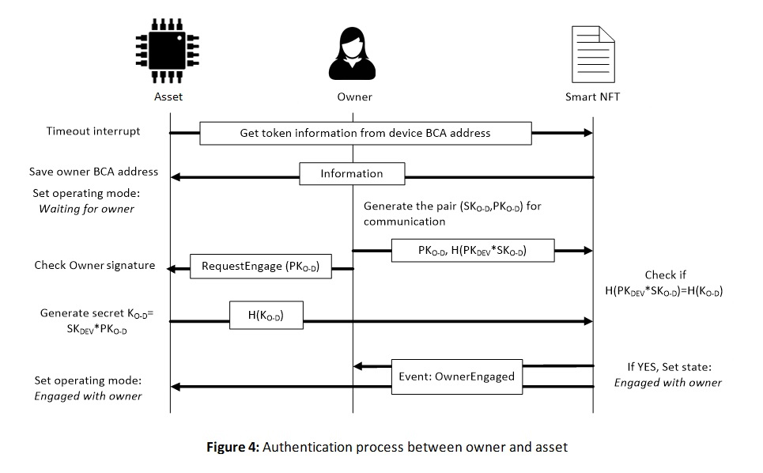
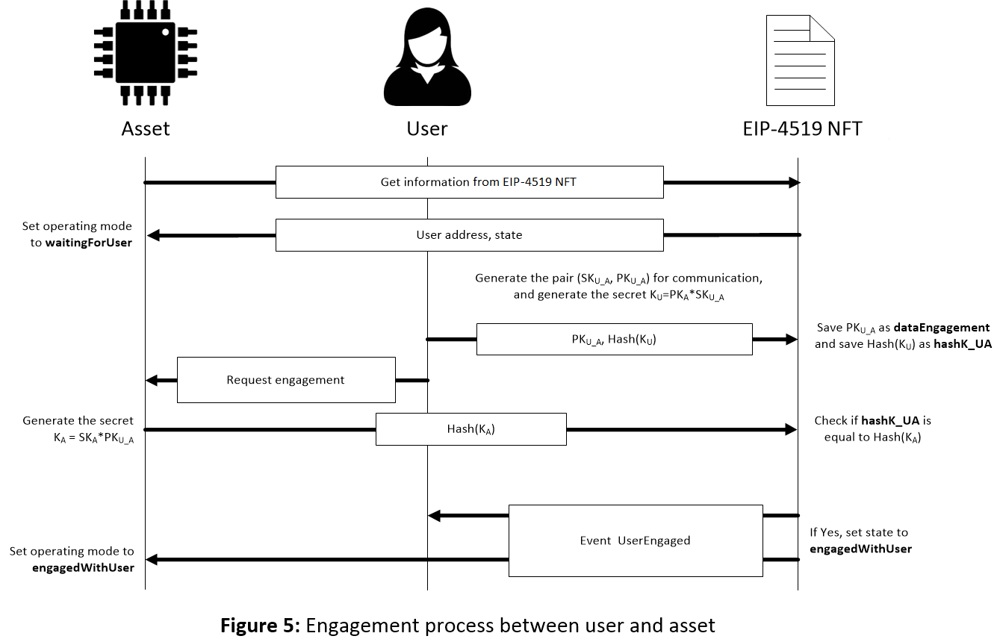

## Abstract

This EIP standardizes an interface for non-fungible tokens representing physical assets, such as Internet of Things (IoT) devices. These NFTs are tied to physical assets and can verify the authenticity of the tie. They can include an Ethereum address of the physical asset, permitting physical assets to sign messages and transactions. Physical assets can operate with an operating mode defined by its corresponding NFT.
 
## Motivation

This standard was developed because [EIP-721](./eip-721.md) only tracks ownership (not usage rights) and does not track the Ethereum addresses of the asset. The popularity of smart assets, such as IoT devices, is increasing. To permit secure and traceable management, these NFTs can be used to establish secure communication channels between the physical asset, its owner, and its user.

## Specification

The attributes `addressAsset` and `addressUser` are, respectively, the Ethereum addresses of the physical asset and the user. They are optional attributes but at least one of them should be used in an NFT. In the case of using only the attribute `addressUser`, two states define if the token is assigned or not to a user. `Figure 1` shows these states in a flow chart. When a token is created, transferred or unassigned, the token state is set to `notAssigned`. If the token is assigned to a valid user, the state is set to `userAssigned`.


  
In the case of defining the attribute `addressAsset` but not the attribute `addressUser`, two states define if the token is waiting for authentication with the owner or if the authentication has finished successfully. `Figure 2` shows these states in a flow chart. When a token is created or transferred to a new owner, then the token changes its state to `waitingForOwner`. In this state, the token is waiting for the mutual authentication between the asset and the owner. Once authentication is finished successfully, the token changes its state to `engagedWithOwner`.


 
Finally, if both the attributes `addressAsset` and `addressUser` are defined, the states of the NFT define if the asset has been engaged or not with the owner or the user (`waitingForOwner`, `engagedWithOwner`, `waitingForUser` and `engagedWithUser`). The flow chart in `Figure 3` shows all the possible state changes. The states related to the owner are the same as in `Figure 2`. The difference is that, at the state `engagedWithOwner`, the token can be assigned to a user. If a user is assigned (the token being at states `engagedWithOwner`, `waitingForUser` or `engagedWithUser`), then the token changes its state to `waitingForUser`. Once the asset and the user authenticate each other, the state of the token is set to `engagedWithUser`, and the user is able to use the asset.

 
 
In order to complete the ownership transfer of a token, the new owner must carry out a mutual authentication process with the asset, which is off-chain with the asset and on-chain with the token, by using their Ethereum addresses. Similarly, a new user must carry out a mutual authentication process with the asset to complete a use transfer. NFTs define how the authentication processes start and finish. These authentication processes allow deriving fresh session cryptographic keys for secure communication between assets and owners, and between assets and users. Therefore, the trustworthiness of the assets can be traced even if new owners and users manage them.

When the NFT is created or when the ownership is transferred, the token state is `waitingForOwner`. The asset sets its operating mode to `waitingForOwner`. The owner generates a pair of keys using the elliptic curve secp256k1 and the primitive element P used on this curve: a secret key SK<sub>O_A</sub> and a Public Key PK<sub>O_A</sub>, so that PK<sub>O_A</sub> = SK<sub>O_A</sub> * P. To generate the shared key between the owner and the asset, K<sub>O</sub>, the public key of the asset, PK<sub>A</sub>, is employed as follows:

K<sub>O</sub> = PK<sub>A</sub> * SK<sub>O_A</sub>

Using the function `startOwnerEngagement`, PK<sub>O_A</sub> is saved as the attribute `dataEngagement` and the hash of K<sub>O</sub> as the attribute `hashK_OA`. The owner sends request engagement to the asset, and the asset calculates:

K<sub>A</sub> = SK<sub>A</sub> * PK<sub>O_A</sub>

If everything is correctly done, K<sub>O</sub> and K<sub>A</sub> are the same since:

K<sub>O</sub> = PK<sub>A</sub> * SK<sub>O_A</sub> = (SK<sub>A</sub> * P) * SK<sub>O_A</sub> = SK<sub>A</sub> * (SK<sub>O_A</sub> * P) = SK<sub>A</sub> * PK<sub>O_A</sub>

Using the function `ownerEngagement`, the asset sends the hash of K<sub>A</sub>, and if it is the same as the data in `hashK_OA`, then the state of the token changes to `engagedWithOwner` and the event `OwnerEngaged` are sent. Once the asset receives the event, it changes its operation mode to `engagedWithOwner`. This process is shown in `Figure 4`. From this moment, the asset can be managed by the owner and they can communicate in a secure way using the shared key. 

 

If the asset consults Ethereum and the state of its NFT is `waitingForUser`, the asset (assuming it is an electronic physical asset) sets its operating mode to `waitingForUser`. Then, a mutual authentication process is carried out with the user, as already done with the owner. The user sends the transaction associated with the function `startUserEngagement`. As in `startOwnerEngagement`, this function saves the public key generated by the user, PK<sub>U_A</sub>, as the attribute `dataEngagement` and the hash of K<sub>U</sub> = PK<sub>A</sub> * SK<sub>U_A</sub> as the attribute `hashK_UA` in the NFT.

The user sends request engagement and the asset calculates:

K<sub>A</sub> = SK<sub>A</sub> * PK<sub>U_A</sub>

If everything is correctly done, K<sub>U</sub> and K<sub>A</sub> are the same since:

K<sub>U</sub> = PK<sub>A</sub> * SK<sub>U_A</sub> = (SK<sub>A</sub> * P) * SK<sub>U_A</sub> = SK<sub>A</sub> * (SK<sub>U_A</sub> * P) = SK<sub>A</sub> * PK<sub>U_A</sub>

Using the function `userEngagement`, the asset sends the hash of K<sub>A</sub> obtained and if it is the same as the data in `hashK_UA`, then the state of the token changes to `engagedWithUser` and the event `UserEngaged` is sent. Once the asset receives the event, it changes its operation mode to `engagedWithUser`. This process is shown in `Figure 5`. From this moment, the asset can be managed by the user and they can communicate in a secure way using the shared key. 

 

Since the establishment of a shared secret key is very important for a secure communication, NFTs include the attributes 
`hashK_OA`, `hashK_UA` and `dataEngagement`. The first two attributes define, respectively, the hash of the secret key shared between the asset and its owner and between the asset and its user. Assets, owners and users should check they are using the correct shared secret keys. The attribute `dataEngagement` defines the public data needed for the agreement. 

```solidity
pragma solidity ^0.8.0;
 /// @title EIP-4519 NFT: Extension of EIP-721 Non-Fungible Token Standard. 
///  Note: the EIP-165 identifier for this interface is 0x8a68abe3
 interface EIP-4519 NFT is EIP721/*,EIP165*/{
    /// @dev This emits when the NFT is assigned as utility of a new user.
    ///  This event emits when the user of the token changes.
    ///  (`_addressUser` == 0) when no user is assigned.
    event UserAssigned(uint256 indexed tokenId, address indexed _addressUser);
    
    /// @dev This emits when user and asset finish mutual authentication process successfully.
    ///  This event emits when both the user and the asset prove they share a secure communication channel.
    event UserEngaged(uint256 indexed tokenId);
    
    /// @dev This emits when owner and asset finish mutual authentication process successfully.
    ///  This event emits when both the owner and the asset prove they share a secure communication channel.
    event OwnerEngaged(uint256 indexed tokenId);
    
    /// @dev This emits when it is checked that the timeout has expired.
    ///  This event emits when the timestamp of the EIP-4519 NFT is not updated in timeout.
    event TimeoutAlarm(uint256 indexed tokenId);
    /// @notice This function defines how the NFT is assigned as utility of a new user (if "addressUser" is defined).
    /// @dev Only the owner of the EIP-4519 NFT can assign a user. If "addressAsset" is defined, then the state of the token must be
    /// "engagedWithOwner","waitingForUser" or "engagedWithUser" and this function changes the state of the token defined by "_tokenId" to
    /// "waitingForUser". If "addressAsset" is not defined, the state is set to "userAssigned". In both cases, this function sets the parameter 
    /// "addressUser" to "_addressUser". 
    /// @param _tokenId is the tokenId of the EIP-4519 NFT tied to the asset.
    /// @param _addressUser is the address of the new user.
    function setUser(uint256 _tokenId, address _addressUser) external payable; 
    /// @notice This function defines the initialization of the mutual authentication process between the owner and the asset.
    /// @dev Only the owner of the token can start this authentication process if "addressAsset" is defined and the state of the token is "waitingForOwner".
    /// The function does not change the state of the token and saves "_dataEngagement" 
    /// and "_hashK_OA" in the parameters of the token.
    /// @param _tokenId is the tokenId of the EIP-4519 NFT tied to the asset.
    /// @param _dataEngagement is the public data proposed by the owner for the agreement of the shared key.
    /// @param _hashK_OA is the hash of the secret proposed by the owner to share with the asset.
    function startOwnerEngagement(uint256 _tokenId, uint256 _dataEngagement, uint256 _hashK_OA) external payable;
 
    /// @notice This function completes the mutual authentication process between the owner and the asset.
    /// @dev Only the asset tied to the token can finish this authentication process provided that the state of the token is
    /// "waitingForOwner" and dataEngagement is different from 0. This function compares hashK_OA saved in
    /// the token with hashK_A. If they are equal then the state of the token changes to "engagedWithOwner", dataEngagement is set to 0,
    /// and the event "OwnerEngaged" is emitted.
    /// @param _hashK_A is the hash of the secret generated by the asset to share with the owner.
    function ownerEngagement(uint256 _hashK_A) external payable; 
 
    /// @notice This function defines the initialization of the mutual authentication process between the user and the asset.
    /// @dev Only the user of the token can start this authentication process if "addressAsset" and "addressUser" are defined and
    /// the state of the token is "waitingForUser". The function does not change the state of the token and saves "_dataEngagement" 
    /// and "_hashK_UA" in the parameters of the token.
    /// @param _tokenId is the tokenId of the EIP-4519 NFT tied to the asset.
    /// @param _dataEngagement is the public data proposed by the user for the agreement of the shared key.
    /// @param _hashK_UA is the hash of the secret proposed by the user to share with the asset.
    function startUserEngagement(uint256 _tokenId, uint256 _dataEngagement, uint256 _hashK_UA) external payable;
    
    /// @notice This function completes the mutual authentication process between the user and the asset.
    /// @dev Only the asset tied to the token can finish this authentication process provided that the state of the token is
    /// "waitingForUser" and dataEngagement is different from 0. This function compares hashK_UA saved in
    /// the token with hashK_A. If they are equal then the state of the token changes to "engagedWithUser", dataEngagement is set to 0,
    /// and the event "UserEngaged" is emitted.
    /// @param _hashK_A is the hash of the secret generated by the asset to share with the user.
    function userEngagement(uint256 _hashK_A) external payable; 
 
    /// @notice This function checks if the timeout has expired.
    /// @dev Everybody can call this function to check if the timeout has expired. The event "TimeoutAlarm" is emitted
    /// if the timeout has expired.
    /// @param _tokenId is the tokenId of the EIP-4519 NFT tied to the asset.
    /// @return true if timeout has expired and false in other case.
    function checkTimeout(uint256 _tokenId) external returns (bool);
    
    /// @notice This function sets the value of timeout.
    /// @dev Only the owner of the token can set this value provided that the state of the token is "engagedWithOwner",
    /// "waitingForUser" or "engagedWithUser".
    /// @param _tokenId is the tokenId of the EIP-4519 NFT tied to the asset.
    /// @param _timeout is the value to assign to timeout.
    function setTimeout(uint256 _tokenId, uint256 _timeout) external; 
    
    /// @notice This function updates the timestamp, thus avoiding the timeout alarm.
    /// @dev Only the asset tied to the token can update its own timestamp.
    function updateTimestamp() external; 
    
    /// @notice This function lets obtain the tokenId from an address. 
    /// @dev Everybody can call this function. The code executed only reads from Ethereum.
    /// @param _addressAsset is the address to obtain the tokenId from it.
    /// @return tokenId of the token tied to the asset that generates _addressAsset.
    function tokenFromBCA(address _addressAsset) external view returns (uint256);
    
    /// @notice This function lets know the owner of the token from the address of the asset tied to the token.
    /// @dev Everybody can call this function. The code executed only reads from Ethereum.
    /// @param _addressAsset is the address to obtain the owner from it.
    /// @return owner of the token bound to the asset that generates _addressAsset.
    function ownerOfFromBCA(address _addressAsset) external view returns (address);
    
    /// @notice This function lets know the user of the token from its tokenId.
    /// @dev Everybody can call this function. The code executed only reads from Ethereum.
    /// @param _tokenId is the tokenId of the EIP-4519 NFT tied to the asset.
    /// @return user of the token from its _tokenId.
    function userOf(uint256 _tokenId) external view returns (address);
    
    /// @notice This function lets know the user of the token from the address of the asset tied to the token.
    /// @dev Everybody can call this function. The code executed only reads from Ethereum.
    /// @param _addressAsset is the address to obtain the user from it.
    /// @return user of the token tied to the asset that generates _addressAsset.
    function userOfFromBCA(address _addressAsset) external view returns (address);
    
    /// @notice This function lets know how many tokens are assigned to a user.
    /// @dev Everybody can call this function. The code executed only reads from Ethereum.
    /// @param _addressUser is the address of the user.
    /// @return number of tokens assigned to a user.
    function userBalanceOf(address _addressUser) external view returns (uint256);
    
    /// @notice This function lets know how many tokens of a particular owner are assigned to a user.
    /// @dev Everybody can call this function. The code executed only reads from Ethereum.
    /// @param _addressUser is the address of the user.
    /// @param _addressOwner is the address of the owner.
    /// @return number of tokens assigned to a user from an owner.
    function userBalanceOfAnOwner(address _addressUser, address _addressOwner) external view returns (uint256);
}
```
 
## Rationale

### Authentication

This EIP uses smart contracts to verify the mutual authentication process since smart contracts are trustless.

### Tie Time

This EIP proposes including the attribute timestamp (to register in Ethereum the last time that the physical asset checked the tie with its token) and the attribute timeout (to register the maximum delay time established for the physical asset to prove again the tie). These attributes avoid that a malicious owner or user could use the asset endlessly.

When the asset calls `updateTimestamp`, the smart contract must call `block.timestamp`, which provides current block timestamp as seconds since Unix epoch. For this reason, `timeout`  must be provided in seconds.

### EIP-721-based

[EIP-721](./eip-721.md) is the most commonly-used standard for generic NFTs. This EIP extends EIP-721 for backwards compatibility.
  
## Backwards Compatibility

This standard is an extension of EIP-721. It is fully compatible with both of the commonly used optional extensions (`IERC721Metadata` and `IERC721Enumerable`) mentioned in the EIP-721 standard.

## Test Cases

The test cases presented in the paper shown below are available [here](../assets/eip-4519/PoC_SmartNFT/README.md).

## Reference Implementation

A first version was presented in a paper of the Special Issue **Security, Trust and Privacy in New Computing Environments** of **Sensors** journal of **MDPI** editorial. The paper, entitled [Secure Combination of IoT and Blockchain by Physically Binding IoT Devices to Smart Non-Fungible Tokens Using PUFs](../assets/eip-4519/sensors-21-03119.pdf), was written by the same authors of this EIP.

## Security Considerations

In this EIP, a generic system has been proposed for the creation of non-fungible tokens tied to physical assets. A generic point of view based on the improvements of the current EIP-721 NFT is provided, such as the implementation of the user management mechanism, which does not affect the token's ownership. The physical asset should have the ability to generate an Ethereum address from itself in a totally random way so that only the asset is able to know the secret from which the Ethereum address is generated. In this way, identity theft is avoided and the asset can be proven to be completely genuine. In order to ensure this, it is recommended that only the manufacturer of the asset has the ability to create its associated token. In the case of an IoT device, the device firmware will be unable to share and modify the secret. Instead of storing the secrets, it is recommended that assets reconstruct their secrets from non-sensitive information such as the helper data associated with Physical Unclonable Functions (PUFs). Although a secure key exchange protocol based on elliptic curves has been proposed, the token is open to coexist with other types of key exchange.  

## Copyright

Copyright and related rights waived via [CC0](../LICENSE.md).
