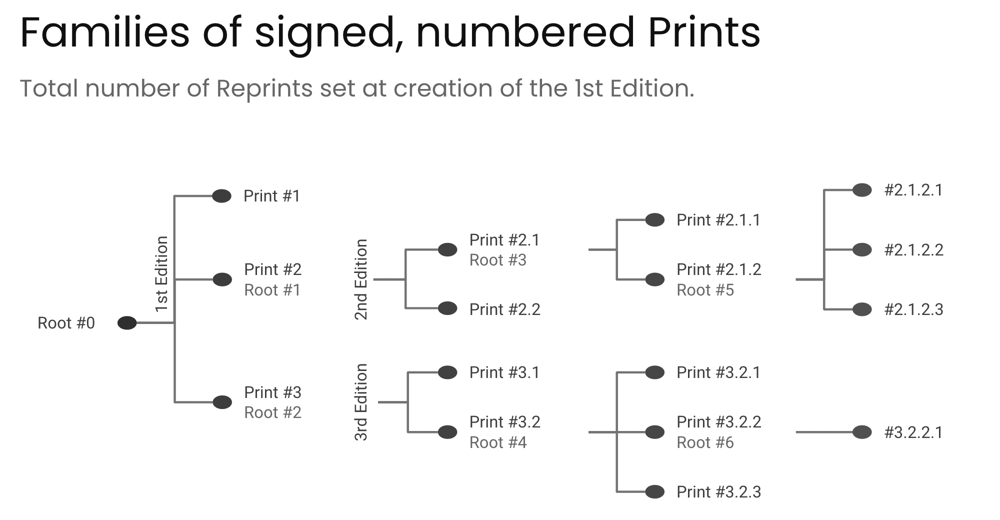
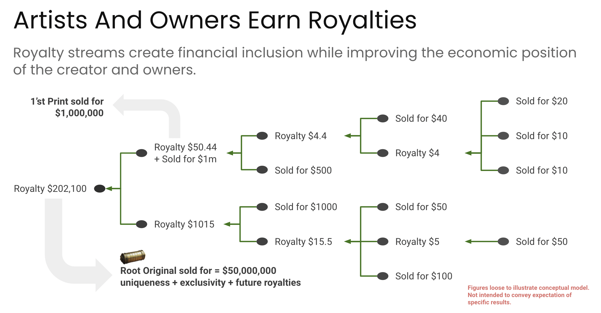

## Abstract

The proposal directly connects NFTs and royalties in a smart contract architecture extending the [ERC-721](./eip-721.md) standard, with the aim of precluding central authorities from manipulating or circumventing payments to those who are legally entitled to them.

The proposal builds upon the OpenZeppelin Smart Contract Toolbox architecture, and extends it to include royalty account management (CRUD), royalty balance and payments management, simple trading capabilities -- Listing/De-Listing/Buying -- and capabilities to trace trading on exchanges. The royalty management capabilities allow for hierarchical royalty structures, referred to herein as royalty trees, to be established by logically connecting a "parent" NFT to its "children", and recursively enabling NFT "children" to have more children. 

## Motivation

The management of royalties is an age-old problem characterized by complex contracts, opaque management, plenty of cheating and fraud. 

The above is especially true for a hierarchy of royalties, where one or more assets is derived from an original asset such as a print from an original painting, or a song is used in the creation of another song, or distribution rights and compensation are managed through a series of affiliates. 

In the example below, the artist who created the original is eligible to receive proceeds from every sale, and resale, of a print. 



The basic concept for hierarchical royalties utilizing the above "ancestry concept" is demonstrated in the figure below.




In order to solve for the complicated inheritance problem, this proposal breaks down the recursive problem of the hierarchy tree of depth N into N separate problems, one for each layer. This allows us to traverse the tree from its lowest level upwards to its root most efficiently.

This affords creators, and the distributors of art derived from the original, the opportunity to achieve passive income from the creative process, enhancing the value of an NFT, since it now not only has intrinsic value but also comes with an attached cash flow.

## Specification

The key words “MUST”, “MUST NOT”, “REQUIRED”, “SHALL”, “SHALL NOT”, “SHOULD”, “SHOULD NOT”, “RECOMMENDED”, “MAY”, and “OPTIONAL” in this document are to be interpreted as described in RFC 2119.

### Outline

This proposal introduces several new concepts as extensions to the ERC-721 standard that warrant explanation:

* **Royalty Account (RA)**
    * A Royalty Account is attached to each NFT through its `tokenId` and consists of several sub-accounts which can be accounts of individuals or other RAs. A Royalty Account is identified by an account identifier.
* **Account Type**
    * This specifies if an RA Sub Account belongs to an individual (user) or is another RA. If there is another RA as an RA Sub Account, the allocated balance needs to be reallocated to the Sub Accounts making up the referenced RA.
* **Royalty Split**
    * The percentage each Sub Account receives based on a sale of an NFT that is associated with an RA
* **Royalty Balance**
    * The royalty balance associated with an RA
* **Sub Account Royalty Balance**
    * The royalty balance associated to each RA Sub Account. Note that only individual accounts can carry a balance that can be paid out. That means that if an RA Sub Account is an RA, its final Sub Account balance must be zero, since all RA balances must be allocated to individual accounts. 
* **Token Type**
    * Token Type is given as either ETH or the symbol of the supported utility tokens such as `DAI`
* **Asset ID**
    * This is the `tokenId` the RA belongs to.
* **Parent**
    * This indicates which `tokenId` is the immediate parent of the `tokenId` to which an RA belongs.

Below a non-normative overview is given of the data structures and functionality that are covered by the requirements in this document. 

#### Data Structures

In order to create an interconnected data structure linking NFTs to RAs certain global data structures are required:

* A Royalty Account and associated Royalty Sub Accounts to establish the concept of a Royalty Account with sub accounts.
* Connecting a `tokenId` to a Royalty Account identifier.
* A structure mapping parent-to-child NFT relationships.
* A listing of token types and last validated balance (for trading and royalty payment purposes)
* A listing of registered payments to be made in the `executePayment` function and validated in `safeTransferFrom`. This is sufficient, because a payment once received and distributed in the `safeTransferFrom` function will be removed from the listing.
* A listing of NFTs to be sold

#### Royalty Account Functions

Definitions and interfaces for the Royalty Account RUD (Read-Update-Delete) functions. Because the RA is created in the minting function, there is no need to have a function to create a royalty account separately.

#### Minting of a Royalty Bearing NFT

When an NFT is minted, an RA must be created and associated with the NFT and the NFT owner, and, if there is an ancestor, with the ancestor's RA. To this end the specification utilizes the `_safemint` function in a newly defined `mint` function and applies various business rules on the input variables.

#### Listing NFTs for Sale and removing a Listing

Authorized user addresses can list NFTs for sale for non-exchange mediated NFT purchases.

#### Payment Function from Buyer to Seller

To avoid royalty circumvention, a buyer will always pay the NFT contract directly and not the seller. The seller is paid through the royalty distribution and can later request a payout.

The payment process depends on whether the payment is received in ETH or an [ERC-20](./eip-20.md) token:

* ERC-20 Token
    1. The Buyer must `approve` the NFT contract for the purchase price, `payment` for the selected payment token (ERC-20 contract address).
    2. For an ERC-20 payment token, the Buyer must then call the `executePayment` in the NFT contract -- the ERC-20 is not directly involved.
* For a non-ERC-20 payment, the Buyer must send a protocol token (ETH) to the NFT contract, and is required to send `msg.data` encoded as an array of purchased NFTs `uint256[] tokenId`.

#### Modified NFT Transfer Function including required Trade data to allocate Royalties

The input parameters must satisfy several requirements for the NFT to be transferred AFTER the royalties have been properly distributed. Furthermore, the ability to transfer more than one token at a time is also considered.

The proposal defines:

* Input parameter validation
* Payment Parameter Validation
* Distributing Royalties
* Update Royalty Account ownership with payout
* Transferring Ownership of the NFT 
* Removing the Payment entry in `registeredPayment` after successful transfer

Lastly, the approach to distributing royalties is to break down the hierarchical structure of interconnected Royalty Accounts into layers and then process one layer at time, where each relationship between a token and its ancestor is utilized to traverse the Royalty Account chain until the root ancestor and associated RA is reached.

#### Paying out Royalties to the NFT Owner -- `from` address in `safeTransferFrom` Function

This is the final part of the proposal.

There are two versions of the payout function -- a `public` function and an `internal` function.

The public function has the following interface:

```
function royaltyPayOut (uint256 tokenId, address RAsubaccount, address payable payoutAccount, uint256 amount) public virtual nonReentrant returns (bool)
```

where we only need the `tokenId`, the RA Sub Account address, `_RAsubaccount` which is the `owner`, and the amount to be paid out, `_amount`. Note that the function has `nonReentrant` modifier protection, because funds are being payed out.

To finally send a Payout payment, the following steps need to be taken:

* find the RA Sub Account based on `RAaccount` and the `subaccountPos` and extract the balance
* extract `tokenType` from the Sub Account
* based on the token type, send the payout payment (not exceeding the available balance)

### Data Structures

#### Royalty Account and Royalty Sub Accounts

In order to create an interconnected data structure linking NFTs to RAs that is search optimized requires to make the following additions to the global data structures of an ERC-721.

Note, a Royalty Account is defined as a collection of Royalty Sub Accounts linked to a meta account. This meta account is comprised of general account identifiers particular to the NFT it is linked to such as asset identifier, parent identifier etc.

<a name="r1">**[R1]**</a> *One or more Royalty Sub-Account MUST be linked to a Royalty Account.*

<a name="r2">**[R2]**</a> *The account identifier of a Royalty Account, `raAccountId`, MUST be unique.*

<a name="r3">**[R3]**</a> *The `tokenId` of a NFT MUST be linked to a `raAccountID` in order to connect an `raAccountId` to a `tokenId`.*


#### Print (Child) NFTs

The set of requirement to manage Parent-Child NFT Relationships and constraints at each level of the NFT (family) tree e.g. number of children permitted, NFT parents have to be linked to their immediate NFT children are as follows.

<a name="r4">**[R4]**</a> *There MUST be a link for direct parent-child relationships*

#### NFT Payment Tokens

In order to capture royalties, an NFT contract must be involved in NFT trading. Therefore, the NFT contract needs to be aware of NFT payments, which in turn requires the NFT contract to be aware which tokens can be used for trading.

<a name="r5">**[R5]**</a> *There MUST be a listing of supported token types*

Since the NFT contract is managing royalty distributions and payouts as well as sales, it needs to track the last available balances of the allowed token types owned by the contract.  

<a name="r6">**[R6]**</a> *There MUST be a link of the last validated balance of an allowed token type in the contract to the respective allowed token contract.*

#### NFT Listings and Payments

Since the contract is directly involved in the sales process, a capability to list one or more NFTs for sale is required.

<a name="r7">**[R7]**</a> *There MUST be a list of NFTs for sale.*

<a name="r8">**[R8]**</a> *A sales listing MUST have a unique identifier.*

Besides listings, the contract is required to manage sales as well. This requires the capability to register a payment, either for immediate execution or for later payment such as in an auction situation.

<a name="r9">**[R9]**</a> *There MUST be a listing for registered payments*

<a name="r10">**[R10]**</a> *A registered payment MUST have a unique identifier.*

#### Contract Constructor and Global Variables and their update functions

This standard extends the current ERC-721 constructor, and adds several global variables to recognize the special role of the creator of an NFT, and the fact that the contract is now directly involved in managing sales and royalties.

<a name="r11">**[R11]**</a> *The minimal contract constructor MUST contain the following input elements.*

```
///
/// @dev Definition of the contract constructor
///
/// @param name as in ERC-721
/// @param symbol as in ERC-721
/// @param baseTokenURI as in ERC-721
/// @param allowedTokenTypes is the array of allowed tokens for payment

constructor(
        string memory name,
        string memory symbol,
        string memory baseTokenURI,
        address[] memory allowedTokenTypes
    ) ERC721(name, symbol) {...}
```


### Royalty Account Management

Below are the definitions and interfaces for the Royalty Account RUD (Read-Update-Delete) functions. Since a Royalty Account is created in the NFT minting function, there is no need to have a separate function to create a royalty account.

#### Get a Royalty Account

There is only one get function required because a Royalty Account and its sub accounts can be retrieved through the `tokenId` in the `ancestry` field of the Royalty Account. 

<a name="r12">**[R12]**</a> *The `getRoyaltyAccount` function interface MUST adhere to the definition below:*

```
/// @dev Function to fetch a Royalty Account for a given tokenId
/// @param tokenId is the identifier of the NFT to which a Royalty Account is attached
/// @param RoyaltyAccount is a data structure containing the royalty account information
/// @param RASubAccount[] is an array of data structures containing the information of the royalty sub accounts associated with the royalty account

function getRoyaltyAccount (uint256 tokenId) public view virtual returns (address,
            RoyaltyAccount memory,
            RASubAccount[] memory);
```


<a name="r13">**[R13]**</a> *The following business rules MUST be enforced in the `getRoyaltyAccount` function:*

* *`tokenId` exists and is not burned*

#### Update a Royalty Account

In order to update a Royalty Account, the caller must have both the 'tokenId' and the `RoyaltyAccount` itself which can be obtained from the Royalty Account getter function. 


<a name="r14">**[R14]**</a> *The `updateRoyaltyAccount` function interface MUST adhere to the definition below:*

```
/// @dev Function to update a Royalty Account and its Sub Accounts
/// @param tokenId is the identifier of the NFT to which the Royalty Account to be updated is attached
/// @param RoyaltyAccount is the Royalty Account and associated Royalty Sub Accounts with updated values  

function updateRoyaltyAccount (uint256 _tokenId, `RoyaltyAccount memory _raAccount) public virtual returns (bool)
```

The update functionality of a Royalty Account, while straightforward, is also highly nuanced. To avoid complicated change control rules such as multi-signature rules, Royalty Account changes are kept simple.

<a name="r15">**[R15]**</a> *The business rules for the update function are as follows:*

1. *An NFTs asset identifier MUST NOT be changed.*
2. *An NFTs ancestor MUST NOT be updated.* 
3. *An NFTs token type accepted for payment MUST NOT be updated.* 
4. *The royalty balance in a Royalty Sub Account MUST NOT be changed.*
5. *The royalty split inherited by the children from the NFT parent MUST NOT be changed.*
6. *New royalty split values MUST be larger than, or less than, or equal to any established boundary value for royalty splits, if it exists.*
7. *The number of existing Royalty Sub Account plus the number of new Royalty Sub Accounts to be added MUST be smaller or equal to an established boundary value, if it exists.*
8. *The sum of all royalty splits across all existing and new Royalty Sub Accounts MUST equal to 1 or its equivalent numerical value at all times.*
9. *'msg.sender` MUST be equal to an account identifier in the Royalty Sub Account of the Royalty Account to be modified and that royalty sub account must be identified as not belonging to the parent NFT* 
    
    9.1 *the Sub Account belonging to the account identifier MUST NOT be removed*
    
    9.2 *A royalty split MUST only be decreased, and either the existing sub account's  royalty split MUST be increased accordingly such that the sum of all royalty splits remains equal to 1 or its numerical equivalent, or one or more new Royalty Sub Accounts MUST be added according to rule 10.*
    
    9.3 *a royalty balance MUST NOT be changed*
    
    9.4 *an account identifier MUST NOT be NULL*

10. *If `msg.sender` is equal to the account identifier of one of the Sub Account owners which is not the parent NFT, an additional Royalty Sub Accounts MAY be added* 
    
    10.1 *if the royalty split of the Royalty Sub Account belonging to `msg.sender` is reduced*
    
    * then the royalty balance in each new Royalty Sub Account MUST be zero
    
    * and the sum of the new royalty splits data MUST be equal to the royalty split of the Royalty Sub Account of `msg.sender` before it was modified
    
    10.2 *new account identifier MUST not be NULL*

11. *If the Royalty Account update is correct, the function returns `true`, otherwise `false`.* 

#### Deleting a Royalty Account

While sometimes deleting a Royalty Account is necessary, even convenient, it is a very costly function in terms of gas, and should not be used unless one is absolutely sure that the conditions enumerated below are met.

<a name="r16">**[R16]**</a> *The `deleteRoyaltyAccount` function interface MUST adhere to the definition below:*

```
/// @dev Function to delete a Royalty Account
/// @param tokenId is the identifier of the NFT to which the Royalty Account to be updated is attached

function deleteRoyaltyAccount (uint256 _tokenId) public virtual returns (bool)
```

<a name="r17">**[R17]**</a> *The business rules for this function are as follows:*

* *`_tokenId` MUST be burned, i.e., have owner `address(0)`.*
* *all `tokenId` numbers genealogically related to `_tokenId` either as ancestors or offspring MUST also be burnt.* 
* *all balances in the Royalty Sub Accounts MUST be zero.*

### NFT Minting

In extension to the ERC-721 minting capability, a Royalty Account with Royalty Sub Accounts are required to be added during the minting, besides establishing the NFT token specific data structures supporting constraints such as the maximum number of children an NFT can have. 

<a name="r18">**[R18]**</a> *When a new NFT is minted a Royalty Account with one or more Royalty Sub Accounts MUST be created and associated with the NFT and the NFT owner, and, if there is an ancestor, with the ancestor's Royalty Account.* 

To this end the specification utilizes the ERC-721 `_safemint` function in a newly defined `mint` function, and applies various business rules on the function's input variables.

<a name="d1">**[D1]**</a> *Note, that the `mint` function SHOULD have the ability to mint more than one NFT at a time.* 

<a name="r19">**[R19]**</a> *Also, note that the `owner` of a new NFT MUST be the NFT contract itself.* 

<a name="r20">**[R20]**</a> *The non-contract owner of the NFT MUST be set as `isApproved` which allows the non-contract owner to operate just like the `owner`.* 

This strange choice in the two requirements above is necessary, because the NFT contract functions as an escrow for payments and royalties, and, hence, needs to be able to track payments received from buyers and royalties due to recipients, and to associate them with a valid `tokenId`.

<a name="r21">**[R21]**</a> *For compactness of the input, and since the token meta data might vary from token to token the MUST be a minimal data structure containing:*

```
/// @param parent is the parent tokenId of the (child) token, and if set to 0 then there is no parent.
/// @param canBeParent indicates if a tokenId can have children or not.
/// @param maxChildren defines how many children an NFT can have.
/// @param royaltySplitForItsChildren is the royalty percentage split that a child has to pay to its parent.
/// @param uri is the unique token URI of the NFT
```

<a name="r22">**[R22]**</a> *The `mint` function interface MUST adhere to the definition below:*

```
/// @dev Function creates one or more new NFTs with its relevant meta data necessary for royalties, and a Royalty Account with its associated met data for `to` address. The tokenId(s) will be automatically assigned (and available on the emitted {IERC-721-Transfer} event).
/// @param to is the address to which the NFT(s) are minted
/// @param nfttoken is an array of struct type NFTToken for the meta data of the minted NFT(s)
/// @param tokenType is the type of allowed payment token for the NFT

function mint(address to, NFTToken[] memory nfttoken, address tokenType) public virtual
```

<a name="r23">**[R23]**</a> *The following business rules for the `mint` function's input data MUST be fulfilled:*

* *The number of tokens to be minted MUST NOT be zero.*
* *`msg.sender` MUST have either the `MINTER_ROLE` or the `CREATOR_Role` identifying the creator of the first NFT.*
* *`to` address MUST NOT be the zero address.*
* *`to` address MUST NOT be a contract, unless it has been whitelisted -- see [Security Considerations](#security-considerations) for more details.* 
* *`tokenType` MUST be a token type supported by the contract.*
* *`royaltySplitForItsChildren` MUST be less or equal to 100% or numerical equivalent thereof less any constraints such as platform fees* 
* *If the new NFT(s) cannot have children, `royaltySplitForItsChildren` MUST be zero.*
* *If the new NFT(s) has a parent, the parent NFT `tokenId` MUST exist.*
* *The ancestry level of the parent MUST be less than the maximum number of allowed NFT generations, if specified.*
* *The number of allowed children for an NFT to be minted MUST be less than the maximum number of allowed children, if specified.*

### Listing and De-Listing of NFTs for Direct Sales

In the sales process, we need to minimally distinguish two types of transactions

* Exchange-mediated sales
* Direct sales

The first type of transaction does not require that the smart contract is aware of a sales listing since the exchange contract will trigger payment and transfer transactions directly with the NFT contract as the owner. However, for the latter transaction type it is essential, since direct sales are required to be mediated at every step by the smart contract.

<a name="r24">**[R24]**</a> *For direct sales, NFT listing, und de-listing, transactions MUST be executed through the NFT smart contract.*   

Exchange-mediated sales will be discussed when this document discusses payments.

In direct sales, authorized user addresses can list NFTs for sale, see the business rules below.

<a name="r25">**[R25]**</a> *The `listNFT` function interface MUST adhere to the definition below:*

```
/// @dev Function to list one or more NFTs for direct sales
/// @param tokenIds is the array of tokenIds to be included in the listing
/// @param price is the price set by the owner for the listed NFT(s)
/// @param tokenType is the payment token type allowed for the listing

function listNFT (uint256[] calldata tokenIds, uint256 price, address tokenType) public virtual returns (bool)
```

The Boolean return value is `true` for a successful function execution, and `false` for an unsuccessful function execution.

<a name="r26">**[R26]**</a> *The business rules of the `listNFT` function are as follows:*

* there MUST NOT already be a listing for one or more NFTs in the `listedNFT` mapping of the proposed listing.
* `seller` MUST be equal to `getApproved(tokenId[i])` for all NFTs in the proposed listing.
* `tokenType` MUST be supported by the smart contract.
* `price` MUST be larger than `0`.

<a name="r27">**[R27]**</a> *If the conditions in [**[R26]**](#r26) are met, then the NFT sales list MUST be updated.*

Authorized user addresses can also remove a direct sale listing of NFTs. 

<a name="r28">**[R28]**</a> *The `removeNFTListing` function interface MUST adhere to the definition below:*

```
/// @dev Function to de-list one or more NFTs for direct sales
/// @param listingId is the identifier of the NFT listing

function removeNFTListing (uint256 listingId) public virtual returns (bool)
```

The Boolean return value is `true` for a successful function execution, and `false` for an unsuccessful function execution.

<a name="r29">**[R29]**</a> *The business rules of the `removeNFTListing` function below MUST be adhered to:*

* *the registered payment entry MUST be NULL*
* *`msg.sender = getApproved(tokenId)` for the NFT listing* 

<a name="r30">**[R30]**</a> *If the conditions in [**[R29]**](#r29) are met, then the NFT sales listing MUST be removed.*

### Payments for NFT Sales

As noted before, a buyer will always pay the NFT contract directly and not the seller. The seller is paid through the royalty distribution and can later request a payout to their wallet.

<a name="r31">**[R31]**</a> *The payment process requires either one or two steps:*

1. *For an ERC-20 token*
    * *The buyer MUST `approve` the NFT contract for the purchase price, `payment`, for the selected payment token type.*
    * *The buyer MUST call the `executePayment` function.*
2. *For a protocol token* 
    * *The buyer MUST call a payment fallback function with `msg.data` not NULL.*

<a name="r32">**[R32]**</a> *For an ERC-20 token type, the required `executePayment` function interface MUST adhere to the definition below*:

```
/// @dev Function to make a NFT direct sales or exchange-mediate sales payment
/// @param receiver is the address of the receiver of the payment
/// @param seller is the address of the NFT seller 
/// @param tokenIds are the tokenIds of the NFT to be bought
/// @param payment is the amount of that payment to be made
/// @param tokenType is the type of payment token
/// @param trxnType is the type of payment transaction -- minimally direct sales or exchange-mediated

function executePayment (address receiver, address seller, uint 256[] tokenIds, uint256 payment, string tokenType, int256 trxnType) public virtual nonReentrant returns (bool)
```

The Boolean return value is `true` for a successful function execution, and `false` for an unsuccessful function execution.

<a name="r33">**[R33]**</a> *Independent of `trxnType`, the business rules for the input data are as follows:*

* *All purchased NFTs in the `tokenIds` array MUST exist and MUST NOT be burned.*
* *`tokenType` MUST be a supported token.*
* *`trxnType` MUST be set to either `0` (direct sale) or `1` (exchange-mediate sale), or another supported type.*
* *`receiver` MAY be NULL but MUST NOT be the Zero Address.*
* *`seller` MUST be the address in the corresponding listing.*
* *`msg.sender` MUST not be a contract, unless it is whitelisted in the NFT contract.*

In the following, this document will only discuss the differences between the two minimally required transaction types.

<a name="r34">**[R34]**</a> *For `trxnType = 0`, the payment data MUST to be validated against the listing, based on the following rules:*

* *NFT(s) MUST be listed*
* *`payment` MUST be larger or equal to the listing price.*
* *The listed NFT(s) MUST match the NFT(s) in the payment data.* 
* *The listed NFT(s) MUST be controlled by `seller`.*

<a name="r35">**[R35]**</a> *If all checks in [**[R33]**](#r33), and in [**[R34]**](#r34) for `trxnType = 0`, are passed, the `executePayment` function MUST call the `transfer` function in the ERC-20 contract identified by `tokenType` with `recipient = address(this)` and `amount = payment`.* 

Note the NFT contract pays itself from the available allowance set in the `approve` transaction from the buyer.

<a name="r36">**[R36]**</a> *For `trxnType = 1`, and for a successful payment, the `registeredPayment` mapping MUST updated with the payment, such that it can be validated when the NFT is transferred in a separate `safeTransferFrom` call, and `true` MUST be returned as the return value of the function, if successful, `false` otherwise.*

<a name="r37">**[R37]**</a> *For `trxnType = 0`, an `internal` version of the `safeTransferFrom` function with message data MUST be called to transfer the NFTs to the buyer, and upon success, the buyer MUST be given the `MINTER_ROLE`, unless the buyer already has that role.*

Note, the `_safeTransferFrom` function has the same structure as `safeTransferFrom` but skips the input data validation.

<a name="r38">**[R38]**</a> *For `trxnType = 0`, and if the NFT transfer is successful, the listing of the NFT MUST be removed.* 

<a name="r39">**[R39]**</a> *For a protocol token as a payment token, and independent of `trxnType`, the buyer MUST send protocol tokens to the NFT contract as the escrow, and `msg.data` MUST encode the array of paid for NFTs `uint256[] tokenIds`.*

<a name="r40">**[R40]**</a> *For the NFT contract to receive a protocol token, a payable fallback function (`fallback() external payable`) MUST be implemented.*

Note that since the information for which NFTs the payment was for must be passed, a simple `receive()` fallback function cannot be allowed since it does not allow for `msg.data` to be sent with the transaction.

<a name="r41">**[R41]**</a> *`msg.data` for the fallback function MUST minimally contain the following data:
`address memory seller, uint256[] memory _tokenId, address memory receiver, int256 memory trxnType`*

<a name="r42">**[R42]**</a> *If `trxnType` is not equal to either '0' or '1', or another supported type, then the fallback function MUST `revert`.*

<a name="r43">**[R43]**</a> *For `trxnType` equal to either '0' or '1', the requirements [**[R33]**](#r33) through [**[R38]**](#r38) MUST be satisfied for the fallback function to successfully execute, otherwise the fallback function MUST `revert`.*

<a name="r44">**[R44]**</a> *In case of a transaction failure (for direct sales, `trxnType = 0`), or the buyer of the NFT listing changing their mind (for exchange-mediated sales, `trxnType = 1`), the submitted payment MUST be able to revert using the `reversePayment` function where the function interface is defined below:*

```
/// @dev Definition of the function enabling the reversal of a payment before the sale is complete
/// @param paymentId is the unique identifier for which a payment was made
/// @param tokenType is the type of payment token used in the payment
function reversePayment(uint256 paymentId, string memory tokenType) public virtual returns (bool)
```

The Boolean return value is `true` for a successful function execution, and `false` for an unsuccessful function execution.

Note, `reentrancy` protection through e.g. `nonReentrant` from the Open Zeppelin library is strongly advised since funds are being paid out.

<a name="r45">**[R45]**</a> *The business rules for the `reversePayment` function are as follows:*

* *There MUST be registered payment for a given `paymentId` and `tokenType`.*
* *`msg.sender` MUST be the buyer address in the registered payment.*
* *The payment amount must be larger than `0`.*
* *The registered payment MUST be removed when the payment has been successfully reverted, otherwise the function must fail.*


### Modified NFT Transfer function

This document adheres to the ERC-721 interface format for the `safeTransferFrom` function as given below:

```
function safeTransferFrom(address from, address to, uint256 tokenId, bytes memory _data) external virtual override
```

Note, that the input parameters must satisfy several requirements for the NFT(s) to be transferred AFTER royalties have been properly distributed. Note also, that the ability to transfer more than one token at a time is required. However, the standard interface only allows one token to be transferred at a time. In order to remain compliant with the ERC-721 standard, this document uses `tokenId` only for the first NFT to be transferred. All other transfer relevant data is encoded in `_data`. 

The high-level requirements are as follows:

* The payment parameters of the trade encoded in `_data` must be validated.
* The seller and the sold NFT token(s) must exist, and the seller must be the owner of the token.
* `msg.sender` must be the seller address or an approved address.
* the payment of the trade received by the NFT smart contract is correctly disbursed to all Royalty Sub Account owners.
* the NFT token is transferred after all Royalty Sub Accounts and their holders associated with the NFT token(s) have been properly credited.

Also, note that in order to avoid royalty circumvention attacks, there is only one NFT transfer function. 

<a name="r46">**[R46]**</a> *Therefore, `transferFrom` and `safeTransferFrom` without `data` MUST be disabled.*

This can be achieved through for example a `revert` statement in an `override` function.

<a name="r47">**[R47]**</a> *The requirements on input parameters of the function are as follows*:

* *`from` MUST not be `address(0)`.*
* *`from` MUST be the owner or `approved` for `tokenId` and the other tokens included in `_data`.*
* *`from` MUST not be a smart contract unless whitelisted.*
* *a Royalty Account MUST be associated to `tokenId` and the other tokens included in `_data`.*
* *`_data` MUST NOT be NULL.*
* *`msg.sender` MUST be equal to `from` or an `approved` address, or a whitelisted contract.*

Note, that in the context of this document only the scenario where the calling contract is still being created, i.e., the constructor being executed is a possible attack vector, and should to be carefully treated in the transfer scenario.

Turning to the `_data` object.

<a name="r48">**[R48]**</a> *The `_data` object MUST minimally contain the following payment parameters:*

* *Seller Address as `address`.*
* *Buyer Address as `address`.*
* *Receiver Address as `address.*
* *Token identifiers as `uint256[]`.*
* *Token type used for payment.*
* *Payment amount paid to NFT contract as `uint256`.*
* *a registered payment identifier.*
* *blockchain ID, `block.chainid`, of the underlying blockchain.*

<a name="r49">**[R49]**</a> *The following business rules MUST be met for the payment data in '_data':*

* *`seller == from`.*
* *`tokenId[0] == tokenId`.*
* *Each token in `_tokenId` has an associated Royalty Account.*
* *`chainid == block.chainid`.*
* *`buyer` is equal to the buyer address in the registered payment for the given ``paymentId.*
* *`receiver == to`.*
* *the receiver of the token is not the seller.*
* *the receiver of the token is not a contract or is a whitelisted contract*
* *For all NFTs in the payment, `tokenId[i] = registeredPayment[paymentId].boughtTokens[i]`.*
* *`tokenType` is supported in the contract.* 
* *`allowedToken[tokenType]` is not NULL.*
* *`tokenType = registeredPayment[paymentId].tokenType`.*
* *`payment > lastBalanceAllowedToken[allowedToken[listingId]]`.*
* *`payment = registeredPayment[paymentId].payment`.*

### Distributing Royalties in the Transfer Function

The approach to distributing royalties is to break down the hierarchical structure of interconnected Royalty Accounts into layers, and then process one layer at time, where each relationship between a NFT and its ancestor is utilized to traverse the Royalty Account chain until the root ancestor and its associated Royalty Account.

Note, that the distribution function assumes that the payment made is for ALL tokens in the requested transfer. That means, that `payment` for the distribution function is equally divided between all NFTs included in the payment. 

<a name="r5">**[R50]**</a> *The `distributePayment` function interface MUST adhere to the definition below:

```
/// @dev Function to distribute a payment as royalties to a chain of Royalty Accounts
/// @param tokenId is a tokenId included in the sale and used to look up the associated Royalty Account
/// @param payment is the payment (portion) to be distributed as royalties

function distributePayment (uint256 tokenId, uint265 payment) internal virtual returns (bool)
```

The Boolean return value is `true` for a successful function execution, and `false` for an unsuccessful function execution.

As mentioned before, the internal `distributePayment` function is called within the modified `safeTransferFrom` function.

Note, that it is necessary to multiply two `uint256` numbers with each other -- the payment amount with the royalty split percentage expressed as a whole number e.g. `10000 = 100%`. And then divide the result by the whole number representing `100%` in order to arrive at the correct application of the royalty split percentage to the payment amount. This requires careful treatment of numbers in the implementation to prevent issues such as buffer over or under runs.

<a name="r51">**[R51]**</a> *The processing logic of `distributePayment` function MUST be as follows:*

* *Load the Royalty Account (`RA`) and associated Royalty Sub Accounts using the passed `tokenId`.*
* *For each Royalty Sub Account in `RA` apply the following rules:*
    * *If a Royalty Sub Account in `RA` has `isIndividual` set to `true` then*
        * *apply the royalty percentage of that Royalty Sub Account to `payment` and add the calculated amount, e.g. `royaltyAmountTemp`, to the `royaltybalance` of that Royalty Sub Account.*
        * *emit an event as a notification of payment to the `accountId` of the Royalty Sub Account containing: assetId, accountId, tokenType, royaltybalance.*
        * *in the RA add `royaltyamountTemp` amount to `balance`*
    * *If a Royalty Sub Account in `RA` has `isIndividual` set to `false` then*
        * *apply the royalty percentage of that Royalty Sub Account to `payment` and store temporarily in a new variable e.g. `RApaymenttemp`, but do not update the `royaltybalance` of the Royalty Sub Account which remains `0`.*
    * *then use `ancestor` to obtain the `RA` connected to `ancestor` e.g. via a look up through a Royalty Account mapping.*
    * *load the new RA*
        * *if `isIndividual` of the Royalty Sub Account is set to `true`, pass through the Royalty Sub Accounts of the next `RA`, and apply the rule for `isIndividual = true`.*
        * *if `isIndividual` of the Royalty Sub Account is set to `false`, pass through the Royalty Sub Accounts of the next `RA`, and apply the rule for `isIndividual = false`.*
    * *Repeat the procedures for `isIndividual` equal to `true` and `false` until a `RA` is reached that does not have an `ancestor`, and where all Royalty Sub Accounts have`isIndividual` set to `true`, and apply the rule for a Royalty Sub Account that has `isIndividual` set to `true` to all Royalty Sub Accounts in that `RA`.*

### Update Royalty Sub Account Ownership with Payout to approved Address (`from`)

In order to simplify the ownership transfer, first the approved address -- the non-contract NFT owner --, `from`, is paid out its share of the royalties. And then the Royalty Sub Account is updated with the new owner, `to`. This step repeats for each token to be transferred.

<a name="r52">**[R52]**</a> *The business rules are as follows:*

* *the internal version of the`royaltyPayOut` function MUST pay out the entire royalty balance of the Royalty Sub Account owned by the `from` address to the `from` address.*
* *the Royalty Sub Account MUST only be updated with the new owner only once the payout function has successfully completed and the `royaltybalance = 0`.*

The last step in the process chain is transferring the NFTs in the purchase to the `to` address. 

<a name="r53">**[R53]**</a> *For every NFT (in the batch) the 'to' address MUST be `approved' (ERC-721 function) to complete the ownership transfer:* 

```
_approve(to, tokenId[i]);
```

The technical NFT owner remains the NFT contract.

### Removing the Payment Entry after successful Transfer

Only after the real ownership of the NFT, the approved address, has been updated, the payment registry entry can be removed to allow the transferred NFTs to be sold again.

<a name="r54">**[R54]**</a> *After the `approve` relationship has been successfully updated to the `to` address, the registered payment MUST be removed.*

### Paying out Royalties to the `from` Address in `safeTransferFrom` Function

There are two versions of the payout function -- a `public` and an `internal` function -- depending on whether there is a payout during a purchase, or a payout is requested by a Royalty Sub Account owner.

<a name="r55">**[R55]**</a> *The public `royaltyPayOut` function interface MUST adhere to the definition below:*

```
/// @dev Function to payout a royalty payment
/// @param tokenId is the identifier of the NFT token
/// @param RAsubaccount is the address of the Royalty Sub Account from which the payout should happen
/// @param receiver is the address to receive the payout
/// @param amount is the amount to be paid out

function royaltyPayOut (uint256 tokenId, address RAsubaccount, address payable payoutAccount, uint256 amount) public virtual nonReentrant returns (bool)
```

The Boolean return value is `true` for a successful function execution, and `false` for an unsuccessful function execution.

Note, that the function has `reentrancy` protection through `nonReentrant` from the Open Zeppelin library since funds are being paid out.

<a name="r56">**[R56]**</a> *The input parameters of the `royaltyPayOut` function MUST satisfy the following requirements:*

* *`msg.sender == RAsubaccount`.*
* *`tokenId` must exist and must not be burned.*
* *`tokenId` must be associated with a Royalty Account.*
* *`RAsubaccount` must be a valid `accountId` in a Royalty Sub Account of the Royalty Account of the `tokenId'.*
* *`isIndividual == true` for the Royalty Sub Account, `RAsubaccount`.*
* *`amount <= royaltybalance` of the Royalty Sub Account, `RAsubaccount.*`

<a name="r57">**[R57]**</a> *The internal `_royaltyPayOut` function interface MUST adhere to the definition below*:

```
function _royaltyPayOut (uint256 tokenId, address RAsubaccount, address payable payoutAccount, uint256 amount) public virtual returns (bool)
```

<a name="r58">**[R58]**</a> *The internal `_royaltyPayOut` function MUST perform the following actions:

* *send the payment to the `payoutaccount`.*
* *update the `royaltybalance` of the `RAsubaccount` of the Royalty Account upon successful transfer.*

<a name="r59">**[R59]**</a> *The following steps MUST be taken to send out a royalty payment to its recipient:*

* *find the Royalty Sub Account.*
* *extract `tokenType` from the Royalty Sub Account.*
* *based on the token type send to the `payoutAccount` either*
    * *'ETH' / relevant protocol token or*
    * *another token based on token type* 
* *and only if the payout transaction is successful, deduct `amount` from `royaltybalance` of the Royalty Sub Account,`RAsubaccount`, and then return `true` as the function return parameter, otherwise return `false`.* 

## Rationale

Royalties for NFTs is at its core a distribution licensing problem. A buyer obtains the right to an asset/content which might or might not be reproducible, alterable etc. by the buyer or agents of the buyer. Therefore, a comprehensive specification must address a hierarchy of royalties, where one or more assets are derived from an original asset as described in the Motivation section in detail. Consequently, a design must solve for a multi-level inheritance, and thus, recursion problem. 

In order to solve for the complicated inheritance problem, this proposal design breaks down the recursive problem of the hierarchy first into a tree of depth N. And the further breaks down the tree structure into N separate problems, one for each layer. This design allows one to traverse the tree from its lowest level upwards to its root most efficiently. This is achieved with the design for the `distributePayment` function and the NFT data structures allowing for the tree structure e.g. `ancestry`,`royaltyAccount`, `RAsubaccount`. 

In order to avoid massive gas costs during the payout of royalties, possibly exceeding block gas limits for large royalty trees, the design needed to create a royalty accounting system to maintain royalty balances for recipients as done with the `royaltyAccount`, 'RAsubaccount' data structures and the associated CRUD operations, as well as require that royalty payouts are done by individual and by request, only, as is achieved with the `royaltyPayout` function design.

Furthermore, the design had to ensure that in order to account for and payout royalties the smart contract must be in the "know" of all buying and selling of an NFT including the exchange of monies. This buying and selling can be either direct through the NFT contract or can be exchange-mediated as is most often the case today -- which is a centralizing factor! The chosen design for purchasing is accounting for those two modes. 

Keeping the NFT contract in the "know" at the beginning of the purchase process requires that authorized user addresses can list NFTs for sale for direct sales , whereas for exchange-mediated purchases, a payment must be registered with the NFT contract before the purchase can be completed.

The design needed to avoid royalty circumvention during the purchase process, therefore, the NFT must be kept in the "know", a buyer will always have to pay the NFT contract directly and not the seller for both purchasing modes. The seller is subsequently paid through the royalty distribution function in the NFT contract. As a consequence, and a key design choice, and to stay compliant with ERC-721, the NFT contract must be the owner of the NFT, and the actual owner is an `approved` address. 

The specification design also needed to account for that the payment process depends on whether the payment is received in ETH or an ERC-20 token:

* ERC-20 Token
    1. The Buyer must `approve` the NFT contract for the purchase price, `payment` for the selected payment token (ERC-20 contract address).
    2. For an ERC-20 payment token, the Buyer must then call the `executePayment` in the NFT contract -- the ERC-20 is not directly involved.
* For a non-ERC-20 payment, the Buyer must send a protocol token (ETH) to the NFT contract, and is required to send encoded listing and payment information.

In addition, the `executePayment` function had to be designed to handle both direct sales (through the NFT contract) and exchange-mediated sales which required the introduction of an indicator whether the purchase is direct or exchange-mediated.

The `executePayment` function also has to  handle the NFT transfer and purchase clean up -- removal  of a listing, or removal of a registered payment, distribution of royalties, payment to the seller, and finally transfer to the seller.

To stay compliant with the ERC-721 design but avoid royalty circumvention, all transfer functions must be disabled save the one that allows for additional information to be submitted with the function in order to manage the complicated purchase cleanup process -- `safeTransferFrom`. To ensure safety, the design enforces that input parameters must satisfy several requirements for the NFT to be transferred AFTER the royalties have been properly distributed, not before. The design accounts for the fact that we need to treat transfer somewhat differently for direct sales versus exchange mediated sales.

Finally the specification needed to take into account that NFTs must be able to be `minted` and `burned` to maintain compliance with the ERC-721 specification while also having to set up all the data structures for the tree.

The design enforces that when an NFT is minted, a royalty account for that NFT must be created and associated with the NFT and the NFT owner, and, if there is an ancestor of the NFT with the ancestor's royalty account to enforces the tree structure. To this end the specification utilizes the ERC-721 `_safemint` function in a newly defined `mint` function and applies various business rules on the input variables required to ensure proper set-up.

An NFT with a royalty account can be burned. However, several things have to be true to avoid locking funds not only for the royalty account of the NFT but also its descendants, if they exist. That means that all royalties for the NFT and its descendants, if they exists, must be paid out. Furthermore, if descendants exist, they must have been burned before an ancestor can be burned. If those rules are not enforced the cleanly, the hierarchical royalty structure in part of the tree can break down and lead to lost funds, not paid out royalties etc.
 

## Backwards Compatibility

This EIP is backwards compatible to the ERC-721 standard introducing new interfaces and functionality but retaining the core interfaces and functionality of the ERC-721 standard.

## Test Cases

A full test suite is part of the reference implementation.

## Reference Implementation

The Treetrunk reference implementation of the standard can be found in the public treetrunkio Github repo under treetrunk-nft-reference-implementation.

## Security Considerations

Given that this EIP introduces royalty collection, distribution, and payouts to the ERC-721 standard, the number of attack vectors increases. The most important attack vector categories and their mitigation are discussed below:

* **Payments and Payouts**:
    * Reentrancy attacks are mitigated through a reentrancy protection on all payment functions. See for example the Open Zeppelin reference implementation .
    * Payouts from unauthorized accounts. Mitigation: Royalty Sub Accounts require at least that `msg.sender` is the Royalty Sub Account owner.
    * Payments could get stuck in the NFT contract if the `executePayment` function fails. Mitigation: For exchange-mediated sales, a buyer can always reverse a payment with `reversePayment` if the `executePayment` function fails. For direct sales, `reversePayment` will be directly triggered in the `executePayment` function.
* **Circumventing Royalties**:
    * Offchain Key exchanges
        * Exchanging a private key for money off chain can not be prevented in any scenario. 
    * Smart Contract Wallets as NFT owners
        * A Smart Contract Wallet controlled by multiple addresses could own an NFT and the owners could transfer the asset within the wallet with an off chain money exchange. Mitigation: Prohibit that Smart Contracts can own an NFT unless explicitly allowed to accommodate special scenarios such as collections.
    * Denial of Royalty Disbursement 
        * An attacker who has purchased one or more NFTs in a given generation of an NFT family can cause out of gas errors or run time errors for the contract, if they add many spurious royalty sub-accounts with very low royalty split percentages, and then mint more prints of those purchased NFTs, and then repeat that step until the set `maxGeneration` limit is reached. An NFT trade at the bottom of the hierarchy will then require a lot of code cycles because of the recursive nature of the royalty distribution function. Mitigation: Limit the number of royalty sub-accounts per NFT and impose a royalty split percentage limit.
        * Following the same approach as above but now targeting the `addListNFT` function, an attacker can force an out of gas error or run time errors in the `executePayment` function by listing many NFTs at a low price, and then performing a purchase from another account. Mitigation: Limit the number of NFTs that can be included in one listing.
        * The creator of the NFT family could set the number of generations too high such that the royalty distribution function could incur and out of gas or run time error because of the recursive nature of the function. Mitigation: Limiting the `maxNumberGeneration` by the creator.
    * General Considerations: The creator of an NFT family must carefully consider the business model for the NFT family and then set the parameters such as maximum number of generations, royalty sub-accounts, number of prints per print, number of NFTs in a listing, and the maximum and minimum royalty split percentage allowed. 
* **Phishing Attacks**
    * NFT phishing attacks often target the `approve` and `setApprovalForAll` functions by tricking owners of NFTs to sign transactions adding the attacker account as approved for one or all NFTs of the victim. Mitigation: This contract is not vulnerable to these type of phishing attacks because all NFT transfers are sales, and the NFT contract itself is the owner of all NFTs. This means that transfers after a purchase are achieved by setting the new owner in the `_approve` function. Calling the public `approve` function will cause the function call to error out because `msg.sender` of the malicious transaction cannot be the NFT owner.
    * NFT phishing attack targeting the `addListNFT` function to trick victim to list one or more NFTs at a very low price and the attacker immediately registering a payment, and executing that payment right away. Mitigation: Implement a waiting period for a purchase can be affected giving the victim time to call the `removeListNFT` function. In addition, an implementer could require Two-Factor-Authentication either built into the contract or by utilizing an authenticator app such as Google Authenticator built into a wallet software. 

Besides the usage of professional security analysis tools, it is also recommended that each implementation performs a security audit of its implementation.

## Copyright

Copyright and related rights waived via [CC0](../LICENSE.md).
