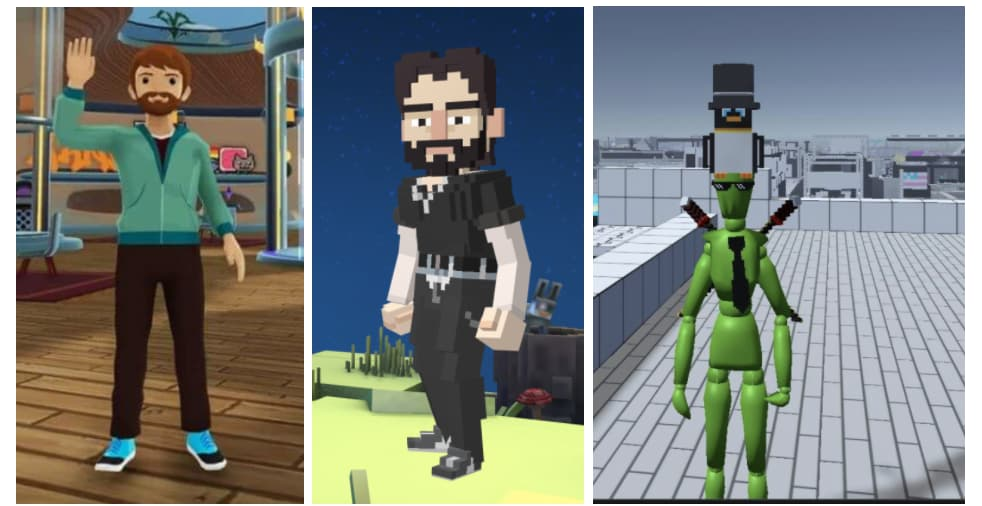

## Abstract

This EIP standardizes a schema for NFTs metadata to add new field namespaces to the JSON schema for [EIP-721](./eip-721.md) and [EIP-1155](./eip-1155.md) NFTs.

## Motivation

A standardized NFT metadata schema allows wallets, marketplaces, metaverses, and similar applications to interoperate with any NFT. Applications such as NFT marketplaces and metaverses could usefully leverage NFTs by rendering them using custom 3D representations or any other new attributes.

Some projects like Decentraland, TheSandbox, Cryptoavatars, etc. need their own 3D model in order to represent an NFT. These models are not cross-compatible because of distinct aesthetics and data formats.

## Specification

The key words "MUST", "MUST NOT", "REQUIRED", "SHALL", "SHALL NOT", "SHOULD", "SHOULD NOT", "RECOMMENDED", "MAY", and "OPTIONAL" in this document are to be interpreted as described in RFC 2119.

### Schema

(subject to "caveats" below)

A new property called `namespaces` is introduced. This property expects one object per project as shown in the example below.

```jsonc
{
    "title": "Asset Metadata",
    "type": "object",
    "properties": {
        "name": {
            "type": "string",
            "description": "Identifies the asset that this NFT represents"
        },
        "description": {
            "type": "string",
            "description": "Describes the asset that this NFT represents"
        },
        "image": {
            "type": "string",
            "description": "A URI pointing to a resource with mime type image/* representing the asset that this NFT represents. Consider making any images at a width between 320 and 1080 pixels and aspect ratio between 1.91:1 and 4:5 inclusive."
        },
        "namespaces": {
          "type": "object",
          "description": "Application-specific NFT properties"
        }
    }
}
```

### Example

```jsonc
{
  "name": "My NFT",
  "description": "NFT description",
  "image": "ipfs://QmZfmRZHuawJDtDVMaEaPWfgWFV9iXoS9SzLvwX76wm6pa",
  "namespaces": {
    "myAwesomeCompany": {
      "prop1": "value1",
      "prop2": "value2",
    },
    "myAwesomeCompany2": {
      "prop3": "value3",
      "prop4": "value4",
    },
  }
}

// Or by simply using a `URI` to reduce the size of the JSON response.

{
  "name": "My NFT",
  "description": "NFT description",
  "image": "ipfs://QmZfmRZHuawJDtDVMaEaPWfgWFV9iXoS9SzLvwX76wm6pa",
  "namespaces": {
    "myAwesomeCompany": "URI",
    "myAwesomeCompany2": "URI",
  }
}
```

## Rationale

There are many projects which need custom properties in order to display a current NFT. Each project may have its own way to render the NFTs and therefore they need different values. An example of this is the metaverses like Decentraland or TheSandbox where they need different 3d models to render the NFT based on the visual/engine of each. NFTs projects like Cryptopunks, Bored Apes, etc. can create the 3d models needed for each project and therefore be supported out of the box.

The main differences between the projects that are rendering 3d NFTs (models) are:

### Armatures

Every metaverse uses its own armature. There is a standard for humanoids but it is not being used for every metaverse and not all the metaverses use humanoids. For example, Decentraland has a different aesthetic than Cryptovoxels and TheSandbox. It means that every metaverse will need a different model and they may have the same extension (GLB, GLTF)



### Metadata (Representations Files)

For example, every metaverse uses its own metadata representation files to make it work inside the engine depending on its game needs.

This is the JSON config of a wearable item in Decentraland:

```jsonc
"data": {
  "replaces": [],
  "hides": [],
  "tags": [],
  "category": "upper_body",
  "representations": [
    {
      "bodyShapes": [
        "urn:decentraland:off-chain:base-avatars:BaseMale"
      ],
      "mainFile": "male/Look6_Tshirt_A.glb",
      "contents": [
        {
          "key": "male/Look6_Tshirt_A.glb",
          "url": "https://peer-ec2.decentraland.org/content/contents/QmX3yMhmx4AvGmyF3CM5ycSQB4F99zXh9rL5GvdxTTcoCR"
        }
      ],
      "overrideHides": [],
      "overrideReplaces": []
    },
    {
      "bodyShapes": [
        "urn:decentraland:off-chain:base-avatars:BaseFemale"
      ],
      "mainFile": "female/Look6_Tshirt_B (1).glb",
      "contents": [
        {
          "key": "female/Look6_Tshirt_B (1).glb",
          "url": "https://peer-ec2.decentraland.org/content/contents/QmcgddP4L8CEKfpJ4cSZhswKownnYnpwEP4eYgTxmFdav8"
        }
      ],
      "overrideHides": [],
      "overrideReplaces": []
    }
  ]
},
"image": "https://peer-ec2.decentraland.org/content/contents/QmPnzQZWAMP4Grnq6phVteLzHeNxdmbRhKuFKqhHyVMqrK",
"thumbnail": "https://peer-ec2.decentraland.org/content/contents/QmcnBFjhyFShGo9gWk2ETbMRDudiX7yjn282djYCAjoMuL",
"metrics": {
  "triangles": 3400,
  "materials": 2,
  "textures": 2,
  "meshes": 2,
  "bodies": 2,
  "entities": 1
}
```

`replaces`, `overrides`, `hides`, and different body shapes representation for the same asset are needed for Decentraland in order to render the 3D asset correctly.

Using `namespaces` instead of objects like the ones below make it easy for the specific vendor/third-parties to access and index the required models. Moreover, `styles` do not exist because there are no standards around for how an asset will be rendered. As I mentioned above, each metaverse for example uses its own armature and aesthetic. There is no Decentraland-style or TheSandbox-style that other metaverses use. Each of them is unique and specific for the sake of the platform's reason of being. Projects like Cryptoavatars are trying to push different standards but without luck for the same reasons related to the uniquity of the armature/animations/metadata.

```jsonc
{
    "id": "model",
    "type": "model/gltf+json",
    "style": "Decentraland",
    "uri": "..."
},

// Or

{
    "id": "model",
    "type": "model/gltf+json",
    "style": "humanoide",
    "uri": "..."
},
```

With `namespaces`, each vendor will know how to render an asset by doing:

```ts
fetch(metadata.namespaces["PROJECT_NAME"].uri).then(res => render(res))
```

The idea behind extending the [EIP-721](./eip-721.md) metadata schema is for backward compatibility. Most projects on Ethereum use non-upgradeable contracts. If this EIP required new implementations of those contracts, they would have to be re-deployed. This is time-consuming and wastes money. Leveraging EIP-721's existing metadata  field minimizes the number of changes necessary. Finally, the JSON metadata is already used to store representations using the `image` field. It seems reasonable to have all the representations of an asset in the same place.

## Backwards Compatibility

Existing projects that can't modify the metadata response (schema), may be able to create a new smart contract that based on the `tokenId` returns the updated metadata schema. Of course, the projects may need to accept these linked smart contracts as valid in order to fetch the metadata by the `tokenURI` function.

## Security Considerations

The same security considerations as with [EIP-721](./eip-721.md) apply related to using http gateways or IPFS for the tokenURI method.

## Copyright

Copyright and related rights waived via [CC0](../LICENSE.md).
