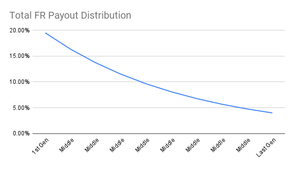
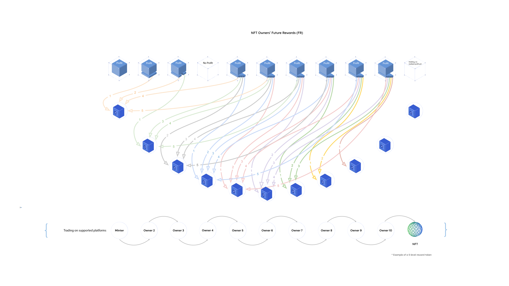
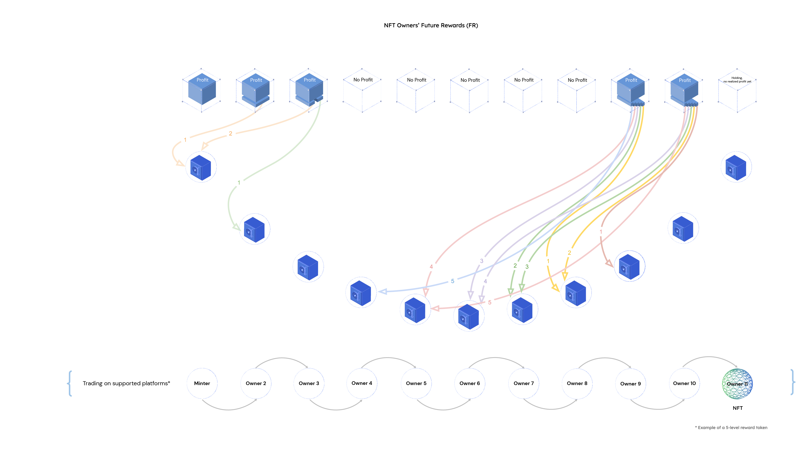

## Abstract

In the proposed EIP, we introduce the Future Rewards (FR) extension for [ERC-721](./eip-721.md) tokens (NFTs), allowing owners to benefit from future price increases even after selling their tokens. With [ERC-5173](./eip-5173.md), we establish a Participatory Value Amplification framework where creators, buyers, and sellers collaborate to amplify value and build wealth together. This innovative approach tackles the challenges faced by traders, creating a fairer and more profitable system that goes beyond zero-sum thinking. Aligned interests between the service provider and users create a sustainable and beneficial trading environment. ERC-5173 compliant token owners enjoy price increases during holding and continue to receive Future Rewards (FRs) even after selling. By eliminating division and promoting collective prosperity, ERC-5173 fosters strong bonds among participants. All sellers, including the original Minter, receive equal FR distributions through the NFT Future Rewards (nFR) framework, ensuring fair sharing of profits across historical ownership.

## Motivation

The current trading landscape is rife with unfair practices such as spoofing, insider trading, and wash trading. These techniques often lead to losses for average traders who are caught in the cycle of greed and fear. However, with the emergence of non-fungible tokens (NFTs) and the potential to track every transaction, we have the opportunity to disrupt this unequal value distribution.

The implementation of ERC-5173 sets a standard for profit sharing throughout the token's ownership history, benefiting all market participants. It introduces a value-amplification system where buyers and owners are rewarded for their contributions to the price discovery process. This model aligns interests and creates a mutually beneficial economic rule for both buyers and sellers.

NFTs, unlike physical art and collectibles, can accurately reflect the contributions of their owners to their value. By recording every price change of each [ERC-721](./eip-721.md) token, we can establish a Future Rewards program that fairly compensates owners. This program aims to level the playing field and provide average traders with a better chance at success.

In addition to promoting a new gift economic model, our framework discourages any illicit deals that bypass the rules set by artists and marketplaces. It promotes transparency and integrity within the trading ecosystem.

When applied to wrapped [ERC-20](./eip-20.md) token trading, this value-amplification framework revolutionizes the asset transaction industry by incorporating identities into the time and sales (T&S) data. This inclusive feature provides a comprehensive view of each transaction, adding a new dimension to trading.

## Specification

The key words “MUST”, “MUST NOT”, “REQUIRED”, “SHALL”, “SHALL NOT”, “SHOULD”, “SHOULD NOT”, “RECOMMENDED”, “MAY”, and “OPTIONAL” in this document are to be interpreted as described in RFC 2119.

The following is an extension of the [ERC-721](./eip-721.md) standard.

[ERC-721](./eip-721.md)-compliant contracts MAY implement this EIP for rewards to provide a standard method of rewarding future buyers and previous owners with realized profits in the future.

Implementers of this standard MUST have all of the following functions:

```solidity

pragma solidity ^0.8.0;

import "@openzeppelin/contracts/utils/introspection/IERC165.sol";

/*
 *
 * @dev Interface for the Future Rewards Token Standard.
 *
 * A standardized way to receive future rewards for non-fungible tokens (NFTs.)
 *
 */
interface IERC5173 is IERC165 {

    event FRClaimed(address indexed account, uint256 indexed amount);

    event FRDistributed(uint256 indexed tokenId, uint256 indexed soldPrice, uint256 indexed allocatedFR);

    event Listed(uint256 indexed tokenId, uint256 indexed salePrice);

    event Unlisted(uint256 indexed tokenId);

    event Bought(uint256 indexed tokenId, uint256 indexed salePrice);

    function list(uint256 tokenId, uint256 salePrice) external;

    function unlist(uint256 tokenId) external;

    function buy(uint256 tokenId) payable external;

    function releaseFR(address payable account) external;

    function retrieveFRInfo(uint256 tokenId) external returns(uint8, uint256, uint256, uint256, uint256, address[] memory);

    function retrieveAllottedFR(address account) external returns(uint256);

    function retrieveListInfo(uint256 tokenId) external returns(uint256, address, bool);
    
}

```

An nFR contract MUST implement and update for each Token ID. The data in the `FRInfo` struct MAY either be stored wholly in a single mapping, or MAY be broken down into several mappings. The struct MUST either be exposed in a public mapping or mappings, or MUST have public functions that access the private data. This is for client-side data fetching and verification.

```solidity

struct FRInfo {
        uint8 numGenerations; //  Number of generations corresponding to that Token ID
        uint256 percentOfProfit; // Percent of profit allocated for FR, scaled by 1e18
        uint256 successiveRatio; // The common ratio of successive in the geometric sequence, used for distribution calculation
        uint256 lastSoldPrice; // Last sale price in ETH mantissa
        uint256 ownerAmount; // Amount of owners the Token ID has seen
        address[] addressesInFR; // The addresses currently in the FR cycle
}

struct ListInfo {
        uint256 salePrice; // ETH mantissa of the listed selling price
        address lister; // Owner/Lister of the Token
        bool isListed; // Boolean indicating whether the Token is listed or not
}

```
 
Additionally, an nFR smart contract MUST store the corresponding `ListInfo` for each Token ID in a mapping. A method to retrieve a Token ID’s corresponding `ListInfo` MUST also be accessible publicly.

An nFR smart contract MUST also store and update the amount of Ether allocated to a specific address using the `_allotedFR` mapping. The `_allottedFR` mapping MUST either be public or have a function to fetch the FR payment allotted to a specific address.

### Percent Fixed Point

The `allocatedFR` MUST be calculated using a percentage fixed point with a scaling factor of 1e18 (X/1e18) - such as "5e16" - for 5%. This is REQUIRED to maintain uniformity across the standard. The max and min values would be - 1e18 - 1.

### Default FR Info

A default `FRInfo` MUST be stored in order to be backward compatible with [ERC-721](./eip-721.md) mint functions. It MAY also have a function to update the `FRInfo`, assuming it has not been hard-coded.

### ERC-721 Overrides

An nFR-compliant smart contract MUST override the [ERC-721](./eip-721.md) `_mint`, `_transfer`, and `_burn` functions. When overriding the `_mint` function, a default FR model is REQUIRED to be established if the mint is to succeed when calling the [ERC-721](./eip-721.md) `_mint` function and not the nFR `_mint` function. It is also to update the owner amount and directly add the recipient address to the FR cycle. When overriding the `_transfer` function, the smart contract SHALL consider the NFT as sold for 0 ETH, and update the state accordingly after a successful transfer. This is to prevent FR circumvention. Additionally, the `_transfer` function SHALL prevent the caller from transferring the token to themselves or an address that is already in the FR sliding window, this can be done through a require statement that ensures that the sender or an address in the FR sliding window is not the recipient, otherwise, it’d be possible to fill up the FR sequence with one’s own address or duplicate addresses. Finally, when overriding the `_burn` function, the smart contract SHALL delete the `FRInfo` and `ListInfo` corresponding to that Token ID after a successful burn.

Additionally, the [ERC-721](./eip-721.md) `_checkOnERC721Received` function MAY be explicitly called after mints and transfers if the smart contract aims to have safe transfers and mints.

### Safe Transfers

If the wallet/broker/auction application will accept safe transfers, then it MUST implement the [ERC-721](./eip-721.md) wallet interface.

### Listing, Unlisting, and Buying

The `list`, `unlist`, and `buy` functions MUST be implemented, as they provide the capability to sell a token.

```solidity
function list(uint256 tokenId, uint256 salePrice) public virtual override {
   //...
}


function unlist(uint256 tokenId) public virtual override {
   //...
}

function buy(uint256 tokenId) public virtual override payable {
   //...
}

```

The `list` function accepts a `tokenId` and a `salePrice` and updates the corresponding `ListInfo` for that given `tokenId` after ensuring that the `msg.sender` is either approved or the owner of the token. The `list` function SHOULD emit the `Listed` event. The function signifies that the token is listed and at what price it is listed for. 

The `unlist` function accepts a `tokenId` and it deletes the corresponding `ListInfo` after the owner verifications have been met. The `unlist` function SHOULD emit the `Unlisted` event.

The `buy` function accepts a `tokenId` and MUST be payable. It MUST verify that the `msg.value` matches the token’s `salePrice` and that the token is listed, before proceeding and calling the FR `_transferFrom` function. The function MUST also verify that the buyer is not already in the FR sliding window. This is to ensure the values are valid and will also allow for the necessary FR to be held in the contract. The `buy` function SHOULD emit the `Bought` event.


### Future Rewards `_transferFrom` Function

The FR `_transferFrom` function MUST be called by all nFR-supporting smart contracts, though the accommodations for non-nFR-supporting contracts MAY also be implemented to ensure backwards compatibility.

```solidity

function transferFrom(address from, address to, uint256 tokenId, uint256 soldPrice) public virtual override payable {
       //...
}

```

Based on the stored `lastSoldPrice`, the smart contract will determine whether the sale was profitable after calling the [ERC-721](./eip-721.md) transfer function and transferring the NFT. If it was not profitable, the smart contract SHALL update the last sold price for the corresponding Token ID, increment the owner amount, shift the generations, and transfer all of the `msg.value` to the `lister` depending on the implementation. Otherwise, if the transaction was profitable, the smart contract SHALL call the `_distributeFR` function, then update the `lastSoldPrice`, increment the owner amount, and finally shift generations. The `_distributeFR` function or the FR `_transferFrom` MUST return the difference between the allocated FR that is to be distributed amongst the `_addressesInFR` and the `msg.value` to the `lister`. Once the operations have completed, the function MUST clear the corresponding `ListInfo`. Similarly to the `_transfer` override, the FR `_transferFrom` SHALL ensure that the recipient is not the sender of the token or an address in the FR sliding window.

### Future Rewards Calculation

Marketplaces that support this standard MAY implement various methods of calculating or transferring Future Rewards to the previous owners.

```solidity

function _calculateFR(uint256 totalProfit, uint256 buyerReward, uint256 successiveRatio, uint256 ownerAmount, uint256 windowSize) pure internal virtual returns(uint256[] memory) {
    //...        
}

```

In this example (*Figure 1*), a seller is REQUIRED to share a portion of their net profit with 10 previous holders of the token. Future Rewards will also be paid to the same seller as the value of the token increases from up to 10 subsequent owners. 

When an owner loses money during their holding period, they MUST NOT be obligated to share Future Rewards distributions, since there is no profit to share. However, he SHALL still receive a share of Future Rewards distributions from future generations of owners, if they are profitable.

 

*Figure 1: Geometric sequence distribution*

The buyers/owners receive a portion ( r ) of the realized profit  (P ) from an NFT transaction. The remaining proceeds go to the seller.

As a result of defining a sliding window mechanism ( n ), we can determine which previous owners will receive distributions. The owners are arranged in a queue, starting with the earliest owner and ending with the owner immediately before the current owner (the Last Generation). The First Generation is the last of the next n generations. There is a fixed-size profit distribution window from the First Generation to the Last Generation. 

The profit distribution SHALL be only available to previous owners who fall within the window. 

In this example, there SHALL be a portion of the proceeds awarded to the Last Generation owner (the owner immediately prior to the current seller) based on the geometric sequence in which profits are distributed. The larger portion of the proceeds SHALL go to the Mid-Gen owners, the earlier the greater, until the last eligible owner is determined by the sliding window, the First Generation. Owners who purchase earlier SHALL receive a greater reward, with first-generation owners receiving the greatest reward.

### Future Rewards Distribution

 

*Figure 2: NFT Owners' Future Rewards (nFR)*

*Figure 2* illustrates an example of a five-generation Future Rewards Distribution program based on an owner's realized profit.

```solidity

function _distributeFR(uint256 tokenId, uint256 soldPrice) internal virtual {
       //...

        emit FRDistributed(tokenId, soldPrice, allocatedFR);
 }
 
```

The `_distributeFR` function MUST be called in the FR `_transferFrom` function if there is a profitable sale. The function SHALL determine the addresses eligible for FR, which would essentially be, excluding the last address in `addressesInFR` in order to prevent any address from paying itself. If the function determines there are no addresses eligible, i.e., it is the first sale, then it SHALL either `return 0` if `_transferFrom` is handling FR payment or send `msg.value` to the `lister`. The function SHALL calculate the difference between the current sale price and the `lastSoldPrice`, then it SHALL call the `_calculateFR` function to receive the proper distribution of FR. Then it SHALL distribute the FR accordingly, making order adjustments as necessary. Then, the contract SHALL calculate the total amount of FR that was distributed (`allocatedFR`), in order to return the difference of the `soldPrice` and `allocatedFR` to the `lister`. Finally, it SHALL emit the `FRDistributed` event. Additionally, the function MAY return the allocated FR, which would be received by the FR `_transferFrom` function, if the `_transferFrom` function is sending the `allocatedFR` to the `lister`.

### Future Rewards Claiming

The future Rewards payments SHOULD utilize a pull-payment model, similar to that demonstrated by OpenZeppelin with their PaymentSplitter contract. The event  FRClaimed would be triggered after a successful claim has been made. 

```solidity

function releaseFR(address payable account) public virtual override {
        //...
}

```

### Owner Generation Shifting

The `_shiftGenerations` function MUST be called regardless of whether the sale was profitable or not. As a result, it will be called in the `_transfer` [ERC-721](./eip-721.md) override function and the FR `transferFrom` function. The function SHALL remove the oldest account from the corresponding `_addressesInFR` array. This calculation will take into account the current length of the array versus the total number of generations for a given token ID.

## Rationale

### Fixed Percentage to 10^18

Considering Fixed-Point Arithmetic is to be enforced, it is logical to have 1e18 represent 100% and 1e16 represent 1% for Fixed-Point operations. This method of handling percents is also commonly seen in many Solidity libraries for Fixed-Point operations.

### Emitting Event for Payment

Since each NFT contract is independent, and while a marketplace contract can emit events when an item is sold, choosing to emit an event for payment is important. As the royalty and FR recipient may not be aware of/watching for a secondary sale of their NFT, they would never know that they received a payment except that their ETH wallet has been increased randomly. 

The recipient of the secondary sale will therefore be able to verify that the payment has been received by calling the parent contract of the NFT being sold, as implemented in [ERC-2981](./eip-2981.md).

### Number of Generations of All Owners ( n ) vs Number of Generations of Only Profitable Owners

It is the number of generations of all owners, not just those who are profitable, that determines the number of owners from which the subsequent owners' profits will be shared, see *Figure 3*. As part of the effort to discourage "ownership hoarding," Future Rewards distributions will not be made to the current owner/purchaser if all the owners lose money holding the NFT. Further information can be found under Security Considerations.



*Figure 3: Losing owners*

### Single vs Multigenerations

In a single generation reward, the new buyer/owner receives a share of the next single generation's realized profit only. In a multigenerational reward system, buyers will have future rewards years after their purchase. The NFT should have a long-term growth potential and a substantial dividend payout would be possible in this case. 

We propose that the marketplace operator can choose between a single generational distribution system and a multigenerational distribution system.

### Direct FR Payout by the Seller vs Smart Contract-managed Payout

FR payouts directly derived from the sale proceeds are immediate and final. As part of the fraud detection detailed later in the Security Considerations section, we selected a method in which the smart contract calculates all the FR amounts for each generation of previous owners, and handles payout according to other criteria set by the marketplace, such as reduced or delayed payments for wallet addresses with low scores, or a series of consecutive orders detected using a time-heuristic analysis. 

### Equal vs Linear Reward Distributions

#### Equal FR Payout


*Figure 4: Equal, linear reward distribution*

FR distributions from the realization of profits by later owners are distributed equally to all eligible owners (*Figure 4*). The exponential reward curve, however, may be more desirable, as it gives a slightly larger share to the newest buyer. Additionally, this distribution gives the earliest generations the largest portions as their FR distributions near the end, so they receive higher rewards for their early involvement, but the distribution is not nearly as extreme as one based on arithmetic sequences (*Figure 5*). 

This system does not discriminate against any buyer because each buyer will go through the same distribution curve.

#### Straight line arithmetic sequence FR payout


*Figure 5: Arithmetic sequence distribution*

The profit is distributed according to the arithmetic sequence, which is 1, 2, 3, ... and so on. The first owner will receive 1 portion, the second owner will receive 2 portions, the third owner will receive 3 portions, etc. 

## Backwards Compatibility

This proposal is fully compatible with current [ERC-721](./eip-721.md) standards and [ERC-2981](./eip-2981.md). It can also be easily adapted to work with [ERC-1155](./eip-1155.md).

## Test Cases

[This contract](../assets/eip-5173/Implementation/nFRImplementation.sol) contains the reference implementation for this proposal.

[Here is a visualization of the test case](../assets/eip-5173/animate-1920x1080-1750-frames.gif?raw=true). 

As a result of implementing ERC-5173, a new project has been launched called untrading.org.

## Reference Implementation

This implementation uses OpenZeppelin contracts and the PRB Math library created by Paul R Berg for fixed-point arithmetic. It demonstrates the interface for the nFR standard, an nFR standard-compliant extension, and an [ERC-721](./eip-721.md) implementation using the extension.

The code for the reference implementation is [here](../assets/eip-5173/Implementation/nFRImplementation.sol).

### Distribution of NFT Royalties to Artists and Creators

We agree that artists’ royalties should be uniform and on-chain. We support [ERC-2981](./eip-2981.md) NFT royalty Standard proposal.

All platforms can support royalty rewards for the same NFT based on on-chain parameters and functions:

- No profit, no profit sharing, no cost;
- The question of "who owned it" is often crucial to the provenance and value of a collectible;
- The previous owner should be re-compensated for their ownership;
- And the buyer/owner incentive in FR eliminates any motive to circumvent the royalty payout schemes;

### Distribution of NFT Owners’ Future Rewards (FRs)

#### Future Rewards calculation

Any realized profits (P) when an NFT is sold are distributed among the buyers/owners. The previous owners will take a fixed portion of the profit (P), and this portion is called Future Rewards (FRs). The seller takes the rest of the profits.

We define a sliding window mechanism to decide which previous owners will be involved in the profit distribution. Let's imagine the owners as a queue starting from the first hand owner to the current owner. The profit distribution window starts from the previous owner immediately to the current owner and extends towards the first owner, and the size of the windows is fixed. Only previous owners located inside the window will join the profit distribution.  


In this equation:

- P is the total profit, the difference between the selling price minus the buying price;
- r is buyer reward ratio of the total P;
- g is the common ratio of successive in the geometric sequence;
- n is the actual number of owners eligible and participating in the future rewards sharing. To calculate n, we have n = min(m, w), where m is the current number of owners for a token, and w is the window size of the profit distribution sliding window algorithm

#### Converting into Code

```solidity

pragma solidity ^0.8.0;
//...

/* Assumes usage of a Fixed Point Arithmetic library (prb-math) for both int256 and uint256, and OpenZeppelin Math utils for Math.min. */
function _calculateFR(uint256 P, uint256 r, uint256 g, uint256 m, uint256 w) pure internal virtual returns(uint256[] memory) {
        uint256 n = Math.min(m, w);
        uint256[] memory FR = new uint256[](n);

        for (uint256 i = 1; i < n + 1; i++) {
            uint256 pi = 0;

            if (successiveRatio != 1e18) {
                int256 v1 = 1e18 - int256(g).powu(n);
                int256 v2 = int256(g).powu(i - 1);
                int256 v3 = int256(P).mul(int256(r));
                int256 v4 = v3.mul(1e18 - int256(g));
                pi = uint256(v4 * v2 / v1);
            } else {
                pi = P.mul(r).div(n);
            }

            FR[i - 1] = pi;
        }

        return FR;
}

```

The complete implementation code can be found [here](../assets/eip-5173/Implementation/nFRImplementation.sol).

## Security Considerations

### Payment Attacks

As this ERC introduces royalty and realized profit rewards collection, distribution, and payouts to the ERC-721 standard, the attack vectors increase. As discussed by Andreas Freund regarding mitigations to phishing attacks, we recommend reentrancy protection for all payment functions to reduce the most significant attack vectors for payments and payouts.

### Royalty Circumventing

Many methods are being used to avoid paying royalties to creators under the current [ERC-721](./eip-721.md) standard. Through an under-the-table transaction, the new buyer's cost basis will be reduced to zero, increasing their FR liability to the full selling price. Everyone, either the buyer or seller, would pay a portion of the previous owner's net realized profits ( P x r ). Acting in his or her own interests, the buyer rejects any loyalty circumventing proposal.

### FR Hoarding through Wash Sales

Quantexa blog and beincrypto articles have reported widespread wash trading on all unregulated cryptocurrency trading platforms and NFT marketplaces. The use of wash trading by dishonest actors can lead to an unfair advantage, as well as inflated prices and money laundering. When a single entity becomes multiple generations of owners to accumulate more rewards in the future, the validity of the system is undermined.

#### Wash trading by users

Using a different wallet address, an attacker can "sell" the NFT to themselves at a loss. It is possible to repeat this process n times in order to maximize their share of the subsequent FR distributions (*Figure 6*). A wallet ranking score can partially alleviate this problem. It is evident that a brand new wallet is a red flag, and the marketplace may withhold FR distribution from it if it has a short transaction history (i.e. fewer than a certain number of transactions).

We do not want a large portion of future rewards to go to a small number of wash traders. Making such practices less profitable is one way to discourage wash trading and award hoarding. It can be partially mitigated, for example, by implementing a wallet-score and holding period-based incentive system. The rewards for both parties are reduced if a new wallet is used or if a holding period is less than a certain period. 


*Figure 6: Same owner using different wallets*

#### Wash trading by the marketplace operator

However, the biggest offender appears to be the marketplace, which engages heavily in wash trading, or simply does not care about it, according to Decrypt. The authors have personally experienced this phenomenon. A senior executive of a top-5 cryptocurrency exchange boasted during a mid-night drinking session in 2018, that they had "brushed" (wash-traded) certain newly listed tokens, which they called "marketmaking." The exchange is still ranked among the top five crypto exchanges today.

Many of these companies engage in wash trading on their own or collude with certain users, and royalties and FR payments are reimbursed under the table. It is crucial that all exchanges have robust features to prevent self-trading. Users should be able to observe watchers transparently. Marketplaces should provide their customers with free access to an on-chain transaction monitoring service like Chainalysis Reactor.

### Long/Cyclical FR-Entitled Owner Generations

In most cases, malicious actors will create excessively long or cyclical Future Rewards Owner Generations that will result in applications that attempt to distribute FR or shift generations running out of gas and not functioning. Therefore, clients are responsible for verifying that the contract with which they interact has an appropriate number of generations, so that looping over will not deplete the gas.

## Copyright

Copyright and related rights waived via [CC0](../LICENSE.md).
