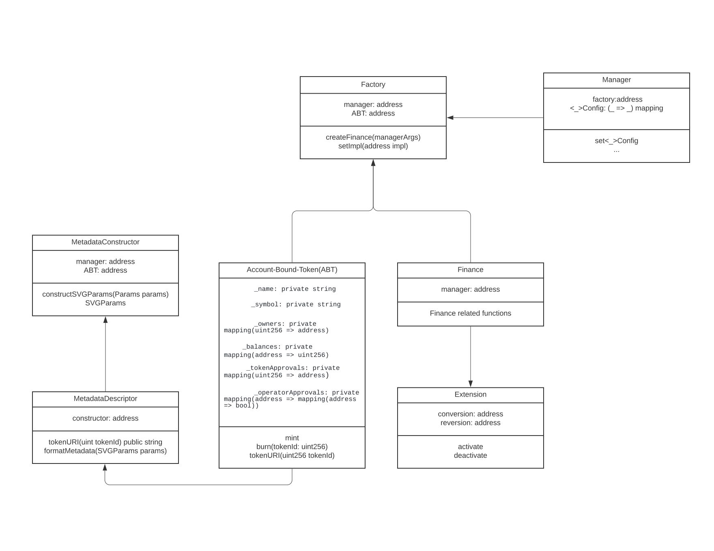

## Abstract

This EIP proposes a form of smart contract design pattern and a new type of account abstraction on how one's finance should be managed, ensuring transparency of managing investments and protection with self-sovereignty even from its financial operators. This EIP enables greater self-sovereignty of one's assets using a personal finance contract for each individual. The seperation between an investor's funds and the operation fee is clearly specified in the personal smart contract, so investors can ensure safety from arbitrary loss of funds by the operating team's control.

This EIP extends [ERC-5114](./eip-5114.md) to further enable transferring fund to other accounts for mobility between managing multiple wallets.

## Motivation

Decentralized finance (DeFi) faces a trust issue. Smart contracts are often proxies, with the actual logic of the contract hidden away in a separate logic contract. Many projects include a multi-signature "wallet" with unnecessarily-powerful permissions. And it is not possible to independently verify that stablecoins have enough real-world assets to continue maintaining their peg, creating a large loss of funds (such as happened in the official bankruptcy announcement of Celsius and UST de-pegging and anchor protocol failure). One should not trust exchanges or other third parties with one's own investments with the operators' clout in Web3.0.

Smart contracts are best implemented as a promise between two parties written in code, but current DeFi contracts are often formed using less than 7 smart contracts to manage their whole investors' funds, and often have a trusted key that has full control. This is evidently an issue, as investors have to trust contract operators with their funds, meaning that users do not actually own their funds.

The pattern with personal finance contract also offers more transparency than storing mixed fund financial data in the operating team's contract. With a personal finance contract, an account's activity is easier to track than one global smart contract's activity. The pattern introduces a Non-Fungiible Account-Bound Token (ABT) to store credentials from the personal finance contract.

### Offchain-identity vs Soul-bound token on credentials

This EIP provides a better alternative to off-chain identity solutions which take over the whole system because their backends eventually rely on the trust of the operator, not cryptographic proof (e.g. Proof-of-work, Proof-of-stake, etc). Off-chain identity as credentials are in direct opposition to the whole premise of crypto. Soulbound tokens are a better, verifiable credential, and data stored off-chain is only to store token metadata.

## Specification

The key words “MUST”, “MUST NOT”, “REQUIRED”, “SHALL”, “SHALL NOT”, “SHOULD”, “SHOULD NOT”, “RECOMMENDED”, “MAY”, and “OPTIONAL” in this document are to be interpreted as described in RFC 2119.

The specification consists of two patterns for **Interaction** and **Governance**.

### Interaction

#### Interfaces

The interaction pattern consists of 4 components for interaction; manager, factory, finance, account-bound token, and extension.

Interaction contract pattern is defined with these contracts:

- A soul-bound or account bound token contract to give access to interact with a financial contract with credentials
- A manager contract that interacts first contact with an investor
- A factory contract that creates a financial contract for each user
- A finance contract that can interact with the investor

#### Requirements

A soul-bound or account bound token contract is defined with these properties:

1. It SHALL be non-fungible and MUST satisfy [ERC-721](./eip-721.md).
2. Credentials SHOULD be represented with its metadata with `tokenURI()` function.
3. It MUST only reference factory to verify its minting.
4. If it is transferrable, it is account-bound. If not, it is soul-bound.

A manager contract is defined with these properties:

1. It MUST be the only kind of contract which calls factory to create.
2. It SHOULD store all related configurations for financial parameters.

A factory contract is defined with these properties:

1. It SHALL clone the finance contract with uniform implementation.
2. It MUST be the only contract that can mint account-bound token.
3. It MUST keep an recent id of account bound token.

A finance contract is defined with these properties:

1. A finance contract MUST only be initialized once from factory contract in constructor.
2. Funds in the contract SHALL NOT be transferred to other contracts nor accounts unless sender who owns soul-bound or account bound token signs to do so.
3. Every state-changing function of the smart contract MUST only accept sender who owns soul-bound or account bound-token except global function(e.g. liquidation).
4. Global function SHOULD be commented as `/* global */` to clarify the function is can be accessed with anyone.
5. Each finance contract SHOULD be able to represent transaction that has happened only with those who had account-bound token.
6. If soul-bound token is used for access, the finance contract MUST be able to represent transaction that has happened only between whom had the private key and the finance contract.

#### Contracts



<center>
Contract Diagram of [ERC-5252](eip-5252.md)
</center>

**`Manager`**: **`Manager`** contract acts as an entry point to interact with the investor. The contract also stores parameters for **`Finance`** contract.

**`Factory`**: **`Factory`** contract manages contract bytecode to create for managing investor's fund and clones **`Finance`** contract on **`Manager`** contract's approval. It also mints account-bound tokens to interact with the `Finance` contract.

**`Finance`**: **`Finance`** contract specifies all rules on managing an investor's fund. The contract is only accessible with an account that has an Account-bound token. When an investor deposits a fund to **`Manager`** contract, the contract sends the fund to **`Finance`** contract account after separating fees for operation.

**`Account-bound token`**: **`Account-bound token`** contract in this EIP can bring the **`Finance`** contract's data and add metadata. For example, if there is a money market lending
**`Finance`** contract, its **`Account-bound token`** can show how much balance is in agreement using SVG.

**`Extension`**: **`Extension`** contract is another contract that can utilize locked funds in **`Finance`** contract. The contract can access with **`Finance`** contract on operator's approval managed in **`Manager`** contract. Example use case of `Extension` can be a membership.

**`Metadata`**: **`Metadata`** contract is the contract where it stores metadata related to account credentials. Credential related data are stored with specific key. Images are usually displayed as SVG, but offchain image is possible.

---

### Governance

The governance pattern consists of 2 components; influencer and governor.

#### Interfaces

#### Requirements

An influencer contract is defined with these properties:

1. The contract SHALL manage multiplier for votes.
2. The contract SHALL set a decimal to calculated normalized scores.
3. The contract SHALL set a function where governance can decide factor parameters.

A governor contract is defined with these properties:

1. The contract MUST satisfy Governor contract from OpenZeppelin.
2. The contract SHALL refer influencer contract for multiplier
3. The contract MUST limit transfer of account bound token once claimed for double vote prevention.

#### From Token Governance To Contribution Based Governance

|             | Token Governance             | Credential-based Governance        |
| ----------- | ---------------------------- | ---------------------------------- |
| Enforcement | More tokens, more power      | More contribution, More power      |
| Incentives  | More tokens, more incentives | More contribution, more incentives |
| Penalty     | No penalty                   | Loss of power                      |
| Assignment  | One who holds the token      | One who has the most influence     |

<center>
Token Governance vs Credential Based Governance
</center>

Token governance is not sustainable in that it gives **more** power to "those who most want to rule". Any individual who gets more than 51% of the token supply can forcefully take control.

New governance that considers contributions to the protocol is needed because:

- **Rulers can be penalized on breaking the protocol**
- **Rulers can be more effectively incentivized on maintaining the protocol**

The power should be given to "those who are most responsible". Instead of locked or owned tokens, voting power is determined with contributions marked in Account Bound Tokens (ABT). This EIP defines this form of voting power as **`Influence`**.

#### Calculating Influence

**`Influence`** is a multiplier on staked tokens that brings more voting power of a DAO to its contributors. To get **`Influence`**, a score is calculated on weighted contribution matrix. Then, the score is normalized to give a member's position in whole distribution. Finally, the multiplier is determined on the position in every community members.

#### Calculating score

The weights represent relative importance on each factor. The total importance is the total sum of the factors. More factors that can be normalized at the time of submitting proposal can be added by community.

|     | Description                                                                               |
| --- | ----------------------------------------------------------------------------------------- |
| α   | Contribution value per each **`Finance`** contract from current proposal                  |
| β   | Time they maintained **`Finance`** per each contract from current timestamp of a proposal |

```math
(score per each ABT) = α * (contribution value) + β * (time that abt was maintained from now)
```

#### Normalization

Normalization is applied for data integrity on user's contribution in a DAO.
Normalized score can be calculated from the state of submitting a proposal

```math
(Normalized score per each ABT) = α * (contribution value)/(total contribution value at submitting tx) + β * (time that abt was maintained)/(time passed from genesis to proposal creation)
```

and have a value between 0 and 1 (since α + β = 1).

#### Multiplier

The multiplier is determined linearly from base factor (b) and multiplier(m).

The equation for influence is :

```math
(influence) = m * (sum(normalized_score))
```

#### Example

For example, if a user has 3 **`Account-bound tokens`** with normalized score of each 1.0, 0.5, 0.3 and the locked token is 100, and multiplier is 0.5 and base factor is 1.5. Then the total influence is

````math
0.5 * {(1.0 + 0.5 + 0.3) / 3} + 1.5 = 1.8

 The total voting power would be

```math
(voting power) = 1.8 * sqrt(100)  = 18
````

#### Stakers vs Enforcers

|              | Stakers                           | Enforcers                                                                               |
| ------------ | --------------------------------- | --------------------------------------------------------------------------------------- |
| Role         | stake governance token for voting | Contributed on the system, can make proposal to change rule, more voting power like 1.5 |
| Populations  | many                              | small                                                                                   |
| Contribution | Less effect                       | More effect                                                                             |
| Influence    | sqrt(locked token)                | Influence \* sqrt(locked token)                                                         |

<center>
Stakers vs Enforcers
</center>

**Stakers**: Stakers are people who vote to enforcers' proposals and get dividend for staked tokens

**Enforcers**: Enforcers are people who takes risk on managing protocol and contributes to the protocol by making a proposal and change to it.

#### Contracts

**`Influencer`**: An **`Influencer`** contract stores influence configurations and measures the contribution of a user from his activities done in a registered Account Bound Token contract. The contract puts a lock on that Account Bound Token until the proposal is finalized.

**`Governor`**: **`Governor`** contract is compatible with the current governor contract in OpenZeppelin. For its special use case, it configures factors where the influencer manages and has access to changing parameters of **`Manager`** configs. Only the `Enforcer` can propose new parameters.

## Rationale

### Gas saving for end user

The gas cost of using multiple contracts (as opposed to a single one) actually saves gas long-run if the clone factory pattern is applied. One contract storing users' states globally means each user is actually paying for the storage cost of other users after interacting with the contract. This, for example, means that MakerDAO's contract operating cost is sometimes over 0.1 ETH, limitimg users' minimum deposit for CDP in order to save gas costs. To solve inefficient n-times charging gas cost interaction for future users, one contract per user is used.

#### Separation between investor's and operation fund

The separation between an investor's funds and operation fee is clearly specified in the smart contract, so investors can ensure safety from arbitrary loss of funds by the operating team's control.

## Backwards Compatibility

This EIP has no known backward compatibility issues.

## Reference Implementation

[Reference implementation](../assets/eip-5252/README.md) is a simple deposit account contract as `Finance` contract and its contribution value α is measured with deposit amount with ETH.

## Security Considerations

- **`Factory`** contracts must ensure that each **`Finance`** contract is registered in the factory and check that **`Finance`** contracts are sending transactions related to their bounded owner.

- Reentrancy attack guard should be applied or change state before delegatecall in each user function in **`Manager`** contract or **`Finance`** contract. Otherwise, **`Finance`** can be generated as double and ruin whole indices.

- Once a user locks influence on a proposal's vote, an **`Account Bound Token`** cannot be transferred to another wallet. Otherwise, double influence can happen.

## Copyright

Copyright and related rights waived via [CC0](../LICENSE.md).
