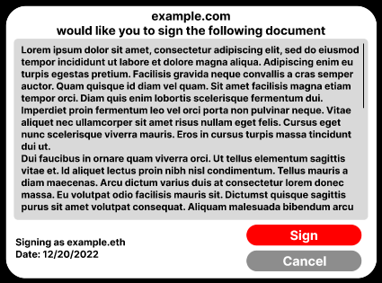

## Abstract

Currently, the real-world applications of smart contracts are limited by the fact that they aren't legally binding. This EIP proposes a standard that allows smart contracts to be legally binding by providing IPFS links to legal documents and ensuring that the users of the smart contract have privity with the relevant legal documents.

Please note that the authors are not lawyers, and that this EIP is not legal advice.

## Motivation

NFTs have oftentimes been branded as a way to hold and prove copyright of a specific work. However, this, in practice, has almost never been the case. Most of the time, NFTs have no legally-binding meaning, and in the rare cases that do, the NFT simply provides a limited license for the initial holder to use the work (but cannot provide any license for any future holders).

## Specification

The key words “MUST”, “MUST NOT”, “REQUIRED”, “SHALL”, “SHALL NOT”, “SHOULD”, “SHOULD NOT”, “RECOMMENDED”, “MAY”, and “OPTIONAL” in this document are to be interpreted as described in RFC 2119.

### Legal Contract Library Interface

```solidity
/// SPDX-License-Identifier: CC0-1.0
pragma solidity ^0.8.0;

import "./IERC165.sol";

interface IERC5289Library is IERC165 {
    /// @notice Emitted when signDocument is called
    event DocumentSigned(address indexed signer, uint16 indexed documentId);
    
    /// @notice An immutable link to the legal document (RECOMMENDED to be hosted on IPFS). This MUST use a common file format, such as PDF, HTML, TeX, or Markdown.
    function legalDocument(uint16 documentId) external view returns (string memory);
    
    /// @notice Returns whether or not the given user signed the document.
    function documentSigned(address user, uint16 documentId) external view returns (bool signed);

    /// @notice Returns when the the given user signed the document.
    /// @dev If the user has not signed the document, the timestamp may be anything.
    function documentSignedAt(address user, uint16 documentId) external view returns (uint64 timestamp);

    /// @notice Sign a document
    /// @dev This MUST be validated by the smart contract. This MUST emit DocumentSigned or throw.
    function signDocument(address signer, uint16 documentId) external;
}
```

### Requesting a Signature

To request that certain documents be signed, revert with an [ERC-5568](./eip-5568.md) signal. The format of the `instruction_data` is an ABI-encoded `(address, uint16)` pair, where the address is the address of the library, and the `uint16` is the `documentId` of the document:

```solidity
throw WalletSignal24(0, 5289, abi.encode(0xcbd99eb81b2d8ca256bb6a5b0ef7db86489778a7, 12345));
```

### Signing a Document

When a signature is requested, wallets MUST call `legalDocument`, display the resulting document to the user, and prompt them to either sign the document or cancel:



If the user agrees, the wallet MUST call `signDocument`.

## Rationale

- `uint64` was chosen for the timestamp return type as 64-bit time registers are standard.
- `uint16` was chosen for the document ID as 65536 documents are likely sufficient for any use case, and the contract can always be re-deployed.
- `signDocument` doesn't take an ECDSA signature for future compatibility with account abstraction. In addition, future extensions can supply this functionality.
- IPFS is mandatory because the authenticity of the signed document can be proven.

## Backwards Compatibility

No backwards compatibility issues found.

## Reference Implementation

### Legal Contract Library

See [`IERC5289Library`](../assets/eip-5289/interfaces/IERC5289Library.sol), [`ERC5289Library`](../assets/eip-5289/ERC5289Library.sol).

## Security Considerations

Users can claim that their private key was stolen and used to fraudulently "sign" contracts. As such, **documents must only be permissive in nature, not restrictive.** For example, a document granting a license to use the image attached to an NFT would be acceptable, as there is no reason for the signer to plausibly deny signing the document.

## Copyright

Copyright and related rights waived via [CC0](../LICENSE.md).
