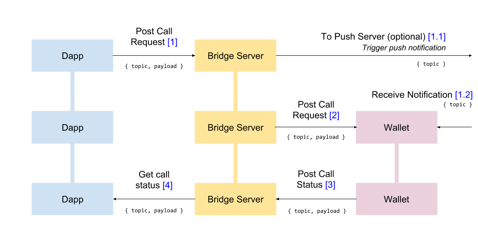

## Abstract

Mobile applications supporting lots of transactions might become a source of bad user experience due to uncontrolled switching between the wallet's and application's UI. By this proposal, we would like to introduce the means to sign and send wallet transactions without the need for user participation. This feature can be implemented by providing user consent for a specific time duration. We call the feature Silent Signing.

## Motivation

Some blockchain applications interact with a blockchain much more frequently than others. It is especially true for gaming applications having their own sidechains. Interrupting the gaming process and switching to the wallet to perform a transaction drastically affect the user experience.

## Specification

To remedy the situation, we'd like to introduce new RPC methods for the ethereum JSON-RPC. Those methods help enable wallets to implement the Silent Signing feature.

### Silent Signing User Flow

The Silent Signing process has the following structure:

1. First, the application requests the wallet to use Silent Signing via the RPC's `wallet_requestSilentSign` method.
2. Second, the wallet prompts the user to confirm enabling the Silent Singing functionality for a specific time duration.
3. If the user does not confirm Silent Signing or the RPC method is not allowed, the application will continue using the regular methods.
4. If the user confirms Silent Signing, then each subsequent transaction will be sent using the `wallet_silentSendTransaction` method for the time duration specified.

### Implementation

The implementation introduces new RPC methods and flow for application and wallet side.

### New RPC Methods

#### `wallet_requestSilentSign`

This RPC method opens the wallet and prompts the user to enable automatic signing for a specific time duration. This function grants the application to call the following methods until the timestamp expires. Standard methods like `eth_signTrancaction` remain untouched.

```shell
Parameters
  Object: request object
    until: NUMBER - unix timesptamp, the end time the permission will be valid
    chainId: NUMBER - the chain id that the contract located in
    contractAddress: ADDRESS - address of the contract to be allowed
    allowedFunctions: STRING ARRAY - allowed function signatures
          Ex: ["equip(address,uint256)", "unequip(address,uint256)"]
    description: STRING - extra description that can be shown to user by the wallet

Returns
  DATA, 20 Bytes: permissionSecret - a secret key for silent-signing requests (randomly generated)
```

#### `wallet_silentSignTransaction`

This RPC method creates a transaction and sends its data to the wallet for signing. The wallet signs the data in the background, interfering with no processes the user is involved in. Afterward, the application sends the signed transaction to the blockchain using Nethereum's or other libraries' `sendRawTransaction` method.

```shell
Parameters
  DATA, 20 Bytes: permissionSecret - secret key obtained from `wallet_requestSilentSign` method
  Object - The transaction object
    from: DATA, 20 Bytes - The address the transaction is sent from.
    to: DATA, 20 Bytes - (optional when creating new contract) The address the transaction is directed to.
    gas: QUANTITY - (optional, default: 90000) Integer of the gas provided for the transaction execution. It will return unused gas.
    gasPrice: QUANTITY - (optional, default: To-Be-Determined) Integer of the gasPrice used for each paid gas, in Wei.
    value: QUANTITY - (optional) Integer of the value sent with this transaction, in Wei.
    data: DATA - The compiled code of a contract OR the hash of the invoked method signature and encoded parameters.
    nonce: QUANTITY - (optional) Integer of a nonce. This allows to overwrite your own pending transactions that use the same nonce.
  
Returns
  DATA, The signed transaction object.
```

#### `wallet_silentSendTransaction`

This RPC method creates a transaction and sends it to the blockchain without interfering with the process the user is involved in.

```shell
Parameters
  DATA, 20 Bytes: permissionSecret - secret key obtained from `wallet_requestSilentSign` method
  Object - The transaction object
    from: DATA, 20 Bytes - The address the transaction is sent from.
    to: DATA, 20 Bytes - (optional when creating new contract) The address the transaction is directed to.
    gas: QUANTITY - (optional, default: 90000) Integer of the gas provided for the transaction execution. It will return unused gas.
    gasPrice: QUANTITY - (optional, default: To-Be-Determined) Integer of the gasPrice used for each paid gas.
    value: QUANTITY - (optional) Integer of the value sent with this transaction.
    data: DATA - The compiled code of a contract OR the hash of the invoked method signature and encoded parameters.
    nonce: QUANTITY - (optional) Integer of a nonce. This allows to overwrite your own pending transactions that use the same nonce.

Returns
  DATA, 32 Bytes - the transaction hash, or the zero hash if the transaction is not yet available.
```

### Application and Wallet Communication

Sending RPC requests between application and wallet can be as usual. For example browser extension wallets can use these new methods easily. Even hardware wallets can implement this too. But for mobile wallets extra communication techniques should be considered. Because mobile wallets can be inactive when it is not in use.

Mobile wallets mostly use Walletconnect protocol. The application closed or active in the background can't connect to the Bridge server via WebSocket. Therefore, we have to trigger the wallet to connect to the Bridge and to start waiting for requests. For this purpose, push notifications are to be used. That means that only the wallets supporting push notifications can implement the feature.



Whenever the wallet receives a push notification, it connects to the Bridge server and gets access to the pending requests. If there are `wallet_silenSignTransaction` or `wallet_silentSendTransaction` silent signing requests pending and the interaction with the requesting client has been confirmed for this particular time duration, then the wallet executes the request without interfering with the ongoing user activity.

## Rationale

Games and Metaverse applications imply lots of cases when the user interacts with the wallet, switching to it and approving transactions. This switching aspect might interfere with gaming per se and create a bad user experience. That is why such applications can benefit if the wallets can support the Silent Signing functionality allowing transactions to be signed with no user interaction.

## Backwards Compatibility

These new RPC methods don't interfere with the current ones, and for mobile wallets the push notifications API is currently a part of the `WalletConnect` specification. Implementing the proposal's functionality changes nothing for other applications and wallets.

## Security Considerations

The proposed feature aims to improve the user experience and can only be enabled with user consent. Users might freely choose to use the application as usual.

Silent Signing permission has restrictions that makes it more secure. 
* Permission granted only for a specified time duration
* Permission granted only for specific contract in a specific chain and restricted to specified functions.

## Copyright

Copyright and related rights waived via [CC0](../LICENSE.md).
