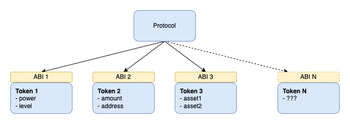
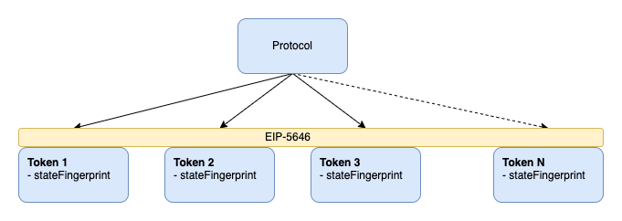

## Abstract

This specification defines the minimum interface required to unambiguously identify the state of a mutable token without knowledge of implementation details.

## Motivation

Currently, protocols need to know about tokens' state properties to create the unambiguous identifier. Unfortunately, this leads to an obvious bottleneck in which protocols need to support every new token specifically.



## Specification

The key words "MUST", "MUST NOT", "SHOULD", "SHOULD NOT", and "MAY" in this document are to be interpreted as described in RFC 2119.

```solidity
pragma solidity ^0.8.0;

interface ERC5646 is ERC165 {

    /// @notice Function to return current token state fingerprint.
    /// @param tokenId Id of a token state in question.
    /// @return Current token state fingerprint.
    function getStateFingerprint(uint256 tokenId) external view returns (bytes32);

}
```

- `getStateFingerprint` MUST return a different value when the token state changes.
- `getStateFingerprint` MUST NOT return a different value when the token state remains the same.
- `getStateFingerprint` MUST include all state properties that might change during the token lifecycle (are not immutable).
- `getStateFingerprint` MAY include computed values, such as values based on a current timestamp (e.g., expiration, maturity).
- `getStateFingerprint` MAY include token metadata URI.
- `supportsInterface(0xf5112315)` MUST return `true`.

## Rationale

Protocols can use state fingerprints as a part of a token identifier and support mutable tokens without knowing any state implementation details.



State fingerprints don't have to factor in state properties that are immutable, because they can be safely identified by a token id. 

This standard is not for use cases where token state property knowledge is required, as these cases cannot escape the bottleneck problem described earlier.

## Backwards Compatibility

This EIP is not introducing any backward incompatibilities.

## Reference Implementation

```solidity
pragma solidity ^0.8.0;

/// @title Example of a mutable token implementing state fingerprint.
contract LPToken is ERC721, ERC5646 {

    /// @dev Stored token states (token id => state).
    mapping (uint256 => State) internal states;

    struct State {
        address asset1;
        address asset2;
        uint256 amount1;
        uint256 amount2;
        uint256 fee; // Immutable
        address operator; // Immutable
        uint256 expiration; // Parameter dependent on a block.timestamp
    }


    /// @dev State fingerprint getter.
    /// @param tokenId Id of a token state in question.
    /// @return Current token state fingerprint.
    function getStateFingerprint(uint256 tokenId) override public view returns (bytes32) {
        State storage state = states[tokenId];

        return keccak256(
            abi.encode(
                state.asset1,
                state.asset2,
                state.amount1,
                state.amount2,
                // state.fee don't need to be part of the fingerprint computation as it is immutable
                // state.operator don't need to be part of the fingerprint computation as it is immutable
                block.timestamp >= state.expiration
            )
        );
    }

    function supportsInterface(bytes4 interfaceId) public view virtual override returns (bool) {
        return super.supportsInterface(interfaceId) ||
            interfaceId == type(ERC5646).interfaceId;
    }

}
```

## Security Considerations

Token state fingerprints from two different contracts may collide. Because of that, they should be compared only in the context of one token contract.

If the `getStateFingerprint` implementation does not include all parameters that could change the token state, a token owner would be able to change the token state without changing the token fingerprint. It could break the trustless assumptions of several protocols, which create, e.g., buy offers for tokens. The token owner would be able to change the state of the token before accepting an offer.

## Copyright

Copyright and related rights waived via [CC0](../LICENSE.md).
