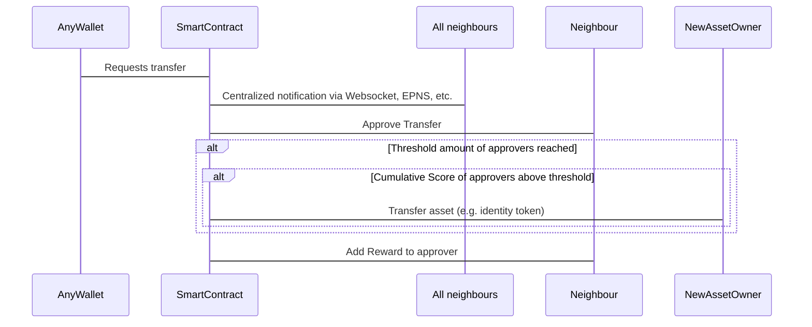

## Abstract
Within this EIP a mechanism of a social recovery is proposed. This implies that by the approval of many identities a token transfer from the identity of the lost private key to a knew identity where the private key is known. This approval is not a technical implementation but needs an interaction of humans. These humans are - based on the Soul Bound Token proposal - called Souls. When enough Souls give their approval (which is a Yes/No decision) and a threshold is reached this transfer from an old to a new identity is performed by a smart contract.

## Motivation
It is always the problem that the private key of an identity can be lost. The reasons for that are manifold. If that key is lost its not possible to recover the tokens. The holder loses his tokens forever. Also the implications to the ecosystem of the token itself is a problem. The more tokens are lost the less tokens are available and a natural growth and a planned evolving of the token is not possible.

## Specification

```solidity
    
pragma solidity ^0.8.7;

interface ISBT {
    function calcScore(address identityAddr_) external view returns (int256);

    function approveTransfer(address from_, address to_) external;

    function requestTransfer(address from_, address to_) external payable;

    function addNeighbour(address neighbour_) external;

    function removeNeighbour(address neighbour_) external;
}
```

## Rationale
The rationale fleshes out the specification by describing what motivated the design and why particular design decisions were made. It should describe alternate designs that were considered and related work, e.g. how the feature is supported in other languages.

## The math behind it

We calculate the score of a node n with the following formular:

$$ score(n) = tanh({{{\displaystyle\sum_{i = 1}^{|N|}} {log{(n_i^{r} {1 \over t - n_i^{t} + 1})}} \over{|N| + 1}} + n^{r}}) $$

where:

$t$ is the current time (whether here and in correlation with $n_i^{t}$ the current block number is stored or some other time identifying value is irrelevant)

$n^{r}$ is the reward count of the node n

$N$ is the list of neighbours of n

$n_i^{r}$ is the reward count of neighbour node i from n

$n_i^{t}$ is the last timestamp (where a reward was booked on that account) of neighbour node i from n

## Flows



## Test Cases
No test cases provided.

## Reference Implementation
No reference implementation provided. We suggest to use as approximation for $tanh()$ a list of approximation values of tanh between -100 and 100.

We suggest to use as approximation for $log()$ (base of 10):

```solidity 
function log(uint256 z) public pure returns (uint256) {
    if (z == 0) return 0;
    return (z - 1) / (z + 1);
}
```

## Security Considerations
In this chapter we want to get into security concerns we found or which came during the implementation. There are three important things which came up.

1) We currently do not see any mechanism of preventing a user of getting a lot of rewards. Sure, a high reward is bound to a lot of investment but the person who wants to get that reward amount and has a enough money will reach it. The only thing which could be improved is that we somehow find a mechanism really identify users bound to an address. We thought about having a kind of a hashing mechanism which hashes a real world object which could be fuzzy (for sure!) and generates a hash out of it which is the same based on the fuzzy set.

2) We implemented a threshold which must be reached to make a social token transfer possible. Currently there is no experience which defines a "good" or "bad" threshold hence we tried to find a first value. This can or must be adjusted based on the experience the world has with such an proposal and implementation we are poposing here.

3) Another problem we see is that the network of the users is not used anymore. Which means that due to a not used contract a user gets stuck with the e.g. social token transfer he/she wants to perform. Hence the contract lives from its usage and if it tends to be not used anymore it will get useless.

## Copyright
Copyright and related rights waived via [CC0](../LICENSE.md).