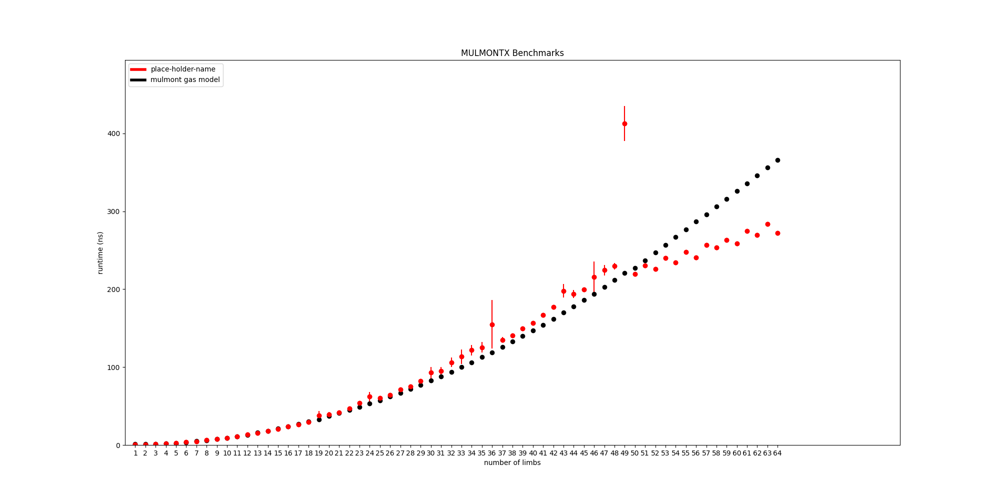
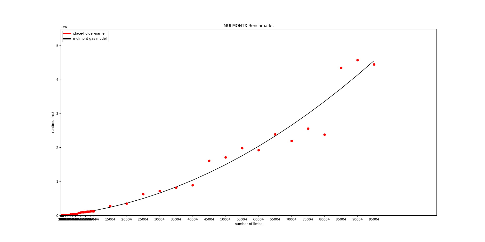
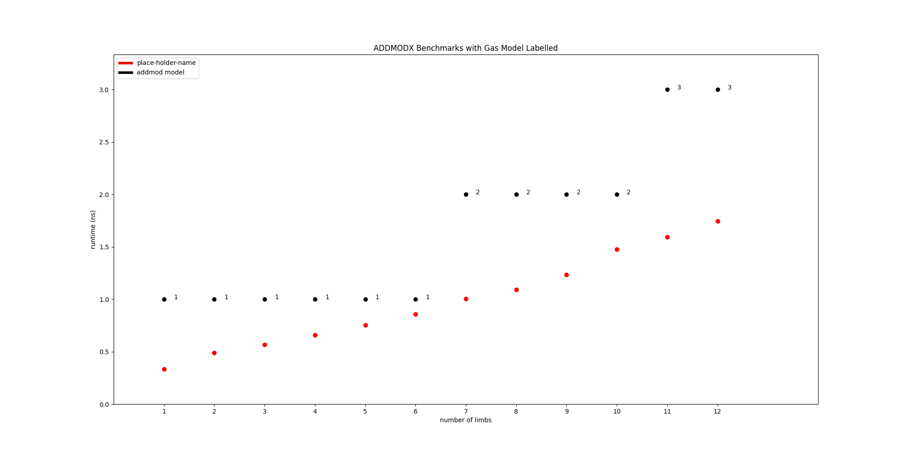
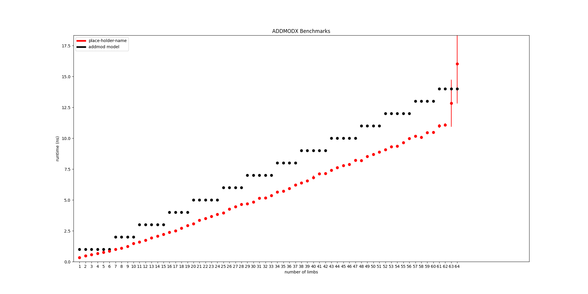
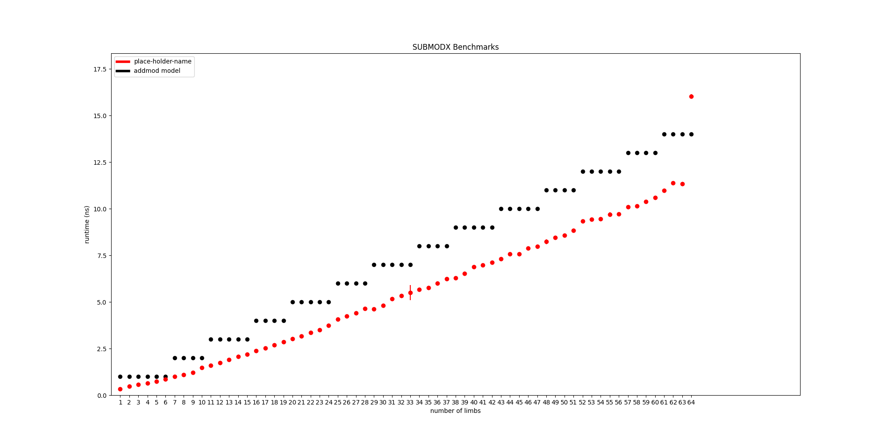
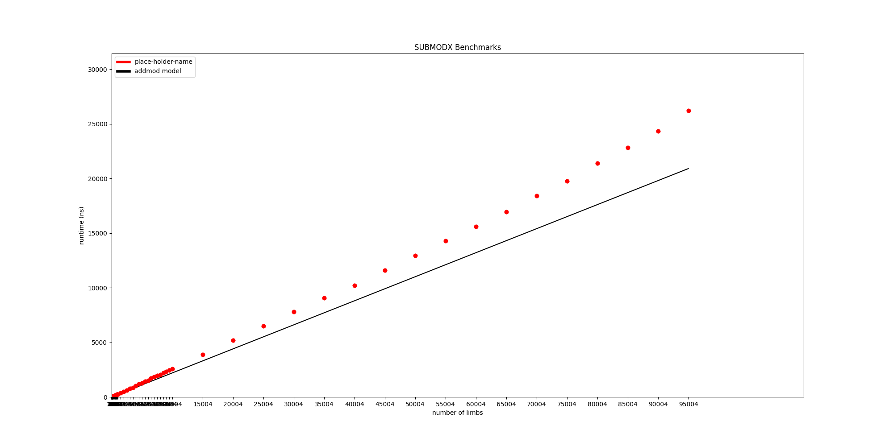

## Abstract

This EIP introduces EVMMAX (EVM Modular Arithmetic Extensions) - a new set of opcodes that provide improved cost vs existing modular arithmetic opcodes, enable performing modular addition/subtraction/multiplication at bit-widths higher than 256bits.

Depends on:
* [EIP-3540](./eip-3540.md) - the versioning provided by EOF containers to modify jumpdest-analysis that this EIP requires without breaking backwards compatibility.
* [EIP-3670](./eip-3670.md) - it rejects deployment of improperly-formed code, which allows changes in this EIP to be more performant.
^ TODO update/rework this list

## Motivation

The EVM has `ADDMOD` and `MULMOD` opcodes which perform modular addition and multiplication.  Two inputs and a modulus are passed as stack items and the result is placed on the stack.  Inputs are not required to be less than the modulus.  The EVM word size limits the inputs and modulus to a maximum of 256 bits in size.

The permissiveness of these opcodes makes them useful in a wide variety of cases.  However, they can not make use of optimizations which can greatly improve performance for common usage patterns.

A common usage pattern for crypto is to perform many chained modular arithmetic operations over a fixed, odd modulus with inputs always less than the modulus.

under these assumptions, modular addition and subtraction can be implemented efficiently with one extended-precision addition and one extended-precision subtraction.  Modular multiplication is slower requiring an extended-precision multiplication to compute a double-width product, and a modular reduction.

To improve the performance of modular multiplication, values can be expressed in Montgomery form.  This allows for the use of Montgomery modular multiplication which replaces the division by the modulus with a bit-shift and single subtraction in the reduction step.

Operating in Montgomery form requires precomputation of a modulus-specific constant as well as the cost of converting values in normal form to/from Montgomery form.  However, these costs are greatly offset by the savings gained when performing many modular multiplications.

(TODO: awkward transition from previous sentence)

This EIP proposes a new model for performing modular arithmetic in the EVM with odd, fixed moduli.  It can provide cost reductions for existing Ethereum applications, greatly increased utility to the EVM while introducing a mostly self-contained spec which doesn't introduce deep changes to the EVM (TODO: reword this).

## Specification

#### Context Variables

| Name | Type | Meaning |
| ---- | ------- | --- |
| `evmmax_state` | `EVMMAXState` | a variable representing ephemeral state which exists for the duration of the current call and in the scope of the current call |

```
class EVMMAXState():
	def __init__(self, mod: int, r_squared: int, mod_inv: int, mod_inv_small: int, limb_count: int):
		self.mod = mod
		self.r_squared = r_squared
		self.mod_inv = mod_inv
		self.mod_inv_small = mod_inv_small
		self.limb_count
```

#### Conventions

| Syntax | Meaning |
| ------ | ------  |
| `x === y % m` | equality of residue classes: `x % m == y % m` |
| `pow(x, -1, m)` | modular multiplicative inverse of `x` with respect to modulus `m`: `x * pow(x, -1, m) === -1 % m` |

Introduce new opcodes:

| Name | Opcode | Stack In | Stack out | Immediate Size (bytes) |
| ----- | ----  | -------- | --------- | -------------- |
| SETMODX | 0x21 | 2 | 0 | 0 |
| ADDMODX | 0x22 | 0 | 0 | 3 |
| SUBMODX | 0x23 | 0 | 0 | 3 |
| MULMONTX | 0x24 | 0 | 0 | 3 |
| TOMONTX | 0x25 | 2 | 0 | 0 |

`ADDMODX`, `SUBMODX` and `MULMONTX` take inputs encoded in a required 3-byte immediate value appended to the opcode.  Jumpdest analysis is modified to treat the immediate bytes similarly to push-data, disallowing dynamic jumps into them.

### `SETMODX`

`SETMODX` takes two stack inputs: `(top of stack) mod_offset, mod_limb_count` where `mod_offset` refers to an EVM memory offset where a modulus represented in `mod_limb_count * 8` bytes with little-endian ordering is expected. If `(mod_offset + mod_limb_count * 8) - 1` falls outside the bounds of allocated memory, consume all call gas and return to the caller in an exceptional state.  Charge `gas_setmodx(mod_limb_count)` return to the caller in an exceptional state if there was insufficient gas remaining:
```
SETMODX_GAS_A = 2.5
SETMODX_GAS_B = 107.0

def gas_setmodx(limb_count):
    return round(SETMODX_GAS_A * limb_count + SETMODX_GAS_B)
```

Load the modulus and check that the modulus is:
* odd
* greater than 1
* greater than or equal to `(1<<((limb_count - 1) * 64)`: the modulus representation occupies the most significant 64 bits.

If any check fails, consume all call gas and return to the caller in an exceptional state.  Otherwise, compute `evmmax_state` (overwriting the previous value if `evmmax_state != None`)
```
R = 1 << (limb_count * 64)
aux_mod = 1 << 64
mod_inv_small = pow(-mod, -1, aux_mod)
mod_inv = pow(-mod, -1, r_val)
r_squared = (r_val ** 2) % mod

evmmax_state = EVMMAXState(mod, r_squared, mod_inv, mod_inv_small, limb_count)
```

### Arithmetic Opcodes

`ADDMODX`, `SUBMODX`, `MULMONTX` take inputs encoded in a 3-byte immediate value appended to the opcode.  The immediate is interpreted as 3 1-byte values `out_slot`,`x_slot`,`y_slot`.  Each slot corresponds to a range of the memory space:
```
def map_slot_to_mem_range(limb_count, slot):
    return (slot * limb_count * 8, (slot + 1) * limb_count * 8 - 1)
```

If `evmmax_state` is not set with the call context or the maximum byte of the ranges specified in the inputs is outside the bounds of allocated memory, consume all call gas and return to the caller in an exceptional state.  Otherwise, charge a gas cost based on the limb count(`gas_addmodx`, `gas_submodx` or `gas_mulmontx`), returning to the caller in an exceptional state if there was insufficient remaining gas.
```
MULMONTX_SUBQUADRATIC_CUTOFF = 49

MULMONTX_LO_GAS_A = 0.092
MULMONTX_LO_GAS_B = -0.01
MULMONTX_LO_GAS_C = 0.24

MULMONTX_HI_GAS_A = 0.0004
MULMONTX_HI_GAS_B = 9.88
MULMONTX_HI_GAS_C = -268.0

ADDMODX_GAS_A = 0.22
ADDMODX_GAS_B = 0.144

def gas_mulmontx(limb_count):
    if limb_count <= MULMONTX_SUBQUADRATIC_CUTOFF:
        return MULMONTX_LO_GAS_A * (limb_count ** 2) + \
            MULMONTX_LO_GAS_B * (limb_count) + \
            MULMONTX_LO_GAS_C
    else:
        return MULMONTX_HI_GAS_A * (limb_count ** 2) + \
            MULMONTX_HI_GAS_B * (limb_count) + \
            MULMONTX_HI_GAS_C

def gas_addmodx(limb_count):
	return int(ADDMODX_GAS_A * limb_count + ADDMODX_GAS_B)

def gas_submodx(limb_count):
	return gas_addmodx(limb_count)

def gas_tomontx(limb_count):
	return gas_mulmontx(limb_count)
```

Interpret the memory ranges associated with `x_slot`, `y_slot` as little-endian values `x`,`y`.  Assert that `x` and `y` are less than the modulus, returning to the caller in an exceptional state if they are not.  Then, each arithmetic opcode computes a result, expressing it as a padded little-endian value and placing it into the memory range referenced by `out_slot`.

`ADDMODX` and `SUBMODX` compute normal modular addition/subtraction:
```

# define some helpers ----------------------------------------------------

# extract the least significant 128-bits of a value and split into hi, low
def hi_lo(val128: int) -> (int, int):
    assert val128 < 1 << (LIMB_BITS * 2), "val must fit in two words"
    return (val128 >> LIMB_BITS) % BASE, val128 % BASE

# single-word (uint64) sub with borrow-in/out
# compute (x - y - b). if negative return (1, abs(x - y - b) % (1<<64)), else return (0, (x - y - b) % (1<<64))
# b (borrow-in) must be 1 or 0
def sub_with_borrow(x: int, y: int, b: int) -> (int, int):
    assert b == 0 or b == 1, "borrow in must be zero or one"
    BASE = 1<<64
    res = x - y - b 
    b_out = 0 
    if res < 0:
        res = BASE - abs(res)
        b_out = 1 

    return b_out, res 

# addmodx/submodx arith -------------------------------------------------------

# modular addition
# input
#    x, y, mod - arrays of 64bit values in ascending order of significance.
#    x, y < mod
#    len(x) == len(y) == len(mod)
# returns
#    (x + y) % mod expressed as an array of 64bit values
#    in ascending order of significance
#    with the same length as mod
def addmodx_arith(x: [int], y: [int], mod: [int]) -> [int]:
    limb_count = len(mod)
    tmp = [0] * limb_count
    z = [0] * limb_count
    c, c1 = 0, 0

    for i in range(limb_count):
        c, tmp[i] = hi_lo(x[i] + y[i] + c)

    for i in range(limb_count):
        c1, z[i] = sub_with_borrow(tmp[i], mod[i], c1)

    if c == 0 and c1 != 0:
        z[:] = tmp[:]

    return z

# modular subtraction
# input
#    x, y, mod - arrays of 64bit values in ascending order of significance.
#    x, y < mod
#    len(x) == len(y) == len(mod)
# returns
#    (x - y) % mod expressed as an array of 64bit values 
#    with the same length as mod
def submodx_arith(x: [int], y: [int], mod: [int]) -> [int]:
    limb_count = len(mod)
    tmp = [0] * limb_count
    z = [0] * limb_count
    c, c1 = 0, 0

    for i in range(limb_count):
        c1, z[i] = sub_with_borrow(tmp[i], mod[i], c1)

    for i in range(limb_count):
        c, tmp[i] = hi_lo(x[i] + y[i] + c)

    if c == 0:
        z[:] = tmp[:]

    return z
```

`MULMONTX` computes `mulmont(x, y, mod)`: the Montgomery modular multiplication of `x` and `y` with respect to `mod` (described below).

#### Montgomery Multiplication

A value `x` expressed in Montgomery form is is `(x * R) % mod` where `R > mod` and `gcd(R, mod) = 1`.  We choose `R = 1 << (limb_count * 64)`.

Modular addition and subtraction of values in Montgomery form is computed the same as normally.

```
xR % mod + yR % mod == (x + y)R % mod
xR % mod + yR % mod == (x - y)R % mod
```

However modular multiplication in Montgomery form works somewhat differently.  The modular multiplication `x * R % mod * y * R % mod == x * y * R * R % mod` is not the expected value in Montgomery form: `x * y * R % mod`.  The extra factor of `R` must be removed.  Therefore `mulmont(x_mont, y_mont, mod)` computes `(x_mont * y_mont * pow(-R, -1, mod)) % mod`.

```
# input:
# 	x < mod
# 	y < mod
#   mod - an odd modulus
# 	R -  a power of two, and greater than mod
# 	mod_inv - pow(-mod, -1, R) == (mod**-1) % R
# output:
#	(x * y * pow(R, -1, mod)) % mod
#
def mulmont(x: int, y: int, mod: int, mod_inv: int, R: int) -> int:
	T = x * y                      # 1
	m = ((T % R) * mod_inv) % R    # 2
	T = T + m * mod                # 3
	T /= R                         # 4
	if T >= mod:
            T -= mod               # 5
	return T
```

To show that `mulmont` is correct, we can prove a few properties of the algorithm:
* `T % R == 0` before the division in step 4: `T == ((x*y % R) * modinv * mod) % R + x * y % R === T + (-1) T % R === 0 % R`
* `T === x * y * r_inv % mod`: `T = (x*y%R + m*mod)R**-1 == (x*y%R)R**-1 + m*(R**-1)*mod === TR**-1 % mod`.
* `0 < T < 2 * mod` after the division in step 4: `m` is between 0 and `R*mod - 1` so `0 < T < (mod**2 - 1) + (R - 1) * mod < (R*mod - 1) + (R - 1)*mod  < 2*R*mod` which after division by `R` makes the result smaller than `2 * mod`.

Note that the choice of `R` as a power of two enables the division in step 4 to be implemented as a bit-shift.

`mulmont` is the generic algorithm for Montgomery Multiplication.  There are other algorithms with quadratic complexity that are more performant than the generic algorithm at small limb counts.  Appendix 1 describes the most popular of these.

After a certain limb count threshold, it is more performant to use the generic algorithm where the component multiplications are implemented using a multiplication method with better asymptotic complexity (e.g. Karatsuba with `O(N**~1.58)`).

#### Conversion between Montgomery and normal forms

Conversion of a normal value to Montgomery form can be computed with `mulmont(norm_val, evmmax_state.r_squared, mod) == norm_val * R % mod`.

`TOMONTX` takes two stack items as input `(top of stack) input, output`.  The most significant byte of each input is an EVMMAX slot (`input_slot`/`output_slot`).  If `evmmax_state == None` or the offset of the highest byte of the ranges referenced by the inputs is outside the bounds of allocated memory, consume all call gas and return to the caller in an exceptional state. Interpret the memory range associated with `input_slot` as little-endian value `input`, compute `mulmont(input, evmmax_state.r_squared, mod)` and place the result in the memory range referenced by `output_slot`.

Conversion from Montgomery form `x_mont` to normal form can be computed with `mulmont(x_mont, 1, mod)`.

## Rationale

The choice of using an offset-based approach where operations happen on values in memory overcomes the need for stack manipulation and enables a wider variety of bit-widths than currently economical in the EVM.

The choice of 64-bit aligned little-endian values is made to match the hardware of most machines removing the need for byte-swapping.

### Benchmarks

Benchmarks were performed on worst-case inputs.  Error bars represent one standard deviation with a sample size of 10 runs of a `go -bench=...` invocation.

Fitting gas models is WIP.  I assume `MULMONTMX` will need a model which fits lower limbs closely while having subquadratic asymptotic behavior.

For reference a benchmark from https://github.com/holiman/uint256 of `MULMOD` doing 256-bit modular multiplication with inputs that are already reduced:
```
BenchmarkMulMod/mod256/uint256-4        	 6665253	       177.5 ns/op
```



`ADDMODMX` and `SUBMODMX`:







`SETMODMX` should have linear-ish complexity.  Modular inverse appears to be `O(logN)` and my current implementation allocates a lot of memory.


`SETMODX` computes Montgomery constants used by generic `mulmont` and algorithms optimized for smaller limb counts.  As a result `SETMODX` is more expensive than it could be, especially for low limbs.  This choice is made to avoid explicitly including a pivot point in the protocol, as it may vary slightly depending on the implementation.

### Other TODOs to note in the rationale:
* ~~choice of little-endian limbs made to match the hardware of most (all?) Ethereum nodes, removing the need for endianness-swapping individual limbs.~~
* restriction to single byte offset is made to reduce contract size footprint while still providing ample potential memory slots.
* use of immediates reduces bytecode size, lessens overhead from interpreter loop.  Also, reduces cost of each EVMMAX arith op invocation by 3-gas without requiring PUSH cost reduction (which would be hard to propose because there may be pathological cases that could be excacerbated if PUSH were cheaper).

slots known statically at deployment time leave open the possibility for optimizations for certain cases (e.g. squaring) - not sure whether to include this

## Security Considerations

### Validity of inputs

Because `R` and `mod` are coprime, the set of `(q * R ) % mod` where `q < mod` is a permutation of the set `q % mod`: all representable values less than `mod` are valid Montgomery representations of other values less than `mod`.

## Open Questions

* setting modulus at contract deployment time and embedding modulus/Montgomery parameters in an EOF section in the deployed bytecode.  advantages: better static analysis?
* cost model which preferences certain bit-widths and modulus forms?
* limb-count cap:
    * tentatively set it low but higher bit-widths could be useful (e.g. 4096-bit RSA verification).
    * needs some analysis of worst-case memory latency/cache-miss overhead.

## Appendix

### 1 - Fast Montgomery multiplication for small bit-widths

`mulmont` algorithms which are most performant for smaller limb counts opt to interleave the multiplication and reduction steps, removing the need to compute the full double-width product of `x` and `y`.  Many use a different montgomery constant: `mod_inv_small`.

The "CIOS" Montgomery multiplication algorithm is an example, which is noted to be the most performant out of several surveyed in [tolga acar's thesis].

```
# CIOS Montgomery multiplication algorithm implementation adapted from section 2.3.2 in https://www.microsoft.com/en-us/research/wp-content/uploads/1998/06/97Acar.pdf
#
# input:
#	x, y, mod - multiprecision numbers represented by arrays of 64bit unsigned integers in ascending order of significance.
#	x, y < mod
#	mod % 2 != 0
#	mod_inv_small = pow(-mod, -1, 1<<64)
# output:
#	(x * y * pow(R, -1, mod)) % mod represented by array of 64bit unsigned integers in ascending order of significance
#
def mulmont_cios(x: [int], y: [int], mod: [int], mod_inv_small: int) -> [int]:
    assert len(x) == len(y) and len(y) == len(mod), "{}, {}, {}".format(x, y, mod)
    assert mod[-1] != 0, "modulus must occupy all limbs"
    limb_count = len(mod)
    t = [0] * (limb_count + 2)

    # each outer-loop iteration computes a row of the multiplication (x * y) % R
    # and simultaneously adds a factor to make the intermediate value divisible by (1<<64)**i
    # until after the final iteration, T is divisible by R

    for i in range(limb_count):
        # first inner-loop multiply x * y[i]
        c = 0
        for j in range(limb_count):
            c, t[j] = hi_lo(t[j] + x[j] * y[i] + c)

        # TODO why 2 carry words instead of 1? Has to do with saving an extra word because we interleave the shift?
        t[limb_count + 1], t[limb_count] = hi_lo(t[limb_count] + c)

        # second inner-loop: t <- t + ((t % b) * modinv % b) * mod making t % b**i == 0
        # integrates the reduction (bit-shift) into the calculation of t
        m = (mod_inv_small * t[0]) % BASE
        c, _ = hi_lo(m * mod[0] + t[0])

        for j in range(1, limb_count):
            c, t[j - 1] = hi_lo(t[j] + mod[j] * m + c)

        # TODO explain carries here
        hi, t[limb_count - 1] = hi_lo(t[limb_count] + c)
        t[limb_count] = t[limb_count + 1] + hi

    # discard the top-limb.  the result is 0 < result < 2 * mod so it can't overflow two limbs
    t = t[:-1]
    if t[-1] != 0:
        # result is greater than R, and also greater than mod
        return limbs_sub(t, mod + [0])[:-1]
    elif limbs_gte(t[:-1], mod):
        return limbs_sub(t[:-1], mod)
    else:
        return t[:-1]
```

TODO: demonstrate that `mulmont_cios` has the same properties as `mulmont`.

## Copyright

Copyright and related rights waived via [CC0](../LICENSE.md).
