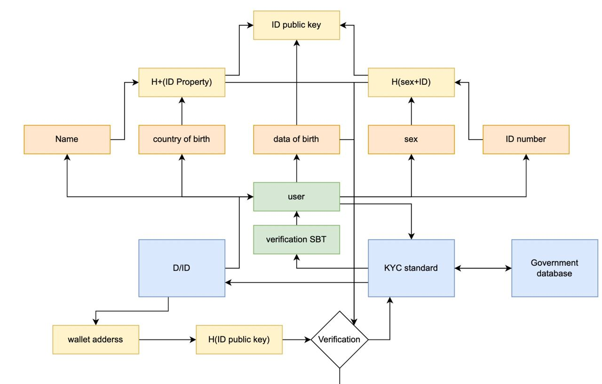

## Abstract

This EIP Provides a defined interface for KYC verification of entities consisting of decentralized identifiers (DID), with abstract onchain conditions. It does this by defining the necessary interface for the identity orchestrator for assigning the identity certificates (such as SBT tokens for  Verifiable Credentials) to the wallets, which can then be verified by ZK schemes.

## Motivation

On-chain verification is becoming indispensable across web3 based on the concerns of regulations against financial protocols, but also by protocols to whitelist users fulfilling certain criteria but being fully transparent and keeping the anonymity of the user. This created the necessity of building on-chain verification of the addresses for token transfers (like stablecoin providers checking for blacklisted entities for the destination address, limited utility tokens for a DAO community, etc). Finally, the existing proposals are based on a trusted entity creating on-chain/off-chain signatures to manage a whitelist and are thus not decentralized protocols.

Also, existing standards for transferring the regulated tokens within not whitelisted entities like [EIP-3643](./eip-3643.md) are insufficient to handle the complex use cases where:

- The validation logic needs to be more complex than verification of the user identity wrt the blacklisted address that is defined off-chain, and is very gas inefficient due to excessive cross contract calls with the KYC contract for transaction validation.

- Privacy-enhanced/anonymous verification is an important need by crypto users in order to insure censorship-resistant and trustless networks. ZK (zero-knowledge) verification schemes are currently the only way to validate the assertion of the identity by the user while keeping aspects of the provider's identity completely private.

Thus we resolve the challenges not being addressed by other standards by defining the optimal functional interfaces that defines the identity issuer to validate the web2 based KYC onchain, along with immutability as shown by SBT throughout the whole lifecycle.

## Specification

The keywords "MUST", "MUST NOT", "REQUIRED", "SHALL", "SHALL NOT", "SHOULD", "SHOULD NOT", "RECOMMENDED", "NOT RECOMMENDED", "MAY", and "OPTIONAL" in this document are to be interpreted as described in RFC 2119 and RFC 8174.

### Definitions

- ZK: Zero-knowledge. Refers to a cryptographic system in which a characteristic of an entity can be proven without revealing which entity the proof refers to.

- SBT: Soulbound tokens, these are non-fungible and non transferrable tokens that is used for defining the identity of the users. they are defined by standard [eip-5192](./eip-5192.md).

- SBT Certificates: SBT that represent the ownerships of ID signatures corresponding to the requirements defined in `function standardRequirement()`.

- KYC standard: Know your customer standard are the set of minimum viable conditions that financial services providers (banks, investment providers and other intermediate financial intermediaries) have to satisfy in order to access the services. this in web3 consideration concerns not about the details about the user itself, but about its status (onchain usage, total balance by the anon wallet, etc) that can be used for whitelisting.

- ZK-ID NFT: NFT representing the self-sovereign federated identity for providing ZK based decentralized identity from trusted public certificates (e.g national identity cards, passport and eSIM).

- W3C DID specification: Its the specification defined by world-wide-web org in order to assign the identifier and the verification condition without determining the person/ organization Private identification information.

- Verifiable Credentials(VC): These are tamper-resistant claims whose authorship can be verified cryptographically.

#### Diagram



Here we show the example real-life implementation scenario of how the identity issuer contract following this standard can be used to access a particular DeFI protocol that includes a modifier to check the possession of the given certificate.

1. Firstly the administrator will be defining the standard requirement of the SBT certificate, based on the conditions defined by the given exchange.

2. On the side of protocol/aggregator protocol once the requirements for the given certificate id are defined, then the exchange defines the modifier conditions by importing the function `IERC5851(_KYCaddress).isVerified(address, SBTID)` before calling the specific functions.

3. Then administrator assigns the SBT to the given address wallet. for verifying the identity of the given user is compliant with the correct compliance requirements, they can use ZK schemes (as simple as checking the Merkle root of the commitments, or via the circuits  on ZK rollup, etc)

4. Thus now the user can access the various DeFI services where the SBT with the given ID is accepted.

5. And eventually whenever needed, the admin can revoke the access to the given certificate identified by SBTID, and then emit an event that SHOULD be captured by the wallet application of the user to notify the status of the certificate.

### Functions

```solidity
pragma solidity ^0.8.0;

interface IERC5851 {
    // getter functions
 
    /// @notice function to validate if the address `verifying` is the holder of the SBT defined by the tokenId `SBTID`
    /// @dev it MUST be defining the logic corresponding to all the current possible requirements needed by the verifier(check out more details in the Metadata section).
    /// @param verifying is the EOA/smart contract wallet address that wants to validate the SBT issued to it by the KYC. 
    /// @param SBTID is the Id of the SBT the user is the claimer.
    /// @return true if the assertion is valid, else false
    /**
    example isVerified(0xfoo, 1) --> true will mean that 0xfoo is the holder of the SBT identity token defined by tokenId '1' of the given ERC5851 contract. 
    */

    function isVerified(address verifying, uint256 SBTID) external view returns (bool);

    /// @notice getter function to fetch the onchain identification logic for the given identity holder.
    /// @dev it MUST not be defined for address(0). 
    /// @param SBTID is the Id of the SBT that the user is the claimer.
    /// @return the struct array of all the descriptions of condition metadata that is defined by the administrator for the given KYC provider.
    /**
    ex: standardRequirement(1) --> {
    { "title":"DepositRequirement",
        "type": "number",
        "description": "defines the minimum deposit in USDC for the investor along with the credit score",
        },
       "logic": "and",
    "values":{"30000", "5"}
}
This defines the condition encoded for the identity index 1, defining the identity condition that the holder must have 30000 USDC along with a credit score of at least 5.*/

    function standardRequirement(uint256 SBTID) external view returns (Requirement[] memory);
   
// setter functions
    /// @notice function for setting the requirement logic (defined by Requirements metadata) details for the given identity token defined by SBTID.
    /// @dev it should only be called by the admin address.
    /// @param SBTID is the Id of the SBT-based identity certificate for which the admin wants to define the Requirements.
    /// @param `requirements` is the struct array of all the descriptions of condition metadata that is defined by the administrator. check metadata section for more information.
/**
example: changeStandardRequirement(1, { "title":"DepositRequirement",
    "type": "number",
    "description": "defines the minimum deposit in USDC for the investor along with the credit score",
    },
    "logic": "and",
    "values":{"30000", "5"}
}); 
will correspond to the functionality that admin needs to adjust the standard requirement for the identification SBT with tokenId = 1, based on the conditions described in the Requirements array struct details.
**/
    function changeStandardRequirement(uint256 SBTID, Requirement[] memory requirements) external returns (bool);

    /// @notice function which uses the ZKProof protocol to validate the identity based on the given 
    /// @dev it should only be called by the admin address.
    /// @param SBTID is the Id of the SBT-based identity certificate for which admin wants to define the Requirements.
    /// @param certifying is the address that needs to be proven as the owner of the SBT defined by the tokenID.
    /**
example: certify(0xA....., 10) means that admin assigns the DID badge with id 10 to the address defined by the `0xA....` wallet.
    */
    function certify(address certifying, uint256 SBTID) external returns (bool);

    /// @notice function which uses the ZKProof protocol to validate the identity based on the given 
    /// @dev it should only be called by the admin address.
    /// @param SBTID is the Id of the SBT-based identity certificate for which the admin wants to define the Requirements.
    /// @param certifying is the address that needs to be proven as the owner of the SBT defined by the tokenID.
    // eg: revoke(0xfoo,1): means that KYC admin revokes the SBT certificate number 1 for the address '0xfoo'.

    function revoke(address certifying, uint256 SBTID) external returns (bool);
}
```

### events

```solidity

    interface IERC5851 {
    /** 
    * standardChanged
    * @notice standardChanged MUST be triggered when requirements are changed by the admin. 
    * @dev standardChanged MUST also be triggered for the creation of a new SBTID.
    e.g : emit StandardChanged(1, Requirement(Metadata('depositRequirement','number', 'defines the max deposited that user can have in the denomination of USDC' ), "<=", "30000");
    is emitted when  the Requirement condition is changed  which allows the certificate holder to call the functions with the modifier, only after the deposit in the address is not greater than 30000 USDC.
    */
    event StandardChanged(uint256 SBTID, Requirement[] _requirement);
    /** 
    * certified
    * @notice certified MUST be triggered when the SBT certificate is given to the certifying address. 
    * eg: Certified(0xfoo,2); means that wallet holder address 0xfoo is certified to hold a certificate issued with id 2, and thus can satisfy all the conditions defined by the required interface.
    */
    event Certified(address certifying, uint256 SBTID);
    /** 
    * revoked
    * @notice revoked MUST be triggered when the SBT certificate is revoked. 
    * eg: Revoked( 0xfoo,1); means that entity user 0xfoo has been revoked to all the function access defined by the SBT ID 1.
    */
    event Revoked(address certifying, uint256 SBTID);
}
```

### Metadata structure

The structure of on-chain metadata storage follows a similar pattern as that of [EIP-3475](./eip-3475.md) and is described as the following type:

```solidity
    /**
     * @dev metadata that describes the Values structure on the given requirement. 
     * example: 
    {   "title": "jurisdiction",
        "_type": "string",
        "description": "two-word code defining legal jurisdiction"
        }
    * @notice it can be further optimized by using efficient encoding schemes (like TLV etc) and there can be a tradeoff in the gas costs of storing large strings vs encoding/decoding costs while describing the standard.
     */
    struct Metadata {
        string title;
        string _type;
        string description;
    }
    /**
     * @dev Values here can be read and written by smart contract and front-end, cited from [EIP-3475].
     example : 
{
 jurisdiction = IERC5851.stringValue("CH");
}
     */
    struct Values { 
        string stringValue;
        uint uintValue;
        address addressValue;
        bool boolValue;
    }
```

**2. Requirement structure:**
This will be stored in each of the SBT certificates that will define the conditions that need to be satisfied by the owner of the certificate when any verifier (of the DeFI protocol functions) calling the `isVerified()` function, to be validated to run the function, this will be defined for each onchain `Values` separately.

```solidity
    /**
     * @dev structure that DeFines the parameters for specific requirements of the SBT certificate
     * @notice this structure is used for the verification process, it contains the metadata, logic, and expectation
     * @logic given here MUST be one of ("⊄", "⊂", "<", "<=", "==", "!=", ">=",">")
     ex: standardRequirement => {
    { "title": "adult",
        "type": "uint",
        "description": "client holders age to be gt 18 yrs.",
        },
       "logic": ">=",
    "value": "18" 
}
Defines the condition encoded for the identity index 1, DeFining the identity condition that the holder must be more than 18 years old.
    */
    struct Requirement {
        Metadata metadata;
        string logic;
        Values expectation;
    }
```

## Rationale

For the standard interface functions, we followed the implementation of the W3C DID specification, which defines the components of the data registry, DID identifier. thus we represented the same properties in our standard using the Verifier and SBT standard. Also to define the metadata (URL, topics, subjects, and the identifier), we followed the metadata definition as [eip-3475](./eip-3475.md) with the possibility to define context metadata and verification condition within the single contract.

## Backwards Compatibility

- The ERC standard remains backward compliant for previous versions for cases that only do the changes in schema of the requirements structure.
- In case of the changes like the logic of verification protocol, developers will have to use proxy contract patterns like [eip-1967](./eip-1967.md) which will route the `isVerified()`function call based on the version of verifier contracts the SBT was issued.

## Test Cases

Test-case for the minimal reference implementation is [here](../assets/eip-5851/contracts/test.sol) for using transaction verification regarding whether the users hold the tokens or not. Use the remix to compile and test the contracts.

## Reference Implementation

The interface standard is divided into two separated implementations.

- [verifier_modifier](../assets/eip-5851/contracts/verification_modifier.sol) is a simple modifier that needs to be imported by functions that are to be only called by holders of the SBT certificates. This is a wrapper contract of this EIP's `verify()` method and can be implemented for arbitrary types of contract.

- [SBT_certification](../assets/eip-5851/contracts/SBT_certification.sol) is the example of identity certificate that can be assigned by the KYC controller contract. this implements all th functions and events in the standard interface.

Apart from that there is [example script](../assets/eip-5851/script/createProof.js) that allows the creation of proofs off-chain which can then be initialized by admin contract in order to validate the `isVerified()` function for given contract.

## Security Considerations

1. Writing functions interfaces (i.e `changeStandardRequirement()`, `certify()` and `revoke()`) are dependent on the admin roles.

2. The modifiers SHOULD not be deployed for the verifier contract that is upgradable (either via proxy patterns defined by [eip-1167](./eip-1167.md), [eip-1967](./eip-1967.md)). if the requirement is deemed important, there need to be appropriate roles(usually by the admin) to insure that verification logic doesn't get updated without the admin's permission.

## Copyright

Copyright and related rights waived via [CC0](../LICENSE.md).
