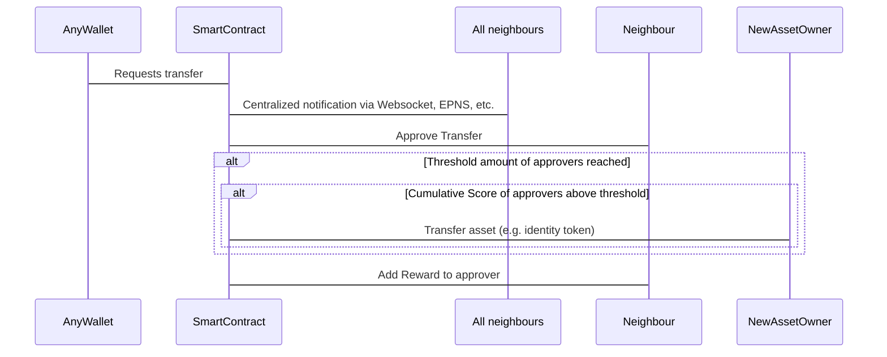

## Abstract

This EIP standardizes a mechanism of a social recovery where a token may be transferred from an inaccessible account to a new account, given enough approvals from other identities. This approval is not purely technical, but rather needs human intervention. These humans are - based on the Soul Bound Token proposal - called Souls. When enough Souls give their approval (which is a Yes/No decision) and a threshold is reached, a token is transferred from an old to a new identity.

## Motivation

It is a known problem that the private key of an account can be lost. If that key is lost it's not possible to recover the tokens owned by that account. The holder loses those tokens forever. In addition to directly harming the token holder, the entire  ecosystem of the token itself is affected: the more tokens that are lost the less tokens are available for the natural growth and planned evolution of that ecosystem.


## Specification

```solidity

pragma solidity ^0.8.7;

interface ISocialRecovery {
    /// @dev Related but independent identity approves the transfer
    function approveTransfer(address from_, address to_) external;

    /// @dev User wants to move their onchain identity to another wallet which needs to be approved by n-nearest neighbour identities
    function requestTransfer(address from_, address to_) external payable;

    function addNeighbour(address neighbour_) external;

    function removeNeighbour(address neighbour_) external;
}
```

**The math behind it**:

A compliant contract SHOULD calculate the score of a node n with the following formula:

$$ score(n) = tanh({ { {\displaystyle\sum_{i = 1}^{|N|} } {log{(n_i^{r} {1 \over t - n_i^{t} + 1})}} \over{|N| + 1}} + n^{r}}) $$

where:

$t$ is the current time (can be any time-identifying value such as `block.timestamp`, `block.number`, etc.)

$n^{r}$ is the reward count of the node n

$N$ is the list of neighbours of n

$n_i^{r}$ is the reward count of neighbour node i from n

$n_i^{t}$ is the last timestamp (where a reward was booked on that account) of neighbour node i from n


**Flows**:




## Rationale

The formula proposed was deemed very resilient and provides a coherent incentivation structure to actually see value in the on-chain score. The formula adds weights based on scores based on time which further contributes to the fairness of the metric. 


## Security Considerations


1) We currently do not see any mechanism of preventing a user of getting a lot of rewards. Sure, a high reward is bound to a lot of investment but the person who wants to get that reward amount and has a enough money will reach it. The only thing which could be improved is that we somehow find a mechanism really identify users bound to an address. We thought about having a kind of a hashing mechanism which hashes a real world object which could be fuzzy (for sure!) and generates a hash out of it which is the same based on the fuzzy set.

2) We implemented a threshold which must be reached to make a social token transfer possible. Currently there is no experience which defines a "good" or "bad" threshold hence we tried to find a first value. This can or must be adjusted based on future experience.

3) Another problem we see is that the network of the neighbours is not active anymore to reach the necessary minimum threshold. Which means that due to not being able to reach the minimum amount of approvals a user gets stuck with the e.g. social token transfer he/she wants to perform. Hence the contract lives from its usage and if it tends to be not used anymore it will get useless.

## Copyright

Copyright and related rights waived via [CC0](../LICENSE.md).
