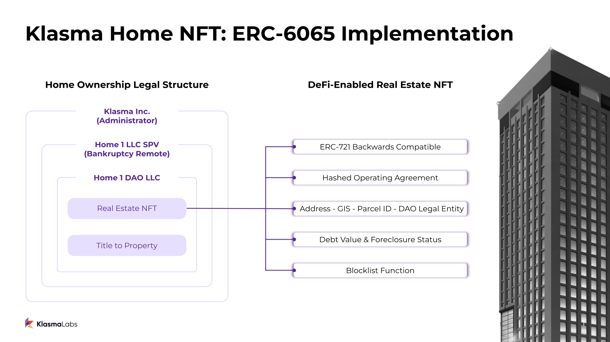

## Abstract

This proposal introduces an open structure for physical real estate and property to exist on the blockchain. This standard builds off of [ERC-721](./eip-721.md), adding important functionality necessary for representing real world assets such as real estate. The three objectives this standard aims to meet are: universal transferability of the NFT, private property rights attached to the NFT, and atomic transfer of property rights with the transfer of the NFT. The token contains a hash of the operating agreement detailing the NFT holder’s legal right to the property, unique identifiers for the property, a debt value and foreclosure status, and a manager address.

## Motivation

Real estate is the largest asset class in the world. By tokenizing real estate, barriers to entry are lowered, transaction costs are minimized, information asymmetry is reduced, ownership structures become more malleable, and a new building block for innovation is formed. However, in order to tokenize this asset class, a common standard is needed that accounts for its real world particularities while remaining flexible enough to adapt to various jurisdictions and regulatory environments.

Ethereum tokens involving real world assets (RWAs) are notoriously tricky. This is because Ethereum tokens exist on-chain, while real estate exists off-chain. As such, the two are subject to entirely different consensus environments. For Ethereum tokens, consensus is reached through a formalized process of distributed validators. When a purely-digital NFT is transferred, the new owner has a cryptographic guarantee of ownership. For real estate, consensus is supported by legal contracts, property law, and enforced by the court system. With existing asset-backed ERC-721 tokens, a transfer of the token to another individual does not necessarily have any impact on the legal ownership of the physical asset.

This standard attempts to solve the real world reconciliation issue, enabling real estate NFTs to function seamlessly on-chain, just like their purely-digital counterparts.

## Specification

The key words “MUST”, “MUST NOT”, “REQUIRED”, “SHALL”, “SHALL NOT”, “SHOULD”, “SHOULD NOT”, “RECOMMENDED”, “NOT RECOMMENDED”, “MAY”, and “OPTIONAL” in this document are to be interpreted as described in RFC 2119 and RFC 8174.

In order to meet the above objectives and create an open standard for on-chain property ownership we have created a token structure that builds on the widely-used ERC-721 standard.

### Token Components:

1. Inherits ERC-721 - Allows for backwards compatibility with the most widely accepted NFT token standard.
2. operatingAgreementHashOf - immutable hash of the legal agreement detailing the right to ownership and conditions of use with regard to the property
3. Property Unique Identifiers - legal description (from physical deed), street address, GIS coordinates, parcel/tax ID, legal owning entity (on deed)
4. debtOf - readable debt value, currency, and foreclosure status of the NFT
5. managerOf - readable Ethereum address with managing control of property

### Interfaces

This EIP inherits the ERC-721 NFT token standard for all transfer and approval logic. All transfer and approval functions are inherited from this token standard without changes. Additionally, this EIP also inherits the ERC-721 Metadata standards for name, symbol, and metadata URI lookup. This allows an NFT under this EIP to become interoperable with preexisting NFT exchanges and services, however, some care must be taken. Please refer to [Backwards Compatibility](#backwards-compatibility) and [Security Considerations](#security-considerations).


#### Solidity Interface

```
pragma solidity ^0.8.13;

import "forge-std/interfaces/IERC721.sol";

interface IERC6065 is IERC721 {

	// This event MUST emit if the asset is ever foreclosed.
	event Foreclosed(uint256 id);

	/* 
	Next getter functions return immutable data for NFT.
	*/
	function legalDescriptionOf(uint256 _id) external view returns (string memory);
	function addressOf(uint256 _id) external view returns (string memory);
	function geoJsonOf(uint256 _id) external view returns (string memory);
	function parcelIdOf(uint256 _id) external view returns (string memory);
	function legalOwnerOf(uint256 _id) external view returns (string memory);
	function operatingAgreementHashOf(uint256 _id) external view returns (bytes32);

	/*
	Next getter function returns the debt denomination token of the NFT, the amount of debt (negative debt == credit), and if the underlying 
	asset backing the NFT has been foreclosed on. This should be utilized specifically for off-chain debt and required payments on the RWA asset.
	It's recommended that administrators only use a single token type to denominate the debt. It's unrealistic to require integrating smart
	contracts to implement possibly unbounded tokens denominating the off-chain debt of an asset.

	If the foreclosed status == true, then the RWA can be seen as severed from the NFT. The NFT is now "unbacked" by the RWA.
	*/
	function debtOf(uint256 _id) external view returns (address debtToken, int256 debtAmt, bool foreclosed);

	// Get the managerOf an NFT. The manager can have additional rights to the NFT or RWA on or off-chain.
	function managerOf(uint256 _id) external view returns (address);
}
```

## Rationale

### Introduction

Real world assets operate in messy, non-deterministic environments. Because of this, validating the true state of an asset can be murky, expensive, or time-consuming. For example, in the U.S., change of property ownership is usually recorded at the County Recorder’s office, sometimes using pen and paper. It would be infeasible to continuously update this manual record every time an NFT transaction occurs on the blockchain. Additionally, since real world property rights are enforced by the court of law, it is essential that property ownership be documented in such a way that courts are able to interpret and enforce ownership if necessary.

For these reasons, it is necessary to have a trusted party tasked with the responsibility of ensuring the state of the on-chain property NFT accurately mirrors its physical counterpart. By having an Administrator for the property who issues a legally-binding digital representation of the physical property, we are able to solve for both the atomic transfer of the property rights with the transfer of the NFT, as well as institute a seamless process for making the necessary payments and filings associated with property ownership. This is made possible by eliminating the change in legal ownership each time the NFT changes hands. An example Administrator legal structure implemented for property tokenization in the U.S. is provided in the [Reference Implementation](#reference-implementation). While a token that implements this standard must have a legal entity to conduct the off-chain dealings for the property, this implementation is not mandatory.

### Guiding Objectives

We have designed this EIP to achieve three primary objectives necessary for creating an NFT representation of physical real estate:

#### 1. Real Estate NFTs are universally transferable

A key aspect to private property is the right to transfer ownership to any legal person or entity that has the capacity to own that property. Therefore, an NFT representation of physical property should maintain that universal freedom of transfer.

#### 2. All rights associated with property ownership are able to be maintained and guaranteed by the NFT

The rights associated with private property ownership are the right to hold, occupy, rent, alter, resell, or transfer the property. It is essential that these same rights are able to be maintained and enforced with an NFT representation of real estate.

#### 3. Property rights are transferred atomically with the transfer of the NFT

Token ownership on any blockchain is atomic with the transfer of the digital token. To ensure the digital representation of a physical property is able to fully integrate the benefits of blockchain technology, it is essential the rights associated with the property are passed atomically with the transfer of the digital token. 

The following section specifies the technological components required to meet these three objectives. 

### operatingAgreementHashOf

An immutable hash of the legal document issued by the legal entity that owns the property. The agreement is unique and contains the rights, terms, and conditions for the specific property represented by the NFT. The hash of the agreement attached to the NFT must be immutable to ensure the legitimacy and enforceability of these rights in the future for integrators or transferees. Upon transfer of the NFT, these legal rights are immediately enforceable by the new owner. For changes to the legal structure or rights and conditions with regard to the property the original token must be burned and a new token with the new hash must be minted. 

### Property Unique Identifiers

The following unique identifiers of the property are contained within the NFT and are immutable:

`legalDescriptionOf`: written description of the property taken from the physical property deed
`addressOf`: street address of the property
`geoJsonOf`: the GeoJSON format of the property’s geospatial coordinates
`parcelIdOf`: ID number used to identify the property by the local authority
`legalOwnerOf`: the legal entity that is named on the verifiable physical deed

These unique identifiers ensure the physical property in question is clear and identifiable. These strings must be immutable to make certain that the identity of the property can not be changed in the future. This is necessary to provide confidence in the NFT holder in the event a dispute about the property arises. 

These identifiers, especially `legalOwnerOf`, allow for individuals to verify off-chain ownership and legitimacy of the legal agreement. These verification checks could be integrated with something like Chainlink functions in the future to be simplified and automatic. 

### debtOf

A readable value of debt and denoted currency that is accrued to the property. A positive balance signifies a debt against the property, while a negative balance signifies a credit which can be claimed by the NFT owner. This is a way for the property administrator to charge the NFT holder for any necessary payments towards the property, like property tax, or other critical repairs or maintenance in the "real world". A credit might be given to the NFT holder via this same function, perhaps the administrator and the NFT holder had worked out a property management or tenancy revenue-sharing agreement.

The `debtOf` function also returns the boolean foreclosure status of the asset represented by the NFT. A true result indicates the associated property is no longer backing the NFT, a false result indicates the associated property is still backing the NFT. An administrator can foreclose an asset for any reason as specified in the `Operating Agreement`, an example would be excessive unpaid debts. Smart contracts can check the foreclosure state by calling this function. If the asset is foreclosed, it should be understood that the RWA backing the NFT has been removed, and smart contracts should take this into account when doing any valuations or other calculations.

There are no standard requirements for how these values are updated as those details will be decided by the implementor. This EIP does however standardize how these values are indicated and read for simplicity of integration. 

### managerOf 

A readable Ethereum address that can be granted a right to action on the property without being the underlying owner of the NFT. 

This function allows the token to be owned by one Ethereum address while granting particular rights to another. This enables protocols and smart contracts to own the underlying asset, such as a lending protocol, but still allow another Ethereum address, such as a depositor, to action on the NFT via other integrations, for example the Administrator management portal. The standard does not require a specific implementation of the manager role, only the value is required. In many instances the managerOf value will be the same as the owning address of the NFT. 

## Backwards Compatibility

This EIP is backwards compatible with ERC-721. However, it is important to note that there are potential implementation considerations to take into account before any smart contract integration. See [Security Considerations](#security-considerations) for more details.

## Reference Implementation

Klasma Labs offers a work in progress [reference implementation](../assets/eip-6065/Implementation.sol). The technical implementation includes the following additional components for reference, this implementation is not required.

Summary of this implementation:

* NFT burn and mint function
* Immutable NFT data (unique identifiers and operating agreement hash)
* Simple debt tracking by Administrator
* Blocklist function to freeze asset held by fraudulent addresses (NOTE: to be implemented in the future)
* Simple foreclosure logic initiated by Administrator
* `managerOf` function implementation to chain this call to other supported smart contracts

### Legal Structure Implementation

This section explains the legal structure and implementation a company may employ as an Administrator of this token. The structure detailed below is specific to property tokenization in the U.S. in the 2023 regulatory environment.

This section details an implementation of the legal standard that could be used by a company specifically for property tokenization in the U.S. in the 2022 regulatory environment.




The legal structure for this token is as follows:

* A parent company and property Administrator, owns a bankruptcy remote LLC for each individual property they act as Administrator for.
* The bankruptcy remote LLC is the owner and manager of a DAO LLC. The DAO LLC is on the title and deed and issues the corresponding NFT and operating agreement for the property.
* This structure enables the following three outcomes:

    1. Homeowners are shielded from any financial stress or bankruptcy their physical asset Administrator encounters. In the event of an Administrator bankruptcy or dissolution the owner of the NFT is entitled to transfer of the DAO LLC, or the sale and distribution of proceeds from the property.
    2. Transfer of the rights to the property are atomic with the transfer of the NFT. The NFT represents a right to claim the asset and have the title transferred to the NFT owner, as well as the right to use the asset. This ensures the rights to the physical property are passed digitally with the transfer of the NFT, without having to update the legal owner of the property after each transfer.

Security note: In the event of a private key hack the company will likely not be able to reissue a Home NFT. Home NFT owners who are not confident in their ability to safely store their home NFT will have varying levels of security options (multi-sigs, custodians, etc.). For public, large protocol hacks, the company may freeze the assets using the Blocklist function and reissue the home NFTs to the original owners. Blocklist functionality is to-be-implemented in the reference implementation above.

## Security Considerations

The following are checks and recommendations for protocols integrating NFTs under this standard. These are of particular relevance to applications which lend against any asset utilizing this standard.

* Protocol integrators are recommended to check that the unique identifiers for the property and the hash of the operating agreement are immutable for the specific NFTs they wish to integrate. For correct implementation of this standard these values must be immutable to ensure legitimacy for future transferees. 
* Protocol integrators are recommended to check the debtOf value for an accurate representation of the value of this token.
* Protocol integrators are recommended to check the foreclose status to ensure this token is still backed by the asset it was originally tied to.
* For extra risk mitigation protocol integrators can implement a time-delay before performing irreversible actions. This is to protect against potential asset freezes if a hacked NFT is deposited into the protocol. Asset freezes are non-mandatory and subject to the implementation of the asset Administrator. 

## Copyright

Copyright and related rights waived via [CC0](../LICENSE.md).
