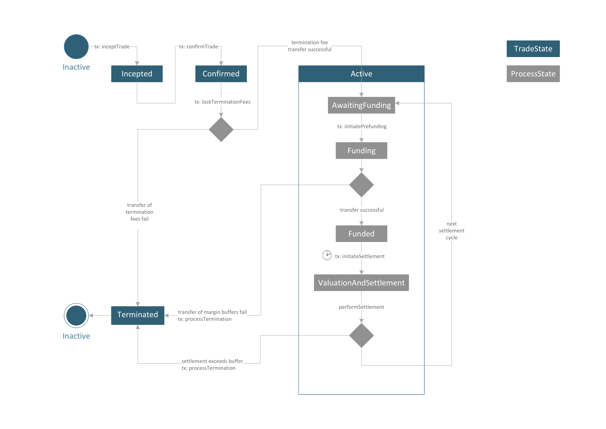
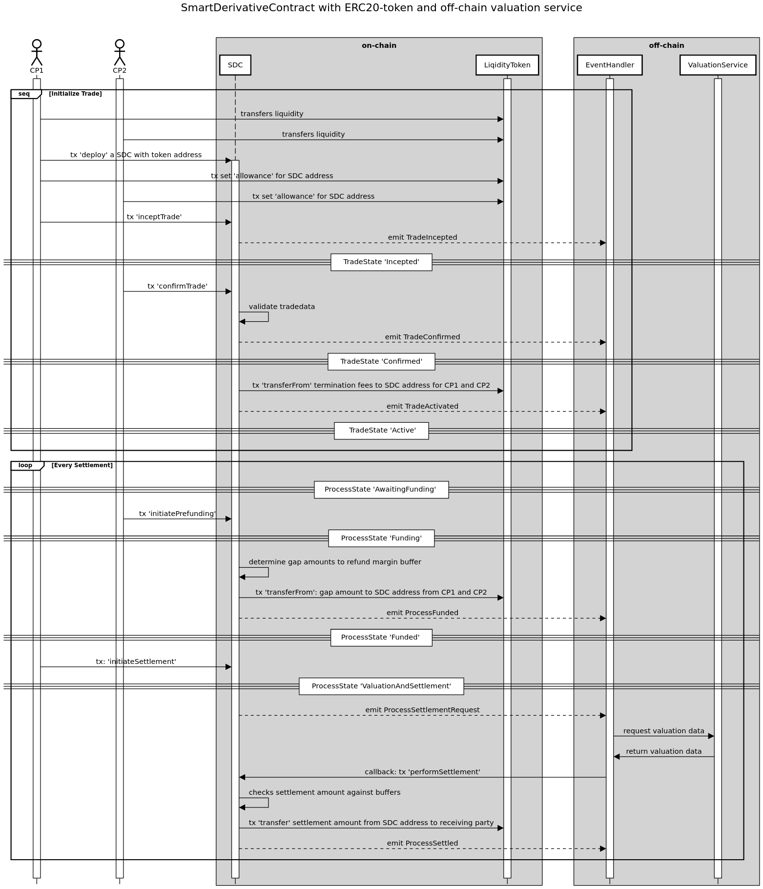

## Abstract

The Smart Derivative Contract is a deterministic protocol to trade and process 
financial derivative contracts frictionless and scalable in a completely automated way. Counterparty credit risk ís removed. 
Known operational risks and complexities in post-trade processing are removed by construction as all process states 
are fully specified and are known to the counterparties.

## Motivation

### Rethinking Financial Derivatives

By their very nature, so-called "over-the-counter (OTC)" financial contracts are bilateral contractual agreements on the exchange of long-dated cash flow schedules.
Since these contracts change their intrinsic market value due to changing market environments, they are subject to counterparty credit risk when one counterparty is subject to default.
The initial white paper describes the concept of a Smart Derivative Contract with the central aim 
to detach bilateral financial transactions from counterparty credit risk and to remove complexities 
in bilateral post-trade processing by a complete redesign.

### Concept of a Smart Derivative Contract

A Smart Derivative Contract is a deterministic settlement protocol which has the same economic behaviour as a collateralized OTC
Derivative. Every process state is specified; therefore, the entire post-trade process is known in advance.
A Smart Derivative Contract (SDC) settles outstanding net present value of the underlying financial contract on a frequent basis. With each settlement cycle net present value of the underlying contract is
exchanged, and the value of the contract is reset to zero. Pre-Agreed margin buffers are locked at the beginning of each settlement cycle such that settlement will be guaranteed up to a certain amount. 
If a counterparty fails to obey contract rules, e.g. not provide sufficient prefunding, SDC will terminate automatically with the guaranteed transfer of a termination fee by the causing party.
These features enable two counterparties to process their financial contract fully decentralized without relying on a third central intermediary agent.
The process logic of SDC can be implemented as a finite state machine on solidity. An [EIP-20](./eip-20.md) token can be used for frictionless decentralized settlement, see reference implementation.
Combined with an appropriate external market data and valuation oracle which calculates net present values, each known OTC derivative contract is able to be processed using this standard protocol.


## Specification

### Methods

The following methods specify  inception and post-trade live cycle of a Smart Derivative Contract. For futher information also please look at the interface documentation ISDC.sol.

#### inceptTrade

A counterparty can initiate a trade by providing trade data as string and calling inceptTrade and initial settlement data. Only registered counteparties are allowed to use that function.

```solidity
function inceptTrade(string memory _tradeData, string memory _initialSettlementData) external;
```

#### confirmTrade

A counterparty can confirm a trade by providing the identical trade data and initial settlement information, which are already stored from inceptTrade call.

```solidity
function confirmTrade(string memory _tradeData, string memory _initialSettlementData) external;
```

#### initiatePrefunding

This method checks whether contractual prefunding is provided by both counterparties as agreed in the contract terms. Triggers a contract termination if not. 

```solidity
function initiatePrefunding() external;
```

#### initiateSettlement

Allows eligible participants (such as counterparties or a delegated agent) to initiate a settlement.

```solidity
function initiateSettlement() external;
```

#### performSettlement

Valuation may be provided off-chain via an external oracle service that calculates net present value and uses external market data. 
Method serves as callback called from an external oracle providing settlement amount and used settlement data which also get stored.
Settlement amount will be checked according to contract terms resulting in either a reqular settlement or a termination of the trade.

```solidity
function performSettlement(int256 settlementAmount, string memory settlementData) external;
```

#### requestTermination

Allows an eligible party to request a mutual termination

```js
function requestTradeTermination(string memory tradeId) external;
```

#### confirmTradeTermination

Allows eligible parties to confirm a formerly-requested mutual trade termination.

```solidity
function confirmTradeTermination(string memory tradeId) external;
```

### Trade Events

The following events are emitted during an SDC trade livecycle.

#### TradeIncepted

Emitted on trade inception - method 'inceptTrade'

```solidity
event TradeIncepted(address initiator, string tradeId, string tradeData);
```

#### TradeConfirmed

Emitted on trade confirmation - method 'confirmTrade'

```solidity
event TradeConfirmed(address confirmer, string tradeId);
```

#### TradeActivated

Emitted when trade is activated

```solidity
event TradeActivated(string tradeId);
```

#### TradeTerminationRequest

Emitted when termination request is initiated by a counterparty

```solidity
event TradeTerminationRequest(address cpAddress, string tradeId);
```

#### TradeTerminationConfirmed

Emitted when termination request is confirmed by a counterparty

```solidity
event TradeTerminationConfirmed(address cpAddress, string tradeId);
```

#### TradeTerminated

Emitted when trade is terminated

```solidity
event TradeTerminated(string cause);
```

### Process Events

The following events are emitted during SDC's process livecycle.

#### ProcessAwaitingFunding

Emitted when funding phase is initiated

```solidity
event ProcessAwaitingFunding();
```

#### ProcessFunded

Emitted when funding has completed successfully - method 'initiatePrefunding'

```solidity
event ProcessFunded();
```

#### ProcessSettlementRequest

Emitted when a settlement is initiated - method 'initiateSettlement'

```solidity
event ProcessSettlementRequest(string tradeData, string lastSettlementData);
```

#### ProcessSettled

Emitted when settlement was processed successfully - method 'performSettlement'

```solidity
event ProcessSettled();
```

## Rationale

The interface design and reference implementation are based on the following considerations:

- A SDC protocol is supposed to be used by two counterparties and enables them to initiate and process a derivative transaction in a bilateral and digital manner.
- The provided interface specification is supposed to completely reflect the entire trade livecycle.
- The interface specification is generic enough to handle the case that two counterparties process one or even multiple derivative transactions (on a netted base)
- Usually, the valuation of an OTC trade will require advanced valuation methodology. This is why the concept will in most cases rely on external market data and valuation algorithms
- A pull-based valuation based oracle pattern is specified by a simple callback pattern (methods: initiateSettlement, performSettlement)
- The reference implementation `SDC.sol` is based on a state-machine pattern where the states also serve as guards (via modifiers) to check which method is allowed to be called at a particular given process and trade state
- Java based state machine and contract implementations are also available. See the github repo link below.

### State diagram of trade and process states 



### Sequence diagram of trade initiation and settlement livecycle



## Test Cases

Live-cycle unit tests based on the sample implementation and usage of [EIP-20](./eip-20.md) token is provided. See file [test/SDC.js](../assets/eip-6123/test/SDC.js)
).

## Reference Implementation

A reference implementation SDC.sol is provided and is based on the [EIP-20](./eip-20.md) token standard. 
See folder /assets/contracts, more explanation on the implementation is provided inline.

### Trade Data Specification (suggestion)

Please take a look at the provided xml file as a suggestion on how trade parameters could be stored.

## Security Considerations

No known security issues up to now.

## Copyright

Copyright and related rights waived via [CC0](../LICENSE.md).


