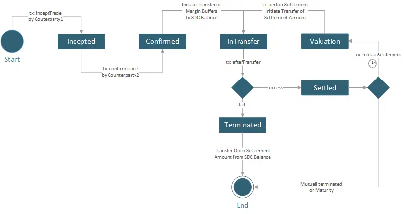

## Motivation

### Rethinking Financial Derivatives

By their very nature, so-called "over-the-counter (OTC)" financial contracts are bilateral contractual agreements on exchanging long-dated cash flow schedules.
Since these contracts change their intrinsic market value due to changing market environments, they are subject to counterparty credit risk when one counterparty is subject to default.
The initial white paper describes the concept of a Smart Derivative Contract (SDC) with the central aim to detach bilateral financial transactions from counterparty credit risk and to remove complexities
in bilateral post-trade processing by a complete redesign.

### Concept of a Smart Derivative Contract

A Smart Derivative Contract is a deterministic settlement protocol with the same economic behaviour as a Financial Contract - e.g. an OTC-Derivative or a Bond.
Every process state is specified; therefore, the entire post-trade process is known in advance and is deterministic over the trade's life cycle. An [EIP-20](./eip-20.md) token can be used for frictionless decentralized settlement, see reference implementation. We do provide a separate interface and implementation for a specific "Settlement Token" derived from [EIP-20](./eip-20.md).
These features enable two or multiple trade parties to process their financial contracts fully decentralized without relying on a third central intermediary agent.
The process logic of SDC can be implemented as a finite state machine on solidity.

### Applications

The interface's life cycle functionality applies to several use cases.

#### Collateralized OTC Derivative

In the case of a collateralized OTC derivative, an SDC settles the outstanding net present value of the underlying financial contract on a frequent basis. With each settlement cycle, the net present value of the underlying contract is exchanged, and the value of the contract is reset to zero. Pre-agreed margin buffers are locked at the beginning of each settlement cycle so that settlement will be guaranteed up to a certain amount.
If a counterparty fails to obey contract rules, e.g. not providing sufficient pre-funding, SDC will terminate automatically with the guaranteed transfer of a termination fee by the causing party.
We provide a Reference Implementation for this case.

#### Defaultable OTC Derivative

Defaultable OTC Derivative has no Collateral in Place so SDC will settle the according cash flows as determined in the contract specification. A defaultable OTC derivative might end in
a state 'Failure to Pay' if a settlement cannot be conducted.

#### Smart Bond Contract

The life cycle of a bond can also make use of the function catalogue below. The interface enables the issuer to allocate and redeem the bond as well as settle coupon payments. On the other hand, it allows bondholders to interact with each other, conducting secondary market trades. It all boils down to a settlement phase, which needs to be pre-agreed by both parties or triggered by the issuer
which can be processed in a completely frictionless way.

### Methods

The following methods specify a Smart Derivative Contract's trade initiation and settlement life cycle. For further information, please also look at the interface documentation ISDC.sol.

#### Trade Initiation Phase: inceptTrade

A party can initiate a trade by providing the party address to trade with, trade data, trade position, payment amount for the trade and initial settlement data. Only registered counterparties are allowed to use that function.

```solidity
function inceptTrade(address _withParty, string memory _tradeData, int _position, int256 _paymentAmount, string memory _initialSettlementData) external;
```

#### Trade Initiation Phase: `confirmTrade`

A counterparty can confirm a trade by providing its trade specification data, which then gets matched against the data stored from `inceptTrade` call.

```solidity
function confirmTrade(address _withParty, string memory _tradeData, int _position, int256 _paymentAmount, string memory _initialSettlementData) external;
```

#### Trade Settlement Phase: `initiateSettlement`

Allows eligible participants (such as counterparties or a delegated agent) to trigger a settlement phase.

```solidity
function initiateSettlement() external;
```

#### Trade Settlement Phase: `performSettlement`

Valuation may be provided on-chain or off-chain via an external oracle service that calculates the settlement or coupon amounts and uses external market data.
This method serves as a callback called from an external oracle providing settlement amount and used settlement data, which also get stored.
The settlement amount will be checked according to contract terms, resulting in either a regular settlement or a termination of the trade.

```solidity
function performSettlement(int256 settlementAmount, string memory settlementData) external;
```

#### Trade Settlement Phase: `afterTransfer`

This method - either called back from the provided settlement token directly or from an eligible address - completes the settlement transfer.
This might result in a termination or start of the next settlement phase, depending on the provided success flag.

```solidity
function afterTransfer(uint256 transactionHash, bool success) external;
```


#### Trade Termination: `requestTermination`

Allows an eligible party to request a mutual termination with a termination amount she is willing to pay

```js
function requestTradeTermination(string memory tradeId, int256 _terminationPayment) external;
```

#### Trade Termination: `confirmTradeTermination`

Allows an eligible party to confirm a previously requested (mutual) trade termination, including termination payment value

```solidity
function confirmTradeTermination(string memory tradeId, int256 _terminationPayment) external;
```

### Trade Events

The following events are emitted during an SDC Trade life-cycle.

#### TradeIncepted

Emitted on trade inception - method 'inceptTrade'

```solidity
event TradeIncepted(address initiator, string tradeId, string tradeData);
```

#### TradeConfirmed

Emitted on trade confirmation - method 'confirmTrade'

```solidity
event TradeConfirmed(address confirmer, string tradeId);
```

#### TradeActivated

Emitted when a Trade is activated

```solidity
event TradeActivated(string tradeId);
```

### TradeSettlementRequest

Emitted when a settlement is requested. May trigger the settlement phase.

```solidity
event TradeSettlementRequest(string tradeData, string lastSettlementData);
```


### TradeSettlementPhase

Emitted when the settlement phase is started.

```solidity
event TradeSettlementPhase();
```


#### TradeTerminationRequest

Emitted when termination request is initiated by a counterparty

```solidity
event TradeTerminationRequest(address cpAddress, string tradeId);
```

#### TradeTerminationConfirmed

Emitted when termination request is confirmed by a counterparty

```solidity
event TradeTerminationConfirmed(address cpAddress, string tradeId);
```

#### TradeTerminated

Emitted when trade is terminated

```solidity
event TradeTerminated(string cause);
```

#### ProcessHalted

Emitted when trade processing stops.

```solidity
event ProcessHalted();
```

## Rationale

The interface design and reference implementation are based on the following considerations:

- An SDC protocol enables interacting parties to initiate and process a financial transaction in a bilateral and deterministic manner. Settlement and Counterparty Risk is managed by the contract.
- The provided interface specification is supposed to completely reflect the entire trade life cycle.
- The interface specification is generic enough to handle the case that parties process one or even multiple financial transactions (on a netted base)
- Usually, the valuation of financial trades (e.g. OTC Derivatives) will require advanced valuation methodology to determine the market value. This is why the concept might rely on an external market data source and hosted valuation algorithms
- A pull-based valuation-based oracle pattern can be implemented by using the provided callback pattern (methods: `initiateSettlement`, `performSettlement`)
- The reference implementation `SDC.sol` is based on a state-machine pattern where the states also serve as guards (via modifiers) to check which method is allowed to be called at a particular given process and trade state
- Java-based state machine and contract implementations are also available. See the finmath-smart-derivative-contract GitHub repo..

### State diagram of trade and process states



### Sequence diagram of trade initiation and settlement life-cycle


## Test Cases

Life-cycle unit tests based on the sample implementation and usage of [EIP-20](./eip-20.md) token is provided. See file [test/SDCTests.js](../assets/eip-6123/test/SDCTests.js)
).

## Reference Implementation

A reference implementation SDC.sol is provided and is based on the [EIP-20](./eip-20.md) token standard.
See folder `/assets/contracts`, more explanation on the implementation is provided inline.

### Trade Data Specification (suggestion)

Please take a look at the provided xml file as a suggestion on how trade parameters could be stored.

## Security Considerations

No known security issues up to now.

## Copyright

Copyright and related rights waived via [CC0](../LICENSE.md).
