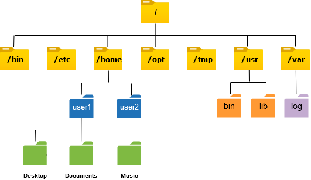
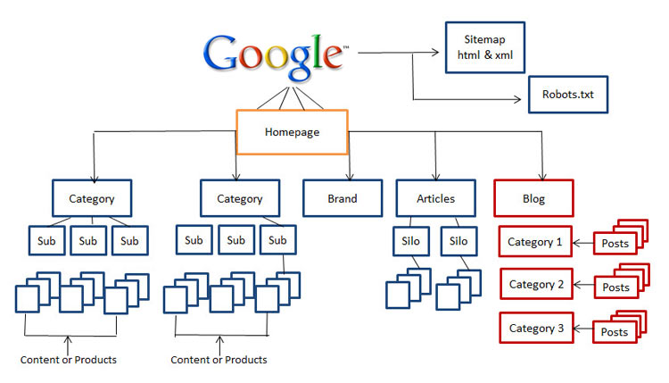

## Abstract

This standard is an extension to [EIP-721](./eip-721.md). It proposes a multi-layer filesystem-like hierarchical NFTs. This standard provides interfaces to get parent NFT or children NFTs and whether NFT is a leaf node or root node, maintaining the hierarchical relationship among them.

## Motivation

This EIP standardizes the interface of filesystem-like hierarchical NFTs and provides a reference implementation.

Hierarchy structure is commonly implemented for file systems by operating systems such as Linux Filesystem Hierarchy (FHS).



Websites often use a directory and category hierarchy structure, such as eBay (Home -> Electronics -> Video Games -> Xbox -> Products), and Twitter (Home -> Lists -> List -> Tweets), and Reddit (Home -> r/ethereum -> Posts -> Hot).



A single smart contract can be the `root`, managing every directory/category as individual NFT and hierarchy relations of NFTs. Each NFT's `tokenURI` may be another contract address, a website link, or any form of metadata.

The advantages and the advancement of the Ethereum ecosystem of using this standard include:

- Complete on-chain storage of hierarchy, which can also be governed on-chain by additional DAO contract
- Only need a single contract to manage and operate the hierarchical relations
- Transferrable directory/category ownership as NFT, which is great for use cases such as on-chain forums
- Easy and permissionless data access to the hierarchical structure by front-end
- Ideal structure for traditional applications such as e-commerce, or forums
- Easy-to-understand interfaces for developers, which are similar to Linux filesystem commands in concept

The use cases can include:

- On-chain forum, like Reddit
- On-chain social media, like Twitter
- On-chain corporation, for managing organizational structures
- On-chain e-commerce platforms, like eBay or individual stores
- Any application with tree-like structures

In the future, with the development of the data availability solutions of Ethereum and an external permissionless data retention network, the content (posts, listed items, or tweets) of these platforms can also be entirely stored on-chain, thus realizing fully decentralized applications.

## Specification

The key words "MUST", "MUST NOT", "REQUIRED", "SHALL", "SHALL NOT", "SHOULD", "SHOULD NOT", "RECOMMENDED", "NOT RECOMMENDED", "MAY", and "OPTIONAL" in this document are to be interpreted as described in RFC 2119 and RFC 8174.

Every compliant contract must implement this proposal, [EIP-721](./eip-721.md) and [EIP-165](./eip-165.md) interfaces.

```solidity
pragma solidity ^0.8.0;

// Note: the ERC-165 identifier for this interface is 0x897e2c73.
interface IERC6150 /* is IERC721, IERC165 */ {
    /**
     * @notice Emitted when `tokenId` token under `parentId` is minted.
     * @param minter The address of minter
     * @param to The address received token
     * @param parentId The id of parent token, if it's zero, it means minted `tokenId` is a root token.
     * @param tokenId The id of minted token, required to be greater than zero
     */
    event Minted(
        address indexed minter,
        address indexed to,
        uint256 parentId,
        uint256 tokenId
    );

    /**
     * @notice Get the parent token of `tokenId` token.
     * @param tokenId The child token
     * @return parentId The Parent token found
     */
    function parentOf(uint256 tokenId) external view returns (uint256 parentId);

    /**
     * @notice Get the children tokens of `tokenId` token.
     * @param tokenId The parent token
     * @return childrenIds The array of children tokens
     */
    function childrenOf(
        uint256 tokenId
    ) external view returns (uint256[] memory childrenIds);

    /**
     * @notice Check the `tokenId` token if it is a root token.
     * @param tokenId The token want to be checked
     * @return Return `true` if it is a root token; if not, return `false`
     */
    function isRoot(uint256 tokenId) external view returns (bool);

    /**
     * @notice Check the `tokenId` token if it is a leaf token.
     * @param tokenId The token want to be checked
     * @return Return `true` if it is a leaf token; if not, return `false`
     */
    function isLeaf(uint256 tokenId) external view returns (bool);
}
```

Optional Extension: Enumerable

```solidity
// Note: the ERC-165 identifier for this interface is 0xba541a2e.
interface IERC6150Enumerable is IERC6150 /* IERC721Enumerable */ {
    /**
     * @notice Get total amount of children tokens under `parentId` token.
     * @dev If `parentId` is zero, it means get total amount of root tokens.
     * @return The total amount of children tokens under `parentId` token.
     */
    function childrenCountOf(uint256 parentId) external view returns (uint256);

    /**
     * @notice Get the token at the specified index of all children tokens under `parentId` token.
     * @dev If `parentId` is zero, it means get root token.
     * @return The token ID at `index` of all chlidren tokens under `parentId` token.
     */
    function childOfParentByIndex(
        uint256 parentId,
        uint256 index
    ) external view returns (uint256);

    /**
     * @notice Get the index position of specified token in the children enumeration under specified parent token.
     * @dev Throws if the `tokenId` is not found in the children enumeration.
     * If `parentId` is zero, means get root token index.
     * @param parentId The parent token
     * @param tokenId The specified token to be found
     * @return The index position of `tokenId` found in the children enumeration
     */
    function indexInChildrenEnumeration(
        uint256 parentId,
        uint256 tokenId
    ) external view returns (uint256);
}
```

Optional Extension: Burnable

```solidity
// Note: the ERC-165 identifier for this interface is 0x4ac0aa46.
interface IERC6150Burnable is IERC6150 {
    /**
     * @notice Burn the `tokenId` token.
     * @dev Throws if `tokenId` is not a leaf token.
     * Throws if `tokenId` is not a valid NFT.
     * Throws if `owner` is not the owner of `tokenId` token.
     * Throws unless `msg.sender` is the current owner, an authorized operator, or the approved address for this token.
     * @param tokenId The token to be burnt
     */
    function safeBurn(uint256 tokenId) external;

    /**
     * @notice Batch burn tokens.
     * @dev Throws if one of `tokenIds` is not a leaf token.
     * Throws if one of `tokenIds` is not a valid NFT.
     * Throws if `owner` is not the owner of all `tokenIds` tokens.
     * Throws unless `msg.sender` is the current owner, an authorized operator, or the approved address for all `tokenIds`.
     * @param tokenIds The tokens to be burnt
     */
    function safeBatchBurn(uint256[] memory tokenIds) external;
}
```

Optional Extension: ParentTransferable

```solidity
// Note: the ERC-165 identifier for this interface is 0xfa574808.
interface IERC6150ParentTransferable is IERC6150 {
    /**
     * @notice Emitted when the parent of `tokenId` token changed.
     * @param tokenId The token changed
     * @param oldParentId Previous parent token
     * @param newParentId New parent token
     */
    event ParentTransferred(
        uint256 tokenId,
        uint256 oldParentId,
        uint256 newParentId
    );

    /**
     * @notice Transfer parentship of `tokenId` token to a new parent token
     * @param newParentId New parent token id
     * @param tokenId The token to be changed
     */
    function transferParent(uint256 newParentId, uint256 tokenId) external;

    /**
     * @notice Batch transfer parentship of `tokenIds` to a new parent token
     * @param newParentId New parent token id
     * @param tokenIds Array of token ids to be changed
     */
    function batchTransferParent(
        uint256 newParentId,
        uint256[] memory tokenIds
    ) external;
}
```

Optional Extension: Access Control

```solidity
// Note: the ERC-165 identifier for this interface is 0x1d04f0b3.
interface IERC6150AccessControl is IERC6150 {
    /**
     * @notice Check the account whether a admin of `tokenId` token.
     * @dev Each token can be set more than one admin. Admin have permission to do something to the token, like mint child token,
     * or burn token, or transfer parentship.
     * @param tokenId The specified token
     * @param account The account to be checked
     * @return If the account has admin permission, return true; otherwise, return false.
     */
    function isAdminOf(uint256 tokenId, address account)
        external
        view
        returns (bool);

    /**
     * @notice Check whether the specified parent token and account can mint children tokens
     * @dev If the `parentId` is zero, check whether account can mint root nodes
     * @param parentId The specified parent token to be checked
     * @param account The specified account to be checked
     * @return If the token and account has mint permission, return true; otherwise, return false.
     */
    function canMintChildren(
        uint256 parentId,
        address account
    ) external view returns (bool);

    /**
     * @notice Check whether the specified token can be burnt by specified account
     * @param tokenId The specified token to be checked
     * @param account The specified account to be checked
     * @return If the tokenId can be burnt by account, return true; otherwise, return false.
     */
    function canBurnTokenByAccount(uint256 tokenId, address account)
        external
        view
        returns (bool);
}
```

## Rationale

As mentioned in the abstract, this EIP's goal is to have a simple interface for supporting Hierarchical NFTs. Here are a few design decisions and why they were made:

### Relationship between NFTs

All NFTs will make up a hierarchical relationship tree. Each NFT is a node of the tree, maybe as a root node or a leaf node, as a parent node or a child node.

This proposal standardizes the event `Minted` to indicate the parent and child relationship when minting a new node. When a root node is minted, parentId should be zero. That means a token id of zero could not be a real node. So a real node token id must be greater than zero.

In a hierarchical tree, it's common to query upper and lower nodes. So this proposal standardizes function `parentOf` to get the parent node of the specified node and standardizes function `childrenOf` to get all children nodes.

Functions `isRoot` and `isLeaf` can check if one node is a root node or a leaf node, which would be very useful for many cases.

### Enumerable Extension

This proposal standardizes three functions as an extension to support enumerable queries involving children nodes. Each function all have param `parentId`, for compatibility, when the `parentId` specified zero means query root nodes.

### ParentTransferable Extension

In some cases, such as filesystem, a directory or a file could be moved from one directory to another. So this proposal adds ParentTransferable Extension to support this situation.

### Access Control

In a hierarchical structure, usually, there is more than one account has permission to operate a node, like mint children nodes, transfer node, burn node. This proposal adds a few functions as standard to check access control permissions.

## Backwards Compatibility

This proposal is fully backward compatible with [EIP-721](./eip-721.md).

## Reference Implementation

Implementation: [EIP-6150](../assets/eip-6150/contracts/ERC6150.sol)

## Security Considerations

No security considerations were found.

## Copyright

Copyright and related rights waived via [CC0](../LICENSE.md).
