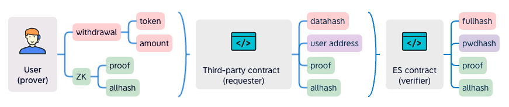

## Abstract

Elastic signature (ES) aims to sign data with a human friendly secret. The secret will be verified fully on-chain and is not stored anywhere. A user can change the secret as often as they need to. The secret does not have a fixed length. The secret will be like a password, which is a better understood concept than private key. This is specifically true for non-technical users. This EIP defines a smart contract interface to verify and authorize operations with ES.


## Motivation

What would a changeable "private key" enable us? For years, we have been looking for ways to lower on-boarding barrier for users, especially those with less technical experiences. Private key custody solutions seem to provide an user friendly on-boarding experience, but it is vendor dependent and is not decentralized. ES makes a breakthrough with Zero-knowledge technology. Users generate proof of knowing the secret and a smart contract will verify the proof. 

### Use case

ES is an alternative signing algorithm. It is not an either-or solution to the private key. It is designed to serve as an additional signing mechanism on top of the private key signature.

- A DeFi app can utilize ES into their transfer fund process. Users will be required to provide their passwords to complete the transaction. This gives an extra protection even if the private key is compromised.
- ES can also be used as a plugin to a smart contract wallet, like Account Abstraction [ERC-4337](./eip-4337.md). A decentralized password is picked instead of the private key. This could lead to a smooth onboarding experiences for new Ethereum Dapp users.


## Specification

Let:

- `pwdhash` represents the hash of the private secret (password).
- `datahash` represents the hash of an intended transaction data.
- `fullhash` represents the hash of `datahash` and all the well-known variables.
- `expiration` is the timestamp after which the intended transaction expires. 
- `allhash` represents the hash of `fullhash` and `pwdhash`.


There are three parties involved, Verifier, Requester and Prover.

- A verifier, 
  - SHOULD compute `fullhash` from a `datahash`, which is provided by the requester.
  - SHOULD derive `pwdhash` for a given address. The address can be an EOA or a smart contract wallet.
  - SHOULD verify the proof with the derived `pwdhash`, the computed `fullhash` and a `allhash`, which is submitted by the requester.
- A requester
  - SHOULD generate `datahash` and decide an `expiration`.
  - SHALL request a verification from the verifier with, 
    - `proof` and `allhash` which are provided by the prover;
    - `datahash`;
    - `expiration`.
- A prover
  - SHOULD generate the `proof` and `allhash` from, 
    - `datahash` and `expiration` which are agreed with the requester;
    - `nonce` and other well-known variables. 

There are also some requirements.

- well-known variable SHOULD be available to all parties.
  - SHOULD include a `nonce`.
  - SHOULD include a `chainid`.
  - MAY include any variable that is specific to the verifier.
- public statements SHOULD include, 
  - one reflecting the `pwdhash`;
  - one reflecting the `fullhash`;
  - one reflecting the `allhash`.
- The computation of `fullhash` SHOULD be agreed by both the verifier and the prover.
- The computation of `datahash`

### `IElasticSignature` Interface 

This is the verifier interface.

```solidity
pragma solidity ^0.8.0;

interface IElasticSignature {
    /**
     * Event emitted after user set/reset their password
     * @param user - an user's address, for whom the password hash is set. It could be a smart contract wallet address
     *  or an EOA wallet address.
     * @param pwdhash - a password hash
     */
    event SetPassword(address indexed user, uint indexed pwdhash);

    /**
     * Event emitted after a successful verification performed for an user
     * @param user - an user's address, for whom the submitted `proof` is verified. It could be a smart contract wallet
     *  address or an EOA wallet address.
     * @param nonce - a new nonce, which is newly generated to replace the last used nonce. 
     */
    event Verified(address indexed user, uint indexed nonce);

    /**
     * Get `pwdhash` for a user
     * @param user - a user's address 
     * @return - the `pwdhash` for the given address
     */
    function pwdhashOf(address user) external view returns (uint);

    /**
     * Update an user's `pwdhash`
     * @param proof1 - proof generated by the old password
     * @param expiration1 - old password signing expiry seconds
     * @param allhash1 - allhash generated with the old password
     * @param proof2 - proof generated by the new password
     * @param pwdhash2 - hash of the new password
     * @param expiration2 - new password signing expiry seconds
     * @param allhash2 - allhash generated with the new password
     */
    function resetPassword(
        uint[8] memory proof1,
        uint expiration1,
        uint allhash1,
        uint[8] memory proof2,
        uint pwdhash2,
        uint expiration2,
        uint allhash2
    ) external;

    /**
     * Verify a proof for a given user
     * It should be invoked by other contracts. The other contracts provide the `datahash`. The `proof` is generated by
     *  the user. 
     * @param user -  a user's address, for whom the verification will be carried out.
     * @param proof - a proof generated by the password
     * @param datahash - the data what user signing, this is the hash of the data
     * @param expiration - number of seconds from now, after which the proof is expired 
     * @param allhash - public statement, generated along with the `proof`
     */
    function verify(
        address user,
        uint[8] memory proof,
        uint datahash,
        uint expiration,
        uint allhash
    ) external;
}
```

`verify` function SHOULD be called by another contract. The other contract SHOULD generate the `datahash` to call this. The function SHOULD verify if the `allhash` is computed correctly and honestly with the password.


## Rationale

The contract will store everyone's `pwdhash`.


The chart below shows ZK circuit logic.


To verify the signature, it needs `proof`, `allhash`, `pwdhash` and `fullhash`.



The prover generates `proof` along with the public outputs. They will send all of them to a third-party requester contract. The requester will generate the `datahash`. It sends `datahash`, `proof`, `allhash`, `expiration` and prover's address to the verifier contract. The contract verifies that the `datahash` is from the prover, which means the withdrawal operation is signed by the prover's password.


## Backwards Compatibility

This EIP is backward compatible with previous work on signature validation since this method is specific to password based signatures and not EOA signatures. 


## Reference Implementation

Example implementation of a signing contract:

```solidity
pragma solidity ^0.8.0;

import "../interfaces/IElasticSignature.sol";
import "./verifier.sol";

contract ZKPass is IElasticSignature {
    Verifier verifier = new Verifier();

    mapping(address => uint) public pwdhashOf;

    mapping(address => uint) public nonceOf;

    constructor() {
    }

    function resetPassword(
        uint[8] memory proof1,
        uint expiration1,
        uint allhash1,
        uint[8] memory proof2,
        uint pwdhash2,
        uint expiration2,
        uint allhash2
    ) public override {
        uint nonce = nonceOf[msg.sender];

        if (nonce == 0) {
            //init password

            pwdhashOf[msg.sender] = pwdhash2;
            nonceOf[msg.sender] = 1;
            verify(msg.sender, proof2, 0, expiration2, allhash2);
        } else {
            //reset password

            // check old pwdhash
            verify(msg.sender, proof1, 0, expiration1, allhash1);

            // check new pwdhash
            pwdhashOf[msg.sender] = pwdhash2;
            verify(msg.sender, proof2, 0, expiration2, allhash2);
        }

        emit SetPassword(msg.sender, pwdhash2);
    }

    function verify(
        address user,
        uint[8] memory proof,
        uint datahash,
        uint expiration,
        uint allhash
    ) public override {
        require(
            block.timestamp < expiration,
            "ZKPass::verify: expired"
        );

        uint pwdhash = pwdhashOf[user];
        require(
            pwdhash != 0,
            "ZKPass::verify: user not exist"
        );

        uint nonce = nonceOf[user];
        uint fullhash = uint(keccak256(abi.encodePacked(expiration, block.chainid, nonce, datahash))) / 8; // 256b->254b
        require(
            verifyProof(proof, pwdhash, fullhash, allhash),
            "ZKPass::verify: verify proof fail"
        );

        nonceOf[user] = nonce + 1;

        emit Verified(user, nonce);
    }

    /////////// util ////////////

    function verifyProof(
        uint[8] memory proof,
        uint pwdhash,
        uint fullhash, //254b
        uint allhash
    ) internal view returns (bool) {
        return
            verifier.verifyProof(
                [proof[0], proof[1]],
                [[proof[2], proof[3]], [proof[4], proof[5]]],
                [proof[6], proof[7]],
                [pwdhash, fullhash, allhash]
            );
    }
}
```

verifier.sol is auto generated by snarkjs, the source code circuit.circom is below

```javascript
pragma circom 2.0.0;

include "../../node_modules/circomlib/circuits/poseidon.circom";

template Main() {
    signal input in[3];
    signal output out[3];

    component poseidon1 = Poseidon(2);
    component poseidon2 = Poseidon(2);

    poseidon1.inputs[0] <== in[0];  //pwd
    poseidon1.inputs[1] <== in[1];  //address
    out[0] <== poseidon1.out; //pwdhash

    poseidon2.inputs[0] <== poseidon1.out;
    poseidon2.inputs[1] <== in[2]; //fullhash
    out[1] <== in[2]; //fullhash
    out[2] <== poseidon2.out; //allhash
}

component main = Main();
```


## Security Considerations

Since the pwdhash is public, it is possible to be crack the password. We estimate the Poseidon hash rate of RTX3090 would be 100Mhash/s, this is the estimate of crack time:

8 chars (number) : 1 secs

8 chars (number + english) : 25 days

8 chars (number + english + symbol) : 594 days

12 chars (number) : 10000 secs

12 chars (number + english) : 1023042 years

12 chars (number + english + symbol) : 116586246 years

The crack difficulty of private key is 2^256, the crack difficulty of 40 chars (number + english + symbol) is 92^40, 92^40 > 2^256, so when password is 40 chars , it is more difficult to be crack than private key.

## Copyright

Copyright and related rights waived via [CC0](../LICENSE.md).
