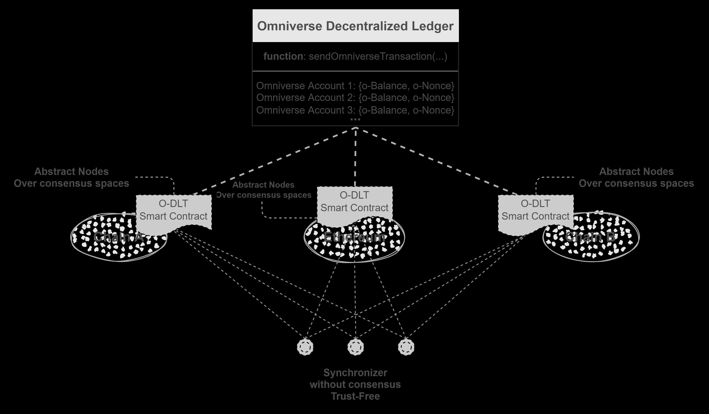

## Abstract

This ERC standardizes an interface for contract-layer consensus-agnostic verifiable cross-chain bridging, through which we can define a new global token inherited from [ERC-20](./eip-20.md)/[ERC-721](./eip-721.md) over multi-chains.  

### Figure.1 Architecture

    

With this ERC, we can create a global token protocol, that leverages smart contracts or similar mechanisms on existing blockchains to record the token states synchronously. The synchronization could be made by trustless off-chain synchronizers.

## Motivation

- The current paradigm of token bridges makes assets fragment.  
- If ETH was transferred to another chain through the current token bridge, if the chain broke down, ETH will be lost for users.  

The core of this ERC is synchronization instead of transferring, even if all the other chains break down, as long as Ethereum is still running, user’s assets will not be lost. 

- The fragment problem will be solved.
- The security of users' multi-chain assets can be greatly enhanced.

## Specification

The key words "MUST", "MUST NOT", "REQUIRED", "SHALL", "SHALL NOT", "SHOULD", "SHOULD NOT", "RECOMMENDED", "NOT RECOMMENDED", "MAY", and "OPTIONAL" in this document are to be interpreted as described in RFC 2119 and RFC 8174.

### Omniverse Account

There SHOULD be a global user identifier of this ERC, which is RECOMMENDED to be referred to as Omniverse Account (`o-account` for short) in this article.  
The `o-account` is RECOMMENDED to be expressed as a public key created by the elliptic curve `secp256k1`. A [mapping mechanism](#mapping-mechanism-for-different-environments) is RECOMMENDED for different environments.  

### Data Structure

An Omniverse Transaction (`o-transaction` for short) MUST be described with the following data structure:

```solidity
/**
 * @notice Omniverse transaction data structure
 * @member nonce: The number of the o-transactions. If the current nonce of an omniverse account is `k`, the valid nonce of this o-account in the next o-transaction is `k+1`. 
 * @member chainId: The chain where the o-transaction is initiated
 * @member initiateSC: The contract address from which the o-transaction is first initiated
 * @member from: The Omniverse account which signs the o-transaction
 * @member payload: The encoded bussiness logic data, which is maintained by the developer
 * @member signature: The signature of the above informations. 
 */
struct ERC6358TransactionData {
    uint128 nonce;
    uint32 chainId;
    bytes initiateSC;
    bytes from;
    bytes payload;
    bytes signature;
}
```

- The data structure `ERC6358TransactionData` MUST be defined as above.
- The member `nonce` MUST be defined as `uint128` due to better compatibility for more tech stacks of blockchains.
- The member `chainId` MUST be defined as `uint32`.
- The member `initiateSC` MUST be defined as `bytes`.
- The member `from` MUST be defined as `bytes`.
- The member `payload` MUST be defined as `bytes`. It is encoded from a user-defined data related to the o-transaction. For example:  
    - For fungible tokens it is RECOMMENDED as follows:  

        ```solidity
        /**
        * @notice Fungible token data structure, from which the field `payload` in `ERC6358TransactionData` will be encoded
        *
        * @member op: The operation type
        * NOTE op: 0-31 are reserved values, 32-255 are custom values
        *           op: 0 - omniverse account `from` transfers `amount` tokens to omniverse account `exData`, `from` have at least `amount` tokens
        *           op: 1 - omniverse account `from` mints `amount` tokens to omniverse account `exData`
        *           op: 2 - omniverse account `from` burns `amount` tokens from his own, `from` have at least `amount` tokens
        * @member exData: The operation data. This sector could be empty and is determined by `op`. For example: 
                    when `op` is 0 and 1, `exData` stores the omniverse account that receives.
                    when `op` is 2, `exData` is empty.
        * @member amount: The amount of tokens being operated
        */
        struct Fungible {
            uint8 op;
            bytes exData;
            uint256 amount;
        }
        ```

        - The related raw data for `signature` in `o-transaction` is RECOMMENDED to be the concatenation of the raw bytes of `op`, `exData`, and `amount`.  

    - For non-fungible tokens it is RECOMMENDED as follows:  

        ```solidity
        /**
        * @notice Non-Fungible token data structure, from which the field `payload` in `ERC6358TransactionData` will be encoded
        *
        * @member op: The operation type
        * NOTE op: 0-31 are reserved values, 32-255 are custom values
        *           op: 0 omniverse account `from` transfers token `tokenId` to omniverse account `exData`, `from` have the token with `tokenId`
        *           op: 1 omniverse account `from` mints token `tokenId` to omniverse account `exData`
        *           op: 2 omniverse account `from` burns token `tokenId`, `from` have the token with `tokenId`
        * @member exData: The operation data. This sector could be empty and is determined by `op`
        *           when `op` is 0 and 1, `exData` stores the omniverse account that receives.
                    when `op` is 2, `exData` is empty.
        * @member tokenId: The tokenId of the non-fungible token being operated
        */
        struct NonFungible {
            uint8 op;
            bytes exData;
            uint256 tokenId;
        }
        ```

        - The related raw data for `signature` in `o-transaction` is RECOMMENDED to be the concatenation of the raw bytes of `op`, `exData`, and `tokenId`. 

- The member `signature` MUST be defined as `bytes`. It is RECOMMENDED to be created as follows.  
    - Concat the sectors in `ERC6358TransactionData` as below (take Fungible token for example) and calculate the hash with `keccak256`: 

        ```solidity
        /**
        * @notice Decode `_data` from bytes to Fungible
        * @return A `Fungible` instance
        */
        function decodeData(bytes memory _data) internal pure returns (Fungible memory) {
            (uint8 op, bytes memory exData, uint256 amount) = abi.decode(_data, (uint8, bytes, uint256));
            return Fungible(op, exData, amount);
        }
        
        /**
        * @notice Get the hash of a transaction
        * @return Hash value of the raw data of an `ERC6358TransactionData` instance
        */
        function getTransactionHash(ERC6358TransactionData memory _data) public pure returns (bytes32) {
            Fungible memory fungible = decodeData(_data.payload);
            bytes memory payload = abi.encodePacked(fungible.op, fungible.exData, fungible.amount);
            bytes memory rawData = abi.encodePacked(_data.nonce, _data.chainId, _data.initiateSC, _data.from, payload);
            return keccak256(rawData);
        }
        ```

    - Sign the hash value.

### Smart Contract Interface

- Every [ERC-6358](./eip-6358.md) compliant contract MUST implement the `IERC6358`  

    ```solidity
    /**
    * @notice Interface of the ERC-6358
    */
    interface IERC6358 {
        /**
        * @notice Emitted when a o-transaction which has nonce `nonce` and was signed by user `pk` is sent by calling {sendOmniverseTransaction}
        */
        event TransactionSent(bytes pk, uint256 nonce);

        /**
        * @notice Sends an `o-transaction` 
        * @dev 
        * Note: MUST implement the validation of the `_data.signature`
        * Note: A map maintaining the  `o-account` and the related transaction nonce is RECOMMENDED  
        * Note: MUST implement the validation of the `_data.nonce` according to the current account nonce
        * Note: MUST implement the validation of the `_data. payload`
        * Note: This interface is just for sending an `o-transaction`, and the execution MUST NOT be within this interface 
        * Note: The actual execution of an `o-transaction` is RECOMMENDED to be in another function and MAY be delayed for a time
        * @param _data: the `o-transaction` data with type {ERC6358TransactionData}
        * See more information in the defination of {ERC6358TransactionData}
        *
        * Emit a {TransactionSent} event
        */
        function sendOmniverseTransaction(ERC6358TransactionData calldata _data) external;

        /**
        * @notice Get the number of omniverse transactions sent by user `_pk`, 
        * which is also the valid `nonce` of a new omniverse transactions of user `_pk` 
        * @param _pk: Omniverse account to be queried
        * @return The number of omniverse transactions sent by user `_pk`
        */
        function getTransactionCount(bytes memory _pk) external view returns (uint256);

        /**
        * @notice Get the transaction data `txData` and timestamp `timestamp` of the user `_use` at a specified nonce `_nonce`
        * @param _user Omniverse account to be queried
        * @param _nonce The nonce to be queried
        * @return Returns the transaction data `txData` and timestamp `timestamp` of the user `_use` at a specified nonce `_nonce`
        */
        function getTransactionData(bytes calldata _user, uint256 _nonce) external view returns (ERC6358TransactionData memory, uint256);

        /**
        * @notice Get the chain ID
        * @return Returns the chain ID
        */
        function getChainId() external view returns (uint32);
    }
    ```

    - The `sendOmniverseTransaction` function MAY be implemented as `public` or `external`
    - The `getTransactionCount` function MAY be implemented as `public` or `external`
    - The `getTransactionData` function MAY be implemented as `public` or `external`
    - The `getChainId` function MAY be implemented as `pure` or `view`
    - The `TransactionSent` event MUST be emitted when `sendOmniverseTransaction` function is called
- Optional Extension: Fungible Token  

    ```solidity
    // import "{IERC6358.sol}";

    /**
    * @notice Interface of the ERC-6358 fungible token, which inherits {IERC6358}
    */
    interface IERC6358Fungible is IERC6358 {
        /**
        * @notice Get the omniverse balance of a user `_pk`
        * @param _pk `o-account` to be queried
        * @return Returns the omniverse balance of a user `_pk`
        */
        function omniverseBalanceOf(bytes calldata _pk) external view returns (uint256);
    }
    ```

    - The `omniverseBalanceOf` function MAY be implemented as `public` or `external`

- Optional Extension: NonFungible Token  

    ```solidity
    import "{IERC6358.sol}";

    /**
    * @notice Interface of the ERC-6358 non fungible token, which inherits {IERC6358}
    */
    interface IERC6358NonFungible is IERC6358 {
        /**
        * @notice Get the number of omniverse NFTs in account `_pk`
        * @param _pk `o-account` to be queried
        * @return Returns the number of omniverse NFTs in account `_pk`
        */
        function omniverseBalanceOf(bytes calldata _pk) external view returns (uint256);

        /**
        * @notice Get the owner of an omniverse NFT with `tokenId`
        * @param _tokenId Omniverse NFT id to be queried
        * @return Returns the owner of an omniverse NFT with `tokenId`
        */
        function omniverseOwnerOf(uint256 _tokenId) external view returns (bytes memory);
    }
    ```

    - The `omniverseBalanceOf` function MAY be implemented as `public` or `external`
    - The `omniverseOwnerOf` function MAY be implemented as `public` or `external`

## Rationale

### Architecture

As shown in [Figure.1](#architecture), smart contracts deployed on multi-chains execute `o-transactions` of ERC-6358 tokens synchronously through the trustless off-chain synchronizers.   

- The ERC-6358 smart contracts are referred to as **Abstract Nodes**. The states recorded by the Abstract Nodes that are deployed on different blockchains respectively could be considered as copies of the global state, and they are ultimately consistent.  
- **Synchronizer** is an off-chain execution program responsible for carrying published  `o-transactions` from the ERC-6358 smart contracts on one blockchain to the others. The synchronizers work trustless as they just deliver `o-transactions` with others' signatures, and details could be found in the [workflow](#workflow).

### Principle

- The `o-account` has been mentioned [above](#omniverse-account).
- The synchronization of the `o-transactions` guarantees the ultimate consistency of token states across all chains. The related data structure is [here](#data-structure).

    - A `nonce` mechanism is brought in to make the states consistent globally.
    - The `nonce` appears in two places, the one is `nonce in o-transaction` data structure, and the other is `account nonce` maintained by on-chain ERC-6358 smart contracts. 
    - When synchronizing, the `nonce in o-transaction` data will be checked by comparing it to the `account nonce`.

#### Workflow

- Suppose a common user `A` and her related operation `account nonce` is $k$.
- `A` initiates an `o-transaction` on Ethereum by calling `IERC6358::sendOmniverseTransaction`. The current `account nonce` of `A` in the ERC-6358 smart contracts deployed on Ethereum is $k$ so the valid value of `nonce in o-transaction` needs to be $k+1$.  
- The ERC-6358 smart contracts on Ethereum verify the signature of the `o-transaction` data. If the verification succeeds, the `o-transaction` data will be published by the smart contracts on the Ethereum side. The verification includes:
    - whether the balance (FT) or the ownership (NFT) is valid
    - and whether the `nonce in o-transaction` is $k+1$
- The `o-transaction` SHOULD NOT be executed on Ethereum immediately, but wait for a time.  
- Now, `A`'s latest submitted `nonce in o-transaction` on Ethereum is $k+1$, but still $k$ on other chains.
- The off-chain synchronizers will find a newly published `o-transaction` on Ethereum but not on other chains.  
- Next synchronizers will rush to deliver this message because of a rewarding mechanism. (The strategy of the reward could be determined by the deployers of ERC-6358 tokens. For example, the reward could come from the service fee or a mining mechanism.) 
- Finally, the ERC-6358 smart contracts deployed on other chains will all receive the `o-transaction` data, verify the signature and execute it when the **waiting time is up**. 
- After execution, the `account nonce` on all chains will add 1. Now all the `account nonce` of account `A` will be $k+1$, and the state of the balances of the related account will be the same too.  

## Reference Implementation

### Omniverse Account

- An Omniverse Account example: `3092860212ceb90a13e4a288e444b685ae86c63232bcb50a064cb3d25aa2c88a24cd710ea2d553a20b4f2f18d2706b8cc5a9d4ae4a50d475980c2ba83414a796`
    - The Omniverse Account is a public key of the elliptic curve `secp256k1`
    - The related private key of the example is:  `cdfa0e50d672eb73bc5de00cc0799c70f15c5be6b6fca4a1c82c35c7471125b6`

#### Mapping Mechanism for Different Environments

In the simplest implementation, we can just build two mappings to get it. One is like `pk based on sece256k1 => account address in the special environment`, and the other is the reverse mapping. 

The `Account System` on `Flow` is a typical example.  

- `Flow` has a built-in mechanism for `account address => pk`. The public key can be bound to an account (a special built-in data structure) and the public key can be got from the `account address` directly.  
- A mapping from `pk` to the `account address` on Flow can be built by creating a mapping `{String: Address}`, in which `String` denotes the data type to express the public key and the `Address` is the data type of the `account address` on Flow.  

### ERC-6358 Token

The ERC-6358 Token could be implemented with the [interfaces mentioned above](#smart-contract-interface). It can also be used with the combination of [ERC-20](./eip-20.md)/[ERC-721](./eip-721.md).  

- The implementation examples of the interfaces can be found at:

    - [Interface `IERC6358`](../assets/eip-6358/src/contracts/interfaces/IERC6358.sol), the basic ERC-6358 interface mentioned [above](#smart-contract-interface)
    - [Interface `IERC6358Fungible`](../assets/eip-6358/src/contracts/interfaces/IERC6358Fungible.sol), the interface for ERC-6358 fungible token
    - [Interface `IERC6358NonFungible`](../assets/eip-6358/src/contracts/interfaces/IERC6358NonFungible.sol), the interface for ERC-6358 non-fungible token

- The implementation example of some common tools to operate ERC-6358 can be found at:

    - [Common Tools](../assets/eip-6358/src/contracts/libraries/OmniverseProtocolHelper.sol).  

- The implementation examples of ERC-6358 Fungible Token and ERC-6358 Non-Fungible Token can be found at:  

    - [ERC-6358 Fungible Token Example](../assets/eip-6358/src/contracts/ERC6358FungibleExample.sol)
    - [ERC-6358 Non-Fungible Token Example](../assets/eip-6358/src/contracts/ERC6358NonFungibleExample.sol)  

## Security Considerations

### Attack Vector Analysis

According to the above, there are two roles:

- **common users** are who initiate an `o-transaction`
- **synchronizers** are who just carry the `o-transaction` data if they find differences between different chains.  

The two roles might be where the attack happens:  

#### **Will the *synchronizers* cheat?**  

- Simply speaking, it's none of the **synchronizer**'s business as **they cannot create other users' signatures** unless some **common users** tell him, but at this point, we think it's a problem with the role **common user**.  
- The **synchronizer** has no will and cannot do evil because the `o-transaction` data that they deliver is verified by the related **signature** of other **common users**.  
- The **synchronizers** would be rewarded as long as they submit valid `o-transaction` data, and *valid* only means that the signature and the amount are both valid. This will be detailed and explained later when analyzing the role of **common user**.  
- The **synchronizers** will do the delivery once they find differences between different chains:
    - If the current `account nonce` on one chain is smaller than a published `nonce in o-transaction` on another chain
    - If the transaction data related to a specific `nonce in o-transaction` on one chain is different from another published `o-transaction` data with the same `nonce in o-transaction` on another chain

- **Conclusion: The *synchronizers* won't cheat because there are no benefits and no way for them to do so.**

#### **Will the *common user* cheat?**

- Simply speaking, **maybe they will**, but fortunately, **they can't succeed**.    
- Suppose the current `account nonce` of a **common user** `A` is $k$ on all chains. `A` has 100 token `X`, which is an instance of the ERC-6358 token.    
- Common user `A` initiates an `o-transaction` on a Parachain of Polkadot first, in which `A` transfers `10` `X`s to an `o-account` of a **common user** `B`. The `nonce in o-transaction` needs to be $k+1$. After signature and data verification, the `o-transaction` data(`ot-P-ab` for short) will be published on Polkadot.
- At the same time, `A` initiates an `o-transaction` with the **same nonce** $k+1$ but **different data**(transfer `10` `X`s to another `o-account` `C` for example) on Ethereum. This `o-transaction` (named `ot-E-ac` for short) will pass the verification on Ethereum first, and be published.  
- At this point, it seems `A` finished a ***double spend attack*** and the states on Polkadot and Ethereum are different.  
- **Response strategy**:
    - As we mentioned above, the synchronizers will deliver `ot-P-ab` to Ethereum and deliver `ot-E-ac` to Polkadot because they are different although with the same nonce. The synchronizer who submits the `o-transaction` first will be rewarded as the signature is valid.
    - Both the ERC-6358 smart contracts or similar mechanisms on Polkadot and Ethereum will find that `A` did cheating after they received both `ot-E-ac` and `ot-P-ab` respectively as the signature of `A` is non-deniable.  
    - We have mentioned that the execution of an `o-transaction` will not be done immediately and instead there needs to be a fixed waiting time. So the `double spend attack` caused by `A` won't succeed.
    - There will be many synchronizers waiting for delivering o-transactions to get rewards. So although it's almost impossible that a **common user** can submit two `o-transactions` to two chains, but none of the synchronizers deliver the `o-transactions` successfully because of a network problem or something else, we still provide a solution:  
        - The synchronizers will connect to several native nodes of every public chain to avoid the malicious native nodes.
        - If it indeed happened that all synchronizers' network break, the `o-transactions` will be synchronized when the network recovered. If the waiting time is up and the cheating `o-transaction` has been executed, we are still able to revert it from where the cheating happens according to the `nonce in o-transaction` and `account nonce`.
- `A` couldn't escape punishment in the end (For example, lock his account or something else, and this is about the certain tokenomics determined by developers according to their own situation).  

- **Conclusion: The *common user* maybe cheat but won't succeed.**

## Copyright

Copyright and related rights waived via [CC0](../LICENSE.md).
